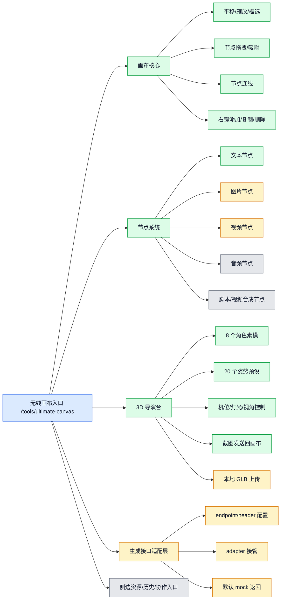
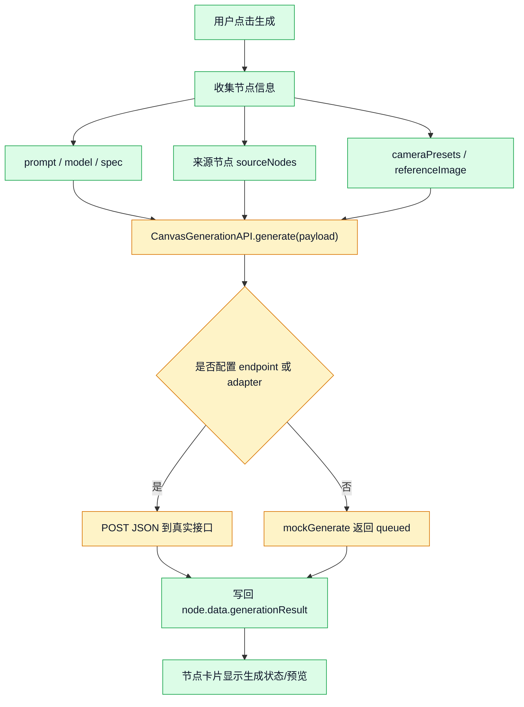
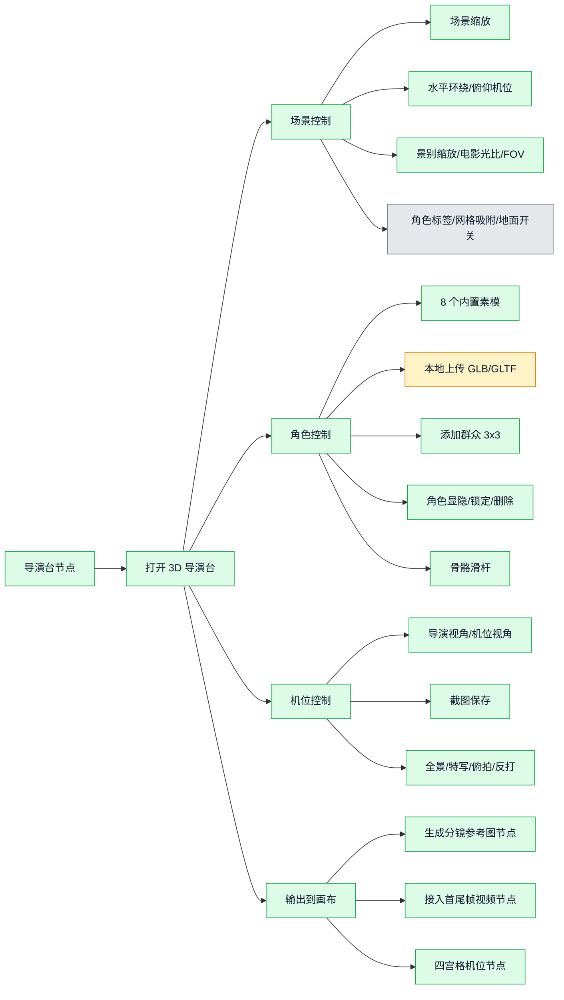

# 无线画布功能地图扫描

日期：2026-06-15

扫描对象：`public/tools/ultimate-canvas/`

入口页面：`/tools/ultimate-canvas`

## 结论

无线画布当前是一个前端静态工具，已经接入 sd2 网站独立页面。它的核心能力是“节点式视频创作画布”：用户可以在画布上创建文本、图片、视频、音频、导演台等节点，把节点连起来，再通过预留的生成接口把节点内容提交给真实后端。

当前真实状态要分清：

- 已实现：画布交互、节点创建、节点连线、提示词弹窗、生成接口适配层、3D 导演台、角色模型/姿势/机位截图、预设工具箱。
- 半成品：图片/视频/文本生成按钮可以收集 payload 并调用 `CanvasGenerationAPI`，但默认没有配置真实 endpoint，所以会返回 mock 结果。
- 占位：素材库、生成历史、协作、分享、通知、帮助、反馈、从历史选择、部分导演台场景开关还没有真实业务处理。

## 文件地图

| 文件 | 作用 | 状态 |
|---|---|---|
| `index.html` | 工具页面骨架：顶部栏、左侧工具栏、画布、侧边面板、添加节点菜单、底部浮动工具栏 | 已接入 |
| `canvas-engine.js` | 画布底层：平移、缩放、框选、节点拖拽、连线、右键菜单、删除/复制节点 | 已实现 |
| `app.js` | 应用逻辑：侧边栏、快捷卡片、节点动作、提示词弹窗、生成提交、导演台、工具箱、快捷键 | 已实现/部分占位 |
| `generation-api.js` | 生成接口适配层：支持配置 endpoint/header/adapter；未配置时 mock | 半成品 |
| `director-3d.js` | Three.js 3D 导演台渲染：加载 GLB、同步角色/机位/灯光/截图 | 已实现 |
| `assets/director/liblib/*` | 8 个角色 GLB、20 个姿势预设、模型动作清单、姿势转换逻辑 | 已接入 |

## 总功能地图



颜色说明：

- 蓝色：已经接进 sd2 网站。
- 绿色：前端功能已实现。
- 黄色：有前端流程，但需要真实后端或更完整保存逻辑。
- 灰色：目前主要是展示入口或占位。

## 画布核心能力

| 功能 | 入口/操作 | 代码位置 | 状态 |
|---|---|---|---|
| 平移画布 | 鼠标中键、右键拖动、空格 + 左键拖动 | `canvas-engine.js` | 已实现 |
| 缩放画布 | 鼠标滚轮、底部 `+/-`、快捷键 | `canvas-engine.js`、`app.js` | 已实现 |
| 框选节点 | 空白画布左键拖拽 | `canvas-engine.js` | 已实现 |
| 拖动节点 | 拖节点标题或卡片空白区域 | `canvas-engine.js` | 已实现 |
| 网格吸附 | 底部“智能吸附”按钮，默认开 | `canvas-engine.js`、`app.js` | 已实现 |
| 节点连线 | 从节点输入/输出连接点拖拽 | `canvas-engine.js` | 已实现 |
| 连线后新建节点 | 连线拖到空白处弹出添加菜单，新节点自动连接 | `canvas-engine.js`、`app.js` | 已实现 |
| 右键菜单 | 右键节点复制/删除，右键空白添加节点 | `canvas-engine.js` | 已实现 |
| 删除节点 | Delete/Backspace 或右键删除 | `canvas-engine.js` | 已实现 |
| 整理画布 | 底部“整理画布”按钮 | `canvas-engine.js`、`app.js` | 已实现 |
| 小地图按钮 | 底部“小地图”按钮只切换 active 状态 | `app.js` | 占位 |

## 节点类型地图

| 节点 | 能做什么 | 生成模式/动作 | 状态 |
|---|---|---|---|
| 文本节点 | 输入故事、场景、角色设定；可展开完整提示词弹窗 | 文生视频、图片提示词、文字生音乐 | 前端已实现，真实生成未接 |
| 图片节点 | 输入画面描述；展示图片生成工具按钮 | 文生图、图生图、高清修复 | 前端已实现，真实生成未接 |
| 视频节点 | 输入视频提示词；选择视频生成模式 | 文生视频、全部参考、图生视频、首尾帧、图片参考；首尾帧生成视频、首帧生成视频 | 前端已实现，真实生成未接 |
| 音频节点 | 展示音频波形占位 | 暂无真实音频生成逻辑 | 占位 |
| 导演台节点 | 3D 角色、机位、灯光、姿势、截图输出 | 分镜参考图、首尾帧视频、四宫格机位 | 前端/3D 已实现，真实生成未接 |
| 脚本节点 | 可被添加，但没有专属编辑/生成逻辑 | 无专属逻辑 | 占位 |
| 视频合成节点 | 可被添加，但没有专属合成逻辑 | 无专属逻辑 | 占位 |

## 生成接口地图



当前 payload 会包含：

- `nodeId`
- `kind`：如 `video`、`image`、`text`
- `mode`：如 `text-to-video`、`image-to-video`、`first-last-frame-video`、`text-to-image`、`upscale-image`
- `modeLabel`
- `prompt`
- `model`
- `spec`
- `sourceNodes`
- `cameraPresets`
- `referenceImage`
- `source`
- `title`

接口适配方式：

```js
window.CanvasGenerationAPI.configure({
  endpoints: {
    default: '/api/xxx',
    video: '/api/video/create',
    image: '/api/image/create',
    'video:text-to-video': '/api/video/create'
  },
  headers: {}
});
```

也可以用 `setAdapter(adapter)` 完全接管请求。

当前缺口：

- 没有把它接到 sd2 真实 `/api/video/create`。
- 没有用户点数预估、冻结、结算。
- 没有轮询任务状态。
- 没有把生成结果写入 sd2 的任务/资产/项目体系。

## 3D 导演台地图



导演台已内置 8 个角色模型：

| 类型 | 显示名 |
|---|---|
| `male-lowpoly` | 男性-低模 |
| `female-lowpoly` | 女性-低模 |
| `muscular` | 健硕 |
| `slim` | 纤细 |
| `broad` | 宽厚 |
| `child` | 儿童 |
| `teen` | 少年 |
| `chibi` | 二头身 |

导演台已内置 20 个姿势：

`站立`、`T型`、`行走`、`跑步`、`坐姿`、`蹲下`、`单膝跪`、`双膝跪`、`叉腰`、`倚靠`、`鞠躬`、`思考`、`格斗`、`踢球`、`投掷`、`推进`、`招手`、`伸手`、`抱臂`、`看手机`。

## 快捷入口地图

| 入口 | 行为 | 状态 |
|---|---|---|
| 欢迎页：故事脚本生成 | 创建脚本节点 | 节点可创建，脚本生成未接 |
| 欢迎页：角色三视图 | 创建图片节点 | 前端可创建 |
| 欢迎页：自动图生视频 | 创建文本节点和视频节点，并自动连线 | 前端可创建 |
| 欢迎页：音乐生成 | 创建音频节点 | 音频生成未接 |
| 左侧加号 | 打开添加节点菜单 | 已实现 |
| 双击画布 | 在鼠标位置打开添加节点菜单 | 已实现 |
| 上传 | 根据本地文件类型创建图片/视频/音频节点 | 只创建节点，未保存文件内容 |
| 从生成历史选择 | 菜单项存在 | 未实现 |
| 工具箱预设 | 9 个预设卡片，点击创建视频节点 | 已实现 |

工具箱 9 个预设：

- 左弧推行
- 电商手机弹出效果
- 咖啡杯出场
- 360旋转展示
- 机械臂视角
- Live 2D
- 商品特写
- 电影感开场
- 慢动作

## 侧边栏和顶部栏状态

| 区域 | 功能 | 状态 |
|---|---|---|
| 顶部项目名 | `contenteditable`，可直接改文字 | 只改 DOM，未持久化 |
| 协作 | 按钮存在 | 未实现 |
| 分享 | 按钮存在 | 未实现 |
| 通知 | 按钮存在 | 未实现 |
| 左侧工具箱 | 展示预设工具卡片 | 已实现 |
| 我的素材 | 分类标签：全部、其它、人物、场景、物品、风格 | 空状态，未接真实素材 |
| 我的主体库 | tab 存在 | 未接真实数据 |
| 生成历史 | 面板存在 | 空状态，未接真实历史 |
| 帮助 | 图标入口存在 | 未实现 |
| 反馈 | 图标入口存在 | 未实现 |

## 快捷键和鼠标操作

| 操作 | 效果 |
|---|---|
| 鼠标滚轮 | 缩放画布 |
| 中键拖动 / 右键拖动 / 空格 + 左键拖动 | 平移画布 |
| 空白处左键拖拽 | 框选节点 |
| 双击空白画布 | 添加节点 |
| 右键节点 | 复制/删除节点 |
| 右键空白 | 添加文本/图片/视频/音频节点 |
| Delete / Backspace | 删除当前选中节点 |
| Escape | 关闭菜单/弹窗/取消连线 |
| Cmd/Ctrl + `+` | 放大 |
| Cmd/Ctrl + `-` | 缩小 |
| Cmd/Ctrl + `0` | 还原 100% |
| Cmd/Ctrl + Shift + F | 整理画布 |

## 接入 sd2 网站后的边界

已经完成：

- 独立页面 `/tools/ultimate-canvas`
- 站内导航入口“无线画布”
- `/tools` 登录保护
- 静态资源随 sd2 部署

还没完成：

- 未接 sd2 真实生成 API。
- 未接点数扣费、冻结、结算。
- 未接任务列表、最近任务、项目、资产库、生成历史。
- 未接自动下载、截图、预览、状态轮询。
- 未保存画布工程数据。
- 未把本地上传文件真正入库。

## 下一步建议

按落地优先级建议分 4 步：

1. 先接真实视频生成：把 `CanvasGenerationAPI.configure()` 接到 sd2 内部 `/api/video/create`，并补状态轮询。
2. 再接资产和历史：上传文件走 sd2 资产接口，生成结果进入任务列表、资产库和最近任务。
3. 再接画布保存：把节点、连线、位置、导演台数据保存到用户项目或单独 canvas 表。
4. 最后补协作/分享/通知/帮助/反馈：这些目前只是入口，适合等核心生成闭环后再做。
