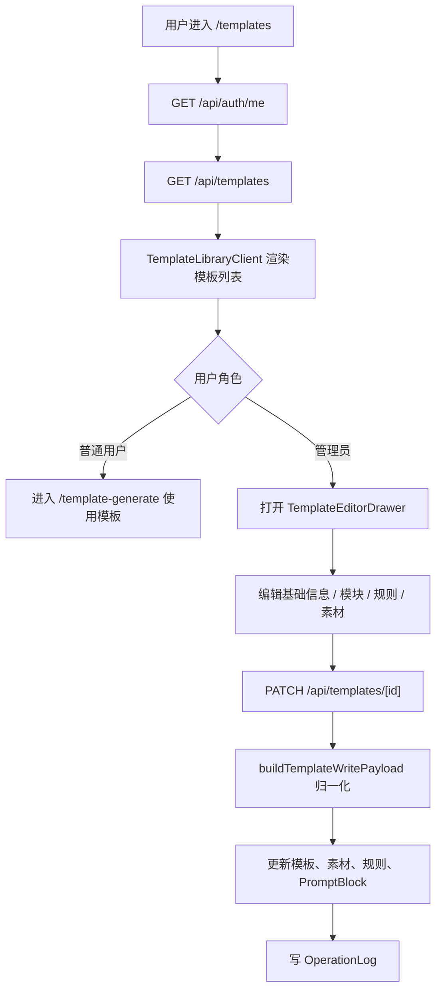
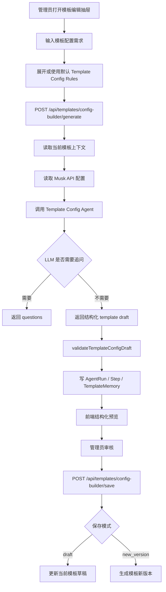
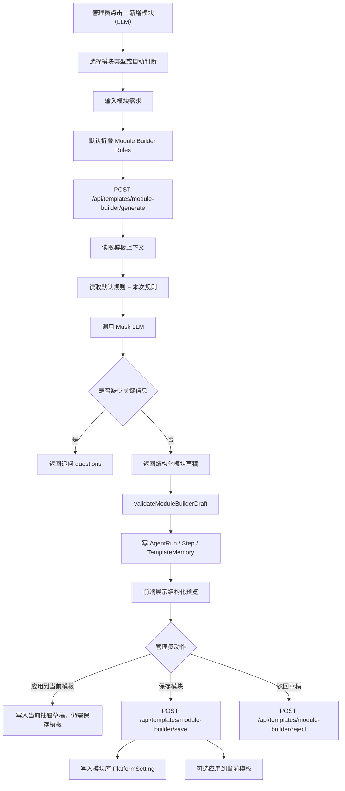
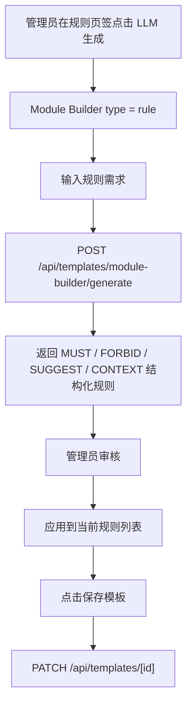
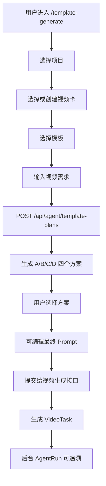
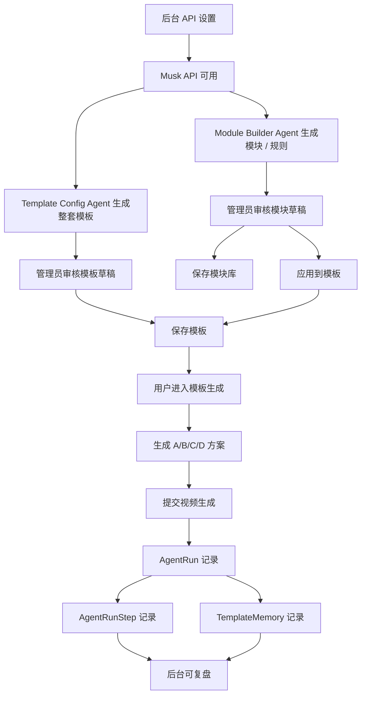

# 模板系统全功能与链路梳理

更新时间：2026-06-16  
梳理范围：当前线上 `sd2` 源码项目 `/Volumes/Data/Projects/video-api-debugger-v12-full-todo`  
文档目的：把“模板、模块、LLM 生成、规则、执行链路、Memory、后台追溯”放在一张图里，方便继续闭环和排查入口。

> 这份文档只梳理现有实现，不代表所有链路都已做过浏览器端完整验收。

## 1. 一句话总览

模板系统现在不是单纯的“填表建模板”，而是分成四层：

1. 模板库：管理和选择视频生成模板。
2. Module Builder Agent：用 LLM 对话生成模块或规则草稿。
3. Template Config Agent：用 LLM 对话生成整套模板配置草稿。
4. Template Agent 执行链路：用户选模板后生成 A/B/C/D 方案，再进入视频生成任务。

完整目标链路是：

```text
管理员配置 LLM
↓
管理员用 LLM 生成模板 / 模块 / 规则
↓
管理员审核并保存
↓
用户选择模板生成方案
↓
系统记录 AgentRun、Step、Memory
↓
后台可复盘每一次执行链路
```

## 2. 页面入口地图

| 入口 | 路由 | 面向对象 | 作用 |
|---|---|---|---|
| 动画模板 | `/templates` | 普通用户、管理员 | 查看模板库；管理员可编辑模板 |
| 模板生成 | `/template-generate` | 普通用户、管理员 | 选择模板后生成 A/B/C/D 方案并提交视频生成 |
| 模块管理 | `/admin/modules` | 管理员 | 查看由 LLM 保存下来的模块库和版本 |
| Agent 执行链路 | `/admin/agent-runs` | 管理员 | 查看模板 Agent、Module Builder、Template Config 的执行记录 |
| Agent 执行详情 | `/admin/agent-runs/[id]` | 管理员 | 查看每次执行的步骤、输入、输出、最终 Prompt、Memory |
| API 设置 | `/admin/integrations` | 管理员 | 设置 Musk API、默认模型和启用状态 |
| API 设置兼容入口 | `/admin/settings` | 管理员 | 指向同一类后台设置入口，避免用户找不到设置页 |

导航实现位置：

| 文件 | 说明 |
|---|---|
| `src/lib/navigation.ts` | 顶部和侧边栏导航配置，包含“模板”“模板生成”“动画模板”“模板与链路”等入口 |
| `src/components/ComposerTopbar.tsx` | 顶部快捷入口会匹配 `/templates`、`/template-generate` |
| `src/components/SideNav.tsx` | 侧边栏渲染普通用户和管理员入口 |

### 2.1 页面板面显示清单

这一节专门说明用户在页面上应该看到什么。前面“页面入口地图”只说明去哪里，这里说明每个板面显示什么。

#### 2.1.1 `/templates` 动画模板页

页面定位：模板库入口，也是管理员进入模板编辑的主入口。

普通用户应该看到：

```text
顶部 / 侧边导航
↓
模板列表
↓
模板封面 / 缩略图
↓
模板名称
↓
模板描述
↓
适用场景 / 状态信息
↓
使用模板 / 进入模板生成
```

管理员额外应该看到：

```text
筛选区：搜索、场景、状态
模板卡片：草稿 / 启用 / 停用状态
管理操作：编辑模板
新增入口：新建模板或进入 LLM 模板配置
```

如果管理员在这里找不到模板入口，优先检查：

```text
src/lib/navigation.ts
src/components/ComposerTopbar.tsx
src/components/SideNav.tsx
src/app/templates/page.tsx
src/components/templates/TemplateLibraryClient.tsx
```

#### 2.1.2 模板编辑抽屉 `TemplateEditorDrawer`

打开方式：

```text
/templates
↓
管理员点击某个模板
↓
打开右侧或弹层式模板编辑抽屉
```

抽屉顶部应该显示：

```text
模板名称
模板描述
状态
版本
默认比例
默认时长
默认分辨率
保存按钮
关闭按钮
```

抽屉主体应该分成这些板块：

| 板块 | 页面上应该显示什么 | 作用 |
|---|---|---|
| 基础信息 | 名称、描述、状态、版本、默认参数 | 管理模板基本资料 |
| Template Config Agent | 模板需求输入框、规则设定、生成按钮、结构化预览、保存草稿 / 新版本 | 用 LLM 生成整套模板配置 |
| 模块配置 | character、logo、style、camera、rules、asset_rule、temporal、prompt_format | 管理模板引用哪些模块 |
| 模块使用方式 | 强制插入 / 仅参考 | 决定模块是否必须进入最终 Prompt |
| Module Builder | 模块类型、需求输入、规则折叠区、生成结果预览、应用 / 保存 / 驳回 | 用 LLM 新增模块 |
| 规则配置 | MUST、FORBID、SUGGEST、CONTEXT 分组 | 管理生成时必须遵守的规则 |
| 素材配置 | 素材类型、名称、URL、缩略图、参考图 ID | 管理角色图、Logo 图、风格图等素材 |

#### 2.1.3 “新增模块（LLM）”板面

入口位置：

```text
模板编辑抽屉
↓
模块页签
↓
[ + 新增模块（LLM） ]
```

页面上应该显示：

```text
新增模块 / Module Builder
├─ 模块类型
│  ├─ 自动判断
│  ├─ 角色模块
│  ├─ Logo 模块
│  ├─ 风格模块
│  ├─ 镜头模块
│  ├─ 规则模块
│  ├─ 素材带规则模块
│  ├─ Temporal 分段模块
│  └─ 提示词格式模块
├─ LLM 对话输入区
│  └─ 描述你想创建什么模块
├─ LLM生成规则设定
│  └─ 默认折叠，可展开编辑本次生成规则
├─ 生成结果预览
│  ├─ moduleType
│  ├─ moduleName
│  ├─ promptBlock
│  ├─ rules
│  ├─ injectionMode
│  ├─ priority
│  └─ assetBinding
└─ 操作按钮
   ├─ 重新生成
   ├─ 应用到当前模板
   ├─ 保存模块
   └─ 驳回草稿
```

这个板面不是普通表单。它的正确交互是：

```text
管理员描述需求
↓
LLM 生成结构化草稿
↓
管理员看预览
↓
管理员决定应用、保存或驳回
```

#### 2.1.4 “新增规则（LLM）”板面

入口位置：

```text
模板编辑抽屉
↓
规则页签
↓
[ + 新增规则（LLM） ]
```

页面上应该显示：

```text
规则类型分组
├─ MUST
├─ FORBID
├─ SUGGEST
└─ CONTEXT

LLM 规则生成区
├─ 规则需求输入框
├─ Module Builder Rules 折叠区
├─ 生成按钮
├─ 结构化规则预览
└─ 应用到当前规则列表
```

注意：

```text
规则生成复用 Module Builder Agent
moduleType = rule
生成后先进入当前抽屉草稿
最后还要点击保存模板
```

#### 2.1.5 `/template-generate` 模板生成页

页面定位：普通用户实际使用模板生成视频的地方。

页面上应该显示：

```text
项目选择
↓
视频卡选择 / 创建
↓
模板选择
↓
模板摘要
↓
用户需求输入
↓
生成 A/B/C/D 方案
↓
方案卡片
↓
最终 Prompt 预览 / 可编辑
↓
提交生成视频
```

管理员额外应该看到：

```text
返回模板库
查看执行链路
进入 AgentRun 详情
```

#### 2.1.6 `/admin/modules` 模块管理页

页面定位：查看已经保存进模块库的模块，不是创建模块的主入口。

页面上应该显示：

```text
模块列表
├─ 模块名称
├─ 模块类型
├─ 作用域：全局 / 模板级
├─ 状态
├─ 当前版本
├─ 来源模板
├─ AgentRun 链接
└─ 最近版本差异 / 版本摘要
```

关键点：

```text
新增模块入口主要在模板编辑抽屉里
/admin/modules 更像模块库查看和追溯页
```

#### 2.1.7 `/admin/integrations` API 设置页

页面定位：管理员配置 LLM API 的地方。

页面上应该显示：

```text
Musk API 设置
├─ 启用开关
├─ Base URL
│  └─ 默认 https://api.muskapis.com/
├─ Model
│  └─ 默认 gpt-5.4
├─ API Key 输入框
├─ API Key 是否已配置
└─ 保存按钮
```

这个页面必须能支撑：

```text
Module Builder Agent
Template Config Agent
```

如果这里没配置或没启用，LLM 新增模块和 LLM 生成模板不会真正跑通。

#### 2.1.8 `/admin/agent-runs` 执行链路页

列表页应该显示：

```text
AgentRun 列表
├─ 执行状态
├─ 模板名称
├─ 触发来源
├─ 创建时间
├─ 选中方案
└─ 查看详情
```

详情页 `/admin/agent-runs/[id]` 应该显示：

```text
执行摘要
├─ 状态
├─ 选中方案
├─ 用户是否编辑 Prompt
├─ 创建时间
└─ 错误信息

执行链路卡片
├─ Intent
├─ Template Load
├─ Module Composer
├─ Rule Engine
├─ Prompt Compiler
├─ Plan Generator
├─ Validator
├─ Seedance Execution
└─ Memory Record

复盘区
├─ 命中规则
├─ 输入 / 输出对比
├─ Agent Prompt
├─ 最终 Prompt
├─ 每一步输入输出 JSON
└─ Memory 记录
```

这个页面的目标是让管理员能回答：

```text
这次生成用了哪个模板？
用了哪些模块和规则？
最终 Prompt 怎么来的？
哪一步失败了？
有没有写入 Memory？
```

## 3. 权限模型

| 能力 | 普通用户 | 模板管理员 / 系统管理员 |
|---|---:|---:|
| 查看启用模板 | 可以 | 可以 |
| 使用模板生成视频 | 可以 | 可以 |
| 查看草稿 / 停用模板 | 不可以 | 可以 |
| 新增 / 编辑模板 | 不可以 | 可以 |
| 用 LLM 生成模块 | 不可以 | 可以 |
| 用 LLM 生成规则 | 不可以 | 可以 |
| 用 LLM 生成整套模板配置 | 不可以 | 可以 |
| 编辑 Module Builder Rules | 不可以 | 可以 |
| 配置 Musk API | 不可以 | 可以 |
| 查看 AgentRun / Memory | 不可以 | 可以 |

后端接口里主要通过 `getSession()` 和 `user.role === 'admin'` 控制。普通用户只能读 active 模板并使用模板生成。

## 4. 数据结构

### 4.1 数据库主表

| 表 / Model | 作用 |
|---|---|
| `GenerationTemplate` | 模板主表，保存名称、描述、状态、版本、默认参数、模块绑定、Temporal 配置 |
| `TemplateAsset` | 模板素材，保存角色图、Logo、风格图、产品图、反例图等 |
| `TemplateRule` | 模板规则，保存 MUST / FORBID / SUGGEST / CONTEXT 规则 |
| `TemplatePromptBlock` | 模板提示词块，保存角色、Logo、风格、镜头、规则、Temporal、提示词格式等 Prompt |
| `AgentRun` | 一次 Agent 执行主记录，保存模板、输入、方案、最终 Prompt、状态 |
| `AgentRunStep` | AgentRun 的每一步输入输出 |
| `TemplateMemory` | 模板相关长期记忆，用于复盘、推荐和生成追溯 |
| `OperationLog` | 管理员操作日志 |
| `PlatformSetting` | 平台级设置，当前用于 Musk API 配置、模块库、Module Builder 默认规则 |

### 4.2 模板序列化结构

核心文件：`src/lib/templates/workbench.ts`

模板对前端输出时，会被整理成：

```text
SerializedGenerationTemplate
├─ template 基础信息
├─ default_params
├─ module_bindings
├─ module_usage
├─ temporal
├─ assets
├─ rules
└─ prompts
```

当前支持的模块键：

```text
character
logo
style
camera
rules
asset_rule
temporal
prompt_format
```

当前支持的规则类型：

```text
must
forbid
suggest
context
```

当前支持的素材类型：

```text
character
logo
style
product
negative
other
```

说明：Prisma schema 的部分注释仍偏旧，但 `workbench.ts` 的归一化层已经支持扩展后的模块、规则和素材类型。

## 5. 核心功能清单

### 5.1 模板库

页面：`src/app/templates/page.tsx`  
组件：`src/components/templates/TemplateLibraryClient.tsx`

功能：

1. 读取当前登录用户。
2. 调用 `/api/templates` 拉取模板列表。
3. 管理员会带 `include_inactive=true`，可以看到草稿和停用模板。
4. 支持搜索、场景筛选、状态筛选。
5. 从模板素材里取缩略图作为预览图。
6. 普通用户点击模板进入 `/template-generate`。
7. 管理员可打开模板编辑抽屉。

### 5.2 模板编辑抽屉

组件：`src/components/templates/TemplateEditorDrawer.tsx`

主要分区：

1. 基础信息：模板名称、描述、状态、版本、默认比例、时长、分辨率。
2. Template Config Agent：用 LLM 生成整套模板配置。
3. 模块配置：角色、Logo、风格、镜头、规则、素材规则、Temporal、提示词格式。
4. 规则配置：MUST、FORBID、SUGGEST、CONTEXT。
5. 素材配置：素材类型、名称、URL、缩略图、参考图 ID。
6. Module Builder：对话式生成单个模块或单条/一组规则。
7. 保存操作：保存模板草稿或新版本。

重要设计：

```text
新增模块不是传统表单
而是点击“+ 新增模块（LLM）”
↓
输入想创建什么
↓
LLM 生成结构化模块草稿
↓
管理员审核 / 微调
↓
应用到当前模板或保存到模块库
```

### 5.3 Template Config Agent

核心文件：`src/lib/templates/template-config-builder.ts`

作用：不是生成单个模块，而是生成一整套模板配置草稿。

它要求 LLM 输出：

```text
templateDraft
defaultParams
modulePlan
promptBlocks
rules
assetBindings
temporal
promptFormat
planStrategy
validationChecklist
missingInputs
```

强制要求：

1. 必须输出结构化 JSON。
2. 必须包含 `prompt_format` 模块。
3. `prompt_format` 直接采用现有视频生成 skills 的提示词格式。
4. 缺少关键模板用途、目标视频类型或素材信息时，先追问，不直接生成。
5. 生成结果只能先成为草稿，管理员保存后才真正进入模板。

### 5.4 Module Builder Agent

核心文件：`src/lib/templates/module-builder.ts`

作用：把管理员一句话需求转成可保存的模块草稿。

支持模块类型：

```text
auto
character
logo
style
camera
rule
asset_rule
temporal
prompt_format
```

输出结构：

```json
{
  "needsClarification": false,
  "moduleType": "character",
  "moduleName": "兔子IP",
  "promptBlock": {},
  "rules": [],
  "injectionMode": "prompt_required",
  "priority": 90
}
```

规则类型：

```text
MUST
FORBID
SUGGEST
CONTEXT
```

注入方式：

```text
prompt_required
context_only
validation_only
```

默认生成规则：

1. 不要只生成自然语言描述，必须输出结构化模块。
2. 必须区分 `prompt_required / context_only / validation_only`。
3. 必须区分 `MUST / FORBID / SUGGEST / CONTEXT`。
4. 如果是图片素材，必须判断它是角色、Logo、风格、镜头、产品还是反例。
5. 如果缺少关键信息，必须先追问，不要直接生成。
6. 输出结果必须可保存为系统模块。

### 5.5 提示词格式模块

提示词格式模块已经接入“视频生成 skills”的格式要求。

来源位置：

| 文件 | 说明 |
|---|---|
| `src/lib/templates/module-builder.ts` | `VIDEO_PROMPT_FORMAT_REQUIREMENTS` |
| `src/components/templates/TemplateEditorDrawer.tsx` | `PROMPT_FORMAT_BLOCK` |
| `src/lib/templates/template-config-builder.ts` | Template Config Agent 强制包含 prompt_format |
| `src/lib/templates/module-library.ts` | 保存模块时标记 `prompt_format_source: video_generation_skills` |

格式要求：

```text
首行：最多两个中文字符 + 三位数字，例如 (弹力001)
正文：先写整段视频总体要求
分镜：每个分镜必须包含时间 / 景别 / 运镜 / 内容
时间：连续、不重叠、不跳秒
描述：默认正向画面描述
结尾：必须包含 (end)
```

### 5.6 模块库

核心文件：`src/lib/templates/module-library.ts`

当前模块库不是独立数据表，而是存在 `PlatformSetting` 里：

```text
key = template_module_library_v1
```

模块库保存：

```text
module id
module type
module name
scope
status
current_version
source_template_id
agent_run_id
versions
```

保存模块时会生成版本记录。每个版本包含：

```text
promptBlock
rules
injectionMode
priority
target
assetBinding
createdBy
createdAt
source
```

如果保存的是 `prompt_format` 模块，会额外记录：

```text
prompt_format_source = video_generation_skills
```

## 6. LLM 配置链路

页面：`/admin/integrations`  
组件：`src/app/admin/integrations/AdminIntegrationsClient.tsx`  
接口：`src/app/api/admin/integrations/musk/route.ts`  
核心文件：`src/lib/integrations/musk.ts`

默认配置：

```text
base_url = https://api.muskapis.com/
model = gpt-5.4
enabled = false
api_key = null
```

保存位置：

```text
PlatformSetting.key = musk_api_v1
```

接口行为：

1. `GET /api/admin/integrations/musk` 返回当前配置，但不会返回 API Key 明文。
2. `PUT /api/admin/integrations/musk` 保存 Base URL、模型、启用状态和 API Key。
3. `createMuskChatCompletion()` 发起真实 LLM 请求。
4. 如果 Base URL 不是 `/chat/completions` 结尾，会自动补 `/v1/chat/completions`。
5. LLM 请求默认要求 JSON 输出。

注意：

```text
如果 Musk API 没启用，或没有 API Key，
Template Config Agent 和 Module Builder Agent 都不能真实生成。
```

## 7. 链路一：模板库浏览与模板编辑



相关文件：

| 文件 | 作用 |
|---|---|
| `src/app/templates/page.tsx` | 模板库页面入口 |
| `src/components/templates/TemplateLibraryClient.tsx` | 模板列表、筛选、打开编辑抽屉 |
| `src/components/templates/TemplateEditorDrawer.tsx` | 管理员编辑模板 |
| `src/app/api/templates/route.ts` | 模板列表和新建模板 |
| `src/app/api/templates/[id]/route.ts` | 模板详情和更新模板 |
| `src/lib/templates/workbench.ts` | 模板读取、写入归一化 |

## 8. 链路二：用 LLM 生成整套模板配置



接口：

| 接口 | 权限 | 作用 |
|---|---|---|
| `POST /api/templates/config-builder/generate` | 管理员 | 生成整套模板配置草稿 |
| `POST /api/templates/config-builder/save` | 管理员 | 保存为草稿或新版本 |

执行记录：

```text
AgentRun
├─ template_config_context
├─ template_config_rules
├─ llm_generate
├─ validator
└─ memory_record
```

## 9. 链路三：用 LLM 新增模块

入口位置：

```text
/templates
↓
管理员打开某个模板
↓
模块页签
↓
点击 “+ 新增模块（LLM）”
```

或：

```text
模块某一行
↓
点击 “LLM 生成”
```

完整链路：



接口：

| 接口 | 权限 | 作用 |
|---|---|---|
| `POST /api/templates/module-builder/generate` | 管理员 | 生成模块草稿 |
| `POST /api/templates/module-builder/save` | 管理员 | 保存模块到模块库，可选应用到模板 |
| `POST /api/templates/module-builder/reject` | 管理员 | 驳回模块草稿并写入 Memory |
| `GET /api/templates/module-builder/library` | 管理员 | 读取模块库 |
| `GET /api/templates/module-builder/rules` | 管理员 | 读取默认生成规则 |
| `PUT /api/templates/module-builder/rules` | 管理员 | 更新默认生成规则 |

执行记录：

```text
AgentRun
├─ module_builder_context
├─ module_builder_rules
├─ llm_generate
├─ validator
└─ memory_record
```

保存后的影响：

1. 模块进入全局或模板级模块库。
2. 模块有版本记录。
3. 如果选择应用到模板，会把模块写入当前模板的模块绑定、PromptBlock、规则或素材绑定。
4. 当前模板仍需要管理员点击保存，才会真正更新模板。

## 10. 链路四：用 LLM 新增规则

入口位置：

```text
/templates
↓
管理员打开某个模板
↓
规则页签
↓
点击 “+ 新增规则（LLM）”
```

或：

```text
某个规则类型区域
↓
点击 “LLM 生成本类规则”
```

设计上，规则生成复用 Module Builder Agent：

```text
moduleType = rule
```

链路：



注意：

1. 规则草稿不会自动入库。
2. 应用到当前模板后，仍要保存模板。
3. 规则也会进入 AgentRun 和 TemplateMemory，方便以后复盘。

## 11. 链路五：用户用模板生成视频

页面：`/template-generate`  
组件：`src/components/templates/TemplateGenerateClient.tsx`  
核心生成器：`src/components/GenerationComposer.tsx`

用户侧流程：



`/api/agent/template-plans` 的执行链：

```text
intent_parse
template_load
module_composer
rule_compute
prompt_compose
plan_generate
validator
seedance_execution
memory_record
```

方案生成位置：`src/lib/agent-plans/template-plans.ts`

当前 A/B/C/D 是本地确定性方案，不是 Musk LLM 实时生成：

| 方案 | 名称 | 倾向 |
|---|---|---|
| A | 品牌开场型 | 适合品牌识别和开场记忆 |
| B | 产品动线型 | 适合产品展示、路径、功能 |
| C | 情绪记忆型 | 适合氛围、情绪、故事感 |
| D | 多段叙事型 | 适合分段节奏和完整叙事 |

最终 Prompt 会组合：

```text
用户需求
模板基础信息
模块绑定
模块使用方式 required / reference
PromptBlock
MUST / SUGGEST / FORBID / CONTEXT 规则
Temporal 分段
A/B/C/D 方案策略
历史 TemplateMemory 信号
```

## 12. 链路六：AgentRun 后台复盘

列表页：`/admin/agent-runs`  
详情页：`/admin/agent-runs/[id]`

详情页展示：

1. 当前执行状态。
2. 选中的方案。
3. 用户是否编辑过 Prompt。
4. 错误信息。
5. 9 步执行链路卡片。
6. 命中规则。
7. 用户输入、模板模块、Temporal、方案、Seedance Payload 摘要。
8. Agent Prompt。
9. 最终 Prompt。
10. 每一步的输入输出 JSON。
11. TemplateMemory 记录。

敏感信息处理：

`src/app/admin/agent-runs/[id]/page.tsx` 会对 token、secret、cookie、authorization、password、api_key、url 等字段做脱敏展示。

## 13. 链路七：Memory 记录

Memory 用途：

1. 保存谁创建了模块。
2. 保存生成前的输入是什么。
3. 保存 LLM 使用了什么规则。
4. 保存 LLM 输出的模块结构。
5. 保存管理员是否保存或驳回。
6. 保存模板生成方案选择结果。
7. 为后续方案推荐提供历史信号。

常见写入点：

| 链路 | Memory 类型 |
|---|---|
| Module Builder 生成 | `module_builder_generate` |
| Module Builder 保存 | `module_builder_save` |
| Module Builder 驳回 | `module_builder_reject` |
| Template Config 生成 | `template_config_generate` |
| Template Config 保存 | `template_config_save` |
| 模板方案生成 | `template_agent_plan` |

## 14. API 清单

| API | 方法 | 权限 | 作用 |
|---|---|---|---|
| `/api/templates` | GET | 登录用户 | 读取模板列表 |
| `/api/templates` | POST | 管理员 | 新建模板 |
| `/api/templates/[id]` | GET | 登录用户 | 读取模板详情；普通用户只能读 active |
| `/api/templates/[id]` | PATCH | 管理员 | 更新模板、素材、规则、PromptBlock |
| `/api/agent/template-plans` | POST | 登录用户 | 生成模板 A/B/C/D 方案并记录 AgentRun |
| `/api/templates/config-builder/generate` | POST | 管理员 | LLM 生成整套模板配置草稿 |
| `/api/templates/config-builder/save` | POST | 管理员 | 保存模板配置草稿或新版本 |
| `/api/templates/module-builder/generate` | POST | 管理员 | LLM 生成模块或规则草稿 |
| `/api/templates/module-builder/save` | POST | 管理员 | 保存模块到模块库，可选应用到模板 |
| `/api/templates/module-builder/reject` | POST | 管理员 | 驳回模块草稿 |
| `/api/templates/module-builder/library` | GET | 管理员 | 读取模块库 |
| `/api/templates/module-builder/rules` | GET | 管理员 | 读取 Module Builder 默认规则 |
| `/api/templates/module-builder/rules` | PUT | 管理员 | 保存 Module Builder 默认规则 |
| `/api/admin/integrations/musk` | GET | 管理员 | 读取 Musk API 设置，不返回 Key 明文 |
| `/api/admin/integrations/musk` | PUT | 管理员 | 保存 Musk API 设置 |

## 15. 存储清单

| 存储位置 | Key / 表 | 内容 |
|---|---|---|
| 数据库 | `GenerationTemplate` | 模板主数据 |
| 数据库 | `TemplateAsset` | 模板素材 |
| 数据库 | `TemplateRule` | 模板规则 |
| 数据库 | `TemplatePromptBlock` | 模板提示词块 |
| 数据库 | `AgentRun` | Agent 执行主记录 |
| 数据库 | `AgentRunStep` | Agent 步骤记录 |
| 数据库 | `TemplateMemory` | 模板长期记忆 |
| 数据库 | `OperationLog` | 管理员操作日志 |
| `PlatformSetting` | `musk_api_v1` | Musk API Base URL、模型、启用状态、API Key |
| `PlatformSetting` | `template_module_library_v1` | 模块库 |
| `PlatformSetting` | Module Builder Rules 相关 key | 默认 LLM 生成规则 |

## 16. 当前已知边界和注意点

1. `Module Builder Agent` 和 `Template Config Agent` 已接入 Musk API 配置，但必须先在后台设置里启用并填写 API Key。
2. `gpt-5.4` 是当前默认模型配置，不代表本地一定已经有可用 Key。
3. 用户侧 `/api/agent/template-plans` 当前是本地方案生成逻辑，不是每次都请求 LLM。
4. 模块库当前存在 `PlatformSetting` JSON 里，还不是独立模块数据表。
5. LLM 生成后的模块和模板都不是直接入库，必须管理员审核后保存。
6. 应用模块到当前模板抽屉后，还需要保存模板，才真正写入模板表。
7. 规则生成复用 Module Builder，生成后也是先进入当前抽屉草稿。
8. AgentRun 详情页做了脱敏，但仍要避免把 API Key、token、cookie 写入用户输入或规则文本。
9. Prisma schema 注释有些旧，真实可用类型以 `workbench.ts` 的归一化层为准。
10. 本文档是源码链路梳理，不等于线上浏览器验收报告。

## 17. 验证脚本和现有烟测

当前仓库里有这些与模板 / LLM 相关的烟测脚本：

| 脚本 | 作用 |
|---|---|
| `scripts/template-builder-entrypoints-smoke.ts` | 检查模板、模块、LLM 入口文案和关键代码是否存在 |
| `scripts/template-llm-contract-smoke.ts` | 检查模板 LLM 输出结构、模块补丁和保存契约 |
| `scripts/module-builder-agent-smoke.ts` | 检查 Module Builder Agent 解析、校验和 prompt_format 要求 |
| `scripts/workbench-closure-smoke.ts` | 检查模板工作台闭环相关入口 |

建议后续验证顺序：

```text
1. npm run lint
2. 运行模板相关 smoke 脚本
3. 后台设置 Musk API
4. 浏览器进入 /templates
5. 管理员新增模块（LLM）
6. 保存模块并应用模板
7. 保存模板
8. 普通用户进入 /template-generate 使用模板生成方案
9. 后台 /admin/agent-runs 检查执行链路和 Memory
```

## 18. 后续闭环建议

优先闭环的检查点：

1. 导航是否能稳定找到 `/templates`、`/template-generate`、`/admin/modules`、`/admin/agent-runs`、`/admin/integrations`。
2. 管理员能否在模板编辑抽屉里看到“+ 新增模块（LLM）”和“+ 新增规则（LLM）”。
3. Musk API 填好后，Module Builder 是否能真实返回结构化 JSON。
4. LLM 生成的模块保存后，是否能在 `/admin/modules` 看到版本。
5. 应用模块到模板后，模板保存是否把 PromptBlock、Rules、Module Binding 都写入。
6. 普通用户使用模板生成时，最终 Prompt 是否包含 required 模块、规则和 prompt_format。
7. `/admin/agent-runs/[id]` 是否能看到完整步骤、输入输出、最终 Prompt 和 Memory。
8. 驳回模块草稿时，是否写入负向 Memory，方便以后避免重复错误。

## 19. 最终闭环图



这套系统的核心原则是：

```text
模块不是手填出来的，
而是由 LLM 根据管理员对话生成；
管理员负责设定生成规则、审核结构化结果、保存模块和版本。
```
