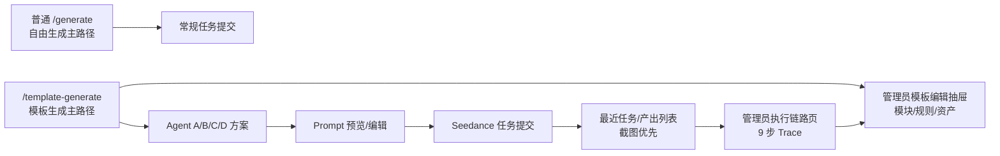

# V1.2 剩余模块落地 Todo

更新时间：2026-06-24

来源：`/Volumes/Data/Downloads/Current/AI视频生成项目成本管理系统需求文档_完整细项版V1.2.md`

最新验收结论：整份 V1.2 仍未完整落地。当前代码已经有视频卡 P0 归档入口、公共项目预算底座、审批记录表、审批中心页面、1080p 基础校验、新建项目“默认记账 / 预算记账”选择入口，但这些还没有形成完整业务闭环。后续执行必须以本 todo 为准，不得把“有模型/有页面/有审批记录”误判为“业务已闭环”。

## 火山 IP 生成页正式版闭环复核 Todo

更新时间：2026-06-24

复核结论：

- [x] 入口已覆盖：当前工作区已有 `/generate/ip` 页面；普通生成页首屏“查看我的项目”旁边已有 `IP生成` 入口；`ComposerTopbar` 和用户导航里也已有 `IP生成`。
- [x] 当前页面只是静态准备页：可保存 IP 授权草稿、展示配置清单、明确 API 未配置时不生成、不扣点、不创建任务。
- [ ] 火山真实接口未闭环：服务端 `Volcengine IP Provider` 适配层已完成；还没有接入本地任务创建、点数冻结、转存和真实火山请求。
- [ ] 任务状态未闭环：还没有把火山任务状态、失败原因、`usage`、结果视频 URL、24 小时转存要求映射回本地 `VideoTask`。
- [ ] 点数和成本未闭环：可沿用现有冻结、扣点、返还和 CostLedger 链路，但必须等火山返回的真实 `usage`/费用口径确认后才能打开真实扣点。
- [ ] 线上未闭环：当前工作区未完成本轮构建、部署和公网验收；不能把本地代码雏形当成线上效果。

官方文档对照范围：

- 视频生成 API 的四个主页面必须全部覆盖：创建视频生成任务、查询视频生成任务、查询视频生成任务列表、取消或删除视频生成任务。
- 配套页面必须纳入设计：`Base URL及鉴权`、`错误码`、`GetInferenceUsage`、用量明细导出、`Seedance 2.0 Badcase 上报 API`、私域素材资产库、真人认证/授权素材说明。
- 不能只按创建任务页实现；火山这套是异步任务，创建只是第一步，查询、回调、转存、错误处理和取消/删除才决定真实闭环。

能复用当前链路：

- [ ] 登录态、用户权限、管理员权限、项目/视频卡绑定、任务归属校验继续复用现有体系。
- [ ] 点数冻结、生成失败返还、成功扣点、成本账本和后台成本展示继续复用现有链路，但 Provider 成本来源要标记为 `volcengine_ip` 或等价来源，避免和普通 Seedance 混在一起。
- [ ] 本地任务表、最近任务列表、任务详情、后台产出留存、视频下载转存、缩略图优先展示继续复用现有能力。
- [ ] 参考图、图集、资产上传、公网对象存储可以复用，但传给火山前必须转换成官方 `content`/`asset://` 可接受格式。
- [ ] 页面 UI 可以从普通生成页复制骨架，但 IP 生成页必须是独立路由和独立状态，不把火山逻辑塞回普通 `/generate`。

必须新写或重写：

- [x] 新增火山 IP Provider：创建任务 `POST /api/v3/contents/generations/tasks`，鉴权使用服务端 `Authorization: Bearer <ARK_API_KEY>`，Base URL 为 `https://ark.cn-beijing.volces.com/api/v3`。
- [x] 新增查询单任务适配：按火山任务 ID 拉取状态，处理成功、运行中、失败、取消、删除等状态，并把失败错误码写回本地任务。
- [x] 新增查询任务列表适配：用于后台对账、补偿扫描和异常恢复，不替代本地任务列表的主展示。
- [x] 新增取消/删除适配：区分“取消 Provider 任务”和“本地隐藏/删除记录”；运行中任务优先取消，已完成记录默认只做本地留存操作。
- [x] 新增火山 payload mapper：从 IP 页面草稿、授权 metadata、参考素材、ratio、duration、resolution、seed、watermark、audio、return_last_frame 等生成官方 `content` 请求体。
- [x] 新增错误码 mapper：把 401/403 鉴权权限、429 限流、余额/配额、模型无权限、敏感内容、版权/真人/素材审核失败、Provider 内部错误，翻译成用户能看懂的状态。
- [ ] 新增重试策略：只对网络超时、429、5xx 等短暂错误做退避重试；鉴权、权限、余额、内容安全、素材审核失败不自动重试。
- [ ] 新增回调接收策略：如果启用 `callback_url`，回调只能作为状态提示；必须校验任务 ID 属于本地任务，幂等写入，必要时再主动查询火山状态确认。
- [ ] 新增结果转存：火山查询结果的视频 URL 有有效期，任务成功后必须尽快下载到本地/对象存储，长期展示优先用本地稳定 URL。
- [x] 新增敏感信息脱敏：日志、AgentRun、raw response、错误详情里不得展示 API Key、AK/SK、签名参数、完整临时视频 URL 或真人认证 token。

暂不做：

- [ ] 暂不自动上报 Badcase。Badcase API 只用于已完成的 Seedance 2.0/2.0 fast 问题反馈，而且会把任务数据交给火山排查；首版只规划管理员手动上报，并要求明确确认。
- [ ] 暂不依赖私域素材资产 API 作为首版前置条件。CreateAsset/CreateAssetGroup 等接口涉及 AK/SK、权益包、授权书、异步审核和素材状态，首版只允许手动填写已存在且已授权的 `asset://`。
- [ ] 暂不做真人 H5 认证闭环。H5 链接、byted token、回调和一次性认证有独立产品/合规流程，等火山账号权限和业务规则确认后再开。
- [ ] 暂不接 `GetUsage`。该接口已标注待弃用，后续如做后台对账，只接 `GetInferenceUsage` 或用量明细导出。
- [ ] 暂不开放真实生成按钮。缺 API Key、Model ID、资源包/余额、版权 IP 权益、素材资产权限前，页面只能保存草稿和展示配置状态。

未决问题：

- [ ] 火山账号侧是否已开通 Seedance 2.0 / 2.0 fast，以及具体 Model ID 或 Endpoint ID。
- [ ] “授权 IP 动画”是否有火山官方版权 IP 权益包或白名单；不能只凭普通视频生成 API 假设可生成授权 IP。
- [ ] 生产环境变量命名、密钥保存位置、AK/SK 是否需要、谁负责配置和轮换。
- [ ] 官方价格、资源包、倍率、`usage` 字段和本项目点数换算规则。
- [ ] 私域素材资产组、真人素材、品牌/Logo/声音素材的授权证明如何上传、保存、审计和过期处理。
- [ ] 回调公网地址、回调重试、任务补偿扫描间隔和列表接口频率限制。
- [ ] 文档中提到的新模型/API 开放日期需要在启用前按当天官方文档重查，不能用旧参数直接上线。

后续落地批次：

- [x] Batch IP-0：只做接口设计和类型定义，新增 `src/lib/provider/volcengine-ip.ts`、状态/错误码类型、payload mapper 单元测试，不调用真实火山。
- [x] Batch IP-1：接环境变量和管理员配置状态页，前端只展示“已配置/未配置”，不回显密钥。
- [x] Batch IP-2A：实现火山创建、查询、列表、取消/删除 Provider 网络适配层和 smoke fixture；不接入本地扣点、不发真实请求。
- [ ] Batch IP-2：实现创建任务服务端链路，复用现有鉴权、项目/视频卡、点数冻结、任务落库；失败必须返还冻结点数。
- [ ] Batch IP-3：实现查询单任务、结果转存、状态回写、任务详情展示和最近任务缩略图。
- [ ] Batch IP-4：实现补偿扫描和查询任务列表，用于任务遗漏、回调失败、URL 过期前转存。
- [ ] Batch IP-5：实现取消/删除 Provider 任务，并和本地任务隐藏/删除做清晰分层。
- [ ] Batch IP-6：补错误码、回调、脱敏、用量对账和管理员手动 Badcase 上报。

### Review - 2026-06-24 Batch IP-0

- 已新增 `src/lib/provider/volcengine-ip.ts`，只包含纯函数：配置读取、创建任务 payload 构造、任务状态映射、错误分类/重试建议、日志脱敏。
- 已新增 `scripts/volcengine-ip-provider-smoke.ts`，覆盖默认 Base URL、Model/API Key 配置闸门、`content` 数组构造、状态映射、429/内容安全错误归类和签名 URL/token 脱敏。
- 已按 TDD 先跑红灯：模块不存在时报 `Cannot find module '@/lib/provider/volcengine-ip'`；实现后 smoke 通过。
- 本批没有接入 `/api/tasks/create`，没有读取真实 API Key，没有向火山发请求，没有冻结点数，也没有部署线上。

### Review - 2026-06-24 Batch IP-1

- 已新增 `getVolcengineIpPublicConfigStatus()`，只返回 `ready`、`api_key_configured`、`model_configured`、Base URL、创建任务路径和缺失项，不返回明文或 masked API Key。
- 已新增管理员 API：`GET /api/admin/integrations/volcengine-ip`，沿用 `getAdminUser` 鉴权，只读返回火山 IP 生成配置状态。
- 已新增只读管理员页面：`/admin/integrations/volcengine-ip`，页面只显示“已配置 / 未配置”、Model ID、Base URL、缺失项和“真实请求未启用”。
- 已新增 `scripts/volcengine-ip-config-status-smoke.ts`，验证缺配置/已配置两种状态、API 不含密钥片段、route 存在且为动态路由。
- 本批没有保存配置、没有回显密钥、没有接入真实创建任务、没有请求火山、没有冻结点数，也没有部署线上。

### Review - 2026-06-24 Batch IP-2A

- 已在 `src/lib/provider/volcengine-ip.ts` 新增火山任务网络适配层：创建任务、查询单任务、查询任务列表、取消/删除任务。
- 已按官方视频生成 API 形态固定方法和路径：`POST /contents/generations/tasks`、`GET /contents/generations/tasks/{id}`、`GET /contents/generations/tasks`、`DELETE /contents/generations/tasks/{id}`。
- 已新增 `scripts/volcengine-ip-task-api-smoke.ts`，用假 `fetch` 验证 URL、方法、`Authorization: Bearer`、请求体不带密钥、状态/usage/结果 URL 解析和列表筛选参数。
- 本批仍未接入 `/api/tasks/create`、项目/视频卡、点数冻结、CostLedger、结果转存或真实火山请求；Batch IP-2 主业务链路继续保持未完成。

验收标准：

- [ ] 普通 `/generate` 原功能不退化，只多一个到 `/generate/ip` 的入口。
- [ ] `/generate/ip` 是独立页面，所有普通生成功能可达；真实生成只在火山配置满足后开启。
- [x] 创建、查询、列表、取消/删除四个火山视频任务接口都有服务端适配和测试 fixture。
- [ ] 任务成功后结果视频已转存，页面不依赖火山 24 小时临时 URL。
- [ ] 失败任务能显示清楚原因，并区分用户可修复、管理员配置问题、火山侧临时问题。
- [ ] 点数冻结、扣点、返还和成本账本与现有链路一致，不能重复扣点或漏返还。
- [ ] 日志和后台详情脱敏，不能泄露密钥、签名 URL、真人认证 token 或完整敏感 payload。
- [ ] 真实 API Key 未配置时，任何生成按钮都不能调用火山，也不能冻结点数。

## Smoke Project 自动合并与项目去重 Todo

更新时间：2026-06-14

问题定义：

- 本地只读统计发现当前 `Project` 表存在 19 个 active/team 的 `Smoke Project ...`。
- 这些项目不是 `scripts/project-ui-smoke.ts` 产生的；该脚本只读检查 `/api/projects`。
- 真实来源是 `scripts/workbench-closure-smoke.ts`，它每次运行都会 `POST /api/projects` 创建随机命名的 `Smoke Project ${randomSuffix()}`，但脚本结束后没有清理，也没有复用固定测试项目。
- 当前 19 个 Smoke Project 下已有 14 条 `VideoTask`、11 张 `VideoCard`、19 个 `CanvasDocument`、50 条 `CostLedger`、36 条 `CostAllocation`。因此不能直接批量删除，只能走“合并迁移 + 审计留痕 + 源项目归档/删除”的闭环。

目标：

- 管理员不再看到一堆测试项目散落在项目列表里。
- 后续 smoke 测试默认复用一个固定项目，不再持续制造 `Smoke Project ...`。
- 历史 Smoke Project 可安全合并到一个目标项目，任务、视频卡、画布、成本归属和成员关系都能闭环迁移。
- 合并前必须提供 dry-run 预览；合并后保留操作日志和迁移审计，支持回查“哪些项目被合并到哪里”。

### 方案选择

- [x] 不推荐“直接删除所有 Smoke Project”：有任务、视频卡、画布和成本账本，删除会破坏历史结果、项目成本和视频卡入口。
- [x] 不推荐“只把项目改名”：列表会少一点，但任务/成本仍散在多个项目，后续项目统计仍被污染。
- [x] 推荐“固定测试项目 + 历史项目合并”：新 smoke 只进固定项目；旧 smoke 通过后台合并工具迁移到目标项目。

### 第一阶段：阻止继续产生垃圾项目

- [x] 修改 `scripts/workbench-closure-smoke.ts`。
- [x] 新增环境变量 `SMOKE_PROJECT_ID`：传入时直接复用该项目，不再创建新项目。
- [x] 新增环境变量 `SMOKE_PROJECT_NAME`：没有 `SMOKE_PROJECT_ID` 时，按固定名称查找或创建，例如 `Smoke Project Archive`。
- [x] 默认行为从“每次随机新建项目”改成“复用固定 smoke 项目”；只有显式设置 `SMOKE_CREATE_UNIQUE_PROJECT=1` 时才允许创建随机项目。
- [x] 脚本输出里标明 `projectMode=reused | created | unique`，方便日志审计。
- [ ] 验证命令：`BASE_URL=http://localhost:3000 npx tsx scripts/workbench-closure-smoke.ts`，预期不会新增随机 `Smoke Project ...`。

### 第二阶段：项目合并后端能力

- [x] 新增项目合并服务：`src/lib/projects/merge.ts`。
- [x] 服务导出 `previewProjectMerge(sourceProjectIds, targetProjectId)`。
- [x] 服务导出 `mergeProjects({ sourceProjectIds, targetProjectId, actorUserId, reason, mode })`。
- [x] preview 返回每个源项目的任务数、视频卡数、画布数、图集数、参考图数、成本账本数、成本分摊数、成员数、预算账户状态和阻断原因。
- [x] merge 必须在单个事务内执行，避免迁移一半失败后账实不一致。
- [x] `VideoTask.project_id` 迁移到目标项目。
- [x] `VideoCard.project_id` 迁移到目标项目。
- [x] `CanvasDocument.project_id` 迁移到目标项目。
- [x] `ReferenceAlbum.project_id` 迁移到目标项目。
- [x] `ReferenceImage.project_id` 迁移到目标项目。
- [x] `ProviderApiRequest.project_id` 迁移到目标项目。
- [x] `ApprovalRecord.project_id` 迁移到目标项目。
- [x] `ContentAuditLog.project_id` 迁移到目标项目。
- [x] `CostLedger.project_id` 和 `CostAllocation.project_id` 迁移时复用 `src/lib/costs/ledger.ts` 的 `recordTaskProjectTransfer` 或等价审计语义，不能静默改账本归属。
- [x] `ProjectMember` 合并时按用户去重：目标已有成员则保留权限更高的角色，源项目成员只作为审计信息记录，不重复插入。
- [x] 源项目合并后状态改为 `archived` 或 `deleted`，推荐第一版用 `archived`，备注写入 `description` 或 `OperationLog`，避免误删。
- [x] 禁止把 `personal`、`system`、目标项目自身、已 deleted 项目作为源项目。
- [x] 禁止合并到 `deleted` 或无权限管理的目标项目。
- [x] 如果源项目存在 `ProjectBudgetAccount` 或 `ProjectBudgetLedger`，第一版先阻断合并，后续单独设计预算合并。

### 第三阶段：管理员项目管理页交互

- [x] 修改 `src/app/admin/projects/AdminProjectsClient.tsx`，增加批量选择列。
- [x] 表格顶部增加搜索框，支持快速搜索 `Smoke Project`。
- [x] 表格顶部增加筛选：全部、活跃、归档、空项目、疑似测试项目。
- [x] 疑似测试项目规则第一版：项目名匹配 `/\\bSmoke Project\\b/i` 或 description 包含 `closure smoke`。
- [x] 勾选多个项目后显示批量操作栏。
- [x] 批量操作栏提供“合并到项目”按钮。
- [x] 点击“合并到项目”后使用右侧抽屉，不使用浏览器 `window.confirm`。
- [x] 抽屉第一步选择目标项目，默认推荐 `Smoke Project Archive`；如果不存在，引导先创建。
- [x] 抽屉第二步展示 dry-run 预览：源项目数量、任务、视频卡、画布、成本账本、成员冲突、预算阻断。
- [x] 抽屉第三步输入合并原因，并二次确认。
- [x] 合并成功后刷新列表，源项目进入归档区，目标项目数据计数增加。
- [x] 空 Smoke Project 可以走快速删除，但仍要二次确认并记录 `project_delete` 操作日志。

### 第四阶段：项目合并 API

- [x] 新增 `POST /api/admin/projects/merge/preview`。
- [x] 入参：`source_project_ids: string[]`、`target_project_id: string`。
- [x] 返回 dry-run 汇总、逐项目明细和阻断原因。
- [x] 新增 `POST /api/admin/projects/merge`。
- [x] 入参：`source_project_ids: string[]`、`target_project_id: string`、`reason: string`、`confirm: true`。
- [x] 仅 admin 可调用；普通项目 owner 第一版不开放跨项目合并。
- [x] API 必须拒绝空 reason、源项目为空、源项目包含目标项目、源项目包含 personal/system/deleted。
- [x] API 成功后写 `OperationLog`：`project_merge_preview`、`project_merge_apply`。

### 第五阶段：历史 Smoke Project 一次性清理脚本

- [x] 新增 `scripts/merge-smoke-projects.ts`。
- [x] 默认 dry-run，只输出候选源项目、目标项目、迁移影响和阻断项。
- [ ] 参数：
  - `--target <projectIdOrName>`
  - `--pattern "Smoke Project"`
  - `--apply`
  - `--reason "合并历史 smoke 测试项目"`
- [x] dry-run 输出必须包含：source project id/name、任务、视频卡、画布、成本账本、成本分摊、是否空项目、是否可快速删除。
- [x] apply 前要求数据库备份路径存在，例如 `BACKUP_CONFIRMED=1`。
- [x] apply 后输出迁移数量和源项目归档数量。

### 数据口径与交互规则

- [x] 合并后的任务仍保留原 `VideoTask.created_at`、`owner_user_id`、`user_id`、`source_request_id`，不能因为项目迁移改变生成者。
- [x] 合并后的成本仍保留原发生时间和 Provider task id。
- [x] 项目详情页按新目标项目展示迁移后的任务、视频卡、画布和成本。
- [x] 源项目归档后只读可查，提示“已合并到 xxx”，不允许继续生成。
- [x] 项目列表默认隐藏已合并归档项目，但管理员可在归档筛选中查看。
- [x] 搜索 `Smoke Project` 时能定位历史源项目和目标归档项目。

### 验收标准

- [ ] 运行 smoke 脚本两次，不再新增两个随机 `Smoke Project ...`。
- [x] 管理员项目页能筛出所有疑似 Smoke Project。
- [x] 合并预览能正确显示当前本地样本：19 个项目、14 条任务、11 张视频卡、19 个画布、50 条成本账本、36 条成本分摊。
- [x] 对带预算账户的项目，第一版明确阻断，不执行半合并。
- [x] 对空 Smoke Project，支持二次确认后快速删除。
- [x] 对有内容的 Smoke Project，合并后任务、视频卡、画布、成本都出现在目标项目。
- [x] 源项目归档，不再出现在默认 active 项目列表。
- [x] `OperationLog` 能查到合并发起人、原因、源项目、目标项目和迁移计数。
- [x] `npm run lint`、`npx tsc --noEmit --pretty false`、`npm run build` 通过。
- [x] 本地 dry-run 和 apply smoke 通过后，再部署 `sd2` 并用管理员页面刷新验证。

## 资产管理页 Todo：即梦式资产库 + 项目/用户维度 + 框选批量操作

更新时间：2026-06-14

闭环状态：

- [x] 产品规划闭环：已明确页面定位、一级分类、权限边界、排序/分组、卡片展示、框选/多选和批量动作设计。
- [x] 数据复用闭环：确认应复用 `VideoTask`、`Asset`、`ReferenceImage`、`Project`、`User`、`/api/video/thumbnail/[id]`、`/api/video/play/[id]`、`downloadBulkVideoZip`、`getTaskWhereForUser`、`getAdminUser`。
- [ ] 代码实现未闭环：尚未新增 `/assets` 页面、统一资产库 API、框选选择状态、批量移动接口和批量下载入口。
- [ ] 验证未闭环：尚未完成桌面框选、多选、管理员用户筛选、批量动作和移动端长按选择的端到端验证。

目标：新增一个类似即梦资产页观感的统一资产管理页，但分类按本项目业务组织，不照搬“图片 / 视频 / 音频 / 文档”。页面既用于用户查看自己的生产资产，也用于管理员按用户审计和批量处理。

### 页面入口与定位

- [ ] 新增 `/assets` 页面，作为统一资产管理入口。
- [ ] 将现有 `/videos` 从重定向 `/tasks` 改为重定向 `/assets?type=video`。
- [ ] 页面标题使用“资产管理”或“资产库”，避免与任务列表混淆。
- [ ] 普通用户默认进入 `生产历史 / 视频 / 按时间 / 最近生成`。
- [ ] 管理员默认进入同样视图，但额外看到 `按用户查看` 一级分类。

### 一级分类

- [ ] `生产历史`：当前用户可见的生成资产，默认按日期分组。
- [ ] `按项目`：按用户有权限访问的项目筛选资产，可选择“全部项目”或指定项目。
- [ ] `按用户查看`：仅管理员可见，支持用户下拉菜单，默认“全部用户”。

### 类型筛选

- [ ] `全部`：视频产出、上传资产、参考素材的统一视图。
- [ ] `视频`：来自 `VideoTask` 的生成结果。
- [ ] `图片`：来自 `Asset` 的上传图片。
- [ ] `参考素材`：来自 `ReferenceImage` / 图集的素材。
- [ ] `已隐藏/已删除`：仅管理员可见，用于审计 `retention_status`。

### 排序、分组与筛选

- [ ] 排序支持：最近生成、最早生成、最近完成、项目名称、用户名称（管理员）、时长。
- [ ] 分组支持：按时间、按项目、按用户（管理员）。
- [ ] 筛选支持：项目、状态、比例、清晰度、关键词。
- [ ] 关键词搜索至少覆盖：prompt、task id、provider task id、项目名、用户显示名。

### 卡片展示

- [ ] 网格卡片采用参考图的暗色横向卡片风格。
- [ ] 视频卡片固定 16:9 容器，竖版视频居中显示，两侧保留深色留白。
- [ ] 左下角显示时长，例如 `00:06`、`00:15`。
- [ ] hover 显示播放按钮、项目名、创建时间、prompt 摘要。
- [ ] 管理员模式 hover 额外显示用户名称。
- [ ] 点击卡片默认打开右侧详情抽屉。
- [ ] 详情抽屉展示播放器、prompt、模型、比例、时长、清晰度、项目、创建用户、创建/完成时间、下载、复用参数、加入图集、隐藏/恢复等操作。

### 选择与框选交互

- [ ] 每张卡片左上角提供复选框。
- [ ] 点击复选框：选中 / 取消选中。
- [ ] `Cmd/Ctrl + 点击卡片`：多选切换。
- [ ] `Shift + 点击卡片`：从上次锚点到当前卡片做范围选择。
- [ ] 在网格空白区域拖动鼠标：显示框选矩形，框内卡片进入选中预览。
- [ ] 鼠标释放后提交框选结果。
- [ ] 默认框选替换当前选择；按住 `Cmd/Ctrl` 时追加到当前选择。
- [ ] 进入多选状态后，普通点击卡片改为切换选中，不再打开详情。
- [ ] 双击卡片或点击卡片上的“查看”按钮仍可打开详情。
- [ ] 移动端不做鼠标框选；长按卡片进入选择模式，点击切换选中。

### 批量操作栏

- [ ] 当 `selectedIds.size > 0` 时显示顶部批量操作栏。
- [ ] 批量栏显示：已选数量、可下载数量、涉及项目数、涉及用户数（管理员）。
- [ ] 操作按钮第一阶段支持：取消选择、下载视频、移动到项目。
- [ ] 管理员额外支持：隐藏、恢复。
- [ ] 第二阶段支持：加入图集、批量移除、批量改可见性。
- [ ] 下载按钮文案显示真实可下载数量，例如 `下载视频（9/12）`。
- [ ] 对跨项目、跨用户批量移动/隐藏增加二次确认。

### 统一资产 API

- [ ] 新增 `GET /api/assets/library`。
- [ ] 查询参数：
  - `scope=history | project | user`
  - `type=all | video | image | reference`
  - `project_id=`
  - `owner_user_id=`，仅管理员
  - `status=succeeded | running | failed | hidden`
  - `group_by=date | project | user`
  - `sort=created_desc | created_asc | completed_desc | project | user | duration`
  - `cursor=`
  - `limit=`
- [ ] 返回统一 item id，格式为 `video_task:<taskId>`、`asset:<assetId>`、`reference_image:<referenceImageId>`。
- [ ] 返回字段统一为：
  - `id`
  - `kind`
  - `source`
  - `taskId`
  - `assetId`
  - `title`
  - `prompt`
  - `thumbnailUrl`
  - `previewUrl`
  - `downloadUrl`
  - `duration`
  - `ratio`
  - `status`
  - `createdAt`
  - `completedAt`
  - `project`
  - `owner`
- [ ] 权限规则必须复用现有 `getTaskWhereForUser`、项目权限和管理员校验，不得直接暴露全量资产。

### 批量动作 API

- [ ] 新增 `POST /api/assets/library/bulk-download` 或复用现有批量下载客户端能力并补齐统一入参。
- [ ] 新增 `POST /api/assets/library/bulk-move`。
- [ ] 第二阶段新增 `POST /api/assets/library/bulk-add-to-album`。
- [ ] 管理员第二阶段新增 `POST /api/assets/library/bulk-hide`。
- [ ] 管理员第二阶段新增 `POST /api/assets/library/bulk-restore`。
- [ ] 批量接口入参使用统一资产 id：`item_ids: string[]`。
- [ ] 后端按 `video_task`、`asset`、`reference_image` 拆分并逐项做权限校验。

### 前端状态设计

- [ ] 定义统一选择 id 类型：

```ts
type AssetLibraryItemId =
  | `video_task:${string}`
  | `asset:${string}`
  | `reference_image:${string}`;
```

- [ ] 维护选择状态：

```ts
type SelectionState = {
  selectedIds: Set<AssetLibraryItemId>;
  anchorId: AssetLibraryItemId | null;
  mode: 'idle' | 'selecting';
};
```

- [ ] 基于 `selectedIds` 计算 `selectedCount`、`downloadableCount`、`movableCount`、`projectCount`、`ownerCount`。
- [ ] 选择状态和筛选/分页切换的关系要明确：切换一级分类、类型或用户时默认清空选择。

### 第一阶段 MVP 验收

- [ ] 普通用户访问 `/assets` 能看到类似参考图的暗色卡片网格。
- [ ] 生产历史按日期分组展示已完成视频。
- [ ] 按项目能筛选项目资产。
- [ ] 管理员能看到 `按用户查看` 并用下拉菜单筛用户。
- [ ] 单选、多选、`Shift` 范围选择、鼠标框选可用。
- [ ] 批量栏能正确显示已选数量和可下载数量。
- [ ] 批量下载视频可用，并遵守现有 `BULK_VIDEO_DOWNLOAD_CLIENT_LIMIT`。
- [ ] 批量移动到项目可用，并对无权限项目禁用。
- [ ] 页面移动端可浏览，长按进入选择模式。
- [ ] 不触碰 `.env`、密钥、Provider token 或数据库危险写入。

## Seedance 2.0 模板驱动 Agent 视频生成系统总控 Todo

更新时间：2026-06-14

目标：在现有 Seedance 生成能力上，落地“模板驱动 + Agent 辅助 + 规则约束”的独立模板生成工作台。普通 `/generate` 继续承担常规自由生成/项目生成；模板生成必须独立成页，不再和普通生成页面共生。用户在模板生成页只看到“模板 + 本次需求 + Agent 方案 + Prompt 预览 + 生成”，系统复杂度隐藏在后台，不把产品做成 Agent 控制台、Prompt 编辑器或后台系统。

### 第一性原理与核心目标（执行硬约束）

**第一性原理：**

- 用户真正购买的不是更多 Prompt 控件，而是“用同一套品牌、角色、Logo、规则，稳定地产出结构一致的视频”。
- 模板生成的本质是“生产线”，不是普通自由生成表单：模板提供固定上下文，用户只提供本次变量，Agent 负责把变量变成可选择方案。
- Agent 的价值不是展示智能过程，而是降低决策成本：给出可比较的 A/B/C/D 方案、明确推荐理由和下一步动作。
- 页面第一屏必须帮助用户回答 4 个问题：我现在用哪个模板？我要输入什么？AI 给了哪些可选方案？我点哪里生成？
- 系统复杂度必须分层隐藏：模板配置进管理员抽屉，调试证据进执行链路页，普通用户主路径不出现规则引擎、Memory、Trace、成本明细等干扰信息。
- 产出留存必须可识别：所有任务/产出列表的第一视觉入口是视频截图或稳定缩略图，而不是提示词、状态、日期或成本。

**核心目标：**

- [ ] 用户进入独立模板生成页后，3 秒内能理解这是“模板生成”，不是普通 `/generate`。
- [ ] 用户不需要写专业 Prompt，只需选模板、输入本次需求、选择方案、确认生成。
- [ ] 模板固定角色、Logo、风格、素材和规则，保证多人使用时输出口径一致。
- [ ] Agent 只辅助用户做选择，不替代用户决策，不把页面变成 Agent 控制台。
- [ ] 管理员能在不打断用户主路径的情况下编辑模板、规则和素材，并能追踪一次生成为什么得到当前 Prompt。
- [ ] 普通 `/generate` 作为常规生成页保留，不因模板生成重构而变得更复杂或丢功能。

**当前 todo 对齐判断：**

- [x] 已对齐：todo 已明确普通 `/generate` 和模板生成页拆分，避免继续共生。
- [x] 已对齐：todo 已按三张截图拆出主页面、模板编辑抽屉、Agent 执行链路页。
- [x] 已对齐：todo 已把 `/generate` 里的既有模板 UI 标记为历史候选实现，不算新目标完成。
- [x] 已对齐：todo 已要求最近任务和产出列表每条都有截图/缩略图。
- [x] 本地已落地：独立路由、模板入口跳转、页面状态拆分、普通 `/generate` 模板工作台隐藏。
- [x] 已完成线上验证：`sd2.youdoodesign.com/template-generate` 已加载本轮独立模板生成页。
- [ ] 仍需落地验证：普通 `/generate` 清理后必须回归，确认项目、视频卡、素材、Prompt、参数和最近任务不退化。

**不算闭环的情况：**

- [ ] 只把模板 UI 继续塞进 `/generate`，即使视觉像截图，也不算完成。
- [ ] 只做静态页面，没有真实模板读取、方案生成、Prompt 预览和任务提交链路，不算完成。
- [ ] 只展示 Agent 日志，没有从任务回到模板规则修正的路径，不算完成。
- [ ] 最近任务或产出列表没有截图/缩略图，不算完成。
- [ ] 管理员入口只在前端隐藏、服务端未校验，不算完成。
- [ ] 本地看起来完成但线上 `sd2.youdoodesign.com/template-generate` 没加载新构建，不算完成。

**闭环路径：**

- [ ] 用户闭环：进入 `/template-generate` -> 看到当前模板 -> 输入本次需求 -> 获取 A/B/C/D 方案 -> 选方案 -> 编辑/确认 Prompt -> 确认参数 -> 创建 Seedance 任务 -> 最近任务出现带截图记录 -> 可进入任务详情。
- [ ] 管理员闭环：进入模板页 -> 打开模板编辑抽屉 -> 修改模块/规则/资产/提示词 -> 保存为新版本 -> 模板页摘要立即更新 -> 新任务记录使用的模板版本。
- [ ] 调试闭环：从任务或模板页进入执行链路 -> 看 9 步 Trace、规则命中、输入输出对比 -> 定位问题 -> 回到模板抽屉调整 -> 重新生成验证。
- [ ] 回归闭环：普通 `/generate` 仍能完成常规生成；模板功能迁出后不残留干扰主流程的模板工作台模块。
- [ ] 发布闭环：本地验证通过 -> build/restart `sd2` -> 公网 URL、静态资源或 DOM 验证新版本 -> 登记版本与回滚点。

**页面关系图：**



### 2026-06-14 截图对照后的重规划（以本段为准）

**截图依据：**

- `/Users/gouki-youdoo/Pictures/test/02/20260425-211254.png`：模板生成独立工作台主页面。
- `/Users/gouki-youdoo/Pictures/test/02/20260614-022935.png`：管理员模板编辑抽屉。
- `/Users/gouki-youdoo/Pictures/test/02/20260614-023019.png`：Agent 执行链路查看页。

**关键纠偏：**

- [x] 普通生成页和模板生成页必须拆开：普通 `/generate` 不再承载模板生成完整工作台。
- [x] 新增独立模板生成入口，推荐路由为 `/template-generate`；如后续因导航体系改为 `/templates/generate`，必须先同步本 todo。
- [x] `/templates` 不应继续简单重定向到普通 `/generate`；它应成为模板列表、模板管理入口或跳转到独立模板生成页的上游入口。
- [x] 已在 `/generate` 里做过的模板 UI 只算候选实现和可复用代码，不算最终完成；需要迁出、拆分状态和重新验收。
- [x] 模板生成页是“模板优先、方案优先”的页面；普通生成页是“Prompt/素材/项目优先”的页面，两者信息架构、默认态和成功路径不同。

**主页面缺口清单（对照 20260425-211254）：**

- [x] 页面顶部需要明确的模板生成工作台外壳：`进入画布模式`、`查看我的项目`、保存到/当前项目选择，不把项目选择藏在普通生成表单里。
- [x] 当前模板区需要展示模板名、模板描述、模板切换、角色/Logo/固定素材/规则/分段摘要，并提供 `编辑模板`、`查看链路` 两个管理员入口。
- [x] 本次需求输入区只承接本次视频目标，保留字数统计和清晰 placeholder，避免混入后台、成本、调试等无关信息。
- [x] 快速调节区需要以按钮/标签承载“更科技、节奏更快、突出品牌、突出产品、情绪更强”等 modifier，并支持后续扩展。
- [x] 当前图集/参考素材需要以缩略图行展示，包含已有图集、固定素材和“添加参考图”入口。
- [x] Agent 方案区必须展示 A/B/C/D 四张可比较方案卡：缩略图、时长标签、标题、结构说明、推荐/选中态，以及 `查看 Prompt`、`继续修改`、`生成此方案` 操作。
- [x] Prompt 预览区需要可编辑、可放大、可恢复 Agent 版本，并继续支持 `@图片N` 引用。
- [x] Seedance 参数区只作为生成前的确认栏：模型、参考模式、比例、时长、清晰度、预估成本和最终生成按钮，视觉权重低于方案选择。
- [x] 最近任务只作为页面底部留存和复用入口，每条任务必须有截图/缩略图、标题/需求摘要、日期、成本和状态。
- [x] 页面不能出现“历史生成归档”等用户已明确删除的字样。

**模板编辑抽屉缺口清单（对照 20260614-022935）：**

- [x] 抽屉必须从独立模板生成页打开，而不是绑定在普通 `/generate`。
- [x] 抽屉顶部需要模板名、版本、状态和 `模块 / 规则 / 资产` 分段或标签页。
- [x] 模块页展示模板专属提示词、角色提示词、Logo 提示词、风格提示词和 Global Prompt，并配套角色/Logo/素材预览卡。
- [x] 规则页展示 MUST/FORBID/SUGGEST 三类计数、规则列表、优先级、启停、编辑、删除和新增规则入口。
- [x] 资产页展示固定素材缩略图、添加素材、管理素材和素材来源说明。
- [x] 底部操作需要包含 `查看变更记录`、`保存为新版本`、`取消`，并处理未保存改动确认。
- [x] 管理员权限必须服务端校验，普通用户不可见入口，也不能调用编辑 API。

**Agent 执行链路缺口清单（对照 20260614-023019）：**

- [x] 执行链路页需要能从模板生成页、最近任务或任务详情进入，并保留返回任务列表/返回模板生成的路径。
- [x] 顶部需要展示项目、模板、分段、Trace ID，并提供复制 Trace ID、导出报告、自动刷新等操作。
- [x] 横向链路卡需要覆盖 9 步：Intent、Template Load、Module Composer、Rule Engine、Prompt Compiler、Plan Generator、Validator、Seedance Execution、Memory Record。
- [x] 下方需要执行时间线，展示每一步状态、耗时、输入摘要、输出摘要和错误信息。
- [x] 需要规则命中面板：MUST/FORBID/SUGGEST 分类、命中规则、优先级、来源模块。
- [x] 需要输入/输出对比面板：用户需求、模板上下文、Agent Prompt、最终 Prompt、提交给 Seedance 的 payload 摘要。
- [x] 敏感字段必须脱敏，不展示 token、cookie、Provider 密钥或私有直链。

**实现批次重新定义：**

- [x] Batch A：路由和导航拆分。新增 `/template-generate`，普通 `/generate` 回归普通生成；迁移或复用已有模板 UI 组件。
- [x] Batch B：独立模板生成主页面。按截图补齐模板区、项目区、需求区、图集区、方案区、Prompt 区、参数区和最近任务区。
- [x] Batch C：模板编辑抽屉重构。按 `模块 / 规则 / 资产` 三段重做抽屉信息架构和保存版本逻辑。
- [x] Batch D：Agent 执行链路页重构。按 9 步链路、时间线、规则命中、输入输出对比重新组织页面。
- [x] Batch E：数据和 API 适配。保留已有模板/Agent/Memory 模型，补齐独立页面需要的读取、保存、追踪和权限边界。
- [x] Batch F：普通生成页清理。移除模板生成工作台级 UI，只保留普通生成需要的项目、素材、Prompt、参数、最近任务能力。
- [x] Batch G：验证和部署闭环。已完成本地构建/HTTP smoke、线上 build/restart/status、公网页面和静态资源验证；登录态视觉细节可继续在真实账号下复核。

### 当前代码定位（历史实现与可复用部分）

- `/generate` 当前由 `src/app/generate/page.tsx` 承载，负责项目/视频卡选择、最近任务、复用草稿和提交状态；后续应回归普通生成页，不再承载模板生成完整工作台。
- 生成输入区当前由 `src/components/GenerationComposer.tsx` 承载，已有参考图、图集、Prompt 输入、Seedance 参数、1080p 审批提示和提交入口；模板生成可复用其中的素材、Prompt 和参数能力，但页面状态必须拆分。
- Prompt 编辑当前由 `src/components/PromptEditor.tsx` 承载，已有 `@图片N` mention 和放大编辑。
- 画布页已有轻量 Agent 卡入口，位置在 `src/components/canvas/full/nodes.tsx`，但它不是本 PRD 的主入口。
- `/templates` 当前在 `src/app/templates/page.tsx` 直接重定向到 `/generate`；后续必须改为模板入口/列表/管理入口，不能继续把模板生成带回普通生成页。
- Seedance 创建任务链路在 `src/app/api/tasks/create/route.ts`，当前负责 Prompt 引用校验、素材渲染、项目/视频卡校验、计费冻结和 Provider 提交。
- `prisma/schema.prisma` 已新增模板、模块绑定、规则集合、Agent 执行链路和 Memory 的专用简化模型；本地 DB 已备份后手动应用本次新增迁移 SQL。

### 产品边界

- [ ] 模板生成主页面是独立日常入口，不和普通 `/generate` 共生。
- [ ] 普通 `/generate` 保留现有自由生成能力、项目/视频卡绑定、参考图、图集、最近任务、审批提示和 Seedance 参数，不因模板页迁出而退化。
- [ ] 模板编辑只做管理员右侧抽屉，不做独立大后台页面。
- [ ] 执行链路查看页只给管理员调试，不暴露给普通用户。
- [ ] 第一版不引入 AST、复杂规则引擎、复杂 Temporal 编排或多 Agent 控制台。

### 成功标准

- [ ] 用户在独立模板生成页能选择模板，看到角色、Logo、规则摘要和固定素材。
- [ ] 用户输入本次需求并选择快捷微调后，系统生成 A/B/C/D 4 个方案。
- [ ] 用户选择一个方案后，得到可编辑 Prompt 预览。
- [ ] 最终生成仍走现有 Seedance 任务创建链路，并记录模板、方案、Prompt 和执行链路。
- [ ] 管理员能在独立模板生成页右侧抽屉编辑模板基础信息、模块绑定、素材、专属提示词、规则和 Temporal 策略。
- [ ] 管理员能查看一次生成从 Intent 到 Memory 的每一步输入/输出、命中规则、使用模块和 Prompt 变化。
- [x] 所有页面改动上线后，刷新 `sd2.youdoodesign.com/template-generate` 即可看到模板生成新效果；刷新 `sd2.youdoodesign.com/generate` 仍是普通生成页且不退化。

### PRD 对齐清单

**产品定位：**

- [x] 最终产品定义为“模板驱动的 AI 视频生成工作台”。
- [x] 用户看到的是：模板 + 输入 + 方案 + 生成。
- [x] 系统背后才是：模块 + 规则 + Agent + Temporal + Memory。
- [x] 不把第一版做成 AI 视频后台系统、Prompt 编辑器或 Agent 控制台。

**页面层级：**

- [ ] 页面一：独立模板生成主页面，是模板生成用户的日常使用页面，优先级最高。
- [ ] 页面二：模板编辑抽屉，是管理员从独立模板生成页右侧滑出的编辑器，不做独立主页面。
- [ ] 页面三：执行链路查看页，是管理员调试页，普通用户不可见。

**独立模板生成主页面必须按以下信息顺序组织：**

- [ ] 顶部工作台区：进入画布模式、查看我的项目、保存到/当前项目。
- [ ] 当前模板区：模板名称、版本、状态、切换和管理员编辑入口。
- [ ] 模板自动加载信息：角色、Logo、规则摘要、固定素材、15s 分段摘要。
- [ ] 本次需求输入区：用户只描述本次视频需求。
- [ ] 快速调节需求：更科技、更快、更品牌等可选 modifier。
- [ ] 当前图集/参考素材区：视频截图/固定素材/添加参考图。
- [ ] Agent 生成方案区：A/B/C/D 四个方案，含缩略图、时长、操作按钮和选中态。
- [ ] Prompt 预览区：可编辑，可放大，可回退到 Agent 原始 Prompt。
- [ ] Seedance 生成参数和生成按钮。
- [ ] 最近任务列表，每条必须有截图/缩略图。

**最小核心数据结构：**

- [x] `Template` 至少表达 `templateId`、模块绑定 `character/logo/style/camera`、`rules.must/forbid/suggest`、`temporal.enabled`、`temporal.segment=15`。
- [x] 用户输入至少表达 `{ text, modifiers }`，不要求用户直接写完整专业 Prompt。
- [x] Agent 输出至少表达 `{ plans: [A, B, C, D], prompt, selectedPlan }`。
- [x] 任务快照必须能追溯 templateId、selectedPlan、Agent 原始 Prompt、用户最终 Prompt 和 agentRunId。

**核心流程：**

- [x] Template 加载。
- [x] 模块自动绑定。
- [x] 用户输入需求。
- [x] Agent 生成 4 个方案。
- [x] 用户选择方案。
- [x] Prompt 生成并允许编辑。
- [x] Seedance 执行。
- [x] 结果与 Memory 回写。

**权限：**

- [x] 普通用户只能使用模板、输入需求、选择方案和生成视频。
- [x] 管理员才能编辑模板、修改模块绑定、调整规则、编辑提示词和查看执行链路。

**产品原则：**

- [x] 模板优先，不以自由 Prompt 作为主路径。
- [x] Agent 辅助，不替代用户选择。
- [x] 规则控制稳定性。
- [x] 模块控制角色、Logo、风格和镜头一致性。
- [x] Temporal 只解决长视频分段问题，不扩展成复杂时序系统。
- [x] 系统复杂度隐藏在后台，前台保持可理解、可选择、可生成。

### Batch 0：设计收敛、数据口径和 Git 保护

目标：先锁定简单产品结构，避免再次系统过度设计。

**主要文件：**

- `tasks/todo.md`
- `tasks/lessons.md`
- 只读调研：`src/app/generate/page.tsx`
- 只读调研：`src/components/GenerationComposer.tsx`
- 只读调研：`src/app/api/tasks/create/route.ts`
- 只读调研：`prisma/schema.prisma`

**任务：**

- [x] 确认第一版只做 3 层：独立模板生成主页面、模板编辑抽屉、执行链路查看页。
- [x] 确认模板字段和 Agent 输出字段只满足 PRD 7.1-7.3，不引入 AST/复杂 DSL。
- [x] 开始实现前再次执行 `git status --short --branch`，保护现有未提交改动。
- [x] 如需数据库变更，先备份 SQLite，再设计最小 Prisma schema。
- [x] 先完成 UI 信息架构草图和交互状态，再写代码。

**验收：**

- [ ] 用户确认 Batch 1-7 的范围和优先级。
- [ ] 明确第一版不做复杂系统能力。

### Batch 1：最小数据模型与 API 底座

目标：给模板、模块、规则、方案、执行链路和记忆建立最小可用结构。

**预计主要文件：**

- `prisma/schema.prisma`
- 新增 `src/lib/templates/*`
- 新增 `src/lib/agent-plans/*`
- 新增 `src/lib/template-memory/*`
- 新增 `src/app/api/templates/*`
- 新增 `src/app/api/agent/template-plans/route.ts`
- 新增 `src/app/api/agent/runs/[id]/route.ts`

**任务：**

- [x] 新增 `GenerationTemplate`：名称、描述、状态、版本、默认 ratio/duration/resolution、Temporal 开关、15s segment 默认值。
- [x] 新增 `TemplateModuleBinding` 或等价 JSON 字段：character、logo、style、camera、rules 模块绑定。
- [x] 新增 `TemplateAsset` 或复用 `ReferenceImage/ReferenceAlbum` 绑定固定素材：角色参考图、Logo、风格参考图。
- [x] 新增 `TemplateRule`：`must/forbid/suggest`、优先级、状态、排序。
- [x] 新增 `TemplatePromptBlock`：Character Prompt、Logo Prompt、Style Prompt、Global Prompt。
- [x] 新增 `AgentRun` 和 `AgentRunStep`：记录 Intent 解析、模板加载、模块组合、规则计算、方案生成、Prompt 输出、Seedance 执行、Memory 记录。
- [x] 新增 `TemplateMemory`：只记录模板维度的轻量反馈、成功/失败摘要、用户选择偏好，不记录敏感内容。
- [x] `VideoTask` 或 `GenerationTaskSnapshot` 关联 templateId、selectedPlan、agentRunId 和 finalPrompt 快照。

**验收：**

- [x] Prisma validate / generate 通过。
- [x] 模板 CRUD API 能创建、读取、更新、停用模板。
- [x] Agent run API 能读到完整执行链路。
- [x] 不读取、不打印 `.env`、token、cookie 或 Provider 密钥。

### Batch 2：独立模板生成主页面信息架构重构

目标：新增独立模板生成页，把已混入 `/generate` 的模板工作台能力迁出；普通 `/generate` 保持常规生成链路。

**预计主要文件：**

- 新增 `src/app/template-generate/page.tsx`
- `src/app/generate/page.tsx`
- `src/components/GenerationComposer.tsx`
- `src/components/PromptEditor.tsx`
- 新增 `src/components/templates/TemplateHeader.tsx`
- 新增 `src/components/templates/TemplateLoadedSummary.tsx`
- 新增 `src/components/templates/TemplateGenerateWorkbench.tsx`
- 新增 `src/components/agent/AgentPlanCards.tsx`
- 新增 `src/components/agent/PromptPreviewPanel.tsx`
- `src/app/globals.css`

**任务：**

- [ ] 新增 `/template-generate` 路由和页面壳，视觉首屏以模板生成工作台为唯一主体。
- [ ] 顶部增加工作台操作区：进入画布模式、查看我的项目、保存到/当前项目。
- [ ] 增加当前模板区：模板名、版本、状态、切换入口、管理员编辑入口、查看链路入口。
- [ ] 增加模板自动加载信息：角色、Logo、规则摘要、固定素材缩略图、15s 分段策略。
- [ ] 将“本次需求输入”作为主输入，不再让用户先面对复杂 Prompt。
- [ ] 增加快捷微调：更科技、更快节奏、更品牌、更产品、更情绪化等可配置选项。
- [ ] 增加当前图集/固定素材区，使用视频内截图或已有素材缩略图作为第一视觉入口。
- [ ] 增加 Agent 生成方案区：A/B/C/D 四个方案卡，展示缩略图、时长、方向、结构、适用场景和风险提示。
- [ ] 为每个方案补齐 `查看 Prompt`、`继续修改`、`生成此方案` 操作，并有选中态和推荐态。
- [ ] 增加 Prompt 预览区：用户选中方案后生成，可编辑、可放大、可恢复到 Agent 版本。
- [ ] Seedance 参数区保留 ratio/duration/resolution/seed/audio/watermark 等能力，但视觉层级降低。
- [ ] 最近任务保留，并显示模板、方案、视频卡、缩略图、日期、成本和状态。
- [ ] 移动端保持单列流程：模板 -> 需求 -> 素材 -> 方案 -> Prompt -> 参数 -> 生成 -> 最近任务。
- [ ] 清理普通 `/generate` 中的模板工作台级 UI，只保留普通生成所需入口。

**验收：**

- [ ] 普通用户在 `/template-generate` 能不写专业 Prompt 完成一次从模板到生成提交前的完整操作。
- [ ] 未选择方案时不能误提交空 Prompt。
- [ ] 普通 `/generate` 的项目/视频卡、参考图、图集、最近任务和复用草稿不退化。
- [ ] `/template-generate` 和 `/generate` 移动端均无横向溢出，关键按钮不被遮挡。

### Batch 3：模板编辑抽屉（管理员）

目标：管理员在独立模板生成页直接维护模板，不跳转到复杂后台，不绑定普通 `/generate`。

**预计主要文件：**

- 新增 `src/components/templates/TemplateEditorDrawer.tsx`
- 新增 `src/components/templates/TemplateModuleBindingEditor.tsx`
- 新增 `src/components/templates/TemplateRuleEditor.tsx`
- 新增 `src/components/templates/TemplateAssetBinder.tsx`
- `src/app/template-generate/page.tsx`
- `src/app/api/templates/[id]/route.ts`
- `src/app/globals.css`

**任务：**

- [ ] 抽屉支持基础信息：名称、描述、状态、版本。
- [ ] 抽屉顶部支持 `模块 / 规则 / 资产` 标签页。
- [ ] 抽屉支持模块绑定：Character、Logo、Style、Camera、Rules。
- [ ] 抽屉支持固定素材：角色参考图、Logo 资源、风格参考图，并展示缩略图。
- [ ] 抽屉支持专属提示词：Character Prompt、Logo Prompt、Style Prompt、Global Prompt。
- [ ] 抽屉支持规则编辑：MUST、FORBID、SUGGEST、优先级、排序、启停、编辑、删除。
- [ ] 抽屉支持 Temporal 简化策略：分段 ON/OFF、默认 15s、是否启用帧传递。
- [ ] 抽屉底部支持查看变更记录、保存为新版本、取消。
- [ ] 抽屉保存前做字段校验，保存后刷新当前模板摘要。

**验收：**

- [ ] 非管理员看不到编辑入口。
- [ ] 管理员修改模板后，独立模板生成页模板摘要立即反映最新配置。
- [ ] 关闭抽屉不丢未保存改动，离开前有确认。

### Batch 4：Agent 方案生成与 Prompt 合成

目标：Agent 只辅助生成方案和 Prompt，不替代用户决策。

**预计主要文件：**

- 新增 `src/lib/agent-plans/generate-template-plans.ts`
- 新增 `src/lib/agent-plans/compose-template-prompt.ts`
- 新增 `src/app/api/agent/template-plans/route.ts`
- `src/components/agent/AgentPlanCards.tsx`
- `src/components/agent/PromptPreviewPanel.tsx`
- `src/app/api/tasks/create/route.ts`

**任务：**

- [x] 输入结构采用 `{ text, modifiers }`，绑定当前 templateId。
- [x] Agent 读取模板、模块、规则、固定素材和 Temporal 设置。
- [x] 生成 A/B/C/D 四个方案，每个方案必须有明确差异，不输出四个近似文案。
- [x] 方案生成后产出结构化 Prompt，不直接提交 Seedance。
- [x] 用户选方案后才写入 Prompt 预览。
- [x] 用户编辑 Prompt 后标记为 `user_edited=true`，仍保留 Agent 原始 Prompt 快照。
- [x] 提交 Seedance 时同时传入 templateId、selectedPlan、agentRunId、finalPrompt。
- [x] Agent 失败时允许用户退回手写 Prompt，但页面必须明确提示“模板方案未生成”。

**验收：**

- [x] 每次 Agent 生成固定输出 4 个方案。
- [x] 选择不同方案会生成不同 Prompt。
- [x] Prompt 预览可编辑，编辑后最终提交使用用户编辑版本。
- [x] 不触发真实付费生成的 dry-run/smoke 可验证方案生成链路。

### Batch 5：执行链路查看页重构（管理员调试）

目标：让管理员能看清 Agent 如何从模板和需求生成最终结果。

**预计主要文件：**

- 新增或重构 `src/app/admin/agent-runs/page.tsx`
- 新增或重构 `src/app/admin/agent-runs/[id]/page.tsx`
- 新增 `src/components/agent/AgentRunTimeline.tsx`
- 新增 `src/components/agent/AgentRunStepInspector.tsx`
- 新增 `src/components/agent/AgentRunChainCards.tsx`
- 新增 `src/components/agent/AgentRunRuleHits.tsx`
- 新增 `src/components/agent/AgentRunIOCompare.tsx`
- `src/app/api/agent/runs/[id]/route.ts`
- `src/app/globals.css`

**任务：**

- [ ] 列表页展示最近 Agent runs：模板、用户、视频卡、状态、选中方案、任务 ID。
- [ ] 详情页顶部展示项目、模板、分段、Trace ID、复制、导出和自动刷新。
- [ ] 详情页用横向链路卡展示 9 步：Intent -> Template Load -> Module Composer -> Rule Engine -> Prompt Compiler -> Plan Generator -> Validator -> Seedance Execution -> Memory Record。
- [ ] 下方执行时间线展示每一步状态、耗时、输入摘要、输出摘要和错误信息。
- [ ] 规则命中面板展示 MUST/FORBID/SUGGEST、优先级、来源模块和启停状态。
- [ ] 输入/输出对比面板展示用户需求、模板上下文、Agent Prompt、最终 Prompt、Seedance payload 摘要。
- [ ] 敏感字段默认脱敏，不展示 token、cookie、Provider 密钥。
- [ ] 从模板生成页最近任务、任务详情或任务列表能跳到对应执行链路。

**验收：**

- [ ] 管理员能追溯一次生成为什么得到这个 Prompt。
- [ ] 普通用户无法访问执行链路页和 API。
- [ ] 执行链路缺失时页面给出可理解空状态。

### Batch 6：Memory 轻量闭环

目标：只做产品可用记忆，不做复杂长期智能体系统。

**预计主要文件：**

- 新增 `src/lib/template-memory/*`
- 新增 `src/app/api/template-memory/*`
- `src/lib/agent-plans/generate-template-plans.ts`
- `src/lib/video/task-finalizer.ts`

**任务：**

- [x] 记录用户选择了 A/B/C/D 哪个方案。
- [x] 记录用户是否编辑 Prompt，编辑幅度只存摘要或结构化标记。
- [x] 任务成功/失败后记录模板、模块、规则、Prompt 版本和结果状态。
- [x] Memory 只用于下一次方案排序或提示，不自动覆盖模板规则。
- [x] 管理员可在执行链路查看 Memory 命中，但第一版不做复杂 Memory 管理后台。

**验收：**

- [x] 同一模板后续生成能看到历史选择偏好被用于方案提示或排序。
- [x] 失败任务不会被当成正向经验自动强化。
- [x] Memory 不存敏感 URL/token/cookie。

### Batch 7：权限、上线验证和回滚

目标：完成真实页面闭环，不停在本地代码。

**主要文件：**

- `src/lib/auth/*`
- `src/app/api/templates/*`
- `src/app/api/agent/*`
- `src/app/template-generate/page.tsx`
- `src/app/generate/page.tsx`
- `tasks/lessons.md`
- `/Volumes/Data/Projects/project-version-registry.md`

**任务：**

- [ ] 普通用户只能使用 active 模板、输入需求、选择方案、生成视频。
- [ ] 管理员才能编辑模板、调整规则、查看执行链路。
- [ ] 所有新增 API 做服务端权限校验，不能只靠前端隐藏按钮。
- [ ] 验证命令：`npx prisma validate`、`npm run db:generate`、`npx tsc --noEmit --pretty false`、`npm run lint`、`npm run build`。
- [ ] UI 验证：桌面和移动端 `/template-generate`，模板抽屉，方案卡，Prompt 预览，最近任务。
- [ ] 回归验证：桌面和移动端 `/generate` 仍是普通生成页，项目、视频卡、素材、Prompt、参数、最近任务不退化。
- [ ] 线上闭环：`youdoo-sites build sd2`、`youdoo-sites restart sd2`、`youdoo-sites status sd2`，再从公网验证页面、API 和静态资源。（用户要求先忽略部署。）
- [ ] 形成聚焦提交、rollback tag、推送远端，并登记版本。

**停止条件：**

- [ ] 未获得用户明确授权前，不跑真实付费生成。
- [ ] 数据迁移无法无损执行时停止，不继续写功能代码。
- [ ] 权限边界不清时停止，不把模板编辑或执行链路暴露给普通用户。
- [x] 构建、类型检查、lint 或关键 smoke 失败时不提交、不上线。

**Git Plan：**

- 当前分支：待执行前重新确认；当前工作区已有其他任务改动，落地时优先新建独立分支或 worktree，避免混入 `codex/smoke-project-merge` 的无关变更。
- 提交分组建议：
  - 提交 1：schema、模板/Agent run/Memory 底座和只读 smoke。
  - 提交 2：独立 `/template-generate` 主页面模板信息架构和方案区。
  - 提交 3：模板编辑抽屉和管理员权限。
  - 提交 4：Agent 方案生成、Prompt 合成和任务快照关联。
  - 提交 5：执行链路查看页和 Memory 轻量闭环。
  - 提交 6：普通 `/generate` 清理和回归。
  - 提交 7：验证修复、线上闭环、经验记录和版本登记。
- 回滚点建议：`rollback/2026-06-14-template-generate-independent-workbench`。

### HARD-GATE

- 当前只完成截图对照后的重规划到 `tasks/todo.md`，不改业务代码。
- 进入独立模板生成页落地前需要用户明确确认“开始落地 / 执行 / 开干”。
- 如果用户只想先做前端原型，则先执行 Batch 2 的静态 UI 和路由拆分，暂不改 Prisma schema 和真实 API。

### Review - 2026-06-14 历史候选实现与验证（不代表独立页完成）

- 重要纠偏：以下记录只说明曾在 `/generate` 内验证过模板工作台候选能力；按 2026-06-14 截图对照和用户确认，最终目标已改为独立模板生成页，不能把这些 `[x]` 当作新路线完成状态。

- 已实现 Batch 1：新增 `GenerationTemplate`、`TemplateAsset`、`TemplateRule`、`TemplatePromptBlock`、`AgentRun`、`AgentRunStep`、`TemplateMemory`，并给 `VideoTask` 增加 `template_id`、`agent_run_id`、`selected_agent_plan_key`、Agent Prompt、最终 Prompt 和用户编辑标记。
- 已实现 Batch 1：新增 `/api/templates`、`/api/templates/:id`、`/api/agent/template-plans`、`/api/agent/runs/:id`，并增加默认 active 模板迁移数据。
- 历史候选实现 Batch 2：`/generate` 中曾新增模板区、模板摘要、本次需求、快捷 modifier、A/B/C/D 方案卡、Prompt 预览和恢复 Agent 版本；这些能力后续只能作为迁出到独立页的参考。
- 历史候选实现 Batch 3：管理员曾可从生成页打开右侧模板编辑抽屉，编辑基础信息、模块绑定、固定素材、提示词、规则和 Temporal；后续需要迁到独立模板生成页并按截图重构为 `模块 / 规则 / 资产` 结构。
- 已实现 Batch 4：Agent 方案生成使用确定性本地逻辑，固定输出 4 个差异化方案；选择方案后写入 Prompt，用户编辑会记录 `prompt_user_edited=true`。
- 历史候选实现 Batch 5：新增过 `/admin/agent-runs` 和 `/admin/agent-runs/:id`，管理员可查看执行链路列表、步骤输入/输出、Prompt 快照和 Memory；后续需要按截图补齐 9 步链路卡、规则命中和输入输出对比。
- 已实现 Batch 6：方案选择、Seedance 提交、Provider 失败都会写入 `TemplateMemory`；后续同模板无 modifier 生成时，会优先参考当前用户历史正向方案选择。
- 已验证：`npx prisma validate`、`npm run db:generate`、`npx tsc --noEmit --pretty false`、局部 `npm run lint`、`npm run build`、`git diff --check`、`npx impeccable detect` 通过。
- 已验证：本地 DB 先备份为 `prisma/dev.db.backup-20260614112714-template-agent`；`prisma migrate deploy` 被历史迁移状态阻塞，未强行修复；`prisma db push` 提示会删除旧字段 `VideoCard.ratio_locked`，已拒绝；最终仅手动应用本次新增迁移 SQL，不触碰历史字段。
- 已验证：本地 smoke 读取默认模板后生成 A/B/C/D 四方案，默认模板包含 4 条规则、4 个提示词块和 3 个素材占位。
- 已验证：本地 dev server `http://localhost:3001/generate` 可访问；当前 in-app browser 无登录态，被重定向到 `/login?next=/generate`，因此认证后的桌面/移动端 UI 目测仍待登录后复核。
- 未执行：按用户要求暂不部署，不执行 `youdoo-sites build/restart/status`，线上 `sd2.youdoodesign.com` 尚未加载本轮改动。

### Review - 2026-06-14 独立模板生成页本地落地

- 已实现：新增 `/template-generate` 独立页面和 `TemplateGenerateClient`，顶部明确为“模板生成工作台”，包含进入画布模式、查看我的项目、项目/视频卡归属、本次需求、模板方案、Prompt 预览、参数确认和最近任务。
- 已实现：`GenerationComposer` 增加 `templateMode`，普通 `/generate` 默认关闭模板工作台；独立模板页显式启用模板工作台并复用素材、Prompt、参数和任务创建能力。
- 已实现：`/templates` 不再重定向到普通 `/generate`，改为进入 `/template-generate`。
- 已实现：模板编辑抽屉改为 `模块 / 规则 / 资产` 三段，保留未保存确认，底部补 `查看变更记录 / 取消 / 保存为新版本`。
- 已实现：模板编辑抽屉补模块预览卡、资产缩略图、素材来源说明、增加/删除素材入口；规则页改为逐条规则编辑，支持分组计数、新增、编辑、删除、启停和优先级。
- 已实现：Agent Run 详情页补 9 步链路卡、规则命中面板、输入/输出对比面板、复制 Trace ID、导出报告、自动刷新、规则来源模块和 Seedance payload 摘要。
- 已实现：`/api/agent/template-plans` 实际落库 9 步 Trace，执行链路页展示和导出报告统一脱敏 token、cookie、密钥和直链字段。
- 已实现：管理员可从模板生成页顶部、最近任务卡、任务详情页和 Agent Run 列表进入执行链路，并能返回模板生成或任务详情。
- 已实现：模板页最近任务保留截图/缩略图第一视觉入口，无图时稳定显示“暂无截图”占位。
- 已验证：`git diff --check`、`npx tsc --noEmit --pretty false`、`npm run lint`、`npm run build`、`npx impeccable detect src/components/templates/TemplateGenerateClient.tsx src/components/GenerationComposer.tsx src/components/templates/TemplateEditorDrawer.tsx 'src/app/admin/agent-runs/[id]/page.tsx'` 通过。
- 已验证：本地 dev server `http://localhost:3100/template-generate` 返回 200，HTML 包含 `模板生成工作台` 和 `app/template-generate/page.js`；`http://localhost:3100/generate` 仍按普通生成页登录保护跳转 `/login?next=%2Fgenerate`。
- 未验证：Playwright 未安装，未完成自动截图和登录态交互验收；当前验证以构建、HTML smoke 和无登录态路由为准。
- 已部署：`sd2` 已完成 build/restart/status；公网 `/template-generate` 200，HTML 命中“模板生成工作台”和模板页静态 chunk，静态 chunk 200；登录态视觉走查仍可在真实账号下继续复核。

## 已落地基线，后续不要重复做

- [x] `VideoCard` 基础模型、项目下视频卡列表、视频卡详情页、生成页绑定视频卡、再生成归属。
- [x] 新生成任务后端要求 `video_card_id`，并校验视频卡属于当前项目。
- [x] 本地样本库当前 `VideoTask.project_id is null` 为 0、`VideoTask.video_card_id is null` 为 0、任务项目与视频卡项目错配为 0。
- [x] `ProjectBudgetAccount`、`ProjectBudgetLedger` 已存在，公共项目生成路径已有预算预占、成功实扣、失败释放和预算不足拒绝。
- [x] `ApprovalRecord`、`/approvals`、`/api/approvals`、`/api/approvals/:id` 已存在。
- [x] 非个人项目 1080p 生成已接入“有效 `resolution_1080p` 审批记录”后端校验。
- [x] 新建项目页已出现“默认记账 / 预算记账”选择；默认记账创建普通协作项目，预算记账引导发起公共项目审批。
- [x] 视频卡详情页已有候选、当前最佳、最终版和封板入口。

## 总体闭环目标

- [ ] 每一笔生成消耗都有项目、视频卡、用户、点数、人民币成本和状态归属。
- [ ] 公共项目消耗走项目预算池，不再混用个人积分口径。
- [ ] 高成本动作不仅有审批记录，还必须在审批通过后驱动业务状态变化，包括公共项目启用、追加预算入账、1080p 额度消耗、比例变更确认、视频卡重开。
- [ ] 飞书需求入口能生成项目草稿和视频卡草稿。
- [ ] 同一视频卡内可以管理方向分支，避免把探索版本错误拆成平级项目或平级视频卡。
- [ ] 项目结束后生成复盘卡，并能反推下一次预算建议。
- [ ] 线上 `sd2.youdoodesign.com` 每个阶段完成后都有构建、重启、公网验证和回滚点。

## 任务包 A：P0 现有闭环硬化与线上验收

目标：把已经做出来的基础能力校准为可信基线，避免后续继续在“看起来完成”的状态上叠功能。

**主要文件：**

- `src/app/projects/page.tsx`
- `src/app/api/projects/route.ts`
- `src/app/api/tasks/create/route.ts`
- `src/app/api/tasks/[id]/project/route.ts`
- `src/app/api/video-cards/[id]/route.ts`
- `src/lib/video-cards/permissions.ts`
- `scripts/backfill-video-cards.ts`

**任务：**

- [ ] 重新验收新建项目页：用户必须在创建前看到“默认记账 / 预算记账”的差异、扣费对象、审批结果和下一步入口。
- [ ] 验证线上 `sd2.youdoodesign.com/projects` 已加载包含记账选择的新构建，不只看本地代码。
- [x] 修复或禁用会清空 `video_card_id` 的任务移动项目路径；移动任务时必须要求选择目标视频卡，或进入未归档池。
- [ ] 将 `VideoTask.project_id`、`VideoTask.video_card_id` 的全局不变量从“新建接口校验”升级为“所有入口都不能破坏”。
- [x] 已封板视频卡禁止继续修改候选、当前最佳、最终版；如需变更必须走重开或替换审批。
- [ ] 视频卡封板后的重开不能只 PATCH `status`，必须有原因、审批记录和操作日志。
- [x] 增加只读巡检脚本：检查无项目任务、无视频卡任务、项目/视频卡错配、封板后仍变更版本角色。

本轮记录：

- 2026-06-14：`/api/tasks/:id/project` 不再允许移动任务时清空视频卡；移动任务必须传入目标项目下可用视频卡，封板/归档目标卡会被拒绝，移出原当前最佳/最终版任务时会清理原卡指针。
- 2026-06-14：`/api/video-cards/:id` 禁止直接 PATCH `status`；已封板/归档视频卡禁止继续直接修改候选、当前最佳、最终版或其他卡片字段，后续重开必须走审批闭环。
- 2026-06-14：新增只读巡检脚本 `scripts/audit-video-card-invariants.ts`，覆盖无项目任务、无视频卡任务、项目/卡错配、失效当前最佳/最终版指针、封板后版本角色变更日志。

**验收：**

- [ ] 本地和线上新建项目页都能明确选择记账方式。
- [ ] 所有任务归档路径不会产生 `video_card_id is null` 的新任务。
- [x] 封板视频卡不能直接改最终版。
- [x] 巡检脚本返回 0 个基础归档异常。

## 任务包 B：公共项目立项、预算审批与预算入账闭环

目标：公共项目不只是“有预算表”，而是从立项审批、预算启用、追加预算到预算预警都形成闭环。

**主要文件：**

- `prisma/schema.prisma`
- `src/app/projects/page.tsx`
- `src/app/api/projects/route.ts`
- `src/app/api/projects/[id]/budget/route.ts`
- `src/app/api/approvals/route.ts`
- `src/app/api/approvals/[id]/route.ts`
- `src/lib/projects/budget.ts`
- `src/lib/approvals.ts`

**任务：**

- [x] 公共项目申请审批通过后，自动创建或启用 `type='public'` 项目，并初始化项目预算账户。
- [ ] 预算记账申请必须记录预算金额、预算用途、申请原因、项目负责人、审批人和有效期。
- [ ] 追加预算审批通过后必须调用 `adjustProjectBudget`，写入 `ProjectBudgetLedger`，并通知申请人/负责人。
- [ ] 追加预算审批拒绝后，项目预算不变，生成页和项目页显示拒绝原因。
- [ ] 预算账户补齐冻结原因、冻结恢复、异常对账状态；预算异常时阻止继续生成但允许整理视频卡和提交审批。
- [ ] 项目预算支持 50% / 70% / 80% / 90% / 100% 阈值策略；最终阈值以 V1.2 文档和 UI 口径统一。
- [ ] 人民币预算估算不能只用当前汇率展示；关键账务记录必须保留当时换算比例快照或明确记录为“展示时换算”。

本轮记录：

- 2026-06-14：公共项目立项审批通过后会创建 `type='public'` 项目、设置申请人为项目负责人、初始化项目预算账户，并按申请的初始预算写入 `ProjectBudgetLedger`。
- 2026-06-14：追加预算审批通过后调用 `adjustProjectBudget` 写入预算流水；追加预算审批拒绝只更新审批状态，不改变项目预算。
- 2026-06-14：新增 `scripts/approval-effects-smoke.ts`，在事务中验证公共项目立项、初始预算、追加预算通过、追加预算拒绝和操作日志，验证后主动回滚，不污染数据库。

**验收：**

- [x] 预算记账申请通过后，系统内能看到公共项目和项目预算账户。
- [x] 追加预算审批通过后，预算总额真实增加并有流水。
- [x] 追加预算审批拒绝后，预算不变且可追溯。
- [ ] 公共项目预算不足时不能生成，但可以提交追加预算审批。

## 任务包 C：审批中心业务联动与 1080p 额度

目标：审批中心从“记录表”升级为“业务状态变更入口”。

**主要文件：**

- `prisma/schema.prisma`
- `src/lib/approvals.ts`
- `src/app/approvals/page.tsx`
- `src/app/api/approvals/route.ts`
- `src/app/api/approvals/[id]/route.ts`
- `src/app/api/tasks/create/route.ts`
- `src/components/GenerationComposer.tsx`

**任务：**

- [ ] 为不同审批类型定义最小必填字段：公共项目、追加预算、1080p、比例变更、视频卡重开。
- [ ] `decideApproval` 或审批处理 API 根据审批类型执行业务副作用，不允许只更新审批状态。
- [ ] 1080p 审批必须绑定项目、视频卡、基准任务、申请理由、预计用途、额度次数、额度预算和有效期。
- [ ] 1080p 生成时扣减审批额度；额度用尽、过期、跨视频卡或跨项目都必须拒绝。
- [ ] 1080p 必须基于当前最佳、候选版本或已通过草稿，禁止没有通过草稿直接刷 1080p。
- [ ] 比例变更审批通过后更新视频卡交付规格，并保留原始比例和变更原因。
- [ ] 视频卡重开审批通过后恢复到允许生成的目标状态，并保留封板记录。
- [ ] 审批通过、拒绝、失效、业务副作用成功/失败都写入 `OperationLog`。

本轮记录：

- 2026-06-14：`project_create` 和 `budget_increase` 已接入 `decideApproval` 业务副作用；其他审批类型仍未闭环，不能视为审批中心整体完成。

**验收：**

- [ ] 每种审批通过后都有可观察的业务结果。
- [ ] 1080p 审批不能被无限复用。
- [ ] 无基准版本的视频卡不能申请或执行 1080p。
- [ ] 审批失败不会产生半更新状态。

## 任务包 D：比例锁定与分辨率策略

目标：降低错误比例和高规格生成造成的成本浪费。

**主要文件：**

- `prisma/schema.prisma`
- `src/app/generate/page.tsx`
- `src/components/GenerationComposer.tsx`
- `src/components/ComposerActionBar.tsx`
- `src/app/api/tasks/create/route.ts`
- `src/app/api/video-cards/[id]/route.ts`

**任务：**

- [ ] 视频卡保存比例来源、是否锁定、目标分辨率、目标时长、平台和原始需求比例。
- [ ] 从视频卡进入生成页时，默认继承并锁定比例、时长、目标分辨率。
- [ ] 解锁比例必须填写原因，并写入操作日志。
- [ ] 公共项目偏离原始交付比例时，不能直接设为最终版，必须负责人确认或审批。
- [ ] 已有最终版后变更比例需要更高权限或比例变更审批。
- [ ] 480p、720p、1080p 的使用门槛和文案按 V1.2 文档规则落地。
- [ ] 后端校验比例和分辨率策略，不能只靠前端提示。

验收：

- [ ] 视频卡下生成默认使用视频卡比例。
- [ ] 用户不能无提示切换比例。
- [ ] 公共项目比例变更有审批记录。
- [ ] 1080p 高规格生成有可追溯审批。

## 任务包 E：飞书多维表格立项

目标：用飞书表单作为需求入口，生成项目草稿和视频卡草稿。

**主要文件：**

- `prisma/schema.prisma`
- `src/lib/auth/feishu.ts`
- `src/app/api/auth/feishu/*`
- `src/app/api/projects/route.ts`
- `src/app/api/projects/[id]/video-cards/route.ts`
- 新增 `src/lib/feishu/*` 或等价同步模块
- 新增 `src/app/api/feishu/*` 或等价同步 API

**任务：**

- [ ] 配置飞书多维表格字段：需求基础信息、使用场景、技术参数、视频条目信息。
- [ ] 新增需求记录模型，保存飞书 `app_token/table_id/record_id`、原始字段快照、同步状态、错误原因和幂等键。
- [ ] 新增飞书需求同步接口或定时同步任务；第一版可手动触发，但必须幂等。
- [ ] 飞书需求表先生成项目草稿，不直接生成正式项目。
- [ ] 视频条目表生成 `VideoCard` 草稿，状态为待确认。
- [ ] 无视频条目时生成“未拆分视频需求”草稿卡，并要求负责人补充。
- [ ] 项目负责人确认后，项目和视频卡进入可制作状态。
- [ ] 系统状态变化回写飞书：已立项、已生成项目、视频卡数量、待补充原因。
- [ ] 同步失败要记录错误状态，不丢原始飞书记录 ID。

验收：

- [ ] 飞书提交后系统能看到项目草稿。
- [ ] 有视频条目时能生成视频卡草稿。
- [ ] 无视频条目时提示补充。
- [ ] 重复提交不会重复创建项目和视频卡。

## 任务包 F：视频卡去重、合并、拆分、移动归档

目标：让视频卡真正代表一条视频交付目标，避免同一目标被重复建卡或不同目标混在一张卡里。

**主要文件：**

- `prisma/schema.prisma`
- `src/app/api/projects/[id]/video-cards/route.ts`
- `src/app/api/video-cards/[id]/route.ts`
- `src/app/api/video-cards/[id]/tasks/route.ts`
- `src/app/api/tasks/[id]/project/route.ts`
- `src/app/projects/[id]/video-cards/[cardId]/page.tsx`
- 新增视频卡归档/合并/拆分服务模块

**任务：**

- [ ] 新建视频卡时检查同项目下相似卡，提示归入已有卡、仍然新建或稍后整理。
- [ ] 支持同项目内视频卡合并，原卡进入已合并状态并保留跳转关系。
- [ ] 支持视频卡拆分，把部分生成记录或方向分支移动到新视频卡。
- [ ] 支持生成记录移动归档到其他视频卡，展示归属随当前归档变化，但账本原始记录不被篡改。
- [ ] 建立未归档池或异常归档列表，处理历史或异常任务。
- [ ] 合并、拆分、移动都写操作日志，并保留操作者和原因。
- [ ] 视频卡命名按“使用场景 + 内容目标 + 平台/比例”给出默认建议。

验收：

- [ ] 同项目内重复视频卡能被提示或合并。
- [ ] 拆分后新旧视频卡成本统计正确。
- [ ] 移动归档不破坏历史成本账本。
- [ ] 用户能追溯生成记录归属变更历史。

## 任务包 G：方向分支

目标：同一视频卡内管理多条创意探索路线，而不是把每次探索拆成平级视频卡。

**主要文件：**

- `prisma/schema.prisma`
- `src/app/projects/[id]/video-cards/[cardId]/page.tsx`
- `src/app/generate/page.tsx`
- `src/app/api/tasks/create/route.ts`
- `src/lib/video-cards/summary.ts`
- 新增 `src/app/api/video-cards/[id]/branches/*`
- 新增 `src/lib/video-branches/*`

**任务：**

- [ ] 新增 `VideoBranch` 数据结构。
- [ ] `VideoBranch` 关联 `video_card_id`。
- [ ] `VideoTask` 增加 `video_branch_id`。
- [ ] 视频卡详情页展示方向分支列表、分支状态和当前主方向。
- [ ] 从方向分支内生成时，任务归入当前视频卡和当前分支。
- [ ] 支持设置主方向、关闭方向、合并方向。
- [ ] 支持方向升格为独立视频卡，并保留历史生成记录可追溯。
- [ ] 分支成本计入视频卡和项目总消耗，同时支持单分支统计。
- [ ] 限制活跃方向数量；超过阈值要求负责人确认。

验收：

- [ ] 同一视频卡下可以有多个方向分支。
- [ ] 分支能统计生成次数、点数和官方成本。
- [ ] 主方向可标记。
- [ ] 分支升格后历史生成记录仍可追溯。

## 任务包 H：复盘卡与预算反推

目标：项目结束后沉淀预算依据，让下一次同类项目能更准地预估成本。

**主要文件：**

- `prisma/schema.prisma`
- `src/app/api/projects/[id]/route.ts`
- `src/app/projects/[id]/page.tsx`
- `src/lib/video-cards/summary.ts`
- 新增 `src/lib/review-cards/*`
- 新增 `src/app/api/projects/[id]/review-card/*`

**任务：**

- [ ] 新增 `ReviewCard` 数据结构。
- [ ] 项目结算或归档时生成复盘卡。
- [ ] 复盘卡包含总点数、总金额、视频卡数量、最贵视频卡、最终版平均成本、分辨率占比、失败率、下次预算建议。
- [ ] 支持按项目类型、平台、比例、时长、发布场景检索历史项目。
- [ ] 新项目立项时读取历史复盘，给出建议预算和风险提示。
- [ ] 复盘卡允许管理员补充人工结论，但不能改写原始账本。
- [ ] 区分“实时聚合 review_summary”和“已归档复盘卡”，避免把临时统计当成知识库。

验收：

- [ ] 项目结束后能生成复盘卡。
- [ ] 复盘卡能解释钱花在哪里。
- [ ] 新项目能参考历史复盘给预算建议。
- [ ] 复盘数据和原始成本账本可相互追溯。

## 任务包 I：通知与提醒

目标：关键成本节点主动提醒负责人和管理员，但不打断低风险操作。

**主要文件：**

- `prisma/schema.prisma`
- `src/app/api/approvals/[id]/route.ts`
- `src/lib/projects/budget.ts`
- `src/app/api/tasks/create/route.ts`
- 新增 `src/lib/notifications/*`
- 新增 `src/app/api/notifications/*`

**任务：**

- [ ] 建立通知模型或事件表，记录通知类型、目标用户、关联项目/视频卡/审批、状态和发送结果。
- [ ] 预算达到 50% / 70% / 80% / 90% / 100% 中最终确认的阈值时提醒，并统一页面文案。
- [ ] 视频卡生成次数过多或接近建议预算时提醒。
- [ ] 公共项目审批、追加预算审批、1080p 审批通过/拒绝时提醒。
- [ ] 项目预算不足时提醒。
- [ ] 视频卡封板、重开、项目归档、复盘卡生成时提醒。
- [ ] 支持站内通知；飞书消息通知作为独立接入点，不把 token 或密钥写入日志。
- [ ] 通知失败可重试或可追踪，不能吞掉错误。

验收：

- [ ] 提醒不会阻断低风险操作。
- [ ] 高风险成本操作必须明确提示。
- [ ] 通知内容不包含敏感 token、cookie、密钥或 Provider 签名 URL。
- [ ] 通知发送失败可重试或可追踪。

## 任务包 J：权限、状态机与审计加固

目标：把 V1.2 的角色、状态、权限规则从隐式判断整理成可验证规则。

**主要文件：**

- `prisma/schema.prisma`
- `src/lib/projects/permissions.ts`
- `src/lib/video-cards/permissions.ts`
- `src/lib/taskStatus.ts`
- `src/lib/approvals.ts`
- `scripts/task-permission-matrix-smoke.ts`

**任务：**

- [ ] 梳理需求方、项目负责人、视频卡负责人、普通成员、只读观察者、管理员、系统任务的权限矩阵。
- [ ] 显式定义项目状态机：草稿、待负责人确认、待管理员审批、已启用、预算不足、已暂停、结算中、已归档、已取消。
- [ ] 显式定义视频卡状态机：草稿、待确认、未开始、生成中、评审中、1080p 审批中、高规格生成中、已定稿、已封板、已合并、已归档、已废弃。
- [ ] 显式定义方向分支状态机：探索中、候选、主方向、已关闭、已合并、已升格为视频卡。
- [ ] 所有状态变更走统一 helper，避免页面/API 各自写字符串。
- [ ] 所有预算、审批、归档、合并、拆分、重开、比例解锁动作写 `OperationLog`。
- [ ] 为关键权限路径补 smoke test 或脚本验证。

验收：

- [ ] 无权限用户不能查看、生成、审批或修改不属于自己的项目/视频卡。
- [ ] 已归档项目和已封板视频卡默认只读。
- [ ] 状态变更都有操作日志。
- [ ] 权限矩阵脚本覆盖项目、视频卡、审批、预算四类关键动作。

## 任务包 K：数据迁移、部署与回滚闭环

目标：每个阶段上线时不破坏已有任务、视频文件、成本账本和公网访问。

- [ ] 每次涉及 schema 或归档逻辑变更前，备份 SQLite 数据库。
- [ ] 为历史项目和历史任务补齐必要归属，脚本默认 dry-run，`--apply` 才执行。
- [ ] 保留原有 `project_id`、`CreditLedger`、`CostLedger`、视频文件和缩略图路径。
- [ ] 验证旧任务详情页、项目页、任务页、管理员成本页没有 500。
- [ ] 本地通过后执行 `youdoo-sites build sd2`、`youdoo-sites restart sd2`、`youdoo-sites status sd2`。
- [ ] 公网验证新页面、API、静态资源和旧链接跳转。
- [ ] 每个可回退节点创建清晰 commit，必要时创建 rollback tag。
- [ ] 每个阶段更新 `/Volumes/Data/Projects/project-version-registry.md`，记录分支、commit、tag、部署目标和验证结果。
- [ ] 每个线上 UI 变更必须验证公网 DOM/页面行为，不允许只用 `youdoo-sites status sd2` 证明完成。

验收：

- [ ] 历史任务不丢失。
- [ ] 历史成本账本不丢失。
- [ ] 历史视频可继续打开。
- [ ] 新生成任务都有项目和视频卡归属。
- [ ] 线上 `sd2.youdoodesign.com` 加载新构建。
- [ ] 远端分支和必要 rollback tag 可见。

## 推荐执行顺序

- [ ] 1. 任务包 A：先修基础不变量和线上验收，尤其是新建项目记账方式、任务移动清空视频卡、封板后仍可改版本。
- [ ] 2. 任务包 C：先让审批真正驱动业务；否则 B/D/F 的审批都会继续空转。
- [ ] 3. 任务包 B：补公共项目立项和追加预算入账闭环。
- [ ] 4. 任务包 D：比例锁定和 1080p 额度接入审批中心。
- [ ] 5. 任务包 F：视频卡治理，解决重复、合并、拆分、移动归档。
- [ ] 6. 任务包 G：方向分支，建立同卡多方向探索结构。
- [ ] 7. 任务包 E：飞书立项入口；如果业务优先要飞书，可以提前到第 2 步，但必须先明确字段、幂等和状态回写。
- [ ] 8. 任务包 H：复盘卡和预算反推，依赖前面账本、视频卡、分支稳定。
- [ ] 9. 任务包 I：通知提醒，接入审批、预算、封板、复盘事件。
- [ ] 10. 任务包 J、K 贯穿每个阶段，每完成一个业务包都同步补权限、状态机、审计、迁移、部署和回滚。

## 每个任务包的通用完成标准

- [ ] 有明确数据模型、API、页面入口、权限规则和异常处理。
- [ ] 有最小可运行验证命令，至少包含 `git diff --check`、`npm run lint`、必要时 `NEXT_DIST_DIR=.next-prod-dry-run npm run build`。
- [ ] 有对应 smoke 或脚本验证，不能只靠页面目测。
- [ ] 不触发真实付费生成，除非单独获得授权。
- [ ] 不提交 `.env`、token、cookie、Provider 签名 URL、数据库备份或大型构建产物。
- [ ] 完成后更新本 todo 勾选状态，并记录验证结果。
- [ ] 线上变更必须执行 build/restart/status，并验证公网 URL、关键 DOM/文案/行为或静态资源已加载新版本。
- [ ] 形成聚焦 commit、推送远端；需要稳定回退点时创建并推送 rollback tag。

---

# 生成记录列表缩略图统一改造 Todo

更新时间：2026-06-13

目标：落实项目规则“所有生成记录列表最左侧必须是视频截图/缩略图”。所有能让用户扫生成记录、任务记录、产出留存、项目内任务、视频卡任务和成本待办的列表，都要在第一视觉列展示对应视频画面；没有截图时保留稳定占位，不能让提示词、日期、状态或金额顶到最左。

## 第一性原理

生成记录列表的核心不是“读一行文本”，而是“快速识别是哪条视频产出”。用户在后台、项目、视频卡和任务页之间切换时，最可靠的识别锚点是画面，不是任务 ID、提示词或金额。提示词可以很长且相似，金额和状态不能帮用户区分视频内容，所以缩略图必须成为每行的第一入口。

产品 UI 方向：这是后台工具，不做装饰型改造。采用统一、稳定、可扫描的紧凑列表结构；缩略图作为首列，右侧再承载提示词、状态、项目、创建者、成本和操作。

## 当前代码依据

- 后台总览最近生成：`src/app/admin/AdminGenerationDashboardClient.tsx` 的 `recent_tasks` 渲染当前第一列是任务文本，没有截图；`src/lib/admin/generation-dashboard.ts` 已查询 `local_video_path`、`result_video_url`、`result_last_frame_url`，但 `DashboardRecentTask` 没把这些字段返回给客户端。
- 产出留存：`src/app/admin/outputs/AdminOutputsClient.tsx` 已有 `OutputFramePreview`，列表最左侧是预览图，基本符合规则，需要统一占位和尺寸口径。
- 我的任务：`src/app/tasks/page.tsx` 已有 `TaskPreview`，但批量选择 checkbox 在截图前面；需要把选择控件合并进缩略图列或覆盖在缩略图上，让截图仍是第一视觉入口。
- 项目详情历史/调试任务：`src/app/projects/[id]/page.tsx` 的“历史 / 调试任务”表格当前第一列是任务 ID，没有缩略图；同页成本账本表已有视频预览，但使用 `<video>` 且取值顺序是 `result_video_url || local_video_path`，需要统一为截图优先、本地优先。
- 视频卡详情生成记录：`src/app/projects/[id]/video-cards/[cardId]/page.tsx` 已有 `video-card-task-preview`，但使用视频标签而不是统一截图 API；需要对齐“截图首列”口径。
- 生成页最近任务：`src/app/generate/page.tsx` 已有 `RecentTaskPreview`，卡片顶部先展示预览图；需要作为生成记录卡片特例验收，确认桌面/移动端截图仍是第一视觉入口。
- 计费与成本待处理队列：`src/app/admin/costs/page.tsx` 的 `recentIssues` 表格当前第一列是提示词，没有缩略图；它本质是带成本异常的生成任务列表，应纳入本规则。

## 目标范围

- `/admin` 最近生成记录。
- `/admin/outputs` 产出留存。
- `/tasks` 我的任务列表。
- `/projects/[id]` 历史/调试任务、项目成本账本里的任务行。
- `/projects/[id]/video-cards/[cardId]` 生成记录。
- `/generate` 最近任务卡片。
- `/admin/costs` 待处理队列中以 `VideoTask` 为主体的任务行。

不纳入本批：Provider 请求异常列表、纯账本汇总、项目列表、用户列表、图集列表。这些不是“生成记录列表”，除非行内直接代表一个视频任务。

## 推荐实现方案

### 1. 抽公共任务缩略图组件

新增或复用公共组件，建议路径：

- `src/components/TaskVideoThumbnail.tsx`

职责：

- 输入 `taskId`、`localVideoPath`、`resultVideoUrl`、`resultLastFrameUrl`、`status`、`href`、`size`。
- 优先用 `/api/video/thumbnail/:taskId` 展示截图。
- 只有存在 `local_video_path`、`result_video_url` 或 `result_last_frame_url` 时才尝试加载截图。
- 图片加载失败后显示稳定占位：生成中、失败无预览、暂无截图、预览不可用。
- 支持操作叠层：批量选择 checkbox、状态小标、可点击详情链接。
- 固定宽高和 aspect-ratio，避免列表加载时跳动。

### 2. 后端数据补齐

- `src/lib/admin/generation-dashboard.ts`：把 `local_video_path`、`result_video_url`、`result_last_frame_url` 加入 `DashboardRecentTask` 返回结构。
- `src/app/admin/costs/page.tsx`：确认 `recentIssues` 查询包含 `local_video_path`、`result_video_url`、`result_last_frame_url`。
- 如某个列表 API 缺字段，只补对应列表需要的最小字段，不扩大返回敏感数据。

### 3. 各列表接入

- `/admin` 最近生成记录：表头新增“截图”作为第一列；每行最左渲染 `TaskVideoThumbnail`，任务文本移动到第二列。
- `/admin/outputs`：保留现有首列预览，替换或对齐为公共组件；占位文案和尺寸统一。
- `/tasks`：把 checkbox 放到缩略图内部左上角或缩略图旁同一首列内，保证截图仍是第一视觉入口。
- `/projects/[id]` 历史/调试任务：第一列改为缩略图 + 短任务 ID，提示词放第二列。
- `/projects/[id]` 成本账本任务行：改用缩略图组件，本地路径优先；非任务账本保留“无任务/无视频”占位。
- `/projects/[id]/video-cards/[cardId]`：首列改用缩略图组件，保持现有卡片布局。
- `/generate` 最近任务：保留卡片预览，但复用同一预览决策函数或组件，保证错误占位一致。
- `/admin/costs` 待处理队列：第一列新增缩略图，任务提示词作为第二列。

### 4. 样式与交互

- 统一缩略图尺寸：
  - 表格/后台紧凑列表：`88x56` 或 `96x60`。
  - 卡片列表：保持现有卡片比例，但使用同一占位样式。
- 缩略图必须不拉伸：`object-fit: cover`，容器固定 `aspect-ratio: 16 / 9`。
- 占位不使用大段说明文字，只显示短状态：`生成中`、`失败`、`暂无截图`、`不可用`。
- 鼠标 hover 缩略图可以显示“查看详情”，但不新增干扰主操作的复杂动画。
- 移动端列表可以折叠成卡片，但缩略图仍位于卡片顶部或最左，不允许文本先出现。

## 执行任务清单

- [ ] 盘点所有生成记录列表现状截图，记录哪些已满足、哪些缺首列截图。
- [ ] 新增 `TaskVideoThumbnail` 公共组件和必要类型。
- [ ] 为公共组件补齐状态占位、图片错误降级、固定尺寸和可点击详情能力。
- [ ] 补齐 `/admin` 最近生成记录返回字段：`local_video_path`、`result_video_url`、`result_last_frame_url`。
- [ ] 补齐 `/admin/costs` 待处理队列任务字段。
- [ ] 改造 `/admin` 最近生成记录首列截图。
- [ ] 对齐 `/admin/outputs` 产出留存预览为公共缩略图口径。
- [ ] 改造 `/tasks` 任务列表，把选择框并入缩略图首列。
- [ ] 改造 `/projects/[id]` 历史/调试任务表格首列截图。
- [ ] 改造 `/projects/[id]` 成本账本任务行，统一本地优先和截图占位。
- [ ] 改造 `/projects/[id]/video-cards/[cardId]` 生成记录预览。
- [ ] 检查 `/generate` 最近任务卡片，确保桌面/移动端截图是第一视觉入口。
- [ ] 改造 `/admin/costs` 待处理队列首列截图。
- [ ] 做桌面和移动端视觉验收，确认无横向溢出、无文本顶到最左、截图不拉伸。
- [ ] 线上部署到 `sd2` 并验证公网页面已加载新 build。

## 验收标准

- 所有目标列表的第一视觉列都是视频截图/缩略图或稳定占位。
- 有本地视频或远端视频的任务，优先请求 `/api/video/thumbnail/:taskId` 展示截图。
- 没有截图来源、加载失败、生成中、失败任务，都有固定尺寸占位，不引发布局跳动。
- 提示词、日期、状态、项目名、成本、操作都不能在截图之前出现。
- `/admin`、`/admin/outputs`、`/tasks`、`/projects/[id]`、`/projects/[id]/video-cards/[cardId]`、`/generate`、`/admin/costs` 桌面和移动端均通过。
- 不触发真实付费生成任务。
- 不改变点数、成本、权限、隐藏/恢复、批量下载等业务逻辑。

## 验证命令

```bash
git diff --check
npm run lint
NEXT_DIST_DIR=.next-prod-dry-run npm run build
```

线上闭环：

```bash
/Users/gouki-youdoo/.youdoo/bin/youdoo-sites build sd2
/Users/gouki-youdoo/.youdoo/bin/youdoo-sites restart sd2
/Users/gouki-youdoo/.youdoo/bin/youdoo-sites status sd2
```

页面验收：

- 刷新 `https://sd2.youdoodesign.com/admin`，最近生成记录左侧有截图。
- 刷新 `https://sd2.youdoodesign.com/admin/outputs`，产出留存左侧有截图。
- 刷新 `https://sd2.youdoodesign.com/tasks`，任务列表左侧第一视觉是截图，选择框不抢首列。
- 刷新一个项目详情页，历史/调试任务和成本账本任务行左侧有截图。
- 刷新一个视频卡详情页，生成记录左侧有截图。
- 刷新 `https://sd2.youdoodesign.com/generate`，最近任务卡片截图仍然优先出现。
- 刷新 `https://sd2.youdoodesign.com/admin/costs#pending-costs`，待处理队列左侧有截图。

## Git Plan

- 当前工作区已有若干未提交源码改动，执行前必须先确认这些改动归属；本任务不得把无关改动混入提交。
- 推荐直接在当前 `codex/video-card-p0-closure` 分支继续，或如果现有改动不属于本任务，则创建干净 worktree 执行。
- 提交分组：
  - 提交 1：公共 `TaskVideoThumbnail` 组件和样式。
  - 提交 2：后端/API 数据字段补齐。
  - 提交 3：各列表接入缩略图。
  - 提交 4：验收记录、经验记录、版本登记。
- 完成后推送分支，创建 `rollback/YYYY-MM-DD-generation-list-thumbnails` 回退 tag，并验证远端可见。

## 停止条件

- 如果发现某个列表没有任务 ID 或无法安全访问 `/api/video/thumbnail/:taskId`，先停下补数据链路，不做纯前端假缩略图。
- 如果现有未提交改动和本任务改动冲突，先报告冲突文件，不覆盖不属于本任务的内容。
- 如果缩略图接口导致列表加载明显变慢，先补懒加载和失败缓存，不扩大为批量预取接口。
- 如果需要数据库迁移，先单独评估，不在本批默认引入 schema 变更。

---

# SD2 自动本地化生成视频策略 Todo

更新时间：2026-06-09

目标：每次视频生成任务在 Provider 侧成功后，系统自动把结果视频下载到服务器本地，写入 `public/videos/<taskId>.mp4`，数据库持久化 `local_video_path=/videos/<taskId>.mp4`，并尽量生成 `public/videos/thumbnails/<taskId>.jpg`，让任务页、列表页、后台和外部 API 都不依赖会过期的 Provider 签名 URL 做预览和截图。

## 当前现状与依据

- `src/lib/video/local-cache.ts` 的 `cacheTaskVideoToLocal` 已经具备本地保存能力：写入 `public/videos/<taskId>.mp4`，文件非空/大小校验后更新 `VideoTask.local_video_path`；遇到 403 时会尝试用 `getVideoTaskStatus` 刷新 `result_video_url`。
- `src/app/api/video/status/[id]/route.ts` 的 `GET` 在刷新 Provider 状态后，如果 `local_status=succeeded`，会调用 `cacheTaskVideoToLocal`，并同时处理 Provider 官方费用、点数结算、状态持久化。
- `src/app/api/video/download/[id]/route.ts` 的 `POST` 是手动下载入口，已复用 `cacheTaskVideoToLocal`。
- `src/app/api/video/thumbnail/[id]/route.ts` 的 `GET` 会先通过 `ensureLocalVideoForThumbnail` 尝试补齐本地视频，再用 ffmpeg 抽帧生成截图。
- `src/app/api/tasks/create/route.ts` 的 `POST` 在 `createVideoTask(providerInput)` 成功后只保存 `provider_task_id` 并返回 `submitted`，当前没有后台轮询或自动最终化任务。

结论：现有能力是“按需落盘”，不是“每次生成后自动落盘”。如果任务成功后没有人及时访问状态、下载或截图接口，Provider 签名 URL 过期后，本地视频和截图仍可能缺失。

## 成功标准

- 新生成任务不依赖用户打开详情页也能完成状态最终化：`submitted/running -> succeeded|failed|cancelled`。
- 成功任务自动落盘：`VideoTask.local_status='succeeded'` 且 `VideoTask.local_video_path='/videos/<taskId>.mp4'`。
- 本地文件真实可用：`public/videos/<taskId>.mp4` 存在、非空、可通过 `ffprobe` 读取时长和视频流。
- 截图可用：`/api/video/thumbnail/:taskId` 能返回图片；条件允许时主动生成 `public/videos/thumbnails/<taskId>.jpg`。
- 任务页、任务列表、后台输出和外部 API 返回都优先使用 `local_video_path`，Provider `result_video_url` 只作为短期来源，不作为长期预览地址。
- 结算闭环不被破坏：Provider 官方费用记录、点数扣费/退款、`completed_at` 仍只在终态时执行一次。
- 日志和文档不泄露 Provider 签名 URL、API key、cookie、token。

## 推荐策略

### 1. 抽出任务最终化服务

新增共享服务，建议路径：`src/lib/video/task-finalizer.ts`。

职责：

- 输入本地 `taskId`，读取 `VideoTask`。
- 调用 `getVideoTaskStatus(provider_task_id)` 刷新 Provider 状态。
- 统一持久化 `provider_status`、`local_status`、`raw_status_response`、`result_video_url`、`result_last_frame_url`、模型、分辨率、时长、错误信息等字段。
- 终态时统一处理 `completed_at`、Provider 官方费用记录、点数结算。
- 当终态为 `succeeded` 时调用 `cacheTaskVideoToLocal`。
- 本地视频保存成功后，可选择调用共享缩略图 helper 生成截图。

原则：不要把结算逻辑复制到后台 worker。`status` 路由、后台 runner、补偿脚本都应该调用同一个 finalizer，避免一次任务被多处重复扣费或重复结算。

### 2. 创建进程内自动轮询 runner

新增轻量 runner，建议路径：`src/lib/video/task-localization-runner.ts`。

触发点：

- 在 `src/app/api/tasks/create/route.ts` 中，Provider 创建成功并保存 `provider_task_id` 后，异步触发 runner。
- 触发不阻塞创建接口返回，创建接口仍快速返回 `submitted`。

运行策略：

- 每个 `taskId` 只允许一个 runner，使用进程内 `Map` 去重。
- 初始延迟 8-15 秒，之后每 10-20 秒调用 finalizer。
- 单任务最长轮询 15-20 分钟，超过后停止，由补偿任务接管。
- 遇到 `succeeded|failed|cancelled` 立即停止。
- 下载并发限制 2-3 个，避免多个大视频同时占满带宽或文件句柄。
- 日志只记录 `taskId`、阶段、状态、错误码，不记录完整签名 URL。

注意：Next.js/launchd 进程内 runner 是“及时落盘”的第一层保障，但进程重启、构建发布或异常退出会丢失内存状态，所以不能作为唯一保障。

### 3. 增加持久化补偿任务

增加第二层保障，建议二选一：

- 方案 A：内部接口 `/api/internal/video/finalize-pending`，由 launchd/cron 定时调用。
- 方案 B：Node 脚本 `scripts/finalize-pending-videos.ts`，由 launchd/cron 定时执行。

扫描范围：

- `local_status in ('submitted', 'running')` 且有 `provider_task_id` 的任务：继续刷新 Provider 状态。
- `local_status='succeeded'` 且 `local_video_path is null` 且有 `result_video_url` 的任务：补下载本地视频。
- 优先处理最近任务，尤其是 Provider URL 还没过期的任务。

建议频率：

- 每 2-5 分钟执行一次。
- 每轮最多处理 20-50 个任务。
- 每轮总运行时间设置上限，例如 60-120 秒。

补偿失败处理：

- 403 且刷新不到新 URL：记录“Provider 签名 URL 已过期，无法自动恢复”，不要自动重新生成付费任务。
- 网络超时：保留为下轮重试。
- 文件写入失败：记录磁盘路径、错误码、可用空间检查建议，不删除已存在的有效视频。

### 4. 截图生成策略

短期策略：

- 继续保持 `/api/video/thumbnail/:id` 的按需生成能力。
- 本地视频保存成功后，主动复用同一套 ffmpeg 抽帧逻辑生成缩略图。

推荐整理：

- 把 `thumbnail` 路由里的 `generateThumbnail`、路径校验、文件存在检查提取到 `src/lib/video/thumbnail.ts`。
- route 和 finalizer 共用 helper，避免两套 ffmpeg 参数不一致。

验收标准：

- `public/videos/thumbnails/<taskId>.jpg` 存在且非空。
- `/api/video/thumbnail/:taskId` 返回 200 和 `Content-Type: image/jpeg`。
- 如果 ffmpeg 不可用，视频落盘仍应成功，截图失败单独记录，不影响任务成功状态。

### 5. API 和前端展示规则

- `/api/video/status/:id`：返回时优先带 `local_video_path`；如果本地保存还在进行，可以附加内部状态字段，例如 `local_cache_status`，但不要泄露签名 URL。
- `/api/video/list`、任务详情页、后台输出页：预览优先使用 `local_video_path`；没有本地路径时显示“视频正在保存到本地”或“远程链接待保存”。
- `/api/video/download/:id`：继续作为手动补救入口，内部仍复用 `cacheTaskVideoToLocal`。
- 外部 API 文档：明确 `result_video_url` 是生成结果来源，不保证长期可预览；长期可用地址以 `local_video_path` 或网站返回的本地视频 URL 为准。

### 6. 数据与文件安全

- 不新增公开目录规则前，继续使用 `public/videos/<taskId>.mp4` 和 `public/videos/thumbnails/<taskId>.jpg`。
- `taskId` 必须做安全校验，只允许字母、数字、下划线、短横线。
- 下载使用临时文件，完整写入和校验后再 rename，避免半截 MP4 被页面读取。
- 不在日志、数据库额外字段、todo、文档中记录完整签名 URL。
- 后续如果视频量变大，再评估从 `public/videos` 迁到对象存储或独立 media volume；当前目标先闭环“生成后立即本地保存”。

## 执行计划

- [x] 梳理当前状态刷新、下载和截图入口，确认现状是按需落盘而非自动落盘。
- [x] 设计 `src/lib/video/task-finalizer.ts`：抽出 Provider 状态刷新、终态持久化、费用记录、点数结算、本地视频保存的统一函数。
- [x] 改造 `src/app/api/video/status/[id]/route.ts`：用 finalizer 替代内联刷新和结算逻辑，保持接口响应兼容。
- [x] 设计 `src/lib/video/task-localization-runner.ts`：提供 `startTaskLocalization(taskId)`，支持去重、轮询、超时、并发限制和脱敏日志。
- [x] 改造 `src/app/api/tasks/create/route.ts`：Provider 接受任务后异步启动 runner，不阻塞创建响应。
- [x] 增加补偿机制：实现内部定时接口或脚本，扫描 pending/running/succeeded-but-local-missing 任务并调用 finalizer。
- [x] 抽出 `src/lib/video/thumbnail.ts`：让 thumbnail route 和自动 finalizer 共用截图生成逻辑。
- [x] 更新列表、任务页、后台输出页的数据使用规则：已核对现有接口和页面会返回/优先使用 `local_video_path`，本轮未额外扩大修改。
- [x] 为历史成功但缺本地文件的任务写一次性 backfill 流程，只尝试恢复，不自动重新付费生成。
- [x] 补充外部 API 说明：生成成功后外部应轮询到终态，并优先使用网站本地视频地址；Provider 签名 URL 只作短期来源。
- [x] 验证构建和关键链路。
- [ ] 部署后跑一条真实或授权测试任务，确认无人打开详情页时也会自动落盘和生成截图。

## Git Plan

- 修改前检查 `git status`，确认现有用户改动，不混入无关文件。
- 建议在独立分支完成，例如 `codex/auto-localize-generated-videos`。
- 提交分组建议：
  - 提交 1：finalizer 抽取和 status route 复用。
  - 提交 2：runner 和 create route 触发。
  - 提交 3：补偿脚本/内部接口和 thumbnail helper。
  - 提交 4：前端/外部文档状态展示与验证记录。
- 若本地已有大量未提交改动，优先使用干净 worktree 或只提交本任务相关文件。

## 验证清单

- 构建验证：

```bash
npm run build
```

- 数据库验证：

```bash
sqlite3 prisma/dev.db "select id,source_type,local_status,result_video_url is not null as has_result,local_video_path from VideoTask order by created_at desc limit 20;"
```

- 本地视频文件验证：

```bash
test -f "public/videos/<taskId>.mp4" && ls -lh "public/videos/<taskId>.mp4"
ffprobe -v error -show_entries format=duration -show_streams "public/videos/<taskId>.mp4"
```

- 截图验证：

```bash
test -f "public/videos/thumbnails/<taskId>.jpg" && file "public/videos/thumbnails/<taskId>.jpg"
curl -I "https://sd2.youdoodesign.com/api/video/thumbnail/<taskId>"
```

- 公网视频验证：

```bash
curl -I "https://sd2.youdoodesign.com/videos/<taskId>.mp4"
```

- 行为验证：

```text
1. 创建任务后不打开任务详情页。
2. 等待 runner 或补偿任务自动刷新到 succeeded。
3. 检查 DB 已写入 local_video_path。
4. 检查 public/videos/<taskId>.mp4 存在且 ffprobe 可读。
5. 检查 thumbnail 可访问。
6. 打开任务页、列表页、后台输出页，确认预览使用本地视频。
```

## 停止条件

- 没有用户明确授权，不跑会消耗点数的真实生成任务。
- 如果发现结算逻辑无法安全抽出，先停下重新规划，不复制粘贴结算代码。
- 如果需要 Prisma schema 迁移，先单独评估迁移风险和现有数据兼容性。
- 如果 Provider 签名 URL 已过期且刷新不到新 URL，只记录不可恢复，不自动重新生成。
- 如果磁盘空间不足或 `public/videos` 不适合作为长期存储，先给出存储迁移方案再继续。

## 待确认问题

- 自动本地化是否覆盖所有生成来源，还是只覆盖 `source_type='codex_api'` 的外部 API 任务？推荐覆盖所有视频任务。
- 补偿任务采用内部接口还是独立脚本？推荐独立脚本加 launchd，更不依赖 HTTP 会话。
- 截图是只生成首帧缩略图，还是额外生成 contact sheet？推荐先首帧缩略图，contact sheet 留给验收工具。
- 视频本地保留多久？当前先永久保留，后续再设计 retention/清理策略。

## Review - 2026-06-09

- 已实现统一 finalizer：状态刷新、终态持久化、点数结算、Provider 官方扣费、本地视频保存和缩略图生成集中到 `src/lib/video/task-finalizer.ts`。
- 已实现创建后自动 runner：`src/app/api/tasks/create/route.ts` 在 Provider 接受任务后调用 `startTaskLocalization(taskId)`，不阻塞创建响应。
- 已实现补偿脚本：`scripts/finalize-pending-videos.ts` 可扫描 `submitted/running` 和 `succeeded` 但缺少 `local_video_path` 的任务；支持 `--dry-run`、`--limit`、`--max-seconds`。
- 已抽出截图 helper：`src/lib/video/thumbnail.ts` 供自动 finalizer 和 `/api/video/thumbnail/:id` 共用；截图失败不会影响视频任务成功状态。
- 已补 Provider 响应日志脱敏：`src/lib/provider/jimeng.ts` 不再直接打印完整签名 URL。
- 已验证：`npx tsc --noEmit --pretty false` 通过；`npx tsx scripts/finalize-pending-videos.ts --dry-run --limit 3 --max-seconds 10` 通过；`npm run build` 通过，仅有既有 `` 和 React hook lint warning。
- 未执行：未跑真实付费生成任务，未部署生产，未配置 launchd/cron 定时执行补偿脚本。

---

# 任务详情页功能与交互重构 Todo

更新时间：2026-06-09

目标页面：`/tasks/[id]`，当前代表页面为 `https://sd2.youdoodesign.com/tasks/cmq1qrmem0028ycido2agm4nv`。

## 当前代码依据

- 页面主入口：`src/app/tasks/[id]/page.tsx` 的 `TaskDetailPage`。
- 结果区与操作：`TaskDetailPage` 内 `resultStateTitle`、`resultDecisionBody`、`handleDownloadToLocal`、`handleOpenVideo`、`handleCopyUrl`、`queryStatus`、`handleRetry`。
- 输入摘要与素材：`TaskDetailPage` 内 `parameterItems`、`advancedParameterItems`、`referenceImages`、`referenceAssets`。
- 排障与账务：`TaskDetailPage` 内 `extractProviderBilling`、`extractEmbeddedOfficialCharges`、`fetchOfficialCharges`、`handleMoveProject`、`ReferenceImageDebug`。
- 状态和样式：`getStatusText`、`getStatusClass`、`getRetentionText`、`costStatusLabel`，以及 `src/app/globals.css` 的 `task-result-*`、`task-detail-*`、`task-ops-*` 相关样式。

## 第一性原理

这个页面不是“任务详情档案页”，而是“生成结果决策页”。用户进来最想完成三件事：

1. 看结果是否成功、能不能播放。
2. 知道这次实际花了多少钱和多少点数。
3. 立刻执行下一步：保存、打开、复制链接、复用输入继续调整，或失败后重试。

运维、账务、项目归属、原始响应都必须保留，但它们不应抢第一屏主任务。

有没有更优雅的方式：把页面重构成“主舞台 + 决策侧栏 + 折叠审计区”，而不是继续向当前单页里堆卡片。这样既保留所有功能，又让普通用户只看最需要的内容，管理员按需展开高级功能。

## 页面核心任务

- 核心任务：围绕一个生成任务做结果确认和下一步处理。
- 3 秒内应看见：
  - 任务当前状态。
  - 视频结果或明确的空状态。
  - 实际扣费金额。
  - 最推荐的下一步按钮。
- 最高频动作：
  - 成功：保存视频、本地打开、复制本地链接、复用输入。
  - 生成中：刷新状态、开启自动刷新。
  - 失败：查看失败原因、复用输入、重新生成。

## 信息层级

### 一级信息，首屏必须可见

- 状态：生成中、已完成、失败、取消。
- 视频预览或空状态。
- 实际扣费：USD 金额，必要时同时展示点数。
- 本地保存状态：本地已保存、远程链接待保存、没有视频链接。
- 主操作按钮。

### 二级信息，首屏可见但弱化

- 输入摘要：模式、比例、时长、分辨率、参考图数量。
- 项目归属名称。
- 完成时间。
- Provider 状态简写。

### 三级信息，默认折叠或移到侧栏

- 完整提示词。
- 完整参数。
- 参考图片、首尾帧、参考视频、参考音频。
- official_charge 账本。
- Provider 返回扣费。
- billing_status、billing_time、usage tokens。
- Provider ID、clientRequestId。

### 四级信息，只给管理员或排障场景

- 项目归属调整。
- 参考图调试信息。
- raw_create_response。
- raw_status_response。

## 功能保留清单

必须保留，不允许在 UI 重构中删除：

- 返回任务列表。
- 新建任务。
- 状态 badge。
- retention 状态提示。
- 刷新结果。
- 自动轮询。
- 失败后重新生成。
- 视频预览。
- 视频预览失败提示。
- 保存视频到本地。
- 打开本地视频。
- 保存并复制或复制本地链接。
- 下载状态、进度、错误和重试保存。
- 复用输入。
- 失败原因。
- 输入摘要。
- 完整提示词。
- 完整参数。
- 参考图片、首尾帧、多帧图片、参考视频、参考音频。
- Workspace 参考图资产展示。
- 运维信息摘要。
- 官方成本状态。
- 官方真实成本。
- Provider 返回扣费。
- official_charge 账本记录。
- 项目归属调整和原因。
- 技术调试与原始响应。

## 推荐页面结构

### 顶部导航

保留弱导航，不抢主任务：

- 左侧：返回任务。
- 中间：任务短 ID、创建时间、状态。
- 右侧：新任务。
- 不在顶部放太多操作，避免和结果区主按钮竞争。

### 主舞台：生成结果

第一屏最大区域，承载视频和结果决策。

显示内容：

- 标题按状态变化：
  - 成功：生成结果。
  - 生成中：正在生成。
  - 失败：生成失败。
  - 无结果：暂无结果。
- 副文案只回答“现在该做什么”，不重复标题。
- 视频区域保持稳定比例，避免空状态、错误提示、视频加载时跳动。
- 视频右上角显示实际扣费，但不能遮挡播放器控制条。
- 视频下方显示本地保存状态。

主按钮规则：

- 成功且未本地保存：主按钮为“保存视频”。
- 成功且已本地保存：主按钮为“打开视频”。
- 生成中：主按钮为“刷新结果”。
- 失败：主按钮为“复用输入”。
- 无结果但有 provider task：主按钮为“刷新结果”。

次级按钮：

- 复制本地链接。
- 复用输入。
- 重新生成，只有失败时出现。
- 重试保存，只有保存失败时出现。

### 决策侧栏：本次任务概要

桌面端放右侧，移动端放在结果区下方。

必须包含：

- 实际扣费：USD。
- 点数扣除或冻结状态。
- 本地保存状态。
- 项目归属。
- 模式、比例、时长、分辨率。
- 完成时间。

交互规则：

- 侧栏只放决策需要的信息，不放原始 JSON。
- 每一项都用短标签和可复制值。
- Provider ID、clientRequestId 默认隐藏到“技术信息”。

### 输入复盘区

目标：让用户判断是否要复用输入继续调整。

默认展示：

- 提示词前 3 到 5 行。
- 输入参数 chips。
- 参考图缩略图前 4 张。

默认折叠：

- 完整提示词。
- 全部参数。
- 全量参考素材。
- Provider payload 的 resolved mode。

按钮：

- 复用输入。
- 复制提示词，可作为次级或 overflow。

### 参考素材区

合并当前重复展示的“参考素材”和“参考图资产”：

- 一个统一模块展示所有输入素材。
- 按类型分组：参考图、首尾帧、多帧图片、参考视频、参考音频。
- Workspace 资产显示资产名和 providerAssetId，但默认只展示资产名，ID 在 hover 或详情中显示。
- 超过 6 个素材默认折叠，提供“查看全部”。

### 排障与账务区

默认折叠，标题建议为“账务与排障”，不要让普通用户误以为必须处理。

首层可见：

- 官方成本状态。
- 官方真实成本。
- Provider 返回扣费。
- official_charge 是否存在。

二层折叠：

- official_charge 账本行。
- billing_status。
- billing_time。
- usage tokens。
- provider_task_id。
- clientRequestId。

管理员功能：

- 项目归属调整放在独立子面板。
- 必须展示当前项目、目标项目、原因、结果反馈。
- 如果目标项目等于当前项目，按钮禁用并说明原因。

技术调试：

- 单独折叠为“技术调试”。
- raw_create_response、raw_status_response、参考图解析信息默认关闭。
- JSON 区域必须支持复制和横向滚动，避免撑破页面。

## 状态设计

### Loading

- 不显示孤立的“加载中...”卡片。
- 使用骨架：
  - 顶部状态骨架。
  - 视频舞台骨架。
  - 侧栏摘要骨架。

### Succeeded

- 视频是主视觉。
- 主按钮根据本地保存状态变化。
- 实际扣费常驻展示。
- 如果未保存到本地，给出弱提示：远程链接可能过期，建议保存。

### Submitted / Running

- 主舞台显示进度感，不要只给空框。
- 主按钮为刷新结果。
- 自动轮询作为开关放在刷新旁。
- 如果轮询开启，显示下一次刷新倒计时或最近刷新时间。

### Failed

- 主舞台直接展示失败原因摘要。
- 主按钮为复用输入。
- 次按钮为重新生成。
- 排障信息折叠保留。

### Video Preview Failed

- 不只显示“视频预览失败”。
- 明确给出操作顺序：
  - 保存到本地。
  - 打开视频。
  - 复制本地链接。
  - 仍失败则刷新状态或复用输入。

### Local Save Failed

- 保存失败要显示错误原因、重试按钮、是否可能 Provider 链接过期。
- 如果已无远程链接，隐藏“保存视频”，主操作变为“刷新结果”或“复用输入”。

### No Permission / Not Found

- 保留返回列表。
- 不暴露敏感任务信息。
- 如果是留存状态导致不可见，给出普通用户可理解的提示。

## 交互细节

### 按钮层级

- 每个状态只允许一个最强主按钮。
- 保存、打开、刷新、复用、重新生成不能同一视觉权重。
- 危险或付费相关动作要有确认或明确提示。

### 复制行为

- 复制本地链接前，如果本地未保存，允许自动保存。
- 自动保存过程必须有进度和可取消或可重试反馈。
- 复制成功状态保留 2 秒。

### 保存行为

- 保存视频按钮应解释保存到哪里：本地长期链接。
- 已保存后按钮变为只读状态，主按钮切换为打开视频。
- 进度条只在真实保存中出现；完成后可折叠为状态行。

### 复用输入

- 复用输入在成功和失败状态都重要，但失败时应升为主操作。
- 复用前不需要确认，因为不消耗点数，只进入生成页。
- 复用入口旁边显示会带走哪些内容：提示词、比例、时长、参考素材。

### 项目归属调整

- 默认折叠。
- 管理员或可管理项目用户才显示。
- 修改前显示影响：成本归属将追加转移记录，不覆盖旧账。
- 原因必填。

## 移动端规划

- 顶部动作合并为一行：返回、状态、新任务。
- 视频舞台占满宽度。
- 决策侧栏下移为“任务摘要”折叠区，但实际扣费仍在视频下方常驻。
- 主按钮固定在结果区下，不做全局 sticky，避免遮挡视频 controls。
- 素材网格每行 2 到 3 个。
- JSON 和长 URL 必须横向滚动，不允许撑出视口。

## 视觉方向

产品型工具界面，走克制信息工作台，不做营销页面。

- 背景保持浅灰工作区。
- 结果舞台使用白色或轻蓝 tint，强调当前任务。
- 状态色只服务状态，不做装饰。
- 实际扣费使用中性高对比胶囊，不使用夸张红色，避免误读为错误。
- 操作按钮统一尺寸和图标规则。
- 不使用嵌套卡片。主舞台、侧栏、折叠区是并列区域。

## 实施计划

### P0：信息架构和首屏

- [ ] 把页面改为“主舞台 + 决策侧栏 + 下方详情”的结构。
- [ ] 定义 `TaskPrimaryAction`，按任务状态只输出一个主按钮。
- [ ] 把实际扣费、点数状态、本地保存状态放入首屏摘要。
- [ ] 把视频空状态、生成中状态、失败状态统一成稳定的结果舞台。
- [ ] 把视频预览失败提示改为操作步骤提示。
- [ ] 保留当前所有功能入口，不删除任何操作。

### P1：输入复盘和素材整理

- [ ] 合并“输入摘要”和“参考图资产”重复区域。
- [ ] 默认展示短提示词和关键参数，完整内容放到展开区。
- [ ] 参考素材按类型分组，超过 6 个折叠。
- [ ] 为提示词增加复制按钮。
- [ ] 复用输入旁展示将复用的内容范围。

### P1：账务与排障下沉

- [ ] 将“排障与账务”改为默认折叠的高级区。
- [ ] 首层只展示官方成本状态、官方真实成本、Provider 返回扣费、账本是否存在。
- [ ] official_charge 账本行放入二层折叠。
- [ ] Provider ID、clientRequestId、usage tokens 放入技术信息。
- [ ] raw_create_response、raw_status_response 支持复制和横向滚动。

### P1：项目归属调整

- [ ] 项目归属调整从账务信息中独立成“管理操作”子区。
- [ ] 展示当前项目、目标项目、原因和影响说明。
- [ ] 原因为空时禁用按钮并提示。
- [ ] 移动成功后刷新项目归属和成本归属状态。

### P2：状态反馈和细节 polish

- [ ] Loading 改为骨架屏。
- [ ] 自动轮询显示最近刷新时间或倒计时。
- [ ] 保存进度完成后折叠成状态行。
- [ ] 移动端检查视频 controls、扣费角标、主按钮不重叠。
- [ ] 所有按钮补齐 hover、focus、disabled、loading 状态。

## 建议拆分组件

- `TaskDetailPageShell`
- `TaskResultStage`
- `TaskDecisionPanel`
- `TaskPrimaryActions`
- `TaskInputReview`
- `TaskReferenceAssets`
- `TaskBillingSummary`
- `TaskProjectMovePanel`
- `TaskTechnicalDebugPanel`
- `TaskStateMessage`

## 验收清单

- [ ] 用户 3 秒内能判断任务状态、是否有视频、实际扣费、下一步点击什么。
- [ ] 成功、生成中、失败、无结果、预览失败、保存失败都有明确状态文案和操作路径。
- [ ] 每个状态只有一个最强主按钮。
- [ ] 保存、打开、复制、复用、刷新、重试、重新生成都仍可达。
- [ ] 输入参数和参考素材仍完整可查。
- [ ] official_charge 和 Provider 账务信息仍完整可查。
- [ ] 项目归属调整仍可用，并保留原因和日志语义。
- [ ] raw response 和参考图调试仍可用，但默认不干扰普通用户。
- [ ] 桌面和移动端无文字溢出、按钮重叠、视频控件遮挡。
- [ ] `npx impeccable detect 'src/app/tasks/[id]/page.tsx'` 通过。
- [ ] `npm run lint` 和 `npx tsc --noEmit` 通过。

## 停止条件

- 如果发现某个现有功能入口无法在新结构中保留，先停止并重新规划，不直接删除。
- 如果项目归属调整涉及权限规则变化，先读 API 约束再改 UI。
- 如果扣费字段含义不确定，不新增换算规则，只展示后端已确认字段。
- 如果需要新接口支持任务摘要，先做兼容方案，不破坏现有 `/api/video/status/[id]` 响应。

---

# 用户与点数管理后台重构 Todo

更新时间：2026-06-10

目标页面：`/admin/users`。当前 `/admin/points` 只做管理员鉴权后重定向到 `/admin/users`，所以“用户管理”和“点数管理”实际集中在同一个页面。

## 当前代码依据

- 页面入口：`src/app/admin/users/page.tsx` 的 `AdminUsersPage`，只允许管理员访问。
- 点数入口：`src/app/admin/points/page.tsx` 的 `AdminPointsPage`，管理员访问后直接 `redirect('/admin/users')`。
- 前端主组件：`src/app/admin/users/AdminUsersClient.tsx` 的 `AdminUsersClient`。
- 用户列表与创建：`src/app/api/admin/users/route.ts` 的 `GET`、`POST`。
- 用户详情、编辑、软删除：`src/app/api/admin/users/[id]/route.ts` 的 `GET`、`PATCH`、`DELETE`。
- 启用/禁用：`src/app/api/admin/users/[id]/enable/route.ts`、`src/app/api/admin/users/[id]/disable/route.ts`。
- 批量用户类型：`src/app/api/admin/users/bulk-profile/route.ts`。
- 账号合并：`src/app/api/admin/users/merge/route.ts`。
- 单人点数操作：`src/app/api/admin/credits/adjust/route.ts`。
- 批量发放点数：`src/app/api/admin/credits/bulk-grant/route.ts`。
- 点数流水：`src/app/api/admin/credits/ledger/route.ts`。
- 点数策略：`src/app/api/admin/credits/policy/route.ts`、`src/lib/credits/policy.ts`。
- 用户类型和能力档案：`src/lib/users/profiles.ts`。

## 当前功能盘点

### 1. 访问与路由

- `/admin/users`：管理员后台页面，非登录用户跳转 `/login`，非管理员跳转 `/generate`。
- `/admin/points`：没有独立界面，只重定向到 `/admin/users`。
- 页面标题是“用户与点数管理”，当前同时承担账号、权限、点数、策略、合并、流水等多个工作流。

### 2. 用户列表

- 加载所有非 `deleted` 用户。
- 展示姓名、账号、邮箱、账号来源、系统身份、飞书绑定状态、用户类型、能力档案、点数、状态、最近登录。
- 点数展示包含长期余额、长期冻结、每日额度剩余、每日额度冻结、总可用点数。
- 支持搜索姓名 / 账号 / 邮箱。
- 支持筛选账号来源、用户类型、能力档案、状态。
- 前端分页，每页 20 人。
- 支持勾选单个用户、全选当前筛选结果、清空选择。
- 支持“只选”某个用户，并自动把单人点数操作指向该用户。

### 3. 单个用户操作

- 编辑账户属性：姓名、账号、邮箱、账号来源、管理员/普通用户、用户类型、能力档案、状态、过期时间。
- 编辑必须填写原因。
- 编辑前会对敏感变化做确认，包括系统身份、状态、账号来源。
- 外部账号只能作为普通用户，能力档案强制为 `external_limited`。
- 管理员必须是内部账号；飞书绑定账号设为管理员时后端会按内部账号兜底。
- 不能让当前登录管理员失去后台访问权限。
- 不能移除最后一个可用管理员。
- 启用账号要求账号未删除、未过期。
- 禁用账号不能禁用当前登录账号，也不能禁用最后一个可用管理员。
- 删除是软删除：状态改为 `deleted`，历史任务和点数流水保留。
- 不能删除当前登录管理员，也不能删除最后一个可用管理员。

### 4. 创建用户

- 创建字段：姓名、账号、邮箱、初始密码、角色、账号来源、用户类型、能力档案、初始点数、原因。
- 用户名或邮箱不能重复。
- 管理员必须是内部账号。
- 外部账号强制普通用户、`other` 用户类型和 `external_limited` 能力档案。
- 可一键套用当前点数策略建议的初始点数。
- 创建后会自动创建 `CreditAccount`。
- 创建后会按策略或输入点数发放初始点数。
- 创建后会自动创建个人默认项目，并把用户加入为 `project_owner`。
- 创建、初始点数、默认项目都会写操作日志。

### 5. 点数策略

- 管理新用户初始点数。
- 初始点数区分内部新用户、外部新用户。
- 可控制是否应用到自注册、飞书首次登录自动创建、管理员创建用户。
- 管理每日固定额度。
- 每日额度区分内部默认、外部默认、各用户类型 override。
- 每日额度有效期限制为 1-168 小时。
- 每日额度按上海时间懒发放。
- 任务消费优先使用每日额度，再使用长期余额。
- 过期未使用每日额度可清零；已冻结额度等待任务结算后关闭或返还。

### 6. 单人点数操作

- 支持发放、扣减、修正为指定长期余额。
- 必须选择用户、输入点数、填写原因。
- 发放和扣减金额必须大于 0；修正允许为 0。
- 扣减只扣长期可用余额，不扣每日额度。
- 扣减不能超过长期可用余额。
- 修正后的长期余额不能低于已冻结点数。
- 操作需要浏览器二次确认。
- 操作会更新 `CreditAccount`，写 `CreditLedger`，写 `operationLog`。

### 7. 批量点数发放

- 对已选用户每人发放同样点数。
- 单次最多 200 个用户。
- 必须填写发放原因。
- 操作前会提示前三个用户名、总人数和总点数。
- 禁用用户也可入账，但启用前不能登录使用。
- 每个用户都会写 `admin_grant` 流水和操作日志。
- 批次本身也会写一条批量操作日志。

### 8. 批量修改用户类型

- 对已选用户批量修改用户类型和能力档案。
- 单次最多 200 个用户。
- 支持自动建议能力档案。
- 外部账号会强制使用 `other` 用户类型和 `external_limited` 档案。
- 必须填写修改原因。
- 每个用户写单条操作日志，并额外写批次日志。

### 9. 重复账号合并

- 先勾选源账号，再选择最终保留账号。
- 保留账号必须是启用状态。
- 源账号至少 1 个，单次最多 20 个。
- 管理员账号不能作为源账号，只能作为保留账号。
- 源账号会软删除并无法登录。
- 合并会转移或合并长期余额、冻结点数、月使用量、总使用量。
- 合并会写 `account_merge_in` 和 `account_merge_out` 点数流水。
- 合并会迁移视频任务、任务 owner、项目 owner、画布、参考图集、参考图、Provider 请求、成本账本、成本分摊、反馈、工作区、资产和资产集合。
- 合并会处理项目成员：保留更高角色、更活跃状态、更早加入记录。
- 合并会处理图集分享权限：合并权限 JSON，保留 active 状态。
- 合并会挑选并迁移最佳飞书身份，清空源账号飞书身份。
- 合并会写详细操作日志，包含迁移计数、点数转移和飞书身份转移。

### 10. 点数流水

- 展示最近点数流水，默认每页 50 条。
- 字段包含时间、用户、类型、变动、余额变化、冻结变化、原因。
- 后端支持按 `user_id` 和 `type` 过滤，但当前页面没有暴露这两个筛选入口。
- 流水按创建时间倒序展示。

## 当前易用性问题

- 一个页面同时展示用户列表、点数策略、账户编辑、批量类型、账号合并、批量发放、创建用户、单人点数操作和点数流水，第一屏焦点过多。
- `/admin/points` 是重定向，导航名称和页面实际结构不一致，用户会以为有独立点数页面但看不到。
- 所有高风险操作都平铺在右侧，创建、合并、批量发放、策略保存的视觉权重接近，容易误操作。
- 用户列表是主工作区，但右侧表单过多，普通查询、管理员操作和危险操作没有分层。
- 选择用户后的下一步不明确：勾选用户既可批量发放、批量修改、合并，也可单人点数操作。
- 点数策略是低频配置，却放在右侧最上方，压过高频的用户查看和单人处理。
- 点数流水和当前选中用户没有联动，排查某个用户点数问题需要手动找。
- 单人点数操作没有展示操作后的余额预览，只依赖 confirm 文案。
- 账号合并已经有强后端能力，但前端只是单个表单，缺少分步骤影响预览和迁移范围确认。
- 用户编辑、创建用户和策略配置使用大量 inline style，后续重构难以保持一致性。
- 表格列偏多，行内按钮过多；删除、禁用这类危险操作和普通编辑并列显示。

## 重构原则

- 不删除原功能。只能做入口归位、显隐分层、流程拆分和信息架构优化。
- 页面定位从“功能堆叠后台”改为“用户运营工作台”。
- 主任务是定位用户、理解账户/点数状态、执行最合适的下一步。
- 高频查看和单人处理优先；低频策略、批量、合并、危险操作下沉。
- 每个状态只给一个最强主按钮，其余动作进入次级按钮或更多菜单。
- 所有会改变权限、登录状态、点数、账号归属的操作必须保留原因、预览、二次确认和日志语义。

## 推荐页面结构

### 顶部：范围和关键状态

- 标题：用户与点数工作台。
- 保留当前管理员身份提示。
- 增加全局搜索框。
- 增加快速视图：
  - 全部用户
  - 可登录用户
  - 管理员
  - 飞书绑定
  - 点数异常
  - 今日额度不足
  - 待开通 / 已禁用 / 已过期
- 增加轻量统计：
  - 总用户数
  - 可登录用户数
  - 管理员数
  - 总长期余额
  - 总冻结点数
  - 今日额度剩余

### 主区：用户表格

- 第一屏只保留用户表格和右侧用户详情/动作面板。
- 表格建议列：
  - 用户：姓名、账号、邮箱、飞书标识。
  - 权限：管理员/普通、内部/外部、状态。
  - 类型：用户类型、能力档案。
  - 点数：长期可用、冻结、今日剩余。
  - 活跃：最近登录、创建时间。
  - 风险：过期、禁用、点数不足、无飞书绑定。
  - 操作：更多菜单。
- 行点击选中用户；行内只保留一个“详情/处理”入口。
- 禁用、删除、合并这类危险动作移入更多菜单或详情面板危险区。

### 右侧：选中用户决策面板

- 未选中时展示筛选结果摘要和常用入口。
- 选中用户后展示：
  - 账户状态：是否可登录、是否管理员、是否飞书绑定、是否过期。
  - 点数钱包：长期余额、长期冻结、今日额度、今日冻结、总可用。
  - 推荐动作：例如发放点数、启用账号、编辑属性、查看流水。
  - 最近 5 条点数流水。
  - 最近任务/消费摘要，后续可接入。
- 主按钮随状态变化：
  - active 普通用户：发放点数。
  - disabled/pending/expired：处理登录状态。
  - 管理员：编辑管理员身份。
  - 点数异常：查看流水。

### 批量操作条

- 只有勾选用户后才出现。
- 展示已选人数、管理员数量、外部账号数量、总可用点数、总冻结点数。
- 主要批量动作：
  - 批量发放点数。
  - 批量修改用户类型。
  - 发起账号合并。
- 危险或复杂批量动作进入分步弹窗，不在右侧常驻。

### 点数操作

- 单人点数操作从常驻表单改为“钱包抽屉”。
- 操作模式：发放、扣减、修正为。
- 展示当前长期余额、冻结、可扣余额、操作后余额。
- 扣减时实时提示最大可扣值。
- 修正时实时校验不能低于冻结点数。
- 必须填写原因。
- 确认弹窗展示 before / delta / after。

### 创建用户

- 从常驻表单改为“创建用户”抽屉或分步弹窗。
- 步骤建议：
  1. 身份信息：姓名、账号、邮箱、初始密码。
  2. 权限与类型：普通/管理员、内部/外部、用户类型、能力档案。
  3. 点数与项目：初始点数、每日额度预览、默认项目说明。
  4. 确认：展示将创建的账号、点数、项目和原因。
- 创建管理员时明确提示“管理员必须是内部账号”。
- 外部账号时隐藏无效选项，只说明会使用外部受限档案。

### 账号合并

- 从常驻表单改为独立向导。
- 步骤建议：
  1. 选择保留账号：只能选 active 账号。
  2. 选择源账号：排除管理员源账号，最多 20 个。
  3. 影响预览：点数转移、冻结转移、任务、项目、图集、成本、反馈、资产、飞书身份。
  4. 最终确认：输入原因并二次确认。
- 如果已选源账号包含管理员，直接阻断并解释“管理员只能作为保留账号”。
- 合并完成后展示迁移计数摘要。

### 点数策略

- 从主屏右侧常驻区移动到“策略”标签页或设置抽屉。
- 分成两个配置块：
  - 新用户初始点数。
  - 每日固定额度。
- 保存前展示变更 diff。
- 保存后提示影响范围：自注册、飞书自动创建、管理员创建、每日额度。
- 增加策略试算器：选择角色、账号来源、用户类型后预览初始点数和每日额度。

### 点数流水

- 从页面底部长表格升级为“流水”标签页或选中用户面板内嵌。
- 全局流水表增加筛选：
  - 用户
  - 类型
  - 时间范围
  - 操作人
  - 正向 / 负向 / 修正 / 冻结相关
- 选中用户时默认展示该用户流水。
- 流水行支持展开 metadata 和操作日志关联。

## 实施计划

### P0：信息架构和功能保全

- [x] 盘点 `/admin/users` 和 `/admin/points` 的当前功能与 API 约束。
- [x] 确认 `/admin/points` 是否保留重定向，还是改为点数管理标签直达链接。
- [x] 建立重构后的一级结构：顶部状态区、用户主表、右侧详情面板、批量操作条、低频配置区。
- [x] 列出所有现有功能入口在新结构中的位置，确保没有功能被删除。
- [x] 定义危险操作分层：禁用、删除、合并、管理员身份变更、点数扣减、点数修正。

### P1：用户表格和选中用户面板

- [x] 重构用户表格列，控制在 6-7 个扫描关键列。
- [x] 行点击选中用户，右侧展示账户、飞书、点数、额度、最近流水。
- [ ] 行内只保留详情入口和更多菜单，删除/禁用下沉。
- [x] 快速筛选改为视图 chip，保留高级筛选。
- [x] 用户分页保持每页 20，后续如数据量增加再改服务端筛选分页。

### P1：单人编辑和点数操作

- [ ] 把账户属性编辑改为抽屉，保留所有字段和影响预览。
- [ ] 账户属性保存前展示变更 diff 和原因。
- [ ] 把单人点数操作改为钱包抽屉，实时展示 before / delta / after。
- [ ] 扣减和修正操作保留后端约束提示。
- [ ] 保存成功后局部刷新用户和该用户流水。

### P1：批量操作

- [x] 勾选用户后显示批量操作条。
- [ ] 批量发放点数改为弹窗，展示人数、总点数、禁用用户提示。
- [ ] 批量修改用户类型改为弹窗，展示外部账号强制档案规则。
- [ ] 批量操作确认页保留原因和二次确认。
- [x] 批量完成后清空选择并刷新列表。

### P1：账号合并向导

- [ ] 把合并重复账号改为 4 步向导。
- [x] 保留账号只允许 active 用户。
- [x] 源账号阻止管理员，单次最多 20 个。
- [x] 影响预览展示点数、冻结、任务、项目、图集、成本、资产、飞书身份迁移范围。
- [x] 完成后展示后端返回的迁移计数。

### P2：策略和流水

- [x] 点数策略移到策略标签页或设置抽屉。
- [ ] 保存策略前展示变更 diff。
- [ ] 增加策略试算器，帮助管理员理解初始点数和每日额度。
- [ ] 点数流水增加用户、类型、时间范围、操作人筛选。
- [x] 选中用户后流水默认按该用户过滤。
- [ ] 流水行支持展开原因、metadata 和关联操作日志。

### P2：视觉与交互 polish

- [x] 移除 `AdminUsersClient` 中大面积 inline style，沉淀为 CSS class 或组件。
- [x] 页面使用安静的后台工作台风格，避免所有模块同等强度。
- [x] 主按钮、次按钮、危险按钮、文本按钮统一层级。
- [x] 表格、抽屉、弹窗、确认页补齐 loading、empty、error、disabled、focus 状态。
- [x] 移动端至少保证用户表可横向滚动，详情面板改为底部抽屉。

## 验收清单

- [ ] 管理员 3 秒内能看懂：当前筛选用户、选中用户状态、点数状态、下一步建议。
- [ ] `/admin/users` 当前所有功能在新结构里都有入口。
- [ ] `/admin/points` 的导航语义明确，不再让用户误以为页面丢失。
- [ ] 创建用户、编辑账户、启用、禁用、软删除、批量类型、批量发放、单人点数、账号合并、点数策略、点数流水全部可达。
- [ ] 管理员保护规则不被破坏：不能失去当前管理员权限、不能删除/禁用最后一个可用管理员。
- [ ] 外部账号规则不被破坏：外部账号只能普通用户，能力档案强制外部受限。
- [ ] 点数约束不被破坏：扣减只扣长期可用余额，修正不能低于冻结点数。
- [ ] 合并约束不被破坏：保留账号 active，源账号非管理员，源账号最多 20 个。
- [ ] 批量约束不被破坏：批量发放和批量类型单次最多 200 人。
- [ ] 所有高风险操作仍有原因、预览和二次确认。
- [ ] `npm run lint` 和 `npx tsc --noEmit --pretty false` 通过。

## 停止条件

- 如果新结构无法保留某个现有功能入口，先停止并重新规划，不直接删除。
- 如果需要改变点数、登录、管理员权限、账号合并后端规则，先单独评估并得到确认。
- 如果发现 `/admin/users` 当前线上行为和源码不一致，先用浏览器和接口确认真实状态，再继续设计。
- 如果需要新增数据库字段或 Prisma 迁移，先拆成独立任务。

## Review - 2026-06-10

- 已落地首屏信息架构：`src/app/admin/users/AdminUsersClient.tsx` 改为顶部统计、快速视图、用户主表、右侧用户决策面板、批量操作条和工具面板。
- 已保留原有业务功能入口：创建用户、编辑账户、启用、禁用、软删除、单人点数、批量发放、批量类型、账号合并、点数策略和全局点数流水仍在同页可达。
- 已把低频功能从首屏常驻区下沉到工具切换区：策略、创建、批量、合并、单人点数不再和用户列表同等抢焦点。
- 已加入选中用户决策面板：展示可登录状态、系统身份、总可用、总冻结、长期余额、今日额度、风险标签和最近 5 条点数流水。
- 已加入快速视图：全部用户、可登录、管理员、飞书绑定、点数异常、今日额度不足、待处理状态。
- 已加入批量操作条：勾选用户后展示人数、管理员数、外部账号数、总可用和总冻结，并提供批量发放、批量类型和账号合并入口。
- 已补样式：`src/app/globals.css` 新增后台工作台、表格、决策面板、工具面板、移动端响应式样式。
- 已验证：`npx tsc --noEmit --pretty false` 通过；`npm run lint` 通过但仍有既有 warning；`npx impeccable detect 'src/app/admin/users/AdminUsersClient.tsx'` 通过。
- 未完成：批量发放/批量类型还不是独立弹窗；账号合并还不是完整 4 步向导；全局流水还没有用户、类型、时间范围、操作人筛选；行内删除/禁用仍作为弱文本按钮保留，未做更多菜单。

---

# 后台反馈优化落地 Todo

更新时间：2026-06-10

目标：把后台反馈中的权限、连续生成、偏好保存、返回来源、图集管理、产出归属、账号展示和状态颜色问题分批落地。项目代付涉及计费主体变化，必须先独立 Spec，不混入普通 UI 修复。

## Batch 1：权限矩阵与隔离验证

- [x] 新增 `scripts/task-permission-matrix-smoke.ts`。
- [x] 复用当前 session cookie 签名方式，不打印 cookie、token 或签名 URL。
- [x] 自动选择本地 active 管理员、普通用户、项目成员作为样本。
- [x] 校验 `/api/video/list` 和 `/api/video/list?include_all=true` 不向普通用户/项目成员泄露非授权任务。
- [x] 校验非授权 `/api/video/status/:id` 返回 403/404。
- [x] 校验非授权 `/api/video/thumbnail/:id` 返回 403/404。
- [x] 校验非管理员访问 `/api/admin/outputs` 返回 401/403。
- [x] 校验项目成员只能访问自己有权限的项目任务列表。
- [x] 运行 `BASE_URL=http://localhost:3000 npx tsx scripts/task-permission-matrix-smoke.ts`，16 个 HTTP 检查通过。
- [x] 运行 `npx tsc --noEmit --pretty false`，通过。
- [x] 运行 `npm run build`，通过；仅有既有 `` 和 React hooks lint warning。

结论：本批次没有发现越权，不需要修改权限业务逻辑。当前闭环是“权限验证闭环”，不是全反馈功能闭环。

## Batch 2：返回来源页和状态颜色语义

- [x] 新增 `src/lib/navigation/return-to.ts`，集中生成任务详情来源链接。
- [x] 任务详情页读取并净化 `return_to`，非法外链 fallback 到 `/tasks`。
- [x] `/tasks`、`/generate`、`/admin/outputs`、`/projects/:id`、`/admin`、`/admin/costs` 的任务详情入口已补 `return_to`。
- [x] 任务详情返回文案会按来源显示：返回任务、返回生成页、返回项目、返回产出留存、返回成本后台、返回后台。
- [x] `GenerationComposer` 增加 `hasAttemptedSubmit`，首次空 prompt 是蓝色 hint，点击提交后仍为空才是红色 error。
- [x] `ComposerStatusLine` 支持 `hint | progress | ok | error` 四种状态语义。
- [x] `提交中...` 使用 progress 语义，不再走 error 样式。
- [x] `status-running` 和生成页最近任务 running badge 改为绿色进行态；失败/危险仍保留红色。
- [x] 运行 `npx tsx -e "import { sanitizeReturnTo, taskReturnLabel, taskDetailHref } from './src/lib/navigation/return-to.ts'; ..."`，通过。
- [x] 运行 `npx tsc --noEmit --pretty false`，通过。
- [x] 运行 `npm run build`，通过；仅有既有 `` 和 React hooks lint warning。
- [x] 运行 `BASE_URL=http://localhost:3000 npx tsx scripts/project-ui-smoke.ts`，通过。

说明：ClickOps CLI 健康检查、能力列表和可调用工具列表通过；本次启动 debug session 后，后续 CLI 调用未能保留该 session，未获得浏览器 snapshot，因此用构建和本地 UI smoke 作为本批次验证证据。

## Batch 3：连续生成和用户最后一次生成设置

- [x] 创建成功后，生成表单不再被长期结果卡阻塞。
- [x] 创建成功后，新任务立即进入最近任务顶部。
- [x] 支持多个已提交任务继续后台轮询，不因为继续创建下一段而停止旧任务刷新。
- [x] 成功提示改为轻量队列提示，支持查看详情和自动收起。
- [x] 新增 `UserPreference` 模型和迁移，保存用户生成偏好。
- [x] 新增 `/api/me/preferences/generation` GET/PATCH。
- [x] 新增生成偏好归一化 helper，避免保存签名 URL、素材 URL、本地路径或一次性上传地址。
- [x] 生成页登录后读取偏好，提交成功后异步保存偏好。
- [x] 本地 localStorage 作为偏好接口不可用时的 fallback。
- [x] 本地数据库未应用迁移时，偏好接口返回 `user_preference_table_missing`，不影响生成页使用。
- [x] 运行 `npm run db:generate`，通过。
- [x] 运行生成偏好归一化 smoke，通过。
- [x] 运行 `npx tsc --noEmit --pretty false`，通过。
- [x] 运行 `npm run build`，通过；仅有既有 `` lint warning。
- [x] 运行 `BASE_URL=http://localhost:3002 npx tsx scripts/project-ui-smoke.ts`，通过。

注意：跨设备服务端偏好持久化依赖 `20260610083000_add_user_preferences` 迁移上线；本地未执行数据库写入迁移前会自动降级到 localStorage。

## Batch 4：图集封面、重命名、删除/归档入口

- [x] 列表 API 返回 `cover_image_url`，优先封面图，否则第一张 active 图片。
- [x] 封面 URL 走 `/api/reference-images/:imageId/content?variant=thumbnail`，继续复用参考图权限。
- [x] 图集卡片显示封面图，失败或空图集 fallback 到数量/空状态。
- [x] 图集卡片动作区增加“重命名 / 删除”，仅 `permissions.edit` 可见。
- [x] 图集详情页增加“重命名图集 / 删除图集”。
- [x] 删除确认文案说明：从列表隐藏，历史任务引用参考图仍保留。
- [x] DELETE 后端从 `deleted` 改为 `archived`，不再批量删除 `ReferenceImage`。
- [x] 列表 API 只返回 `status='active'`，归档图集不再出现在 `/collections`。
- [x] 运行 `npx tsc --noEmit --pretty false`，通过。
- [x] 运行 `npm run build`，通过；仅有既有 `` lint warning。
- [x] 运行图集只读 smoke，通过：列表和详情都返回 `cover_image_url`，页面路由返回 200。
- [x] 运行 `BASE_URL=http://localhost:3002 npx tsx scripts/project-ui-smoke.ts`，通过。

注意：本批次没有执行真实 PATCH/DELETE，避免修改当前本地真实图集数据；写路径已通过类型检查和构建覆盖。

## Batch 5：产出留存和任务详情显示生成者头像、项目、来源

- [x] 新增 `src/lib/users/display.ts`，统一过滤技术用户名和合成飞书邮箱。
- [x] 新增 `src/components/UserIdentityBadge.tsx`，支持头像、姓名、fallback 首字母。
- [x] 后台产出 API owner/submitted/操作人摘要返回 `avatar_url` 和 `account_type`。
- [x] 产出留存列表用头像 badge 展示生成者。
- [x] 任务状态 API 返回 `owner` 和 `submitted_user`。
- [x] 任务详情页视频上方展示生成者、项目、来源和来源请求短 ID。
- [x] Codex API 来源显示 `source_label || Codex API`。
- [x] 运行用户显示格式化 smoke，通过。
- [x] 运行 `npx tsc --noEmit --pretty false`，通过。
- [x] 运行 `npm run build`，通过；仅有既有 `` lint warning。
- [x] 运行 Batch 5 只读 smoke，通过。
- [x] 运行 `BASE_URL=http://localhost:3002 npx tsx scripts/project-ui-smoke.ts`，通过。

注意：本批次没有执行隐藏/恢复/生成等写动作；`impeccable` 未找到项目级 PRODUCT/DESIGN，本次按 product register 和现有后台视觉体系执行。

## Batch 6：账号展示名格式化，隐藏过长技术后缀

- [x] 顶部账号菜单使用统一 `displayUserName`。
- [x] 个人页主名称使用统一显示；合成飞书邮箱显示为“未绑定真实邮箱”。
- [x] 项目 owner、图集 owner、生成页项目选择、画布项目选择等用户可见标签使用统一显示。
- [x] 后台首页、成本页、项目详情、反馈页、集成页、生成驾驶舱和导出中的 owner/member 主显示使用统一格式化。
- [x] 后台用户页列表、批量操作预览、合并账号下拉和确认文案使用统一格式化。
- [x] 保留后台搜索、表单、审计日志里的原始 username/email，不改真实账号数据。
- [x] 运行用户显示格式化 smoke，通过。
- [x] 运行 `npx tsc --noEmit --pretty false`，通过。
- [x] 运行 `npm run build`，通过；仅有既有 `` lint warning。
- [x] 运行 Batch 6 只读页面 smoke，通过。
- [x] 运行 `BASE_URL=http://localhost:3002 npx tsx scripts/project-ui-smoke.ts`，通过。
- [x] 运行 `npx impeccable detect src/components/AccountMenu.tsx`，通过。
- [x] 运行 `npx impeccable detect src/app/admin/users/AdminUsersClient.tsx`，通过。

注意：本批次没有修改 Feishu 绑定字段、登录逻辑、合并逻辑或数据库数据。

## 后续批次

- [x] 用户本质反馈对齐审计；已把反馈归纳为连续创作、状态理解、素材引用、权限归属、账务透明和导航上下文六类本质需求，见 `tasks/feedback-optimization-plan.md` 第 18 节。
- [x] 闭环检查更新；已区分需求理解闭环、规划闭环、本地实现闭环和生产回归闭环；最新闭环状态以本节后续批次和 `tasks/feedback-optimization-plan.md` 第 20 节为准。
- [x] Batch 7：项目代付独立 Spec 阶段 1；已完成现状分析和代码依据，见 `tasks/project-billing-scope-spec.md`。
- [x] Batch 7：管理页二级流水入口先行落地；`/admin/points` 已承载完整点数与额度流水，`/admin/users` 底部全局流水改为二级页入口，后台总览和成本页已补入口。
- [ ] Batch 7：项目代付独立 Spec 阶段 2；确认额度来源、代付开关、配置权限、扣费优先级、外部 API `project_id` 行为、历史任务口径和管理页二级流水页信息架构，推荐将完整点数与额度流水承载在现有 `/admin/points`。
- [ ] Batch 7：项目代付独立 Spec 阶段 3；确认风险决策、数据模型、迁移策略、服务拆分、验证脚本和回滚条件。
- [ ] Batch 7：项目代付实现；完整 Spec 三段确认后再修改 Prisma、账本、创建接口、finalizer、后台 UI 和外部 API 文档。
- [x] Batch 8：任务详情相对时间；已在实际扣费附近显示“生成于/更新于 刚刚、N 分钟前、N 小时前、N 天前”，并保留绝对时间用于审计。
- [x] Batch 9：提示词输入框放大/全屏编辑；已支持大面板编辑、完成写回、取消确认和 Esc 退出。
- [x] Batch 10A：`@图片` 当前素材插入；已按即梦官方 `@图片N` 主格式从当前 workspace 素材生成插入按钮，`PromptChecker` 兼容 `@图片N/@图片 N/@图N/图N`，继续复用现有 `reference_image_ids`。
- [x] Batch 10B：`@图片` 图集选择；已实现从参考图集选择图片后，先加入 workspace，再插入对应 `@图片N`；生产/Payload 抓包仍按下方验收项保留。

### Batch 10 官方 `@图片N` 规则闭环 Todo

- [x] 规则研究：已确认即梦官方主格式是 `@图片N` / `@图片 N`，不是裸 `@图N`；旧格式只能作为历史 prompt 兼容。
- [x] UI 插入一致：`PromptEditor` 当前素材按钮输出 `@图片1`、`@图片2`，不再输出 `@图1`。
- [x] 校验一致：`PromptChecker` 识别 `@图片N`、`@图片 N`，并兼容 `@图N`、`图N`。
- [x] 用户可见文案一致：`PromptEditor`、`PromptChecker`、`ModeSelector`、`ReferenceAlbumPicker` 均使用官方 `@图片N` 口径。
- [x] 提交口径一致：`@图片N` 仍只是 prompt 自然语言引用，真实参考图继续由 `reference_image_ids` 按 workspace 顺序提交，不新增后端字段。
- [ ] 生产回归：用真实登录态打开 `/generate`，上传或选择 2 张参考图，插入 `@图片1/@图片2`，确认页面校验不报缺图。
- [ ] Payload 验收：抓一次创建请求，确认 prompt 包含 `@图片1/@图片2`，同时 `reference_image_ids` 顺序与当前 workspace 第 1、2 张参考图一致。
- [ ] 非付费优先：Payload 验收优先用拦截、dry-run 或测试环境完成；如必须真实提交生成，先取得明确授权。
- [ ] 删除/重排验收：删除或重排第 1 张参考图后，确认 `PromptChecker` 能提示引用越界或顺序变化风险，不能让 `@图片1` 静默指向错误素材。
- [x] 外部 API 说明补充：如果外部 prompt 使用 `@图片N`，文档已说明调用方要按同一顺序传 `reference_image_ids` / `reference_image_urls`，否则 `@图片N` 只是无效文本。
- [x] Batch 10B 实现：从图集选择图片时，先加入 workspace，再按加入后的真实顺序插入 `@图片N`；失败时不得插入 prompt。
- [x] Batch 10B 去重：如果图集图片已在 workspace 中，直接插入已有序号，不重复加入 `reference_image_ids`；前端也允许在 9 张已满时选择已存在图片用于插入。
- [ ] Batch 10B 验收：从图集选择图片后，确认 workspace 缩略图、prompt `@图片N`、提交 payload 三者顺序一致。

## 2026-06-13 未闭环反馈补充 Todo

来源：反馈表复查 + 代码现状复核。已确认完成的反馈不再重复列入；以下只保留未完成或部分完成项。执行前仍需重新读取对应文件，避免覆盖本段之后的新改动。

### F1：生成页最近任务时间与提示词展示

反馈 ID：`cmqc3c1fi00285k2igmj4q9oj`、`cmqc3aha100265k2iiikbhhwg`

当前判断：最近任务卡片里时间和提示词已接近同一信息区，但样式仍可能换行/两行截断；相对时间只覆盖 1 天内，超过 1 天仍回落为日期，未完全符合“几天前 / 几周前 / 几个月前”的反馈。

- [x] 修改 `src/app/generate/page.tsx` 最近任务渲染：时间和提示词摘要放在同一行信息结构中，提示词不另起一整块抢占首屏。
- [x] 修改 `src/app/globals.css` 对应最近任务样式：桌面端一行可扫描，移动端允许合理换行但不能让时间和提示词断成两个独立区块。
- [x] 抽出或补齐相对时间 helper，覆盖 `刚刚`、`N 分钟前`、`N 小时前`、`N 天前`、`N 周前`、`N 个月前`。
- [x] 保留绝对时间可追溯性，建议通过 `title` 或详情页保留，不把审计信息完全丢掉。

验收：

- [x] `/generate` 最近任务在桌面端能一眼看到“相对时间 + 提示词摘要”同一行。
- [x] 创建时间分别为 2 天、10 天、45 天前的任务显示为相对时间，不直接显示日期。
- [x] 移动端无横向溢出，提示词不会遮挡状态、缩略图或操作入口。

### F2：空提示词状态颜色语义

反馈 ID：`cmq6tkq6b00mte4yelpccoh7y`

当前判断：默认“请描述你想生成的视频画面”已是蓝色 hint；点击提交后空 prompt 会切成红色 error。反馈期望偏向“输入提示”而不是“错误警告”，因此仍按部分完成处理。

- [x] 复核 `src/components/GenerationComposer.tsx` 的 `hasAttemptedSubmit` 与空 prompt 校验链路，区分“引导输入”和“提交失败”。
- [x] 复核 `src/components/ComposerStatusLine.tsx` 与 `src/app/globals.css` 的 `hint | progress | ok | error` 样式，空 prompt 优先保持 hint/中性提示。
- [x] 只有服务端拒绝、素材映射错误、余额不足、Provider 创建失败等真实阻断问题才使用 error 红色。

验收：

- [x] 初次进入 `/generate` 时空提示词为蓝色或中性引导。
- [x] 用户点提交但仍未输入 prompt 时，不出现强错误态红色，除非还有其他真实错误。
- [x] 真实提交失败仍有明确红色错误反馈。

### F3：生成页图集入口语义收口

反馈 ID：`cmq6t7ah500fse4yewbmly2bj`

当前判断：图集列表和图集详情已支持重命名/删除；但生成页素材工具栏仍存在“新建图集”语义，未确认是否已调整为“保存当前素材为图集 / 管理已有图集”的清晰入口。

- [x] 复核 `src/components/ImageSetToolbar.tsx` 及生成页引用入口，确认“新建图集”是否和“保存当前素材为图集”语义重复。
- [x] 将生成页主入口调整为面向当前任务的动作，例如“保存当前素材为图集”；已有图集的重命名/删除继续放在图集列表或详情页。
- [x] 如果生成页需要管理已有图集，只提供明确跳转或轻量管理入口，不在生成工具栏里重复完整图集后台。

验收：

- [x] 用户在 `/generate` 能明确区分“把当前素材保存成图集”和“管理已有图集”。
- [x] 图集重命名、删除入口仍可达。
- [x] 不删除原有创建图集能力，只调整入口语义和层级。

### F4：生成者头像展示一致性

反馈 ID：`cmq6pkpu8007fe4yeu5xytq1r`

当前判断：任务详情顶部已经使用 `UserIdentityBadge` 展示生成者；产出留存部分链路已有头像，但视频卡生成记录、项目内记录或其他留存列表仍可能只显示纯文本姓名。

- [x] 复核 `src/app/projects/[id]/video-cards/[cardId]/page.tsx` 的生成记录列表，生成者展示统一改为 `UserIdentityBadge`。
- [x] 复核 `src/app/projects/[id]/page.tsx` 的项目内任务/历史记录，涉及生成者时统一使用头像 + 显示名。
- [x] 如 API 缺少 `avatar_url` 或 `account_type`，只补当前列表需要的最小字段，不扩大敏感数据返回。

验收：

- [x] 任务详情、产出留存、视频卡生成记录、项目内任务记录的生成者展示口径一致。
- [x] 无头像用户有稳定 fallback 首字母或默认头像，不造成布局跳动。
- [x] 技术邮箱和合成飞书账号仍按 `src/lib/users/display.ts` 过滤显示。

本轮记录：

- 2026-06-13：F1-F4 已实现并通过 `git diff --check`、`npx tsc --noEmit --pretty false`、`npm run lint`、`npm run build`；对应 5 条反馈已归档。
- 2026-06-13：F5 通知中心和 F6 项目代付仍未落地。通知中心缺少通知模型；项目代付缺少完整预算冻结/实扣/返还模型，且当前任务创建和 finalizer 仍按个人积分结算。根据本文件停止条件，未完成 Spec 前不改账本、Prisma schema 或扣费逻辑。

### F5：通知中心、版本更新与点数通知

反馈 ID：`cmqau8wyb0014js78wotf6ckz`

当前判断：项目 V1.2 任务包 I 已规划通知与提醒，但反馈里提到的站内通知中心、版本更新通知和点数相关通知还没有独立落地入口。

- [ ] 先写轻量 Spec，明确通知范围：站内通知、版本更新、点数变动、预算不足、审批结果是否同一模型承载。
- [ ] 设计通知数据模型或事件表，字段至少包含通知类型、目标用户、关联资源、状态、已读时间、创建时间。
- [ ] 新增用户侧通知入口：未读数量、通知列表、标记已读。
- [ ] 管理员侧支持发布版本更新通知，点数变动由点数/额度流水触发站内通知。
- [ ] 通知内容不得包含 token、cookie、Provider 签名 URL 或其他敏感内容。

验收：

- [ ] 用户能看到自己的未读通知数量和通知列表。
- [ ] 点数发放、扣除或额度不足时能产生可追踪通知。
- [ ] 管理员能发布版本更新类通知。
- [ ] 通知失败或重复触发有幂等保护。

### F6：项目代付 / 项目额度

反馈 ID：`cmq6pcntk004ne4ye571sm9b5`

当前判断：当前创建任务仍按个人扣费口径；现有 todo 中的 Batch 7 和任务包 B 已把项目代付列为独立 Spec/预算闭环，但尚未实现。该项触及账本、Prisma、扣费、退款和外部 API，禁止作为普通 UI 修复直接改。

- [ ] 完成 Batch 7 项目代付 Spec 阶段 2：确认额度来源、代付开关、配置权限、扣费优先级、外部 API `project_id` 行为、历史任务口径和管理页流水信息架构。
- [ ] 完成 Batch 7 项目代付 Spec 阶段 3：确认风险决策、数据模型、迁移策略、服务拆分、验证脚本和回滚条件。
- [ ] 和任务包 B 合并实现：公共项目扣项目预算，个人项目扣个人积分，系统项目按既有规则单独处理。
- [ ] 创建任务、任务终态结算、失败退款、重复提交幂等、后台流水和成本页全部按同一 billing scope 口径改造。

验收：

- [ ] 公共项目生成不再扣个人积分，而是预占/实扣项目额度。
- [ ] 个人项目仍只扣个人积分。
- [ ] 技术失败、Provider 创建失败、取消任务能释放预占或返还。
- [ ] 所有项目代付账务都有可追溯流水和回滚策略。

## 停止条件

- 项目代付未完成 Spec 前，不修改账本、Prisma schema 或扣费逻辑。
- 图集删除如果从“归档集合”升级为“删除素材文件”，先确认历史任务引用保护策略。
- 外部 API 生成内容的自动下载、截图、归属链路需要和本地视频留存策略统一，不单独做一套。
- `@图片` 不能只插入文本，必须保证 prompt 引用和实际参考图参数一致；做不到映射时先停在轻量当前素材插入版。
- 即梦官方 `@图片N` 规则不得退回 `@图N` 作为主 UI 文案；`@图N` / `图N` 只能保留为历史 prompt 兼容。
- 没有验证 `reference_image_ids` 顺序前，不得把生产闭环标记为完成。

## 视频生成管理页规划需求：成本与产能驾驶舱

页面定位：将视频生成管理页收口为「视频生成成本与产能驾驶舱」，优先服务管理者判断生成规模、成本消耗、项目结构、成员效率和异常风险。

核心展示维度：

1. 视频生成量
2. 成本消耗
3. 项目占比
4. 清晰度消耗占比：480P / 720P / 1080P
5. 成员效率排行
6. 异常预警
7. 最近生成记录
8. 数据口径与交互规则

关键页面原则：

- 不要把「模型」和「清晰度」混在一起。
- 首页优先展示 480P / 720P / 1080P，因为这是管理者最容易理解、也最直接影响成本的维度。
- 模型维度可以作为二级筛选、详情下钻或辅助分析项，不作为首页主视角。
- 成本相关指标必须明确口径，区分实际扣费、估算成本、官方账单导入金额和平台点数消耗。
- 异常预警需要优先暴露会影响成本、额度、任务成功率或产能判断的问题。

待规划交互：

- [ ] 首页顶部展示生成量、总成本、平均单条成本、失败/异常任务数。
- [ ] 首页首屏展示生成趋势，至少包含生成次数、生成秒数和官方额度，并支持按日 / 按周 / 按月查看。
- [ ] 使用清晰度作为第一成本拆分维度，展示 480P / 720P / 1080P 占比和金额。
- [ ] 项目占比支持按生成量、官方成本和点数消耗切换排序，不展示失败维度。
- [ ] 成员效率排行支持按生成量、有效产出、平均成本和点数消耗查看，不展示失败维度。
- [ ] 最近生成记录保留任务、用户、项目、清晰度、实际扣费、状态和时间。
- [ ] 异常预警聚合额度不足、扣费异常、Provider 失败、下载失败、无归属项目等问题。
- [ ] 数据口径区域说明统计周期、币种、成本来源和延迟刷新规则。

### 项目现状对照

- 已有任务数据底座：`prisma/schema.prisma` 的 `VideoTask` 已保存 `resolution`、`duration`、`model`、`actual_cost`、`provider_official_amount_minor`、`provider_official_amount_micros`、`provider_cost_currency`、`project_id`、`user_id`、`owner_user_id`、`local_status`、`provider_cost_status`、`cost_allocation_status`，足够支撑生成量、清晰度、项目、成员、成本和异常统计。
- 已有成本总账底座：`prisma/schema.prisma` 的 `CostLedger` / `CostAllocation` 已保存任务、用户、项目、Provider、官方账单、金额、币种、置信度和分摊关系，适合作为官方成本和对账口径。
- 已有产出列表接口：`src/app/api/admin/outputs/route.ts` 的 `GET` 已返回任务、清晰度、模型、项目、用户、点数扣费、官方扣费、留存状态和分页；但 `summary` 目前只按 `retention_status` 和 `local_status` 汇总，没有按清晰度、项目、成员或成本聚合。
- 已有产出留存页面：`src/app/admin/outputs/AdminOutputsClient.tsx` 的 `AdminOutputsClient` 当前定位是“产出留存”，按预览核对、隐藏/恢复、归属追溯；它展示单条实际扣费，但不是管理驾驶舱。
- 已有后台总览：`src/app/admin/page.tsx` 的 `AdminPage` 已展示本月官方金额、待确认成本、账本自检、接口失败、新反馈、活跃账号、最近任务；但首页主视角仍是供应商余额和计费链路，没有视频生成量、清晰度消耗占比、项目占比和成员效率。
- 已有成本复盘页：`src/app/admin/costs/page.tsx` 的 `AdminCostsPage` 已覆盖官方成本、供应商余额、待确认成本、异常待办、账本自检、待处理队列、Provider 请求异常和最近总账；但缺少管理者第一眼需要的产能结构和清晰度结构。
- 已有导出口径：`src/app/api/admin/costs/export/route.ts` 的 `GET` 导出 CSV 时已包含 `task_resolution`、`task_model`、`task_duration`、`project_id`、`project_name`、`user_id`、金额和币种；说明当前数据已能导出，但还没有聚合 API 给页面直接消费。
- 已有价格规则：`src/lib/pricing.ts` 的 `calculateEstimatedCost` 和 `src/lib/pricing-client.ts` 的 `calculateEstimatedCostClient` 已按 `480p / 720p / 1080p` 计算点数，证明清晰度是稳定的一等参数，不应在驾驶舱首页被模型维度稀释。

### 需要闭环调整的地方

- [ ] 明确落地点：将 `/admin` 首屏升级为「视频生成成本与产能驾驶舱」，保留供应商余额和计费链路作为风险区；`/admin/outputs` 继续做产出明细与留存操作，`/admin/costs` 继续做成本复盘与对账。
- [ ] 新增聚合口径：在后台服务端聚合或新增 `/api/admin/generation-dashboard`，返回时间范围内的生成量、成功数、失败数、总点数、官方成本、平均单条成本、清晰度占比、项目占比、成员排行、异常列表和最近生成记录。
- [ ] 清晰度优先：驾驶舱第一层图表和指标按 `resolution` 聚合，只展示 `480p / 720p / 1080p / 未记录`；`model` 只放到二级筛选或明细列，不和清晰度并列成首页主维度。
- [ ] 成本口径分层：页面必须同时但分层显示 `actual_cost`（平台点数扣除）、`provider_official_amount_micros/minor`（官方美金成本）、`estimated_cost`（预估点数）、`frozen_cost/refund_amount`（冻结/退款），默认主成本用官方成本；官方缺失时显示“待官方确认”，不能用点数冒充美金成本。
- [ ] 项目占比闭环：项目占比按 `VideoTask.project_id` 聚合，缺失项目归入“未归属项目”，并把未归属项目计入异常预警，入口跳到 `/admin/costs` 待处理队列或 `/admin/outputs?project_id=...`。
- [ ] 成员效率闭环：成员排行按 `owner_user_id` 优先、回退 `user_id` 聚合，展示生成量、成功量、点数消耗、官方成本和平均成本；点击成员跳到 `/admin/outputs?owner_user_id=...`。
- [ ] 异常预警闭环：复用 `src/lib/costs/audit.ts` 的账本自检，并补充驾驶舱级异常：失败可能收费、待官方确认、未归属项目、成本未分摊、Provider 请求失败、长时间 pending、重复 `provider_task_id`、任务已完成但缺少本地视频/缩略图。
- [ ] 最近生成记录闭环：最近记录保留任务 ID、提示词摘要、用户、项目、清晰度、时长、状态、点数扣除、官方成本、成本状态；详情跳转使用 `taskDetailHref(task.id, '/admin')`，不要复制一套详情页。
- [ ] 数据口径说明：在驾驶舱底部或帮助抽屉写明统计周期、刷新方式、币种换算、官方成本优先级、点数和美金区别、清晰度归一化规则、未记录数据如何处理。
- [ ] 导出闭环：复用 `/api/admin/costs/export` 的字段，新增与当前筛选一致的驾驶舱导出入口，避免页面看的是聚合口径、导出却是全量总账口径。

### 推荐实施顺序

- [x] P0：新增驾驶舱聚合查询，先支持默认“本月”数据和 `7d / 30d / 本月 / 自定义` 时间筛选。
- [x] P0：改造 `/admin` 首屏模块顺序：顶部 KPI -> 清晰度成本占比 -> 项目占比 + 成员排行 -> 异常预警 -> 最近生成记录 -> 数据口径。
- [x] P0：把 `model` 降为筛选项或明细列，首页不做模型大卡片。
- [x] P1：为项目、成员、异常和最近记录补跳转参数，保证从聚合指标能回到明细列表。
- [x] P1：补充空状态、加载态、成本缺失态和官方金额待确认态，避免管理者误读。
- [ ] P2：增加导出当前驾驶舱数据、保存常用时间范围、按项目/成员展开二级明细。

### 验收标准

- [ ] 首页第一屏能回答：本周期生成了多少视频、花了多少官方成本、主要成本花在哪个清晰度、哪个项目/成员消耗最高、有哪些异常需要处理。
- [ ] 清晰度图表只按 `480p / 720p / 1080p / 未记录` 展示，不把模型作为同级主维度。
- [ ] 任一聚合数字都能追溯到明细任务或成本记录。
- [ ] 官方成本缺失时明确显示“待官方确认”，不把平台点数展示成美元。
- [ ] 异常预警每一类都有可点击处理入口或明确说明为什么无法处理。
- [ ] `/admin/outputs` 和 `/admin/costs` 的原有功能入口保留，不因驾驶舱改造被删除。

### 具体细节任务规划

> 执行前约束：这是中等以上 UI + 数据口径改造。先确认本规划，再进入代码实现；实现中发现数据口径偏差，先回写本规划，再改代码。

#### 任务目标对齐

**总目标**：把 `/admin` 从普通后台总览升级为「视频生成成本与产能驾驶舱」，让管理者在第一屏判断本周期视频产能、官方成本、清晰度消耗结构、项目/成员消耗和异常待办，并且每个数字都能追溯到明细。

| 目标 ID | 目标 | 对应任务 | 成功信号 | 不做什么 |
| --- | --- | --- | --- | --- |
| G1 | 第一屏回答经营问题：生成了多少、花了多少、哪里花得最多、哪里异常 | P0-1、P0-2、P0-3、P0-4 | `/admin` 首屏有 KPI、清晰度主舞台、项目/成员、异常预警、最近记录 | 不做一堆等权重小卡片，不让供应商余额继续压过生成驾驶舱 |
| G2 | 清晰度成为首页主成本维度 | P0-1、P0-3、P0-4、P1-1 | 首页图表只按 `480p / 720p / 1080p / 未记录` 展示，点击能进明细 | 不把 `model` 和 `resolution` 混成同级主维度 |
| G3 | 成本口径不混淆 | P0-1、P0-2、P0-3、P1-4、P1-3 | 官方美元成本、平台点数、预估点数、冻结/退款分层显示；官方缺失显示“待官方确认” | 不把 `actual_cost` 点数显示成 USD，不用预估点数冒充真实扣费 |
| G4 | 聚合数字可追溯 | P1-1、P1-2、P1-3 | 清晰度、项目、成员、异常、最近记录都有明细跳转或导出 | 不新增孤立 dashboard 数据，不复制一套任务详情页 |
| G5 | 异常预警可处理 | P0-1、P1-2、P1-4 | 每个异常都有数量、原因、处理入口和口径说明 | 不只展示红色数字，不把异常做成不可点击提示 |
| G6 | 保留原后台功能 | P0-0、P0-3、P1-1 | `/admin/outputs` 隐藏/恢复、`/admin/costs` 对账、`/admin/users` 用户点数入口仍可达 | 不为了驾驶舱改造删除原有功能入口 |
| G7 | 可验证、可上线 | P0-0、详细验证计划 | 类型检查、lint、build、smoke、上线健康检查都有明确命令 | 不在 build 失败或口径未确认时重启生产服务 |

**目标依赖顺序**

- [ ] 先闭环 G3 成本口径：如果金额口径不清，后续图表都可能误导。
- [ ] 再闭环 G2 清晰度维度：确认历史数据归一化后，再做首页主舞台。
- [ ] 再闭环 G1 首屏信息结构：用聚合数据喂给 `/admin`。
- [ ] 再闭环 G4/G5 追溯和异常处理：所有数字必须可回到 `/admin/outputs` 或 `/admin/costs`。
- [ ] 最后闭环 G6/G7：确认原功能保留、验证命令通过、上线链路健康。

**执行判定**

- [ ] P0 完成的定义：G1、G2、G3 的默认本月视图可用，且不影响原后台入口。
- [ ] P1 完成的定义：G4、G5 可追溯和可处理，导出与页面筛选口径一致。
- [ ] P2 完成的定义：不改变核心口径，只改善使用效率和空/加载/记忆状态。
- [ ] 如果某个任务不能服务上表任何目标，默认不做或降级到 P2。

#### P0-0：执行前基线和保护

- [ ] 运行 `git status --short`，确认当前已有改动归属，不把无关文件混入本次实现。
- [ ] 不改 `prisma/schema.prisma`，除非实现时证明现有字段无法表达驾驶舱口径；当前判断是不需要新增表。
- [ ] 不删除 `/admin/outputs`、`/admin/costs`、`/admin/users`、`/admin/projects` 的现有入口。
- [ ] 不改变真实扣费、点数冻结、退款、Provider 请求和官方账单写入逻辑；本期只做读侧聚合和展示。
- [ ] 实现前先跑一次 `npx tsc --noEmit --pretty false`，记录当前基线是否通过。

#### P0-1：新增驾驶舱聚合服务层

**目标**：把统计口径集中到一个服务文件，页面和 API 不各算一套。

**文件**

- [ ] Create: `src/lib/admin/generation-dashboard.ts`

**实现要点**

- [ ] 定义 `DashboardRangeKey = '7d' | '30d' | 'month' | 'custom'`。
- [ ] 定义 `GenerationDashboardQuery`：`range`、`dateFrom`、`dateTo`、`projectId`、`ownerUserId`、`resolution`。
- [ ] 定义 `GenerationDashboardData`，至少包含：
  - `range`
  - `kpis`
  - `resolution_breakdown`
  - `project_breakdown`
  - `member_ranking`
  - `warnings`
  - `recent_tasks`
  - `data_notes`
- [ ] 实现 `parseDashboardRange(searchParams, now)`：默认本月；自定义范围最大先限制为 180 天，避免一次性扫全库。
- [ ] 实现 `normalizeDashboardResolution(value)`：只允许 `480p / 720p / 1080p`，其他归为 `unknown`。
- [ ] 实现 `officialCostMicros(task)`：优先 `provider_official_amount_micros`，否则 `provider_official_amount_minor * 10000`，没有官方成本返回 `null`。
- [ ] 实现 `taskActorId(task)`：优先 `owner_user_id`，回退 `user_id`。
- [ ] 实现 `getGenerationDashboardData(query)`：
  - 从 `VideoTask.created_at` 做时间过滤。
  - 只 select 驾驶舱需要字段，避免读取 raw response 和大 JSON。
  - 聚合生成量、成功量、失败量、总点数、官方成本、平均单条官方成本。
  - 按清晰度聚合数量、成功量、失败量、点数、官方成本。
  - 按项目聚合数量、成功量、点数、官方成本；`project_id = null` 归为“未归属项目”。
  - 按成员聚合数量、成功量、点数、官方成本、平均成本。
  - 生成最近 10 条任务记录。
  - 生成异常预警：待官方确认、失败可能收费、未归属项目、成本未分摊、Provider 请求失败、长时间 pending、重复 `provider_task_id`、终态任务缺成本账本。
- [ ] 复用 `src/lib/costs/audit.ts` 的 `getCostLedgerAuditSummary()`，不要复制账本自检逻辑。

**验证**

- [ ] 新增或临时运行 helper smoke：`npx tsx -e "import { getGenerationDashboardData } from './src/lib/admin/generation-dashboard.ts'; ..."`。
- [ ] 期望：能返回 `resolution_breakdown` 且键只包含 `480p / 720p / 1080p / unknown`。

#### P0-2：新增驾驶舱 API

**目标**：给页面交互和后续导出提供稳定 JSON 边界。

**文件**

- [ ] Create: `src/app/api/admin/generation-dashboard/route.ts`

**实现要点**

- [ ] `GET` 使用 `getAdminUser(request)` 校验管理员。
- [ ] 从 query 读取：`range`、`date_from`、`date_to`、`project_id`、`owner_user_id`、`resolution`。
- [ ] 调用 `getGenerationDashboardData`。
- [ ] 返回 `{ dashboard, generated_at }`。
- [ ] 错误时沿用后台 API 风格：401/403 透出鉴权错误，其他返回 500 + `加载驾驶舱失败`。

**验证**

- [ ] `npx tsc --noEmit --pretty false`
- [ ] 本地登录态可用时访问 `/api/admin/generation-dashboard?range=month`，确认 JSON 包含 `kpis`、`resolution_breakdown`、`warnings`。

#### P0-3：改造 `/admin` 首屏为驾驶舱

**目标**：让后台首页第一屏回答“生成量、官方成本、清晰度消耗、项目/成员消耗、异常待办”。

**文件**

- [ ] Modify: `src/app/admin/page.tsx`
- [ ] Create: `src/app/admin/AdminGenerationDashboardClient.tsx`

**页面结构**

- [ ] 顶部 `PageBanner` 标题改为“视频生成成本与产能驾驶舱”。
- [ ] 第一行 KPI：
  - 本周期视频生成量
  - 官方成本
  - 平均单条官方成本
  - 异常待办
- [ ] 第二块主舞台：清晰度成本占比，只展示 `480p / 720p / 1080p / 未记录`。
- [ ] 第三块：项目占比和成员效率排行并列展示。
- [ ] 第四块：异常预警，按可处理优先级排序。
- [ ] 第五块：最近生成记录。
- [ ] 底部：数据口径与交互规则。

**交互规则**

- [ ] 时间范围用分段控件：`本月 / 7天 / 30天 / 自定义`。
- [ ] 切换范围后通过 API 刷新，不整页跳转。
- [ ] 项目、成员、异常、最近任务都必须能跳到明细。
- [ ] 供应商余额和账本自检保留，但移动到风险辅助区，不抢第一视角。
- [ ] 原后台总览的“计费与成本、用户与点数、项目管理、产出留存、接口配置、反馈管理”入口保留在快捷入口区。

**禁止**

- [ ] 不做模型大卡片。
- [ ] 不把 `actual_cost` 点数显示成美元。
- [ ] 不让状态 chip 抢过清晰度和成本主视角。

#### P0-4：补驾驶舱样式

**文件**

- [ ] Modify: `src/app/globals.css`

**样式模块**

- [ ] `.admin-generation-dashboard`
- [ ] `.admin-dashboard-toolbar`
- [ ] `.admin-dashboard-kpi-grid`
- [ ] `.admin-dashboard-resolution-stage`
- [ ] `.admin-dashboard-breakdown-row`
- [ ] `.admin-dashboard-ranking`
- [ ] `.admin-dashboard-warning-list`
- [ ] `.admin-dashboard-recent-table`
- [ ] `.admin-dashboard-data-notes`

**设计约束**

- [ ] 产品后台风格：克制、信息密度高、少装饰。
- [ ] 第一屏不超过三个强焦点：KPI、清晰度主舞台、异常提示。
- [ ] 移动端顺序：KPI -> 清晰度 -> 异常 -> 项目 -> 成员 -> 最近记录 -> 口径。
- [ ] 不新增大面积渐变、装饰图形或营销式 hero。

#### P1-1：补 `/admin/outputs` 明细追溯参数

**目标**：所有驾驶舱聚合数字都能回到明细任务。

**文件**

- [ ] Modify: `src/app/api/admin/outputs/route.ts`
- [ ] Modify: `src/app/admin/outputs/AdminOutputsClient.tsx`

**实现要点**

- [ ] API `buildWhere` 增加 `resolution` 校验：`480p / 720p / 1080p / unknown`。
- [ ] API 支持 `date_from` / `date_to` 已有，继续复用。
- [ ] 页面高级筛选增加清晰度筛选。
- [ ] 从 URL 初始化 `resolution`、`date_from`、`date_to`、`owner_user_id`、`project_id`，让驾驶舱跳转后筛选状态可见。
- [ ] 输出卡片继续保留隐藏/恢复功能，不因追溯改造删除。

**跳转规则**

- [ ] 清晰度卡片：`/admin/outputs?resolution=480p&date_from=...&date_to=...`
- [ ] 项目卡片：`/admin/outputs?project_id=...&date_from=...&date_to=...`
- [ ] 成员卡片：`/admin/outputs?owner_user_id=...&date_from=...&date_to=...`
- [ ] 最近任务：`taskDetailHref(task.id, '/admin')`

#### P1-2：异常预警处理入口

**目标**：异常不是只展示数字，每一类都能进入处理位置。

**文件**

- [ ] Modify: `src/lib/admin/generation-dashboard.ts`
- [ ] Modify: `src/app/admin/AdminGenerationDashboardClient.tsx`
- [ ] Optional Modify: `src/app/admin/costs/page.tsx`

**预警类型和入口**

- [ ] `pending_official_cost`：跳 `/admin/costs`，锚定或过滤待确认成本。
- [ ] `failed_possible_charge`：跳 `/admin/costs`，查看失败但可能收费任务。
- [ ] `unallocated_project`：跳 `/admin/outputs?project_id=unassigned` 或 `/admin/costs` 待处理队列。
- [ ] `provider_request_failed`：跳 `/admin/costs` Provider 请求异常区。
- [ ] `stale_pending_provider_request`：跳 `/admin/costs` 账本自检区。
- [ ] `duplicate_provider_task_id`：跳 `/admin/costs` 账本自检区。
- [ ] `missing_local_video`：跳 `/admin/outputs?status=succeeded&has_local_video=false`，如果本期不做该筛选，则先跳 `/admin/outputs?status=succeeded` 并在说明里标注。

#### P1-3：导出当前驾驶舱数据

**目标**：页面看到什么，导出就是什么口径。

**文件**

- [ ] Create: `src/app/api/admin/generation-dashboard/export/route.ts`
- [ ] Modify: `src/app/admin/AdminGenerationDashboardClient.tsx`

**实现要点**

- [ ] 复用 `getGenerationDashboardData` 的时间和筛选口径。
- [ ] CSV 至少包含两段：
  - `summary`：KPI、清晰度、项目、成员、异常。
  - `recent_tasks`：任务 ID、时间、用户、项目、清晰度、时长、状态、点数、官方成本、成本状态。
- [ ] 导出文件名：`generation-dashboard-YYYY-MM-DD.csv`。
- [ ] 页面导出按钮拼接当前筛选 query。

#### P1-4：补数据口径说明

**文件**

- [ ] Modify: `src/app/admin/AdminGenerationDashboardClient.tsx`

**必须写清楚**

- [ ] 统计周期以 `VideoTask.created_at` 为准。
- [ ] 官方成本优先读 `provider_official_amount_micros`，回退 `provider_official_amount_minor`。
- [ ] `actual_cost` 是平台点数，不是美元。
- [ ] `estimated_cost` 是预估点数，不能代表真实扣费。
- [ ] 清晰度只归一为 `480p / 720p / 1080p / 未记录`。
- [ ] 任务无项目时归入“未归属项目”。
- [ ] Provider 官方金额未返回时展示“待官方确认”。

#### P2：体验补强

- [ ] 支持保存上次选择的时间范围到 localStorage，仅影响本机显示，不写用户偏好表。
- [ ] 支持项目/成员榜单展开查看更多。
- [ ] 支持按项目或成员筛选后保持全页联动。
- [ ] 增加骨架屏和空状态。
- [ ] 为金额字段统一两位小数展示，微单位金额不得被四舍五入到 0。

### 详细验证计划

- [ ] `git diff --check -- src/lib/admin/generation-dashboard.ts src/app/api/admin/generation-dashboard/route.ts src/app/admin/page.tsx src/app/admin/AdminGenerationDashboardClient.tsx src/app/admin/outputs/AdminOutputsClient.tsx src/app/api/admin/outputs/route.ts src/app/globals.css`
- [ ] `npx tsc --noEmit --pretty false`
- [ ] `npm run lint`
- [ ] `npm run build`
- [ ] `npx tsx scripts/generation-dashboard-smoke.ts`
- [ ] 本地浏览器检查 `/admin`：
  - 看得到“视频生成成本与产能驾驶舱”。
  - 第一屏主维度是清晰度，不是模型。
  - 点击 `480p / 720p / 1080p` 能进入对应 `/admin/outputs` 明细。
  - 官方成本缺失显示“待官方确认”。
  - 点数不会显示成美元。
- [ ] 上线后执行：
  - `/Users/gouki-youdoo/.youdoo/bin/youdoo-sites build sd2`
  - `/Users/gouki-youdoo/.youdoo/bin/youdoo-sites restart sd2`
  - `/Users/gouki-youdoo/.youdoo/bin/youdoo-sites status`
  - `curl -sS -D - https://sd2.youdoodesign.com/api/health | head -c 1000`

### 停止条件和回滚点

- [ ] 如果发现清晰度字段历史数据混有 `480P / 720P / 1080P` 大写或其他枚举，先补归一化规则，不直接丢弃数据。
- [ ] 如果官方成本字段缺失比例过高，页面仍可上线，但必须强化“待官方确认”状态，不能用点数顶替美元。
- [ ] 如果 `/admin/outputs` 当前筛选参数改造影响隐藏/恢复功能，立即停止并先修明细页回归。
- [ ] 如果 `npm run build` 失败，不执行 `youdoo-sites restart sd2`。
- [ ] 如果实现需要改 `prisma/schema.prisma`、扣费逻辑或 Provider 写入逻辑，先暂停并重新确认方案。

### 落地记录 - 2026-06-10

- [x] 新增 `src/lib/admin/generation-dashboard.ts`，集中处理时间范围、清晰度归一化、官方成本微单位、项目占比、成员排行、异常预警和最近生成记录。
- [x] 新增 `/api/admin/generation-dashboard`，管理员鉴权后返回驾驶舱 JSON。
- [x] 新增 `/api/admin/generation-dashboard/export`，按当前筛选导出驾驶舱聚合和最近任务 CSV。
- [x] 新增 `src/app/admin/AdminGenerationDashboardClient.tsx`，支持本月、7 天、30 天、自定义时间范围、刷新和导出。
- [x] 改造 `/admin` 为「视频生成成本与产能驾驶舱」，保留供应商余额、计费成本、产出留存、用户点数、项目管理等入口。
- [x] `/admin/outputs` 支持从 URL 初始化 `resolution`、`date_from`、`date_to`、`owner_user_id`、`project_id`，并在高级筛选中展示清晰度和日期筛选。
- [x] `/api/admin/outputs` 支持 `resolution=480p/720p/1080p/unknown` 和 `project_id=unassigned` 追溯查询。
- [x] `/admin/costs` 补 `audit-checks`、`pending-costs`、`provider-errors` 锚点，异常预警可以跳转到处理区域。
- [x] 新增 `scripts/generation-dashboard-smoke.ts`，验证本月范围、清晰度聚合键和点数/美元口径说明。
- [x] 根据参考图调整驾驶舱分析区：项目占比和清晰度占比改为圆环图，圆环使用 `aspect-ratio: 1 / 1` 保证正圆。
- [x] 页面成员排行、项目占比和驾驶舱 CSV 导出移除失败相关比率字段，后续规划也不再把失败维度作为展示或排序维度。
- [x] 按参考图补“每日生成量与成本”趋势模块：支持按日 / 按周 / 按月切换，展示生成次数、生成秒数和官方额度；驾驶舱导出同步增加 `trend_day / trend_week / trend_month`。
- [x] 本地验证：`git diff --check`、`npx tsc --noEmit --pretty false`、`npx tsx scripts/generation-dashboard-smoke.ts`、`npm run lint`、`npm run build`、`npx impeccable detect` 通过。
- [x] 上线验证：`youdoo-sites build sd2`、`youdoo-sites restart sd2`、`youdoo-sites status`、`/api/health` 通过；`.next-prod` 可检索到新标题、新清晰度模块和新 API。
- [ ] 浏览器视觉自动化验收未闭环：Codex in-app browser 能列出 `sd2.youdoodesign.com/admin/users` 标签，但导航 `/admin` 超时；本次以构建产物、生产健康和 smoke/API 鉴权作为验收证据。
- [ ] P2 未做：保存时间范围、项目/成员展开更多、全页联动筛选增强。

---

## 2026-06-10 金额展示双币种统一计划

### 问题定义

- 当前项目里金额展示口径不完全统一：
  - `formatAmountMinorWithCny`、`formatAmountMicrosWithCny` 已经能显示美元和人民币换算。
  - `formatAmountMinorWithFixedCny`、`formatAmountMicrosWithFixedCny` 已用于部分列表和后台页，能固定两位人民币。
  - `formatProviderUsdCharge` 仍只返回 `$xx USD`，会让任务详情、生成页等位置只看到美金。
  - 趋势图金额标签为了空间只显示 `$xx.xx`，但 title 和汇总应继续显示完整双币种。
- 管理和审计场景里，隐藏币种信息会增加误读风险；点击切换虽然省空间，但会让同一金额在不同用户/不同状态下看起来不一致。

### 推荐方案

- [x] 采用“默认同时显示美金 + 人民币换算”作为全项目统一规则。
- [x] 不把点击切换作为默认交互；只在极窄卡片或图表点位上允许短金额，完整金额必须放在 title、详情、表格或侧栏里。
- [x] 美元展示：`$0.35 USD`。
- [x] 人民币展示：`约 ¥2.55`。
- [x] 组合展示：`$0.35 USD（约 ¥2.55）`。
- [x] CNY 原币展示：`¥2.55 CNY` 或 `¥2.55`，不再额外重复换算。
- [x] 未确认金额继续显示：`待官方确认`。

### 影响范围

- [x] `src/lib/costs/currency.ts`
  - 收敛金额 helper。
  - `formatProviderUsdCharge` 改为返回双币种固定两位文案。
  - 增加必要的测试样例或轻量 smoke。
- [x] `src/app/tasks/[id]/page.tsx`
  - 任务详情“实际扣费”、侧栏成本、成本流水统一使用双币种。
- [x] `src/app/tasks/page.tsx`
  - 我的任务列表金额统一双币种，保留两位小数。
- [x] `src/app/generate/page.tsx`
  - 最近任务卡片金额不覆盖截图，不写进视频/图像，只在卡片文字区显示双币种。
- [x] `src/app/admin/outputs/AdminOutputsClient.tsx`
  - 产出留存列表金额统一双币种。
- [x] `src/app/admin/costs/page.tsx`
  - 成本管理页 KPI、任务表、流水表统一双币种。
- [x] `src/app/admin/AdminGenerationDashboardClient.tsx`
  - 驾驶舱 KPI、汇总、明细列表统一双币种；趋势图点位保持短标签，但 title 用完整双币种。
- [x] `src/app/projects/[id]/page.tsx`
  - 项目详情成本总览和成本表统一双币种。
- [x] `src/app/admin/page.tsx`
  - 供应商余额如果是 USD，也显示人民币换算。
- [x] `src/app/admin/costs/ProviderBalancePanel.tsx`
  - 供应商余额快照统一显示双币种固定两位。
- [x] `src/app/admin/costs/OfficialChargeImportForm.tsx`
  - 官方扣费导入预览统一显示双币种固定两位。
- [x] CSV 导出：
  - 保留原始币种/原始金额字段。
  - 增加人民币换算字段，避免导出后丢口径。

### 验收标准

- [x] 全项目用户可见的官方金额默认可同时看到原币种和人民币换算。
- [x] 不再出现只显示 `$xx USD` 但没有人民币换算的任务/产出/成本金额。
- [x] 金额不显示在视频画面或截图缩略图上，只显示在文本区域。
- [x] 小数点后保留两位，微单位金额不得显示成 `$0.00 USD（约 ¥0.00）` 误导用户；小于 0.01 的金额要按既有微金额规则或显示 `< $0.01`。
- [x] `actual_cost` 点数不伪装成美元；点数、官方扣费、人民币换算三者继续分层。

### 验证计划

- [x] `git diff --check -- src/lib/costs/currency.ts src/app/tasks/[id]/page.tsx src/app/tasks/page.tsx src/app/generate/page.tsx src/app/admin/outputs/AdminOutputsClient.tsx src/app/admin/costs/page.tsx src/app/admin/costs/ProviderBalancePanel.tsx src/app/admin/costs/OfficialChargeImportForm.tsx src/app/admin/AdminGenerationDashboardClient.tsx src/app/projects/[id]/page.tsx src/app/admin/page.tsx src/app/api/admin/generation-dashboard/export/route.ts src/app/api/projects/[id]/costs/export/route.ts scripts/currency-format-smoke.ts`
- [x] `npx tsc --noEmit --pretty false`
- [x] `npm run lint`
- [x] `npm run build`
- [x] 针对金额 helper 增加或执行 smoke，覆盖 USD、CNY、null、微单位金额。
- [x] 构建产物只读检查 `.next-prod/server`、`.next-prod/static`，确认双币种 helper、CSV 人民币列和金额换行 CSS 已进入生产包。
- [x] 上线后执行 `youdoo-sites build sd2`、`youdoo-sites restart sd2`、`youdoo-sites status`、公网 `/api/health`。

### 待确认

- [x] 方案 A：默认同时显示美金和人民币换算。已采用。
- [ ] 方案 B：金额可点击，在美金和人民币之间切换。不采用默认方案，审计页面会隐藏一半信息。

### 落地记录 - 2026-06-10

- [x] `formatProviderUsdCharge` 从只显示 `$xx USD` 改为 `$xx.xx USD（约 ¥xx.xx）`。
- [x] 微单位金额小于 0.01 时显示 `< $0.01 USD`，避免误读为 0。
- [x] 任务详情、生成页最近任务、任务列表、后台产出、后台成本、供应商余额、项目复盘、后台首页统一使用固定双币种 helper。
- [x] 导出补人民币估算列：驾驶舱导出增加 `official_costs_cny_estimate`，项目导出补 `official_cost_micros/final_cost_micros` 及对应人民币估算。
- [x] 最近任务和任务详情金额胶囊允许换行，不再把长金额挤出文本区或压到缩略图上。
- [x] 新增 `scripts/currency-format-smoke.ts` 覆盖 USD、CNY、空值和微金额边界。
- [x] 上线 `sd2` 后公网 `/api/health` 返回 200；`youdoo-sites status` 显示 `sd2` 为 OK。

---

## 2026-06-11 生成页最近任务无限下拉计划

### 需求本质

- 用户表面需求：生成页的“最近任务”不要固定 6 条，可以一直往下延伸。
- 本质目标：连续生成时，用户不离开 `/generate` 就能回看更早任务、复用历史任务、确认任务状态和成本，不被固定卡片数量打断。
- 不可变约束：
  - 生成页主目标仍是创建任务，最近任务不能抢占表单主流程。
  - 不一次性加载全部历史任务，避免慢查询、首屏慢、缩略图请求过多。
  - 不触发真实生成，不改变任务创建、扣费、轮询结算逻辑。
  - 不绕过现有权限，继续复用 `/api/video/list` 的用户可见任务过滤。

### 代码依据

- `src/app/generate/page.tsx` 的 `GeneratePage` 当前只有 `recentTasks` 数组状态，初始加载调用 `fetch('/api/video/list')` 后 `(d.tasks || []).slice(0, 6)`。
- `src/app/generate/page.tsx` 的轮询 `refreshRecentTasks` 也会重新取 `/api/video/list` 并 `slice(0, 6)`，导致更早任务永远不可见。
- `src/app/generate/page.tsx` 的 `handleSubmit` 成功后把新任务插入最近任务顶部，并继续 `.slice(0, 6)`。
- `src/app/generate/page.tsx` 的最近任务渲染区只在 `recentTasks.length > 0` 时显示，没有分页、加载中、加载失败、到底状态。
- `src/app/api/video/list/route.ts` 已支持 `page`、`limit`、`pagination.total`、`pagination.total_pages`，并通过 `getTaskWhereForUser` 做权限过滤。
- `src/app/tasks/page.tsx` 已经用 `/api/video/list?page=${page}&limit=20` 驱动分页任务列表，可作为分页字段口径参考。

### 推荐方案

- 采用“滚动到哨兵元素再加载下一页”的无限下拉。
- 首屏加载第 1 页，建议 `limit=12`。原因：6 条太短，20 条对生成页首屏缩略图请求偏重，12 条在桌面网格和移动端列表之间更均衡。
- 使用 `IntersectionObserver` 监听最近任务列表底部 sentinel，接近视口时加载下一页。
- 保留一个“加载更多”按钮作为兜底，IntersectionObserver 不可用或失败时仍可手动加载。
- 数据合并按 `task.id` 去重，新任务提交成功后只插入顶部，不重置已加载页。
- 轮询更新只更新已加载列表里的任务；任务进入终态时可以刷新第一页并与当前列表合并，但不能把已加载的第 2 页以后清空。
- 不把最近任务做成固定高度内部滚动区域，页面自然向下延伸。这样用户在生成页继续浏览历史时，浏览器滚动条就是时间线。

### 有没有更优雅的方式

- 更优雅方案不是“加一个无限滚动库”，而是把最近任务收敛成一个小型时间线状态机：`items`、`page`、`hasMore`、`loadingInitial`、`loadingMore`、`error`、`loadedIds`。
- 这样不用引入依赖，也不会把固定 6 条的旧逻辑散在初始加载、轮询和提交成功三个地方。

### 任务拆解

- [x] Batch 11A：抽出最近任务分页状态。
  - 修改 `src/app/generate/page.tsx`。
  - 新增常量 `RECENT_TASK_PAGE_SIZE = 12`。
  - 新增状态：
    - `recentTasks`
    - `recentTasksPage`
    - `recentTasksHasMore`
    - `recentTasksLoadingInitial`
    - `recentTasksLoadingMore`
    - `recentTasksError`
  - 新增 helper：
    - `mergeTasksById(current, incoming)`：按 `id` 去重，保留服务端排序，避免重复卡片。
    - `normalizeRecentTaskListResponse(data)`：读取 `tasks` 和 `pagination`，统一容错。

- [x] Batch 11B：改初始加载。
  - 把当前 `useEffect(() => fetch('/api/video/list')...)` 改为 `loadRecentTasksPage(1, { replace: true })`。
  - 请求 `/api/video/list?page=1&limit=12`。
  - 成功后设置第一页任务、页码、`hasMore = page < total_pages`。
  - 失败后显示可恢复错误，不影响生成表单使用。

- [x] Batch 11C：实现滚动触发。
  - 在最近任务列表底部添加 sentinel `div`，使用 `useRef<HTMLDivElement | null>`。
  - `IntersectionObserver` 的 `rootMargin` 建议 `360px 0px`，让用户接近底部前预加载。
  - 条件：`hasMore && !loadingInitial && !loadingMore` 才请求下一页。
  - 组件卸载或依赖变化时 disconnect observer。
  - 如果浏览器不支持 `IntersectionObserver`，展示“加载更多”按钮。

- [x] Batch 11D：保留手动加载兜底。
  - 在最近任务底部增加 footer：
    - 加载中：`正在加载更多任务...`
    - 可继续：按钮 `加载更多`
    - 到底：`已加载全部最近任务`
    - 错误：`加载失败` + `重试`
  - UI 使用现有 product 风格，不做大卡片嵌套，不引入装饰性动效。

- [x] Batch 11E：处理提交成功和轮询合并。
  - `handleSubmit` 成功后，新任务插入 `recentTasks` 顶部，去重，不再 `.slice(0, 6)`。
  - `activePollingTaskIds` 不再因为最近任务数量限制 `.slice(0, 6)`；可保留合理上限，例如 12 个活跃轮询 ID，防止异常批量提交造成轮询风暴。
  - `refreshRecentTasks` 改成刷新第一页并 merge，不覆盖已加载更早任务。
  - 单任务状态轮询继续按 `task.id` 更新已加载卡片。

- [x] Batch 11F：视觉和响应式整理。
  - 修改 `src/app/globals.css` 的 `.composer-recent`、`.composer-recent-grid` 附近样式。
  - 增加 `.composer-recent-footer`、`.composer-recent-load-more`、`.composer-recent-sentinel`、`.composer-recent-error`。
  - 移动端保持单列自然下滑，按钮不溢出，状态文字不遮挡缩略图。
  - 不使用固定高度内滚动，不做 nested cards。

- [ ] Batch 11G：验证和回归。
  - 构造或使用已有任务超过 12 条的本地数据，确认首屏只加载第 1 页。
  - 滚动到底部前触发第 2 页加载，任务卡片追加而不是替换。
  - 继续滚动直到 `hasMore=false`，展示到底状态。
  - 新建任务后，新任务出现在顶部，已加载的旧任务不丢。
  - 运行中任务状态更新后，卡片状态、截图、金额仍更新。
  - 当前代码、类型、lint、构建已通过；生产隔离构建、服务重启、公开静态资源验证已通过；登录态真实滚动验收待补。

### 验收标准

- [x] 构建产物层面确认生成页最近任务不再固定 6 条：生产 `.next-prod` 已包含 `limit=12`、`composer-recent-footer`、`加载更多`。
- [x] 页面自然向下延伸，不出现固定高度内部滚动容器。
- [x] 接近底部自动加载下一页，不是一次性拉取全部历史。
- [x] 加载中、加载失败、重试、到底四种状态已在组件状态中覆盖且不挡住生成表单。
- [x] 新任务提交后能立即进入顶部，旧任务分页结果不被清空。
- [x] 后台轮询不会把已经加载的更早任务覆盖掉。
- [x] 用户权限仍由 `/api/video/list` 控制，不新增越权数据面。
- [ ] 登录态真实页面滚动验收：需要在已登录浏览器中确认首屏、滚动触发和按钮兜底的实际交互。

### 验证命令

- [x] `git diff --check -- src/app/generate/page.tsx src/app/globals.css tasks/todo.md`
- [x] `npx tsc --noEmit --pretty false`
- [x] `npm run lint`
- [x] `npm run build`
- [x] `npx impeccable detect src/app/generate/page.tsx`
- [x] 隔离 worktree 验证：`npx tsc --noEmit --pretty false`
- [x] 隔离 worktree 生产构建：`NEXT_DIST_DIR=.next-prod npm run build`
- [x] 生产包验证：`.next-prod/BUILD_ID = V_IEwr1fh0mpmlS6VngzK`，生成页服务端包包含 `/api/video/list?page=${page}&limit=12`。
- [x] 公开资源验证：`https://sd2.youdoodesign.com/_next/static/chunks/app/generate/page-beb93a5cfdf807fb.js` 包含 `composer-recent-footer` 和 `加载更多`。
- [x] 服务验证：`/Users/gouki-youdoo/.youdoo/bin/youdoo-sites restart sd2 --wait 5` 后 `sd2 running ok ok 200`。
- [ ] 浏览器验证 `/generate`：
  - 登录态下首屏显示最近任务。
  - 滚动接近底部自动加载下一页。
  - 手动按钮兜底可用。
  - 移动端无横向溢出。
  - 当前本地未登录访问 `/generate` 返回 `307 /login?next=%2Fgenerate`，`/api/video/list?page=1&limit=12` 返回 `401 Unauthorized`，说明路由和 API 正常受登录态保护；需要登录态补完整交互验收。

### 风险与停止条件

- 如果 `/api/video/list` 的分页在生产数据量下响应慢，先查 SQL 和索引，不在前端扩大 limit 硬扛。
- 如果滚动触发导致重复请求，先修状态锁和 observer 生命周期，不靠防抖时间乱补。
- 如果提交成功后刷新第一页会清空更早页，停止实现，先修 merge 逻辑。
- 如果需要真实生成来验证新任务插入，只做用户明确授权后的付费操作；默认用已有任务或请求拦截验证。

### Git Plan

- 当前分支：`codex/minimal-feedback-loop`。
- 当前工作区已有多处未提交修改，执行前必须再次 `git status`，只触碰本计划范围。
- 预计修改文件：
  - `src/app/generate/page.tsx`
  - `src/app/globals.css`
  - `tasks/todo.md`
- 不修改：
  - `src/app/api/video/list/route.ts`，除非实测发现分页响应或字段不足。
  - `prisma/**`、扣费、Provider、任务创建接口。
- 提交策略：本任务实现和样式可作为一个聚焦提交；如果发现 API 需要优化，另拆提交。

### HARD-GATE

- 本节是规划，不是实现。
- 开始编码前需要确认：采用 `limit=12`、自然页面下滑、IntersectionObserver + 手动按钮兜底、提交成功只插顶部不清空已加载页。

### 落地记录 - 2026-06-11

- [x] `src/app/generate/page.tsx` 新增最近任务分页状态机，首屏请求 `/api/video/list?page=1&limit=12`。
- [x] 最近任务底部新增 `IntersectionObserver` sentinel，接近底部自动请求下一页。
- [x] 保留手动“加载更多”按钮，加载失败可重试，加载完成显示到底状态。
- [x] 提交成功后新任务插入顶部，不再裁剪成 6 条；活跃轮询 ID 上限调整为 12。
- [x] 轮询终态刷新第一页时使用 merge，不覆盖已加载的更早任务。
- [x] `src/app/globals.css` 增加最近任务 footer、加载、错误、到底、移动端样式，不使用固定高度内部滚动容器。
- [x] 本地验证：`git diff --check`、`npx tsc --noEmit --pretty false`、`npm run lint`、`npm run build`、`npx impeccable detect src/app/generate/page.tsx` 通过。
- [x] 生产安排：在 `/Volumes/Data/Projects/worktrees/video-api-debugger/recent-tasks-infinite-scroll-deploy` 创建隔离 worktree，只应用 `src/app/generate/page.tsx` 和 `src/app/globals.css` 的本次差异。
- [x] 生产构建：隔离 worktree 执行 `NEXT_DIST_DIR=.next-prod npm run build` 通过；仅有项目既有 `` LCP lint warnings。
- [x] 生产替换：新包同步为 `/Volumes/Data/Projects/video-api-debugger/.next-prod`；曾短暂被主工作区构建覆盖为 `v5AQDBjd5J9c7LhDxD0lN`，已重新覆盖为隔离 worktree 构建 `V_IEwr1fh0mpmlS6VngzK`。
- [x] 回滚备份：主工作区构建包已备份到 `/Volumes/Data/Projects/video-api-debugger-deploy-backups/.next-prod.current-v5AQDBjd5J9c7LhDxD0lN-20260611225629`；该备份不是固定 6 的旧包，而是当前主工作区构建包。
- [x] 生产重启：最终使用 `launchctl kickstart -k gui/$(id -u)/com.youdoo.site.sd2` 直接重启，避免再次触发任何构建同步；`sd2.youdoodesign.com` 公开 health 为 200。
- [x] 公开资源验证：新 chunk `/_next/static/chunks/app/generate/page-beb93a5cfdf807fb.js` 已包含 `composer-recent-footer` 和 `加载更多`，说明刷新页面后会加载新前端包。
- [x] 风险复核：主工作区构建 `v5AQDBjd5J9c7LhDxD0lN` 短暂生效时，`/tmp/youdoo-site-sd2.err.log` 出现 `/api/reference-albums` 的 Prisma `P2022 public_folder_id` 报错；最终隔离包中已搜不到 `public_folder_id`、公共图集新 API 路由和未跟踪新路由，判断该日志为短暂主工作区构建留下的历史记录。
- [ ] 登录态浏览器验收：待用真实登录态打开 `/generate`，验证首屏 12 条、滚动加载下一页、手动按钮兜底和移动端无横向溢出。

---

## 2026-06-11 上传历史图片库与参考图选择弹窗计划

### 需求本质

- 用户表面需求：只要上传过的图片，都要出现在一个地方；可以增减、删除；后续点参考图时弹出小弹窗，里面展示曾经上传过的图片，底部有上传和取消按键。
- 真实目标：把“曾经上传过的图片”变成可复用的个人图片池，减少重复上传，让生成页添加参考图更快。
- 关键边界：
  - 这是个人上传历史，不是公共图集，不进入公共审核。
  - 公共图集用于共享和审核；上传历史用于个人复用，两者后续可以互通，但不能混成一个概念。
  - 删除历史图片默认做软删除或隐藏，不物理删除已被任务、图集、工作台引用的文件。
  - 不改变生成扣费、Provider 调用、任务创建参数口径。

### 当前代码依据

- `src/lib/hooks/useWorkspace.ts` 的 `uploadAsset`：生成页当前上传图片后，会调用 `/api/assets/upload`，再把返回的 `asset.id` 加到当前 workspace。
- `src/components/ReferenceStrip.tsx` 的 `handleAddClick`：当前点击添加参考图会直接触发隐藏文件选择器，不会先展示历史图片库。
- `src/components/ReferenceAlbumPicker.tsx` 的 `ReferenceAlbumPicker`：当前“选择参考图”只按图集读取 `ReferenceImage`，不是按上传过的 `Asset` 读取。
- `src/app/api/workspace/assets/route.ts` 的 `POST`：已经支持通过 `assetId` 把资产加入 workspace，也支持通过 `referenceImageIds` 加入图集图片。
- `src/app/api/assets/upload/route.ts`：上传入口已保存 `Asset`，并返回 `asset.id/originalUrl/thumbnailUrl`。
- `prisma/schema.prisma` 的 `Asset`：已有 `owner_id/type/original_url/thumbnail_url/file_name/mime_type/width/height/file_size/hash/created_at`，可以作为历史上传图片库的数据基础。

### 推荐产品方案

采用“上传历史图片库”独立弹窗，而不是把历史图片塞进公共图集。

- 生成页参考图区域的“添加”入口点击后，打开 `UploadedImagePicker` 弹窗。
- 弹窗默认展示当前用户上传过的图片，按最近上传倒序。
- 图片卡片支持：
  - 缩略图预览。
  - 文件名、尺寸、上传时间。
  - 已在当前工作台的状态提示。
  - 选中/取消选中。
  - hover/focus 后出现删除历史图片按钮。
- 底部操作建议：
  - 左侧：`上传新图片`
  - 右侧：`取消`、`加入参考图`
- 用户原话“下方是一个上传和取消按键”可落地为首版简化：
  - 未选图时：主按钮显示 `上传`
  - 选中历史图后：主按钮显示 `加入参考图`
  - 为避免歧义，推荐最终使用三按钮布局：`上传新图片 / 取消 / 加入参考图`。

### 交互闭环

1. 用户点击生成页参考图区域的添加卡片。
2. 系统打开历史图片弹窗。
3. 弹窗加载 `/api/assets/history?type=image&page=1&limit=40`。
4. 用户可直接选择历史图片，也可点击上传新图片。
5. 上传新图片成功后：
   - 写入 `Asset`。
   - 自动刷新历史列表。
   - 默认选中新上传图片。
6. 点击 `加入参考图`：
   - 调用 `/api/workspace/assets`，传入选中的 `assetId` 列表。
   - workspace 顺序追加，继续对应 `图1/图2/...` 和 `@图片N`。
   - 弹窗关闭，参考图条刷新。
7. 用户在弹窗里删除历史图片：
   - 二次确认。
   - 如果图片仍在当前 workspace，仅从历史库隐藏，不强制移出当前参考图。
   - 已被任务、图集或历史记录引用的资产不物理删除。

### 数据与 API 设计

- 新增 `Asset.status`，建议默认 `active`，支持 `active | hidden | deleted`。
- 新增迁移：
  - `ALTER TABLE Asset ADD COLUMN status TEXT NOT NULL DEFAULT 'active';`
  - 增加索引：`owner_id,type,status,created_at`。
- 新增 API：`GET /api/assets/history`
  - 只返回当前登录用户 `owner_id=user.id` 的图片资产。
  - 默认过滤 `type='image'` 和 `status='active'`。
  - 支持分页：`page/limit`。
  - 返回字段：`id, thumbnailUrl, originalUrl, fileName, width, height, fileSize, mimeType, createdAt`。
- 新增 API：`DELETE /api/assets/history/[id]`
  - 校验 owner。
  - 默认把 `Asset.status` 改为 `hidden`。
  - 不删除物理文件，不删除任务引用。
- 可选增强：`POST /api/assets/history/add-to-workspace`
  - 也可以不新增，首版直接复用现有 `/api/workspace/assets` 的 `assetId` 能力。

### 前端组件规划

- 新增 `src/components/UploadedImagePicker.tsx`
  - props：
    - `open`
    - `currentCount`
    - `currentAssetIds`
    - `onClose`
    - `onUploadFiles(files)`
    - `onConfirm(assetIds)`
  - 状态：
    - `items`
    - `selectedAssetIds`
    - `loading`
    - `uploading`
    - `deletingAssetId`
    - `error`
    - `page/hasMore`
- 修改 `src/components/ReferenceStrip.tsx`
  - `handleAddClick` 从直接 `fileInputRef.current?.click()` 改为打开历史图片弹窗。
  - 保留拖拽上传和替换逻辑，不删除现有入口。
  - 仍允许拖拽文件直接上传到参考图条，这是快速路径。
- 修改 `src/components/GenerationComposer.tsx`
  - 接入 `UploadedImagePicker`。
  - 给 `ReferenceStrip` 传入打开弹窗的回调，或直接在 `ReferenceStrip` 内部渲染弹窗。
  - 推荐弹窗状态放在 `GenerationComposer`，避免 `ReferenceStrip` 继续变胖。
- 修改 `src/lib/hooks/useWorkspace.ts`
  - 新增 `addAssets(assetIds: string[])` 或复用现有单个 `assetId` 添加逻辑扩展成批量。
  - 保持 `uploadAsset(file)` 的现有行为：上传后仍加入当前工作台。
  - 给弹窗上传新图时可增加 `uploadAssetToHistory(file, { addToWorkspace?: false })`，避免“上传只是进历史库”时自动加入工作台。

### 任务拆解

- [x] Batch 12A：数据模型与迁移规划。
  - 给 `Asset` 增加 `status` 字段和索引。
  - 确认老数据默认 `active`，不影响当前 workspace 和历史任务。
  - 生成迁移文件，但不自动应用生产库。

- [x] Batch 12B：历史图片 API。
  - 新增 `GET /api/assets/history`。
  - 新增 `DELETE /api/assets/history/[id]`。
  - 接口统一使用 `getSession()`，按当前用户隔离数据。
  - 不返回视频、音频，不返回隐藏资产。

- [x] Batch 12C：workspace 批量加入能力。
  - 扩展 `/api/workspace/assets` 支持 `assetIds` 数组。
  - 保留现有 `assetId` 和 `referenceImageIds` 入参兼容。
  - 继续限制最多 9 张参考图。
  - 重复 asset 只更新排序，不重复插入。

- [x] Batch 12D：新增 `UploadedImagePicker` 弹窗。
  - 首屏加载最近 40 张图片。
  - 图片网格支持选中、已在工作台、删除。
  - 支持上传新图片，上传成功后刷新列表并默认选中。
  - 底部操作固定：上传新图片、取消、加入参考图。
  - 空状态提示用户可以上传第一张图片。

- [x] Batch 12E：接入生成页参考图添加入口。
  - 点击添加参考图打开历史图片弹窗。
  - 拖拽上传、替换单张、删除当前参考图、排序保持原功能。
  - 加入历史图片后，参考图条立即刷新。
  - `@图片N` 顺序继续以 workspace 当前顺序为准。

- [x] Batch 12F：样式与响应式。
  - 在 `src/app/globals.css` 增加历史图片弹窗样式。
  - 桌面端弹窗宽度建议 840-960px，图片网格稳定列宽。
  - 移动端单列或双列，底部按钮不溢出。
  - 删除按钮只在 hover/focus 后显现，移动端长按不可靠，移动端始终显示一个小删除入口。

- [ ] Batch 12G：验证和验收。
  - 用已有上传图片验证历史库可读。
  - 上传新图片后确认出现在历史库。
  - 从历史库选择图片加入 workspace，生成页参考图条增加。
  - 删除历史图片后不再出现在弹窗，但当前任务/图集引用不坏。
  - 已在当前工作台的图片不能重复占用 9 张上限。

### 验收标准

- [ ] 所有通过生成页上传过的图片，默认会进入历史图片库。
- [ ] 点“添加参考图”先出现历史图片弹窗，而不是只打开系统文件选择器。
- [ ] 弹窗内可以选择历史图片加入当前参考图条。
- [ ] 弹窗内可以上传新图片，并在上传后立即出现在历史库。
- [ ] 弹窗内可以删除历史图片，且必须二次确认。
- [ ] 删除历史图片不破坏已生成任务、已有图集和当前工作台引用。
- [ ] 仍然最多 9 张参考图，重复选择不会重复插入。
- [ ] 原有拖拽上传、替换单张、删除当前参考图、排序能力保留。

### 验证命令

- [x] `git diff --check -- prisma/schema.prisma src/app/api/assets/history/route.ts src/app/api/assets/history/[id]/route.ts src/app/api/workspace/assets/route.ts src/lib/hooks/useWorkspace.ts src/components/GenerationComposer.tsx src/components/ReferenceStrip.tsx src/components/UploadedImagePicker.tsx src/app/globals.css tasks/todo.md`
- [x] `npm run db:generate`
- [x] `npx tsc --noEmit --pretty false`
- [x] `npm run lint`
- [x] `npm run build`
- [x] `npx impeccable detect src/components/UploadedImagePicker.tsx`
- [ ] 浏览器验证 `/generate`：
  - 添加参考图打开历史图片弹窗。
  - 上传新图片后自动刷新并可加入参考图。
  - 删除历史图片需要二次确认。
  - 移动端无横向溢出。

### 风险与停止条件

- 如果 `Asset` 当前被多个用户通过 hash 去重共用，必须先确认 owner 语义；不能因为一个用户隐藏历史图片影响另一个用户可见性。
- 如果物理删除会影响任务结果、图集或 workspace，禁止物理删除，改为 `hidden`。
- 如果 `/api/workspace/assets` 批量添加和现有 `referenceImageIds` 逻辑冲突，先保留单个添加循环，不改 reference image 逻辑。
- 如果上传历史图片库和公共图集 UI 概念混淆，先停下调整文案和入口，不继续编码。
- 如果需要真实生成验证，不执行付费生成，只验证上传、选择、workspace 参数。

### 回滚策略

- 前端回滚：恢复 `ReferenceStrip` 添加按钮为直接打开文件选择器。
- API 回滚：保留 `Asset.status` 字段不使用，历史 API 下线不影响现有上传和 workspace。
- 数据回滚：`hidden` 状态可批量恢复为 `active`；不做物理删除所以可恢复。

### Git Plan

- 当前工作区已有多处未提交修改，执行前必须再次 `git status`，只触碰本计划范围。
- 预计修改文件：
  - `prisma/schema.prisma`
  - `prisma/migrations/<timestamp>_add_asset_history_status/migration.sql`
  - `src/app/api/assets/history/route.ts`
  - `src/app/api/assets/history/[id]/route.ts`
  - `src/app/api/workspace/assets/route.ts`
  - `src/lib/hooks/useWorkspace.ts`
  - `src/components/UploadedImagePicker.tsx`
  - `src/components/GenerationComposer.tsx`
  - `src/components/ReferenceStrip.tsx`
  - `src/app/globals.css`
  - `tasks/todo.md`
- 不修改：
  - Provider 创建、扣费、任务结算逻辑。
  - 公共图集审核流，除非后续明确要求“历史图片保存到图集/提交公共”。
- 提交策略：
  - 提交 1：数据模型和历史图片 API。
  - 提交 2：workspace 批量加入与上传 hook。
  - 提交 3：弹窗 UI 和生成页接入。

### HARD-GATE

- 本节是规划，不是实现。
- 开始编码前需要确认：
  - 历史图片库是个人私有，不进入公共图集。
  - 删除使用软删除/隐藏，不物理删除文件。
  - 添加参考图入口改为先弹历史图片库，但保留拖拽上传快速路径。
  - 弹窗底部最终按钮采用 `上传新图片 / 取消 / 加入参考图`。

### Review - 2026-06-11

- [x] 已落地 `Asset.status` 和迁移文件 `20260611103000_add_asset_history_status`，用于历史图片隐藏，不物理删除文件。
- [x] 已新增 `/api/assets/history` 和 `/api/assets/history/[id]`，支持当前用户图片历史列表和软删除隐藏。
- [x] 已扩展 `/api/workspace/assets` 支持 `assetIds` 批量加入，保留 `assetId` 和 `referenceImageIds` 兼容。
- [x] 已新增 `UploadedImagePicker`，支持历史图片选择、上传新图片、删除历史图片、加载更多和加入参考图。
- [x] 已改造 `ReferenceStrip` 添加入口：点击添加参考图打开历史图片弹窗；拖拽上传、替换、删除、排序保留。
- [x] 已在 `GenerationComposer` 接入历史图片弹窗和 `useWorkspace.addAssets/uploadAssetToHistory`。
- [x] 已补历史图片弹窗样式和移动端响应式。
- [x] 已验证：`npm run db:generate`、`npx tsc --noEmit --pretty false`、`npm run lint`、`npm run build`、`npx impeccable detect src/components/UploadedImagePicker.tsx` 通过。
- [ ] 未执行浏览器真实点击验收：本轮未应用数据库迁移，运行库缺少 `Asset.status` 时历史图片 API 会失败；需在目标环境应用迁移后再验收。

---

## 2026-06-11 图集转为共享图集功能计划

### 需求本质

- 用户表面需求：把已有图集转为共享图集。
- 真实目标：让个人图集或项目图集可以授权给指定用户或项目使用，减少复制图集、重复上传和手动传图。
- 关键边界：
  - 共享图集不是公共图集。共享图集是定向授权；公共图集是管理员审核后进入公共文件夹。
  - 共享图集不复制图片、不复制图集，只修改访问授权。
  - 取消共享不能删除图集、图片、历史任务引用。
  - 项目图集原有项目成员权限必须保留，额外共享只是增加授权对象。

### 当前代码依据

- `prisma/schema.prisma` 已有 `AlbumShare`，包含 `album_id/grantee_type/grantee_id/permissions_json/expires_at/status`。
- `src/app/api/reference-albums/[id]/shares/route.ts` 已支持：
  - `GET` 列出当前图集共享记录。
  - `POST` 创建或更新共享记录。
  - 创建共享后，如果图集 `visibility='private'`，会更新为 `visibility='shared'`。
- `src/app/api/album-shares/[id]/route.ts` 已支持取消共享，并在没有 active share 时把 `visibility` 恢复为 `private` 或 `project`。
- `src/lib/reference-albums/permissions.ts` 已按 `AlbumShare` 计算用户/项目共享权限。
- `src/app/collections/[id]/ReferenceAlbumDetailClient.tsx` 已有“共享图集”区域，但当前要手填用户 ID / 项目 ID，缺少产品化“转为共享”流程。
- `src/app/collections/ReferenceAlbumsClient.tsx` 当前卡片能展示 `shared` scope，但缺少图集卡片上的“共享设置”入口。

### 推荐方案

基于现有 `AlbumShare` 做“共享设置”弹窗，不新增共享表。

- 图集列表卡片：
  - 有 `can_share` 或 `permissions.edit` 时显示 `共享设置`。
  - 私有图集第一次点击时文案可显示 `转为共享`。
  - 已共享图集显示 `已共享` 状态和共享数量。
- 图集详情页：
  - 顶部操作区新增 `共享设置`。
  - 替换当前手填 ID 的简陋分享区，保留共享列表能力。
- 弹窗分区：
  - 当前状态：私有 / 项目可见 / 已共享给 N 个对象 / 公共图集不可在此转共享。
  - 添加共享对象：用户 / 项目。
  - 权限预设：仅查看、可生成、可协作编辑。
  - 已共享对象列表：展示对象类型、对象名或 ID、权限、过期时间、移除按钮。
- 权限默认：
  - 推荐默认 `可生成`：view + use + copy。
  - 外部用户自动降权：不允许 download/viewSource/edit，沿用现有 API 逻辑。

### 交互闭环

1. 用户在图集列表或详情页点击 `转为共享` / `共享设置`。
2. 系统打开共享设置弹窗，加载图集详情和 active shares。
3. 用户选择共享对象类型：
   - 用户：搜索或输入用户。
   - 项目：搜索或选择项目。
4. 用户选择权限预设，必要时展开高级权限。
5. 点击 `保存共享`：
   - 调用 `POST /api/reference-albums/:id/shares`。
   - 图集 visibility 自动变为 `shared`。
   - 刷新共享对象列表和图集卡片状态。
6. 被授权用户进入“共享给我的”能看到图集，并按权限使用参考图。
7. 用户移除共享对象：
   - 调用 `DELETE /api/album-shares/:id`。
   - 如果无 active shares，图集恢复为 private 或 project。
8. 用户点击 `关闭全部共享`：
   - 二次确认。
   - 批量 revoke active shares。
   - 图集状态恢复私有或项目可见。

### 数据与 API 设计

- 复用现有 `AlbumShare`，不新增表。
- 建议增强 API：
  - `PATCH /api/album-shares/[id]`
    - 修改权限、过期时间、状态。
  - `POST /api/reference-albums/[id]/shares/revoke-all`
    - 一键关闭全部共享。
  - `GET /api/reference-albums/[id]/shares`
    - 返回时补充 grantee 展示信息：
      - user：name/email/account_type/status。
      - project：name/type/status。
- 可选增强：
  - `GET /api/users/search?q=...`
  - `GET /api/projects?can_share_album=true`
  - 如果现有搜索接口不足，首版可继续输入 ID，但 UI 必须解释清楚。

### 前端组件规划

- 新增 `src/components/ShareAlbumDialog.tsx`
  - props：
    - `open`
    - `album`
    - `shares`
    - `onClose`
    - `onRefresh`
  - 状态：
    - `targetType`
    - `targetId`
    - `permissionPreset`
    - `customPermissions`
    - `expiresAt`
    - `saving`
    - `error`
- 修改 `src/app/collections/[id]/ReferenceAlbumDetailClient.tsx`
  - 用 `ShareAlbumDialog` 替换现有手填共享区。
  - 顶部操作区增加 `共享设置`。
  - 保留上传、重命名、删除、作为参考图生成等原功能。
- 修改 `src/app/collections/ReferenceAlbumsClient.tsx`
  - 卡片展示 `已共享` 状态。
  - 卡片操作区新增 `共享设置`。
  - 分享后刷新当前列表和共享数量。
- 修改 `src/app/globals.css`
  - 新增共享弹窗、权限预设、共享对象列表、危险操作按钮样式。
  - 保持 8px 圆角、白底、蓝色主按钮、灰色次按钮，和现有图集页一致。

### 权限预设

- 仅查看：
  - `view=true`
  - `use=false`
  - `copy=false`
  - `download=false`
  - `viewSource=false`
  - `edit=false`
- 可生成（推荐默认）：
  - `view=true`
  - `use=true`
  - `copy=true`
  - `download=false`
  - `viewSource=false`
  - `edit=false`
- 可协作编辑：
  - `view=true`
  - `use=true`
  - `copy=true`
  - `download=false`
  - `viewSource=false`
  - `edit=true`
  - 仅 owner/admin 或项目资产管理员可授权。

### 任务拆解

- [x] Batch 13A：补共享 API 展示信息。
  - 增强 `GET /api/reference-albums/[id]/shares`，返回 grantee display 信息。
  - 保留旧字段，兼容当前详情页。
  - 验证外部用户权限降级不变。

- [x] Batch 13B：补共享记录更新和关闭全部共享。
  - 新增 `PATCH /api/album-shares/[id]`。
  - 新增 `POST /api/reference-albums/[id]/shares/revoke-all`。
  - 关闭全部共享后恢复 `visibility`。
  - 写 operation log。

- [x] Batch 13C：新增 `ShareAlbumDialog`。
  - 支持用户/项目目标。
  - 支持权限预设和高级权限展开。
  - 支持过期时间可选。
  - 支持共享对象列表、修改权限、移除对象、关闭全部共享。

- [x] Batch 13D：接入图集详情页。
  - 顶部操作区增加 `共享设置`。
  - 替换当前“共享图集”手填 ID 区域。
  - 成功共享后刷新 album 和 shares。
  - 详情摘要显示共享状态和共享数量。

- [x] Batch 13E：接入图集列表页。
  - 卡片展示 `已共享` 标签。
  - 操作区增加 `共享设置`。
  - 列表接口如需共享数量，补 `_count.shares` 或 active share count。
  - 保持原有提交公共、重命名、删除入口。

- [x] Batch 13F：样式与响应式。
  - 新增共享弹窗样式。
  - 移动端按钮不溢出。
  - 权限开关和共享对象列表在小屏可读。

- [ ] Batch 13G：浏览器和多账号行为验收。
  - 创建共享。
  - 被共享用户可见。
  - 按权限使用。
  - 修改权限。
  - 移除单个共享。
  - 关闭全部共享。
  - 确认公共图集和项目图集不被破坏。

### 验收标准

- [ ] 私有图集可以一键进入共享设置。
- [ ] 可以共享给指定用户。
- [ ] 可以共享给指定项目。
- [ ] 被共享对象能在“共享给我的”看到图集。
- [ ] 被共享对象能按权限查看、生成、复制。
- [ ] 外部用户不会获得下载、查看源图、编辑权限。
- [ ] 可以修改某个共享对象权限。
- [ ] 可以移除某个共享对象。
- [ ] 可以关闭全部共享并恢复图集原 visibility。
- [ ] 共享操作不复制图集、不复制图片、不影响历史任务。
- [ ] 公共图集仍走公共文件夹和审核流程，不被“共享设置”替代。

### 验证命令

- [x] `git diff --check`
- [x] `npx tsc --noEmit --pretty false`
- [x] `npm run lint`
- [x] `npm run build`
- [x] `npx impeccable detect src/components/ShareAlbumDialog.tsx`
- [ ] 浏览器验证 `/collections` 和 `/collections/:id`：
  - 打开共享设置。
  - 添加用户/项目共享。
  - 修改权限。
  - 移除共享。
  - 关闭全部共享。

### 风险与停止条件

- 如果用户/项目搜索能力不足，不要临时做不可靠模糊匹配；首版可输入 ID，但必须给清楚提示。
- 如果共享图集与公共图集在文案上混淆，先停下调整文案。
- 如果关闭全部共享会影响项目图集原项目权限，必须先修 visibility 恢复规则。
- 如果权限预设和底层 `permissions_json` 不一致，先修权限序列化，不继续做 UI。
- 如果需要用另一个真实账号验收，需用户提供已登录态或手动切换，不索取密码、token、cookie。

### 回滚策略

- 前端回滚：隐藏 `共享设置` 新入口，恢复旧的详情页共享区域。
- API 回滚：保留现有 `POST/GET shares`，下线新增 `PATCH/revoke-all` 不影响旧共享。
- 数据回滚：新增共享都是 `AlbumShare` 记录，可逐条 revoke；不涉及图片和任务数据删除。

### Git Plan

- 当前工作区已有多处未提交修改，落地前必须再次 `git status`，只触碰本计划范围。
- 预计修改文件：
  - `src/app/api/reference-albums/[id]/shares/route.ts`
  - `src/app/api/album-shares/[id]/route.ts`
  - `src/app/api/reference-albums/[id]/shares/revoke-all/route.ts`
  - `src/components/ShareAlbumDialog.tsx`
  - `src/app/collections/[id]/ReferenceAlbumDetailClient.tsx`
  - `src/app/collections/ReferenceAlbumsClient.tsx`
  - `src/app/globals.css`
  - `tasks/todo.md`
- 不修改：
  - 公共图集审核流。
  - 历史图片库。
  - Provider、扣费、生成任务逻辑。
- 提交策略：
  - 提交 1：共享 API 增强。
  - 提交 2：共享设置弹窗。
  - 提交 3：图集列表/详情页接入和样式。

### HARD-GATE

- 本节是规划，不是实现。
- 开始编码前需要确认：
  - 共享图集复用 `AlbumShare`，不新建共享表。
  - “转为共享”是授权访问同一个图集，不复制图集。
  - 默认权限采用 `可生成`。
  - 公共图集继续走公共文件夹和审核流程，不并入共享设置。

### Review - 2026-06-11

- 已实现共享 API 增强：`GET /api/reference-albums/[id]/shares` 返回 grantee 展示信息和解析后的权限；`POST` 保留外部用户降权并返回统一结构。
- 已新增共享管理能力：`PATCH /api/album-shares/[id]` 支持权限、过期时间、状态更新；`POST /api/reference-albums/[id]/shares/revoke-all` 支持关闭全部共享并恢复图集 visibility。
- 已新增 `ShareAlbumDialog`：支持用户/项目 ID、权限预设、高级权限、过期时间、共享对象列表、修改权限、移除单个对象和关闭全部共享。
- 已接入图集详情页和图集列表页：可管理图集显示 `转为共享` / `共享设置`，卡片和摘要显示 active share 数量；公共图集仍走公共文件夹和审核流程。
- 已验证：`git diff --check`、`npx tsc --noEmit --pretty false`、`npm run lint`、`npm run build`、`npx impeccable detect src/components/ShareAlbumDialog.tsx` 通过；lint/build 仍输出项目既有 `` 与 hook dependency warning。
- 未执行浏览器和多账号行为验收：本轮未执行数据库写入或迁移命令；当前工作区已有前序图集/历史图片迁移未应用到运行库时，`/collections` 相关 API 可能先被缺表或缺列挡住。需在目标环境应用既有迁移后，再验证添加共享、共享给我的、权限修改、单个移除和关闭全部共享。

---

## 2026-06-12 生成提示词输入框自适应高度规划

### 需求本质

- 用户表面需求：生成页提示词输入框可以根据需要调整高度大小，或者自动适配。
- 本质目标：用户写短提示词时不要被大输入框占空间；写长提示词、分镜、镜头运动、参考图说明时，不要被固定 4 行高度打断，也不要频繁打开“放大编辑”。
- 不可变约束：
  - 生成页主任务仍是快速提交生成，输入框不能把参考图、状态行、参数栏和提交按钮挤到难以触达。
  - 不能破坏现有 `@图片1` 插入、字数限制、放大编辑弹层、焦点恢复和提交校验。
  - 不改 Provider、扣费、任务创建、prompt 渲染和参考图解析逻辑。
  - 移动端不能产生横向溢出，不能让 textarea 盖住 footer 工具条。

### 当前代码依据

- `src/components/PromptEditor.tsx` 的 `PromptEditor` 维护主输入框 `textareaRef` 和放大输入框 `expandedTextareaRef`，当前主输入框在 `handleChange` 中只做 2000 字限制，没有高度逻辑。
- `src/components/PromptEditor.tsx` 第 177-187 行渲染主 textarea，固定 `rows={4}`，class 为 `.composer-prompt-textarea`。
- `src/components/PromptEditor.tsx` 第 189-211 行渲染 footer，里面有规则提示、参考图按钮、“放大编辑”和字数计数；高度调整必须不遮挡这一排工具。
- `src/components/PromptEditor.tsx` 第 214-248 行已有“放大编辑”弹层，适合承载长文案深度编辑，不需要再新增第二套大编辑器。
- `src/app/globals.css` 第 6108-6120 行 `.composer-prompt-textarea` 当前 `min-height: 96px`、`resize: none`，导致用户既不能拖动，也不能自动长高。
- `src/app/globals.css` 第 6583-6585 行移动端把 `.composer-prompt-textarea` 的 `min-height` 提到 `120px`，移动端规划需保留更舒适的初始高度。
- `src/components/canvas/full/nodes.tsx` 第 298-306 行已有 textarea 自动增高参考实现：先设 `height=auto`，再取 `scrollHeight` 和 `maxHeight` 的较小值，超过上限后启用内部滚动。

### 设计方向

- 推荐方案：自动适配为主，手动 resize 作为兜底，放大编辑保留为深度编辑。
- 主输入框初始高度：
  - 桌面：约 4 行，保持当前 96px 左右。
  - 移动端：约 5 行，保持当前 120px 左右。
- 自动增长上限：
  - 桌面：`min(320px, 42vh)`，足够写完整分镜，但不会吞掉生成参数和按钮。
  - 移动端：`min(280px, 38vh)`，避免软键盘出现后页面被 textarea 占满。
- 超过上限后：
  - textarea 内部出现纵向滚动。
  - footer 继续固定在输入框下方，不被内容覆盖。
  - “放大编辑”仍然可用，作为长提示词整理模式。
- 手动调整：
  - 允许 `resize: vertical`，但配合 `min-height`/`max-height` 限制。
  - 用户手动拖动后，本轮编辑优先尊重用户手动高度；后续清空或复用任务时可重新回到自动高度。

### 有没有更优雅的方式

- 更优雅方案不是简单把 CSS 改成 `resize: vertical`，那会让 footer、移动端和长 prompt 溢出不可控。
- 更优雅方案是把 PromptEditor 变成“两级编辑”：
  - 主态：自动高度，适合 1-12 行提示词，跟随用户输入自然扩展。
  - 深度态：沿用现有放大编辑，适合长分镜、复杂运镜、逐秒说明。
- 这样不用新增依赖，也不引入新的页面结构；只是补齐主输入框的高度状态机。

### 交互细节

- 输入时自动扩展：
  - 每次 `value` 变化后，用 `requestAnimationFrame` 调整主 textarea 高度。
  - 逻辑：`height='auto'` -> `nextHeight=Math.min(scrollHeight,maxHeight)` -> 设置 `height` -> 根据是否超过上限切换 `overflowY`。
- 插入 `@图片N` 后自动扩展：
  - `insertMainReference` 调用 `onChange(next)` 后，下一轮 `value` 变化触发 resize。
  - 光标恢复逻辑保持不变。
- 复用历史任务后自动扩展：
  - `GenerationComposer` 通过 `setPrompt(reuseDraft.prompt)` 更新值，`PromptEditor` 根据 `value` 变化自动调整。
- 清空提示词后回缩：
  - 当 `value.trim()` 为空时，回到最小高度。
- 放大编辑：
  - 维持当前弹层，不强制自动增长。
  - 可选增强：给 `.composer-prompt-expanded-textarea` 改为 `resize: vertical` 或让它占满 panel 剩余高度，但不作为第一批必须项。

### 任务拆解

- [x] Batch 14A：抽出高度配置和 resize helper。
  - 修改 `src/components/PromptEditor.tsx`。
  - 新增主输入框高度常量，例如 `PROMPT_TEXTAREA_MAX_HEIGHT = 320`。
  - 新增 `resizeMainTextarea()`，复用画布节点里成熟的 `scrollHeight` 方案。
  - 使用 `useCallback` 保持依赖稳定。

- [x] Batch 14B：接入自动高度。
  - 在 `handleChange` 后不直接读 DOM，改为依赖 `value` 的 `useEffect`/`useLayoutEffect` 调整高度。
  - 初始挂载、复用任务、插入参考图、清空提示词都走同一条 resize 路径。
  - 避免 SSR 问题：只在 client component 的 effect 内访问 DOM。

- [x] Batch 14C：补手动调整兜底。
  - 修改 `src/app/globals.css`。
  - `.composer-prompt-textarea` 从 `resize: none` 改为 `resize: vertical`。
  - 增加 `max-height`、`overflow-y`、`scrollbar-gutter: stable`。
  - 保持 footer 和工具按钮不被 textarea 内容覆盖。

- [x] Batch 14D：响应式和视觉打磨。
  - 桌面保持 96px 初始高度。
  - 移动端保持 120px 初始高度，上限比桌面略小。
  - 校验按钮、参考图按钮、字数计数在输入框增高后仍贴合当前布局。
  - 不新增解释性大段文案；只保留当前规则提示和放大编辑入口。

- [ ] Batch 14E：可选深度编辑增强。
  - 评估 `.composer-prompt-expanded-textarea` 是否允许 `resize: vertical`。
  - 如果改，必须限制在弹层内部，不影响主页面滚动。
  - 如果移动端体验不好，保持现状，不做额外改动。

### 验收标准

- [x] 短提示词时，主输入框保持约 4 行，不显得过大。
- [x] 长提示词输入到 10-12 行时，主输入框自然增高，不需要立即点“放大编辑”。
- [x] 超过最大高度后，textarea 内部滚动，生成页参数栏和提交按钮仍可触达。
- [x] 用户可以手动纵向拖动调整高度，但不能横向拖动造成布局溢出。
- [x] 清空提示词后高度正确刷新；插入 `@图片1`、复用历史任务通过同一 `value` resize effect 覆盖，待真实素材页面回归补测。
- [x] 放大编辑、取消、完成、Escape 关闭、字数上限仍保持原行为。
- [x] 移动端无横向溢出，软键盘场景下不遮挡关键操作。

### 验证命令

- [x] `git diff --check -- src/components/PromptEditor.tsx src/app/globals.css tasks/todo.md`
- [x] `npx tsc --noEmit --pretty false`
- [x] `npm run lint`
- [x] `npm run build`
- [x] `npx impeccable detect src/components/PromptEditor.tsx`
- [x] 浏览器验证 `/generate`：
  - 输入 1 行、5 行、12 行、超长提示词。
  - 插入 `@图片1`（本轮未创建真实参考图数据，待真实素材页面回归补测）。
  - 点击“放大编辑”，取消和完成都正常。
  - 复用最近任务后高度自动适配。
  - 桌面和移动端都无横向溢出。

### 风险与停止条件

- 如果自动高度造成页面频繁跳动，先降低自动增长上限或只在输入后下一帧调整，不用动画强行掩盖。
- 如果手动 resize 和自动 resize 互相抢高度，优先保留自动高度，手动 resize 作为后续项。
- 如果移动端软键盘导致提交按钮不可达，降低移动端最大高度。
- 如果改动影响 `@图片` 插入光标位置、放大编辑草稿或提交校验，立即停止并先修 PromptEditor 状态流。

### Git Plan

- 当前分支：`codex/minimal-feedback-loop`。
- 当前工作区已有多处未提交改动，落地前必须再次 `git status`，只触碰本计划范围。
- 预计修改文件：
  - `src/components/PromptEditor.tsx`
  - `src/app/globals.css`
  - `tasks/todo.md`
- 不修改：
  - `src/components/GenerationComposer.tsx`，除非 PromptEditor 需要新增明确 props。
  - Provider、扣费、任务创建、prompt 解析、参考图上传和图集逻辑。
- 上线策略：
  - 如需同步 `sd2` 线上，继续使用隔离 worktree 构建，避免夹带当前工作区其它未提交改动。

### HARD-GATE

- 本节是规划，不是实现。
- 开始编码前需要确认：采用“主输入框自动高度 + 纵向手动 resize 兜底 + 保留放大编辑”的方案。

### Review - 2026-06-12

- 已实现：`src/components/PromptEditor.tsx` 增加主输入框自适应高度，桌面最大 320px，移动端最大 280px，超过上限后内部滚动；`src/app/globals.css` 放开纵向 resize，并设置桌面/移动端 CSS 上限。
- 已验证：`git diff --check`、`npx tsc --noEmit --pretty false`、`npm run lint`、`npm run build`、`npx impeccable detect src/components/PromptEditor.tsx` 均通过；lint 只有项目既有 `` 与 hook dependency warning。
- 浏览器验证：在本地 `http://127.0.0.1:3100/generate` 使用只读 session cookie 验证，短文本高度 123px，长文本桌面封顶 320px，移动端封顶 280px，清空回缩，无横向溢出；放大编辑打开、完成、Escape 关闭保持正常。
- 生产同步：`youdoo-sites build sd2` 与 `youdoo-sites restart sd2 --wait 5` 通过；`sd2.youdoodesign.com` 当前 `launchd/port/build/local/public` 均为 OK，公网 CSS chunk 已确认包含 `resize:vertical`、`scrollbar-gutter:stable`、桌面 `max-height:min(320px,42vh)` 和移动端 `max-height:min(280px,38vh)`。
- 注意：本轮未提交生成任务，未执行 Provider、扣费、上传和真实参考图插入链路；`@图片` 插入和复用任务的高度刷新依赖 `value` 变化路径，已由同一 textarea resize effect 覆盖。

---

## 2026-06-12 批量下载视频闭环规划

### 需求本质

- 用户表面需求：在现有网站里批量下载视频。
- 用户真实目标：在任务列表、生成结果或后台产出里选中一批视频，一次拿到可交付文件，不要逐条点开、保存、复制链接。
- 最优体验目标：默认下载一个 ZIP 文件；小批量立即打包，大批量转后台任务，用户仍然只需要一次确认和一个下载结果。
- 不可变约束：
  - 必须复用现有单个视频缓存链路：`src/lib/video/local-cache.ts` 的 `cacheTaskVideoToLocal()`。
  - 必须复用现有任务权限语义：普通用户只能下载自己可见任务，管理员可在后台产出留存范围内批量下载。
  - 不改变 Provider 生成、扣费、任务创建和视频状态刷新逻辑。
  - 不把已过期 Provider 外链直接交给用户；下载前优先缓存为同源本地文件。
  - 大文件不能拖死 Next.js 请求或阻塞其它操作。

### 当前代码依据

- 单个保存接口：`src/app/api/video/download/[id]/route.ts`，已做登录、任务查询、`assertCanViewTask()` 权限校验、任务成功状态校验，并调用 `cacheTaskVideoToLocal()`。
- 本地缓存实现：`src/lib/video/local-cache.ts`，固定保存到 `public/videos/{taskId}.mp4`，已有同任务并发去重 `activeCacheTasks`，可刷新过期外链。
- 同源播放/下载接口：`src/app/api/video/play/[id]/route.ts`，支持本地文件 range 播放；本轮批量下载不能只依赖该接口，因为它当前只按 task id 取文件或重定向 provider URL。
- 我的任务页：`src/app/tasks/page.tsx`，已有分页任务列表、任务状态、实际扣费、本地视频字段和单条“查看详情 / 重新生成 / 从列表移除”操作，适合做普通用户批量入口。
- 项目列表页：`src/app/projects/page.tsx`，项目卡已有项目名、描述、负责人、成员数、任务数、图集数和 `管理 / 归档为只读 / 恢复` 操作；适合增加项目级 `下载视频包` 入口。
- 任务详情页：`src/app/tasks/[id]/page.tsx`，已有保存视频、打开视频、复制本地链接、下载视频按钮，适合复用文案和状态语义。
- 后台产出接口：`src/app/api/admin/outputs/route.ts`，已有管理员筛选、任务状态、项目、用户、成本、留存状态字段，适合做管理员批量导出入口。

### 目标对齐

| 用户目标 | 页面入口 | 第一批交付 | 后续增强 | 验收口径 |
|---|---|---|---|---|
| 下载某个项目的全部可交付视频 | `/projects` 项目卡 `下载视频包` | 项目卡按钮打开确认弹窗，按项目范围生成 ZIP | 项目全部历史视频超过阈值时自动创建后台任务 | 用户不需要进入项目详情或任务列表，也能拿到该项目视频包 |
| 从多个任务里挑一部分下载 | `/tasks` 任务列表多选 | 勾选任务后即时 ZIP 下载 | 支持跨页选择、保存选择状态 | 用户能精确控制下载范围 |
| 管理员按筛选条件导出产出 | `/admin/outputs` | 暂不放第一批，先保留规划 | 后台任务打包、按筛选结果全量导出 | 不阻塞普通用户侧闭环 |
| 下载后可交付、可复盘 | ZIP 文件 + `manifest.csv` | 视频文件名可读，manifest 包含任务与成本字段 | 增加封面图、项目说明、失败明细页 | ZIP 解压后直接可用于交付和归档 |
| 避免误点和系统卡死 | 确认弹窗 + 阈值策略 | 点击项目卡按钮后先确认；超过阈值不给同步打包 | 后台任务进度、完成通知、失败重试 | 大批量不会让页面长时间无响应 |

### 第一批任务目标

- P0：项目卡入口必须成立。用户在 `/projects` 看到项目卡时，可以直接点 `下载视频包`，不用先进入项目详情。
- P0：下载结果必须是一个 ZIP，不是连续弹出多个 mp4 下载。
- P0：ZIP 内必须有 `manifest.csv`，否则批量下载只是拿文件，不方便项目交付和追溯。
- P0：服务端必须逐条任务做权限校验，项目卡入口不能绕过任务可见性。
- P1：`/tasks` 多选入口同步做，满足“跨项目挑选几个结果下载”的场景。
- P1：大批量第一批先明确提示超过阈值，不做同步打包；后台任务作为第二批闭环。
- P2：管理员 `/admin/outputs` 复用，等用户侧体验稳定后再做。

### 方案选择

推荐组合：B 即时 ZIP 下载为默认，C 后台任务式打包作为大批量兜底。

- 方案 A：前端逐个触发下载。
  - 优点：最小改动。
  - 缺点：浏览器多文件下载限制明显，用户会收到多个下载弹窗，文件组织差。
  - 结论：不作为最终体验，只可作为开发期 fallback。
- 方案 B：即时 ZIP 下载。
  - 优点：用户只下载一个文件，符合“批量下载”的心智；可以附带 `manifest.csv`。
  - 缺点：需要 ZIP 依赖或 Node 流式打包；超大批量可能请求超时。
  - 结论：普通用户默认方案。
- 方案 C：后台任务式打包。
  - 优点：适合大批量、大文件、管理员导出，有进度和失败明细。
  - 缺点：需要新增批量任务模型和清理策略。
  - 结论：超过阈值自动切换，作为稳定兜底。
- 方案 D：管理员导出到服务器目录。
  - 优点：适合内部归档和 PPT 演示素材落盘。
  - 缺点：不是普通用户自助体验。
  - 结论：作为管理员后续增强，不进入第一批用户侧闭环。

### 有没有更优雅的方式

- 更优雅方案不是简单在任务列表里加很多“下载”按钮，而是把下载理解成“交付包生成”。
- 用户侧看到的是一个轻量动作：选中视频 -> 批量下载 -> 获得 ZIP。
- 系统侧用同一套 `bulk download job` 抽象承接即时打包和后台打包：小批量同步返回 ZIP，大批量创建 job，再复用相同的缓存、命名、manifest 和错误汇总逻辑。
- 这样后续后台产出、项目页、生成页最近任务都可以复用同一个批量下载能力，而不是每个页面各写一套。

### 交互设计

- 普通用户入口：
  - `/tasks` 任务列表增加批量选择模式。
  - 每张任务卡左上或操作区出现 checkbox。
  - 顶部 sticky 批量工具条显示：已选数量、可下载数量、不可下载数量、预计打包方式。
  - 主按钮：`批量下载 ZIP`。
  - 次按钮：`清空选择`。
- 项目卡入口：
  - `/projects` 项目卡增加 `下载` 或 `下载视频包` 按钮，和 `管理`、`归档为只读` 同层，但视觉上不抢主入口。
  - 按钮语义不是下载项目卡，而是下载该项目下可见的已完成视频。
  - 点击后打开项目级批量下载确认弹窗，展示项目名、可下载视频数、不可下载数、预计打包方式。
  - 如果项目没有可下载视频，按钮 disabled，文案为 `暂无可下载视频` 或 hover 说明原因。
  - 归档项目仍允许下载历史视频；归档只影响继续生成和新增素材，不影响历史交付包。
- 选择规则：
  - 默认只允许选择 `local_status === 'succeeded'` 且有 `local_video_path` 或 `result_video_url` 的任务。
  - 不满足条件的任务 checkbox disabled，并在 tooltip 或状态文案里说明“生成未完成 / 无视频链接 / 已移除”。
- 确认弹窗：
  - 展示数量、任务范围、预计行为。
  - 小批量：`将打包为 ZIP，可能需要几秒到几分钟。`
  - 大批量：`将创建后台打包任务，完成后可回来下载。`
  - 展示失败预警：外链可能过期、缓存失败会进入失败明细。
- 下载结果：
  - 即时 ZIP：浏览器下载一个 `seedance-videos-YYYYMMDD-HHmm.zip`。
  - ZIP 内文件名：`001_任务短ID_项目名_分辨率_秒数.mp4`，避免只看到随机 ID。
  - 附带 `manifest.csv`：任务 ID、项目、生成者、创建时间、完成时间、分辨率、秒数、比例、实际扣费、提示词摘要、文件名、状态。
- 大批量后台任务：
  - 弹窗切换为进度视图：待缓存、缓存中、已打包、失败数量。
  - 完成后展示 `下载 ZIP`、`复制下载链接`、`查看失败明细`。
- 管理员入口：
  - 第一批做用户侧 `/projects` 项目卡和 `/tasks` 多选闭环。
  - 第二批在 `/admin/outputs` 复用同样选择器和批量下载弹窗。
  - 管理员可按当前筛选结果“下载当前页选中项”，后续再做“下载全部筛选结果”。

### 数据与接口设计

- 第一批即时接口：
  - `POST /api/video/bulk-download`
  - 入参：`{ taskIds?: string[], projectId?: string }`
  - 行为：校验登录 -> 按 `taskIds` 或 `projectId` 查询任务 -> 逐条权限校验 -> 过滤可下载 -> 调用 `cacheTaskVideoToLocal()` -> 流式打包 ZIP -> 返回文件。
  - 约束：`taskIds` 和 `projectId` 第一批二选一；项目卡入口传 `projectId`，任务列表入口传 `taskIds`。
  - 限制：普通用户单次最多 20 个；管理员第一批最多 50 个；超过阈值返回 `requires_background_job: true`。
- 第二批后台任务接口：
  - `POST /api/video/download-batches`
  - `GET /api/video/download-batches/[id]`
  - `GET /api/video/download-batches/[id]/file`
  - `POST /api/video/download-batches/[id]/retry-failed`
- 建议新增模型：
  - `VideoDownloadBatch`：`id/user_id/status/source/scope_json/zip_path/file_size/total_count/success_count/failed_count/error_message/expires_at/created_at/updated_at/completed_at`
  - `VideoDownloadBatchItem`：`id/batch_id/task_id/status/local_video_path/file_name/file_size/error_message/created_at/updated_at`
- 文件存放：
  - 临时 ZIP：`storage/download-batches/{batchId}.zip` 或 `public/downloads/video-batches/{batchId}.zip`。
  - 如果走 public 目录，必须用不可猜测 batch id，并在下载接口里校验权限后读取文件，不直接暴露目录列表。
- 依赖选择：
  - 已选 `yazl` 做 Node 流式 ZIP；`archiver` 当前版本在本项目 Next 构建中触发导出条件错误，不作为第一批依赖。
  - 如果不想新增依赖，必须评估 Node 原生没有 ZIP 打包能力，手写 ZIP 不值得。

### 执行任务拆解

- [x] Batch 15A：补 ZIP 与批量下载基础设施 Spec。
  - 明确依赖：使用 `yazl`。
  - 明确阈值：普通用户 20 个或 1GB 内即时；超过转后台任务。
  - 明确文件命名、CSV 字段、失败项结构。
  - 明确 API 入参同时支持 `projectId` 和 `taskIds`，但第一批一次请求只能使用一种范围。
  - 输出最终接口契约后再编码。

- [x] Batch 15B：抽批量下载服务层。
  - 新增 `src/lib/video/bulk-download.ts`。
  - 封装项目范围任务查询、指定任务查询、权限校验、可下载状态判断、缓存调用、文件名生成、manifest 生成。
  - 普通用户权限复用 `assertCanViewTask()`。
  - 管理员路径后续复用，但第一批不开放全部筛选结果下载。

- [x] Batch 15C：实现即时 ZIP API。
  - 新增 `src/app/api/video/bulk-download/route.ts`。
  - 接收 `taskIds` 或 `projectId`，拒绝空数组、重复 ID、范围冲突、超过阈值。
  - `projectId` 模式按当前用户可见任务查询该项目下已完成视频，不信任前端传入数量。
  - 对每个任务调用 `cacheTaskVideoToLocal()`，失败项写入 manifest，不让单个失败中断整包。
  - 成功视频加入 ZIP；如果没有任何成功视频，返回 400 和失败明细。
  - 响应 header 设置 `Content-Type: application/zip`、`Content-Disposition`。

- [x] Batch 15D：任务列表批量选择 UI。
  - 修改 `src/app/tasks/page.tsx`。
  - 增加选择状态、可下载判断、批量工具条、确认弹窗、下载中状态、失败提示。
  - 下载时用 `fetch` 获取 blob，再触发一个 ZIP 文件下载。
  - 保留原有查看详情、重新生成、从列表移除功能，不改变现有单条操作。

- [x] Batch 15E：项目卡下载入口。
  - 修改 `src/app/projects/page.tsx`。
  - 在项目卡操作区增加 `下载视频包` 入口；所有可见项目成员可见，空项目或没有已完成视频时 disabled。
  - 点击后复用批量下载确认弹窗，下载范围固定为该项目下当前用户可见的已完成视频。
  - 第一批下载该项目最近 N 个可下载视频并明确显示数量；如果用户要项目全部历史视频，必须走后台任务或服务端分页查询。
  - 保留原有 `管理`、`恢复`、`归档为只读` 链路，不改变项目权限和归档语义。

- [x] Batch 15F：体验与状态闭环。
  - 下载中展示阶段：准备任务、缓存视频、打包 ZIP、开始下载。
  - 成功后提示：已打包 X 个，失败 Y 个，失败明细可在 ZIP 的 manifest 中查看。
  - 禁止重复点击；下载取消先不做，后续由后台任务承接。
  - 移动端批量工具条不遮挡任务卡操作。

- [ ] Batch 15G：大批量后台任务兜底。
  - 新增 Prisma 模型和迁移。
  - 新增 batch API。
  - 新增后台进度页或弹窗轮询。
  - 新增过期清理策略，避免 ZIP 无限占用磁盘。
  - 该批次在即时 ZIP 稳定后再做。

- [ ] Batch 15H：管理员产出留存复用。
  - 修改 `src/app/admin/outputs/AdminOutputsClient.tsx`。
  - 增加当前页多选批量下载。
  - 后续评估“下载全部筛选结果”是否必须走后台任务，不能同步请求。

### 验收标准

- [x] 普通用户在 `/tasks` 可多选已完成、有视频链接的任务。
- [x] 普通用户在 `/projects` 项目卡可直接发起该项目视频包下载。
- [x] 未完成、失败、无视频链接的任务不能被选中，并有明确原因。
- [x] 选中 1-20 个任务后，点击一次即可下载一个 ZIP。
- [x] 项目卡下载会先展示确认弹窗，不会误点后立即开始大批量下载。
- [x] ZIP 内视频文件名可读，不只有 task id。
- [x] ZIP 内包含 `manifest.csv`，字段覆盖任务 ID、项目、生成者、时间、参数、扣费、提示词摘要和失败原因。
- [x] 有本地视频的任务不重复拉取 Provider；无本地视频但外链有效时会先缓存。
- [x] Provider 外链过期时，调用现有刷新逻辑；刷新失败不影响其它视频入包。
- [x] 普通用户不能通过传入其它用户 taskId 下载无权限视频，manifest 也不能泄露无权任务的项目、生成者、提示词或扣费元数据。
- [ ] 管理员入口上线前，后台 API 也必须做管理员鉴权，不能复用普通用户接口绕过权限。
- [ ] 大批量超过阈值时不会让请求挂死，返回后台任务兜底提示或创建后台任务。
- [x] 移动端无横向溢出，批量工具条和弹窗可关闭、可恢复。

### 验证计划

- 静态验证：
  - `git diff --check`
  - `npx tsc --noEmit --pretty false`
  - `npm run lint`
  - `npm run build`
  - `npx impeccable detect src/app/tasks/page.tsx`
- API 验证：
  - 未登录请求 `POST /api/video/bulk-download` 返回 401。
  - 空数组、重复 ID、超过阈值返回明确错误。
  - 同时传 `taskIds` 和 `projectId` 返回范围冲突错误。
  - `projectId` 模式只打包当前用户可见项目内任务。
  - 普通用户传入无权 taskId 返回跳过或 403，不泄露视频。
  - 混合成功/失败任务时，ZIP 仍生成，并在 manifest 里记录失败项。
- 文件验证：
  - 解压 ZIP，确认视频可播放。
  - `manifest.csv` 编码可被 Excel/Numbers 打开。
  - 文件名不包含 `/`、空字符、过长 prompt 或不可用字符。
- 浏览器验证：
  - `/tasks` 桌面多选、取消、确认下载、失败提示。
  - 移动端宽度 390px 无横向溢出。
  - 单条原有按钮仍正常。
- 权限验证：
  - 普通用户 A 不能下载用户 B 的私有任务。
  - 项目成员权限按 `assertCanViewTask()` 保持一致。
  - 管理员后台入口必须使用 admin API。

### 风险与回滚

- 风险：ZIP 依赖引入后构建体积或 Edge runtime 不兼容。
  - 控制：API route 明确使用 Node runtime；依赖只在服务端 import。
- 风险：大文件同步打包超时。
  - 控制：设置数量和大小阈值；超过阈值走后台任务。
- 风险：Provider 外链过期导致批量失败。
  - 控制：复用 `cacheTaskVideoToLocal()` 的刷新逻辑；单个失败不影响整包。
- 风险：磁盘占用增长。
  - 控制：即时 ZIP 不落盘或短期临时文件；后台 ZIP 设置 `expires_at` 和清理脚本。
- 风险：权限扩大。
  - 控制：服务端逐条校验任务权限；ZIP 文件下载也校验 batch owner/admin。
- 回滚：
  - 前端隐藏批量下载入口。
  - 保留现有单个下载接口不变。
  - 若后台任务表已上线，只停止创建新 batch，不删除已有数据。

### Git Plan

- 当前分支：`codex/minimal-feedback-loop`。
- 当前工作区：规划前干净。
- 规划提交只修改 `tasks/todo.md`。
- 实现前必须重新 `git status`，避免混入其它改动。
- 第一批预计修改文件：
  - `src/lib/video/bulk-download.ts`
  - `src/app/api/video/bulk-download/route.ts`
  - `src/app/tasks/page.tsx`
  - `src/app/projects/page.tsx`
  - `src/app/globals.css`
  - `tasks/todo.md`
  - `tasks/lessons.md`
- 如果需要 ZIP 依赖，预计修改：
  - `package.json`
  - `package-lock.json`
- 第二批后台任务预计修改：
  - `prisma/schema.prisma`
  - `prisma/migrations/*`
  - `src/app/api/video/download-batches/*`
  - `scripts/*` 清理脚本（如需要）
- 完成实现和验证后，做聚焦提交并推送当前分支；如果 GitHub 网络仍失败，保留本地 commit 并明确报告。

### HARD-GATE

- 已确认并进入实现。
- ZIP 依赖落地为 `yazl`，不是 `archiver`。
- 第一批范围：用户侧 `/projects` 项目卡下载视频包 + `/tasks` 多选即时 ZIP；超过阈值先提示不支持大批量，后台任务放第二批。

### Review - 2026-06-12

- 已实现：新增 `POST /api/video/bulk-download`，支持 `taskIds` 和 `projectId` 二选一；新增批量下载服务层，复用 `cacheTaskVideoToLocal()`，打包 ZIP 和 `manifest.csv`。
- 已实现：`/projects` 项目卡新增 `下载视频包` 入口，先展示项目级确认弹窗；`/tasks` 增加本页可下载任务多选、批量工具条和确认弹窗。
- 已调整：ZIP 依赖从规划推荐的 `archiver` 改为 `yazl`，因为 `archiver` 当前 ESM 导出条件会导致 Next build 失败。
- 已验证：`git diff --check`、`npx tsc --noEmit --pretty false`、`npm run lint`、`npm run build`、`npx impeccable detect src/app/projects/page.tsx`、`npx impeccable detect src/app/tasks/page.tsx` 通过。
- 已验证：本地 `http://127.0.0.1:3100` API smoke 通过，未登录返回 401，范围冲突返回 400，`taskIds` 和 `projectId` 模式都能生成 ZIP；ZIP 内含 mp4 和 `manifest.csv`，文件名经 Python `zipfile` 验证正常。
- 已验证：Playwright 检查 `/projects` 有项目下载按钮和确认弹窗，`/tasks` 有批量工具条和任务选择框，桌面与 390px 移动端无横向溢出。
- 未完成：大批量后台任务、管理员 `/admin/outputs` 复用、跨页选择和后台 ZIP 清理策略仍保留为后续批次。

---

# Batch 16：生成页 `@` 自动弹窗与主体引用 Todo

更新时间：2026-06-13

目标页面：`/generate` 普通生成页，兼顾 `/generate/canvas` 画布生成卡。

## 需求目标

把即梦截图里的 `@` 交互还原到本站生成输入框：

1. 用户在提示词输入框里输入 `@` 后自动弹出候选面板，不需要点按钮。
2. 弹窗标题为“可能@的内容”，第一项是“+ 创建主体”。
3. 第一批候选覆盖当前参考图、历史上传图片、图集图片，并全部闭环到真实 `referenceImageIds`。
4. `+ 创建主体` 和已有主体候选保留为目标形态，但主体创建、主体管理和 `album_type=subject` 放第二批，不阻塞基础 `@` 弹窗上线。
5. 选中候选后，必须替换当前光标前的 `@query`，不能粗暴追加到提示词末尾。
6. 后端仍以 `referenceImageIds` 顺序绑定真实图片，prompt 里的 `@图片N` 只作为用户可读标记，不能误以为 provider 会自动解析主体名。
7. 画布页已有的 `@` 自动弹窗不能退化，后续应复用共享解析逻辑，减少两套实现分叉。

## 当前代码依据

- `src/components/PromptEditor.tsx` 的 `PromptEditor`：
  - 当前只有参考图按钮插入，`insertMainReference()` / `insertDraftReference()` 会把 `@图片N` 插到光标位置。
  - 输入 `@` 不会自动弹窗。
  - 主输入框和放大编辑框各维护一套插入逻辑，后续要统一。
- `src/components/GenerationComposer.tsx` 的 `GenerationComposer`：
  - `referenceLabels` 由 `workspace.assets` 顺序生成 `图片1`、`图片2`。
  - `handleAddReferenceImages()` 会把图集图片加入工作台，并自动 append `@图片N` 到 prompt 末尾。
  - `handleAddUploadedAssets()` 只把历史图片加入工作台，不会自动插入 `@图片N`。
  - `handleSubmit()` 会把 `workspace.assets[*].referenceImageId` 按顺序传给 `referenceImageIds`。
- `src/components/canvas/full/nodes.tsx` 的 `GenerationCard`：
  - 画布页已有 `updateMentionState()`，用 `/(^|\s)@([^\s@]*)$/` 在输入 `@` 时打开候选。
  - `insertMention()` 会替换当前 `@query`，支持方向键、Enter、Tab、Escape 和点击选择。
  - 当前候选只来自已连线图片 `connectedImageAssets`。
- `src/components/ReferenceAlbumPicker.tsx` 的 `ReferenceAlbumPicker`：
  - 已支持我的图集、项目图集、共享给我的、公共图集。
  - 确认按钮文案为“加入并插入 @图片”，但插入方式由 `GenerationComposer.handleAddReferenceImages()` 追加到末尾。
- `src/components/UploadedImagePicker.tsx` 的 `UploadedImagePicker`：
  - 已支持历史图片列表、上传新图片、选择、删除和加入参考图。
  - 确认按钮当前是“加入参考图”，没有自动插入 `@图片N`。
- `src/lib/hooks/useWorkspace.ts` 的 `useWorkspace`：
  - `addAssets()` / `addReferenceImages()` 会调用 `/api/workspace/assets` 后刷新 workspace。
  - 当前返回值是 `Promise<void>`，调用方需要用现有资产顺序推导新增后的 `图片N`。
- `src/app/api/workspace/assets/route.ts` 的 `POST`：
  - 支持 `assetIds` 和 `referenceImageIds` 两种加入方式。
  - 历史上传图片加入 workspace 时会通过 `attachAssetToSiteReferenceImage()` 补齐站内参考图记录，并返回 `referenceImageIds`。
- `src/components/PromptChecker.tsx` 的 `checkPrompt()`：
  - 识别 `@图片1`、`@图片 1`，兼容 `@图1` / `图1`。
  - 会检测 prompt 引用的图号是否超过当前素材数量。
- `docs/sd2-external-api-integration.md`：
  - 已明确 `@图片N` 本身只是 prompt 文本，真实绑定必须依赖 `reference_image_ids` / `referenceImageIds` 数组顺序。

## 第一性原理

`@` 不是装饰性输入提示，而是“把语义描述绑定到真实参考素材”的命令入口。

用户真正需要的是：在写提示词的当下，用最短路径选择“我要引用哪个对象或图片”，系统自动把它转成当前 provider 能理解的 `@图片N + referenceImageIds 顺序绑定`。因此第一版必须优先闭环真实图片绑定，主体名只是更友好的展示与分组入口，不能在 provider 不支持时只插入 `@主体名`。

有没有更优雅的方式：把普通生成页和画布页的 `@` 检测、替换、键盘交互抽成共享 mention 能力；页面只负责提供候选和处理“候选选中后如何加入 workspace”。这样既还原即梦体验，也避免继续维护两套 `@` 逻辑。

## 页面逻辑与交互层级

- 页面核心任务：在提示词编辑过程中快速选择并绑定参考素材。
- 第一眼内容：
  - 输入 `@` 后，光标附近出现“可能@的内容”弹窗。
  - 第一项固定是“+ 创建主体”。第一批可作为入口占位或打开现有图集保存流程，不新增主体数据模型。
  - 其后优先展示当前工作台参考图，带缩略图、`@图片N`、文件名或图集来源。
  - 再展示“从历史图片选择”“从图集选择”这类来源动作，让不在 workspace 的图片也能通过同一入口加入并插入。
  - 空状态明确提示“先上传或从历史图片选择”。
- 最高频动作：
  - 输入 `@`。
  - 方向键选择候选。
  - Enter/Tab 或点击插入。
  - 继续输入文字。
- 一级可见功能：
  - 当前参考图候选。
  - 创建主体入口（第一批展示入口，第二批完成主体库）。
  - 最近/历史图片入口。
- 二级功能：
  - 图集选择、公共图集、共享图集、批量选择。
  - 主体管理、主体重命名、主体删除。
- 隐藏或延后功能：
  - 主体创建、已有主体列表、主体重命名、主体删除。
  - 复杂主体训练、跨项目主体权限、主体版本管理。
  - provider 级主体语法，除非后续确认后端支持。
- 主路径：
  - 用户输入 `@` -> 弹窗打开 -> 选择当前参考图 -> prompt 当前 `@query` 被替换成 `@图片N` -> `PromptChecker` 显示引用正常 -> 提交时 `referenceImageIds` 顺序与 `@图片N` 对齐。
- 复杂路径：
  - 用户输入 `@` -> 选择历史图片或图集图片 -> 图片加入 workspace -> 系统计算新增后的 `图片N` -> 替换当前 `@query` -> 提交。
- 状态要求：
  - 无参考图：显示创建主体入口、上传图片、从历史图片选择、从图集选择。
  - 正常：显示当前素材、历史图片入口、图集入口；主体候选第二批补齐。
  - 达到 9 张上限：禁用会新增素材的候选，说明“最多 9 张”。
  - 加载失败：弹窗内展示失败文案，但输入框仍可继续编辑。

## 分期边界

### 第一批：基础 `@ mention` 闭环

第一批只解决“输入 `@` 自动弹窗 + 真实图片绑定”：

- 抽公共 mention 解析/替换能力。
- 普通 `/generate` 输入 `@` 自动弹出“可能@的内容”。
- 当前工作台图片作为候选，选中后直接插入当前 `@图片N`。
- 历史上传图片和图集图片可以从 `@` 弹窗进入选择，选中后先加入 workspace，再插入真实 `@图片N`。
- 重复选择同一张图片时复用已有 `@图片N`，不重复加入 workspace。
- 9 张上限、失败提示、键盘操作、移动端展示一次闭环。
- 画布 `/generate/canvas` 复用共享 mention 解析/替换逻辑，但候选仍保持“已连线图片”。

### 第二批：主体能力

第二批再做“主体”：

- 创建主体。
- 已有主体候选，如 `export (1)`。
- 主体图集或 `album_type=subject`。
- 主体管理：重命名、删除、共享、权限、图片增减。
- 选择主体后把主体图片加入 workspace，并插入对应 `@图片N`，而不是提交 `@主体名` 给 provider。

## 推荐架构

### 共享 mention 解析层

新增 `src/lib/prompt/mention.ts`：

- `detectMentionAtCursor(value, cursor)`：
  - 返回当前光标前是否处于 `@query` 状态。
  - 兼容行首、空格后、中文标点后输入 `@`。
  - 不在邮箱、URL、已有完整 `@图片1` 中误触发。
- `replaceMentionAtCursor(value, mention, insertText)`：
  - 用候选文本替换当前 `@query`。
  - 自动补一个尾随空格，避免和后文粘连。
  - 返回 next value 和 next cursor。
- `parseImageMentions(value)`：
  - 从 `PromptChecker` 抽出或复用现有 `@图片N` 解析，避免两套正则。

### 共享弹窗组件

新增 `src/components/PromptMentionPopover.tsx`：

- 接收候选列表、activeIndex、loading、empty、onSelect、onActiveChange。
- 视觉上接近即梦：
  - 标题“可能@的内容”。
  - 第一行“+ 创建主体”。
  - 候选行：缩略图、主标题、辅助信息。
  - 紧凑深色浮层或跟随当前生成页主题的深色面板。
- 交互：
  - ArrowUp / ArrowDown 切换。
  - Enter / Tab 选中。
  - Escape 关闭。
  - 鼠标按下选择时不要让 textarea 失焦导致 range 丢失。
- 样式加入 `src/app/globals.css`，避免和画布页 `.mention-popover` 命名冲突。

### 第一批候选模型

第一批不实现完整主体库，先统一候选协议：

```ts
type MentionCandidate =
  | { type: 'action'; action: 'create_subject'; label: '创建主体'; disabled?: boolean; description?: string }
  | { type: 'image'; token: '@图片1'; label: '图片1'; title: string; thumbnailUrl?: string; referenceImageId?: string; assetId?: string }
  | { type: 'source'; source: 'history' | 'album'; label: string; description?: string };
```

第一批候选顺序：

1. `+ 创建主体`：先展示入口；如果主体功能未落地，点击后打开二期提示或复用“保存当前参考图为图集”的低风险入口。
2. 当前 workspace 图片：`@图片1`、`@图片2`。
3. 来源动作：`从历史图片选择`、`从图集选择`。

第二批再扩展：

```ts
type SubjectMentionCandidate = {
  type: 'subject';
  token?: string;
  subjectId: string;
  label: string;
  thumbnailUrl?: string;
  count: number;
};
```

### 普通生成页接入

修改 `src/components/PromptEditor.tsx`：

- 新增 props：
  - `mentionCandidates`
  - `onMentionSelect`
  - `onCreateSubject`
  - `onOpenMentionSource`
- 主输入框和放大编辑框都支持输入 `@` 自动触发。
- 保留现有 `@图片N` 按钮，不删除旧功能。
- 选择候选时按当前 textarea 的 mention range 替换，不再只 append 到末尾。
- 选择需要异步加入 workspace 的候选时，显示小 loading 状态，失败后保留原 prompt 和错误提示。

修改 `src/components/GenerationComposer.tsx`：

- 将 `referenceLabels` 扩展为 `mentionCandidates`：
  - 当前 workspace 图片：直接插入 `@图片N`。
  - 创建主体：第一批只做入口展示或低风险占位；完整创建流程第二批。
  - 历史图片入口：打开 `UploadedImagePicker`，选择后插入到 pending mention range。
  - 图集入口：打开 `ReferenceAlbumPicker`，选择后插入到 pending mention range。
- 抽出“加入或复用图片并返回 label” helper：
  - 传入 `assetIds` 或 `referenceImageIds`。
  - 已在 workspace 的返回已有 `图片N`。
  - 新增的根据当前 `workspace.assets.length` 和新增顺序返回 `图片N`。
  - 加入失败时抛出明确错误。
- 改造 `handleAddUploadedAssets()`：
  - 普通从历史图片入口打开时，加入后也能插入 `@图片N`。
  - 如果没有 pending mention range，则沿用当前行为或 append markers。
- 改造 `handleAddReferenceImages()`：
  - 支持 pending mention range 替换。
  - 图集批量选择时插入多个 `@图片N`，顺序与 workspace 保持一致。

### 主体功能第二批

第二批不新增 provider 级主体语法，只把主体作为“可复用的一组参考图”来实现：

- 候选展示可以显示主体名，例如 `export (1)`。
- 选中主体后，把主体内图片加入 workspace，并插入对应 `@图片N`。
- 如果主体只有 1 张，插入一个 `@图片N`。
- 如果主体有多张，按主体内排序插入多个 `@图片N`。
- “+ 创建主体”第二批可复用当前图集能力：
  - 有当前参考图时：提示输入主体名，把当前参考图保存为主体图集。
  - 没有参考图时：打开历史图片弹窗，选择图片后再输入主体名。
- 数据模型优先复用 `ReferenceAlbum.album_type`：
  - 如果已有 `subject` 或类似类型，沿用。
  - 如果没有，第二批单独规划 Prisma schema 迁移，不在基础 `@` 弹窗批次偷改数据库。

### 画布页合并

修改 `src/components/canvas/full/nodes.tsx`：

- 用 `src/lib/prompt/mention.ts` 替换本地 `updateMentionState()` 和 `insertMention()` 中的正则/替换逻辑。
- 保持现有已连线图片候选、键盘操作和空状态文案。
- 不在第一批强行把图集/历史图片入口塞进画布生成卡，避免破坏画布的“先连线再引用”模型。

## 执行任务拆解

- [x] Batch 16A：确认 `@` 交互 Spec 与验收口径。
  - 明确第一批只实现公共 mention、自动弹窗、当前图片/历史图片/图集图片真实绑定。
  - 明确主体创建、主体候选、`album_type=subject` 和主体管理全部放第二批。
  - 明确普通生成页必须输入 `@` 自动触发。
  - 明确不删除现有参考图按钮、历史图片弹窗、图集弹窗。
  - 明确画布页只抽共享 mention 逻辑，不扩大图集能力。

- [x] Batch 16B：抽共享 prompt mention 工具。
  - 新增 `src/lib/prompt/mention.ts`。
  - 覆盖检测、替换、解析 `@图片N`。
  - 把 `PromptChecker.checkPrompt()` 里的图片引用解析改为复用共享函数。
  - 用 `npx tsx -e` 或轻量测试文件验证边界：行首 `@`、空格后 `@`、中文后 `@`、替换 `@图`、不误伤邮箱。

- [x] Batch 16C：新增通用候选弹窗组件。
  - 新增 `src/components/PromptMentionPopover.tsx`。
  - 支持标题、创建主体行、当前图片候选、历史/图集来源动作、空状态、loading、禁用态。
  - 增加 `src/app/globals.css` 样式，尺寸稳定，移动端不溢出。
  - 使用 lucide `Plus`、`Image` 或现有图标，不拉伸图标。

- [x] Batch 16D：普通生成页 `PromptEditor` 自动触发。
  - 修改 `src/components/PromptEditor.tsx`。
  - 输入 `@` 自动打开弹窗。
  - 输入 `@图` / `@图片` 可过滤候选。
  - ArrowUp / ArrowDown / Enter / Tab / Escape 可用。
  - 主输入框和放大编辑框行为一致。
  - 保留现有 `@图片N` 按钮。

- [x] Batch 16E：`GenerationComposer` 候选与 workspace 绑定闭环。
  - 修改 `src/components/GenerationComposer.tsx`。
  - 当前参考图候选展示缩略图、`@图片N`、文件名、图集来源。
  - 历史图片和图集选择后，按 pending mention range 插入，不再只追加末尾。
  - `UploadedImagePicker` 加入后也能自动插入 `@图片N`。
  - 重复选择同一张图时复用已有 `@图片N`，不重复加入 workspace。
  - 达到 9 张上限时禁用新增候选，并给出明确提示。
  - 提交前仍用 `workspace.assets` 顺序生成 `referenceImageIds`。

- [x] Batch 16F：第一批收口验证。
  - 验证普通生成页当前图片、历史图片、图集图片三条链路。
  - 验证重复选择、9 张上限、pending mention range 替换。
  - 验证 payload `referenceImageIds` 顺序与 prompt `@图片N` 对齐。
  - 验证不执行付费真实生成，除非用户明确授权。

- [x] Batch 16G：画布页复用共享 mention 逻辑。
  - 修改 `src/components/canvas/full/nodes.tsx`。
  - 保持现有已连线图片候选。
  - 只替换检测和插入函数，避免改变画布连线模型。
  - 回归 `src/components/canvas/full/seedanceApi.ts` 的 prompt mention 引用逻辑。

- [x] Batch 16H：样式与易用性打磨。
  - 修改 `src/app/globals.css`。
  - 弹窗跟随输入区，层级高于输入面板但不遮挡主要操作条。
  - 候选图片保持正方形缩略图，不拉伸。
  - 文案保持短句：`可能@的内容`、`创建主体`、`上传或选择图片`。
  - 移动端宽度使用 `min(视口宽度 - 安全边距, 固定最大宽度)`。

- [ ] Batch 16I：第二批主体能力规划。
  - 先查 `ReferenceAlbum.album_type` 的现有取值和接口支持。
  - 如果可复用图集类型，新增“创建主体”入口并保存为主体图集。
  - 如果当前 schema 不支持主体类型且需要迁移，先停下单独规划 Prisma 变更，不在本批次偷改数据库。
  - 主体候选选中后必须加入真实图片并插入 `@图片N`，不能只插 `@主体名`。

- [x] Batch 16J：最终验证与闭环。
  - 静态检查和构建通过。
  - 浏览器验证 `/generate` 输入 `@` 自动弹窗。
  - 选择当前参考图后，prompt 原位置变成 `@图片1`。
  - 选择历史图片后，图片进入参考图条，prompt 原位置变成对应 `@图片N`。
  - 选择图集多图后，prompt 插入多个 `@图片N`，顺序与参考图条一致。
  - 达到 9 张时不能新增，并显示限制。
  - `/generate/canvas` 原有 `@` 功能不回退。

## 验收标准

第一批必须通过：

- [ ] `/generate` 输入框只要输入 `@` 就自动出现候选弹窗。
- [ ] 弹窗标题显示“可能@的内容”。
- [ ] 弹窗第一项是“+ 创建主体”，但第一批不要求完成主体库、主体管理和数据库迁移。
- [ ] 当前参考图候选带缩略图，不把文字盖在图片上。
- [ ] 点击或键盘选中当前参考图，会替换当前 `@query`，不是 append 到末尾。
- [ ] 历史图片选择后，会自动加入参考图条并插入正确 `@图片N`。
- [ ] 图集图片选择后，会自动加入参考图条并插入正确 `@图片N`。
- [ ] 重复选择同一张图，不重复加入 workspace，复用原 `@图片N`。
- [ ] `PromptChecker` 对插入后的 `@图片N` 显示引用正常。
- [ ] 提交 payload 的 `referenceImageIds` 顺序与参考图条一致。
- [ ] 达到 9 张上限时，新增候选禁用且文案明确。
- [ ] 放大编辑框也支持输入 `@` 弹窗。
- [ ] Escape 能关闭弹窗，不清空用户输入。
- [ ] 方向键、Enter、Tab 可用。
- [ ] `/generate/canvas` 已有 `@` 弹窗仍可用。
- [ ] 桌面和 390px 移动端无横向溢出。

第二批再验收：

- [ ] `+ 创建主体` 能创建主体图集或主体记录。
- [ ] `@` 弹窗展示已有主体，如 `export (1)`。
- [ ] 选择主体后，把主体图片加入 workspace，并插入真实 `@图片N`。
- [ ] 主体管理权限、共享、删除和重命名有明确规则。

## 验证计划

静态验证：

```bash
git diff --check
npx tsc --noEmit --pretty false
npm run lint
npm run build
npx impeccable detect src/components/PromptEditor.tsx
npx impeccable detect src/components/PromptMentionPopover.tsx
npx impeccable detect src/components/GenerationComposer.tsx
```

共享 mention 工具验证：

```bash
npx tsx -e "import { detectMentionAtCursor, replaceMentionAtCursor } from './src/lib/prompt/mention'; console.log(detectMentionAtCursor('abc @图', 6)); console.log(replaceMentionAtCursor('abc @图 后文', 6, '@图片1'))"
```

浏览器验证：

```text
1. 打开 /generate。
2. 上传或从历史图片加入一张参考图。
3. 在 prompt 中间输入 @，确认自动弹窗出现。
4. 选择 @图片1，确认替换发生在光标位置。
5. 删除 prompt 中的 @图片1，再输入 @，选择历史图片入口，确认新图进入参考图条且 prompt 插入对应 @图片N。
6. 打开放大编辑框，重复 @ 选择。
7. 打开 /generate/canvas，连线图片卡和生成卡，输入 @，确认画布弹窗和键盘选择仍正常。
```

接口与数据验证：

```text
1. 创建普通生成任务前，在浏览器 Network 中确认 POST /api/tasks/create 的 referenceImageIds 顺序。
2. 确认 prompt 中 @图片1 对应 referenceImageIds[0]。
3. 历史图片加入 workspace 后，确认 /api/workspace/assets 返回 referenceImageIds，工作台刷新后可提交。
4. 不执行付费真实生成，除非用户明确授权。
```

## 风险与回滚

- 风险：主体功能需要 schema 支持。
  - 控制：第一批只预留或展示创建主体入口，不做主体 schema；如果需要 Prisma 迁移，第二批单独规划。
- 风险：异步加入历史图片后 workspace state 滞后，导致 `图片N` 计算错位。
  - 控制：选中前用当前资产顺序预计算，加入后刷新 workspace，并用去重规则避免重复插入。
- 风险：输入框失焦导致 selection range 丢失。
  - 控制：弹窗点击使用 pointer down 阻止默认失焦，并缓存 pending mention range。
- 风险：画布页逻辑被普通页改动影响。
  - 控制：共享工具只抽无状态解析/替换，画布候选来源和连线模型保持原样。
- 风险：`@主体名` 与 provider 实际绑定不一致。
  - 控制：第一批不提交 `@主体名` 给 provider，只插入可绑定的 `@图片N`。
- 回滚：
  - 隐藏自动弹窗入口，保留原有 `@图片N` 按钮。
  - 回退 `PromptEditor` 到按钮插入。
  - 画布页若受影响，可临时恢复本地 `updateMentionState()` / `insertMention()`。

## Git Plan

- 当前分支：`codex/minimal-feedback-loop`。
- 当前状态：规划前分支领先远端 2 个本地提交，工作区需在实现前再次确认。
- 本轮对齐规划只修改 `tasks/todo.md`。
- 第一批实现预计文件：
  - 新增 `src/lib/prompt/mention.ts`
  - 新增 `src/components/PromptMentionPopover.tsx`
  - 修改 `src/components/PromptEditor.tsx`
  - 修改 `src/components/GenerationComposer.tsx`
  - 修改 `src/components/PromptChecker.tsx`
  - 修改 `src/components/UploadedImagePicker.tsx`
  - 修改 `src/components/ReferenceAlbumPicker.tsx`
  - 修改 `src/components/canvas/full/nodes.tsx`
  - 修改 `src/app/globals.css`
  - 必要时修改 `tasks/lessons.md`
- 第二批主体能力预计另行规划，可能涉及：
  - `prisma/schema.prisma`
  - `src/app/api/reference-albums/*`
  - `src/lib/reference-albums/*`
  - 主体管理相关组件
- 提交分组建议：
  - 提交 1：共享 mention 工具和 PromptChecker 复用。
  - 提交 2：普通生成页自动弹窗和候选 UI。
  - 提交 3：历史图片/图集图片加入 workspace 并替换 pending mention。
  - 提交 4：画布页复用和验证修正。
  - 主体能力单独开第二批提交，不混入第一批。
- 完成实现和验证后，做聚焦提交；如果 GitHub 网络仍失败，保留本地 commit 并明确报告。

## HARD-GATE

- 当前只完成规划对齐，不编码。
- 第一批进入实现前需要用户明确确认“开干 / 落地 / 执行”。
- 第一批执行范围：公共 `@ mention`、普通生成页自动弹窗、当前图片/历史图片/图集图片真实绑定、画布页不退化。
- 主体创建和主体库是第二批；如果执行中发现必须改 Prisma schema，立即停止并单独规划数据库变更。

## Review - 2026-06-13

- 已实现第一批：新增公共 `src/lib/prompt/mention.ts`，统一检测 `@query`、替换当前 mention range、解析 `@图片N`。
- 已实现第一批：`src/components/PromptChecker.tsx` 复用共享 `parseImageMentions()`，避免图片引用正则分叉。
- 已实现第一批：新增 `src/components/PromptMentionPopover.tsx`，支持“可能@的内容”、`+ 创建主体`、当前图片候选、历史/图集来源动作、loading、空状态、鼠标选择和高亮态。
- 已实现第一批：`src/components/PromptEditor.tsx` 主输入框和放大编辑框输入 `@` 自动弹窗，支持过滤、Escape、方向键、Enter/Tab；修复快速 `ArrowDown` 后立刻 `Enter` 时 activeIndex 滞后的快捷键问题。
- 已实现第一批：`src/components/GenerationComposer.tsx` 提供当前 workspace 图片候选；历史图片/图集来源选择后先加入或复用 workspace，再把真实 `@图片N` 插回 pending mention range；重复选择已在 workspace 的图复用原序号。
- 已实现第一批：`src/components/canvas/full/nodes.tsx` 复用公共 mention 检测/替换，保持画布候选来源仍为已连线图片。
- 已实现第一批：`src/app/globals.css` 增加弹窗样式，缩略图固定正方形，不遮盖图片，不产生移动端横向溢出。
- 未实现第二批：主体创建、已有主体候选、`album_type=subject`、主体管理和 Prisma schema 变更仍保留为 Batch 16I。
- 已验证：`git diff --check`、共享 mention 工具 smoke、`npx tsc --noEmit --pretty false`、`npm run lint`、`npm run build`、`npx impeccable detect src/components/PromptEditor.tsx`、`npx impeccable detect src/components/PromptMentionPopover.tsx`、`npx impeccable detect src/components/GenerationComposer.tsx` 通过。
- 已验证：本地 3100 dev server 覆盖开发 session secret 后，`/generate` 输入 `@` 自动弹窗；第一项为“创建主体”；当前 5 张素材显示缩略图候选；键盘选择插入 `@图片1` 到原光标位置；图集来源选择已在工作台图片后插入 `@图片1`；历史图片入口可打开；放大编辑框支持 `@`；390px 移动端无横向溢出。
- 已验证：`/generate/canvas` 新建生成卡后输入 `@` 仍显示原有“先把图片卡连到这张生成卡，才能 @ 选择。”空状态，画布 prompt 编辑未退化。
- 未执行：未做真实付费生成；未为了验收新增历史图片到 workspace；未读取 `.env`。

---

# V1.2 P0 视频卡闭环总控 Todo

更新时间：2026-06-13

目标：按 `/Volumes/Data/Downloads/Current/AI视频生成项目成本管理系统需求文档_完整细项版V1.2.md` 第 44、45、47 节，先落地第一批 P0：项目下不再直接平铺生成结果，所有新生成必须归属到视频卡，项目页以视频卡为主视图，视频卡详情可管理该卡下的生成记录、再抽一次和成本聚合。

## 当前总控判断

- 第一批执行范围只覆盖 P0 视频卡闭环，不把飞书同步、方向分支、完整审批中心、复盘知识库和复杂预算预测混进本批。
- 当前代码已有 `Project`、`ProjectMember`、`VideoTask.project_id`、个人点数冻结/结算、官方成本账本和项目详情页基础能力。
- 当前代码缺少 `VideoCard`、`VideoTask.video_card_id`、视频卡 API、视频卡详情页、生成页视频卡选择和历史任务兜底归档。
- 用户已明确授权总控 Agent 自动拆包、派发子 Agent、合并结果并最终验证，本轮不再等待逐条派任务。

## 子 Agent 分工

- [x] 后端数据/API 调研：Agent `019ebf42-f9fd-7d02-b57c-c58b487656c9`，负责 schema、权限、API、账本统计建议。
- [x] 项目页/视频卡页 UI 调研：Agent `019ebf43-2447-7631-aa1b-1232dbb11def`，负责项目详情页、视频卡详情页和 UI 状态建议。
- [x] 生成页/再抽一次链路调研：Agent `019ebf43-4ee0-7c62-8c92-1f6894646795`，负责生成提交字段、URL query、最近任务和复用链路建议。
- [x] 迁移/验证/上线闭环调研：Agent `019ebf43-7cfa-7781-8ffc-7cc1c2f93200`，负责 SQLite 备份、Prisma Client、构建和 sd2 线上验证顺序。

## 任务包与依赖

- [x] Batch 0：总控调研与计划落地
  - 读取需求文档第 44、45、47 节。
  - 检查 `git status` 并创建隔离分支 `codex/video-card-p0-closure`。
  - 派发 4 个并行只读调研子 Agent。
  - 追加本总控计划到 `tasks/todo.md`。
- [x] Batch 1：数据结构与权限 helper
  - 修改 `prisma/schema.prisma`：新增 `VideoCard`，给 `VideoTask` 增加 `video_card_id`、版本角色字段和关系。
  - 新增或扩展视频卡权限 helper，复用项目权限，不允许跨项目绑定。
  - 新增视频卡聚合 helper，统一任务数、成功数、失败数、点数和官方成本统计。
- [x] Batch 2：视频卡 API
  - 新增 `GET/POST /api/projects/[id]/video-cards`。
  - 新增 `GET/PATCH /api/video-cards/[id]`。
  - 新增 `GET /api/video-cards/[id]/tasks`。
  - API 返回视频卡聚合、当前最佳和最终版摘要。
- [x] Batch 3：历史数据兜底归档
  - 编写可重复执行的 backfill 脚本，为已有项目任务创建兜底视频卡并绑定 `video_card_id`。
  - 默认先 dry-run，再在本地备份 SQLite 后执行。
  - 保持 `project_id`、`CreditLedger`、`CostLedger` 原始账务不变。
- [x] Batch 4：项目详情页改造
  - `src/app/api/projects/[id]/route.ts` 返回视频卡列表和聚合。
  - `src/app/projects/[id]/page.tsx` 默认展示视频卡列表，原“生成任务”降级为二级调试区。
  - 新增“创建视频卡”和“在此卡生成”入口。
- [x] Batch 5：视频卡详情页 / 工作台
  - 新增 `/video-cards/[id]` 页面。
  - 展示视频卡基础信息、生成记录、当前最佳、最终版、成本摘要。
  - 提供“再抽一次”“标记候选”“标记当前最佳”“标记最终版”“封板”操作。
- [x] Batch 6：生成页绑定视频卡
  - `src/app/generate/page.tsx` 在选择项目后必须选择视频卡；项目没有视频卡时允许快速创建。
  - 支持 `?project_id=` 和 `?video_card_id=` 进入生成页。
  - `src/app/api/tasks/create/route.ts` 校验 `video_card_id` 属于当前项目并写入任务。
  - 最近任务、任务详情和列表接口返回视频卡归属。
- [x] Batch 7：复用 / 再抽一次归属
  - `src/app/api/tasks/[id]/reuse/route.ts` 返回原任务 `video_card_id`。
  - 从视频卡详情页或最近任务复用时默认归入当前视频卡。
  - 封板视频卡默认阻止继续生成。
- [x] Batch 8：验证、提交、上线闭环
  - 本地验证：Prisma Client、类型检查、lint、build、关键 API smoke。
  - 数据验证：历史任务均有 `video_card_id`，新生成接口无卡拒绝，有卡通过到创建前校验阶段。
  - Git：聚焦提交、推送分支、创建 rollback tag、验证远端可见。
  - 线上：执行 `youdoo-sites build sd2`、`youdoo-sites restart sd2`、`youdoo-sites status sd2`，并公网验证页面/API/静态资源。

## 文件冲突控制

- `prisma/schema.prisma` 只由主线程修改，避免 schema 冲突。
- `src/app/api/tasks/create/route.ts` 和 `src/app/generate/page.tsx` 涉及真实付费生成链路，主线程合并子 Agent 建议后集中修改。
- 项目页和视频卡详情页可在 schema/API 稳定后再并行或连续修改。
- 迁移脚本不直接改生产数据；先 dry-run 和备份，再执行本地/线上所需步骤。

## 停止条件

- 不自动跑真实付费生成任务，除非用户后续明确授权。
- 如果 Prisma 迁移或 backfill 发现无法无损处理历史数据，停止并先输出数据风险。
- 如果构建、类型检查或关键 API smoke 失败，不提交、不推送、不上线。
- 如果线上 `sd2` build/restart/status 或公网验证失败，不汇报完成，先修复或明确阻塞。

## Git Plan

- 当前开发分支：`codex/video-card-p0-closure`。
- base：`codex/minimal-feedback-loop` 当前远端同步状态。
- 提交分组建议：
  - 提交 1：schema、权限 helper、聚合 helper、backfill 脚本。
  - 提交 2：视频卡 API。
  - 提交 3：项目页和视频卡详情页。
  - 提交 4：生成页绑定、任务创建校验、复用链路。
  - 提交 5：验证修复、经验记录和版本登记。
- 稳定回退点：完成验证后创建 `rollback/2026-06-13-video-card-p0` 并推送。

## Review - 2026-06-13 本地实现与验证

- 已实现 Batch 1：新增 `VideoCard` schema、`VideoTask.video_card_id`、版本角色字段、迁移 SQL、视频卡权限 helper 和视频卡聚合 helper。
- 已实现 Batch 2：新增项目视频卡列表/创建 API、视频卡详情/PATCH API、视频卡任务列表 API。
- 已实现 Batch 3：新增 `scripts/backfill-video-cards.ts`，默认 dry-run；本地 SQLite 已先备份到 `/Volumes/Data/Backups/video-api-debugger/dev-before-video-cards-20260613-130750.db`，再执行迁移和 `--apply`。
- 已验证 Batch 3：本地创建 22 张兜底视频卡，迁移 124 个历史任务；`missing_card=0`、`cross_project=0`，`CreditLedger` 和 `CostLedger` 计数/汇总保持不变。
- 已实现 Batch 4：项目详情 API 返回 `video_cards` 聚合；项目详情页主视图展示视频卡，原生成任务表降级为“历史 / 调试任务”。
- 已实现 Batch 5：新增 `/video-cards/[id]` 工作台，展示基础信息、成本摘要、生成记录，并支持标记当前最佳、最终版和封板。
- 已实现 Batch 6：标准生成页支持选择/快速创建视频卡；提交 `/api/tasks/create` 必须校验并写入 `video_card_id`；最近任务显示视频卡归属。
- 已实现 Batch 6 补充：画布生成页也加载并传递 `video_card_id`，无视频卡时不发起正式生成。
- 已实现 Batch 7：复用接口返回原任务 `video_card_id`；任务详情复用链接带 `project_id/video_card_id`；失败重试继承原视频卡，历史未归档任务会被明确拒绝。
- 已验证：`npx prisma validate` 通过；`npm run db:generate` 通过；`npx tsc --noEmit --pretty false` 通过；`npm run lint` 通过，剩余为既有 `` 和 hook warning；`npm run build` 通过，并生成 `/video-cards/[id]` 与新增 API routes。
- 已完成 Batch 8：形成代码提交 `0960217 feat: 落地视频卡归属闭环`，推送分支 `codex/video-card-p0-closure`，创建并推送 rollback tag `rollback/2026-06-13-video-card-p0`；rollback tag 指向代码提交 `09602174d2daa7fd235e01707fbcd5e1018a652a`，远端分支 head 为收尾记录提交 `2d1643f3a8d0022790d5bc321388185eba0f2b97`。
- 已完成线上闭环：执行 `youdoo-sites build sd2` 生成 `.next-prod/BUILD_ID=MsQxqmA1MWOaeLuRk2VVy`，执行 `youdoo-sites restart sd2` 后 `youdoo-sites status sd2` 显示本地和公网健康检查正常。
- 已完成公网验证：`https://sd2.youdoodesign.com/api/health` 返回 200，`/video-cards/test-nonexistent` 返回 200 页面，`/api/video-cards/test-nonexistent` 返回 401 鉴权响应而非 500，`/_next/static/MsQxqmA1MWOaeLuRk2VVy/_buildManifest.js` 返回 200。
- 已登记版本：`/Volumes/Data/Projects/project-version-registry.md` 新增 `v0.4.0：视频卡归属闭环版`，记录分支、提交、rollback tag、部署目标、验证结果和数据库备份路径。
- 未执行：未跑真实付费生成任务。

## Review - 2026-06-14 资产管理页第一版落地

- [x] 新增 `/assets` 资产管理页，支持“生产历史 / 按项目 / 按用户查看”三类视图；“按用户查看”仅管理员可见。
- [x] 页面支持视频、图片、参考素材类型筛选，支持状态、项目、用户、时间/项目/用户分组和最近生成、最近完成、项目、用户、时长排序。
- [x] 内容展示采用缩略图优先的深色资产网格，按时间默认分组，视频卡片显示时长、项目、创建时间和管理员用户信息。
- [x] 新增多选能力：复选框单点、已进入选择态后的单点多选、Shift 范围选择、移动端长按选择、鼠标拖拽框选。
- [x] 新增批量动作：已完成视频可复用既有 ZIP 批量下载能力；视频任务可批量移动到目标项目和目标视频卡。
- [x] 新增 `GET /api/assets/library`，统一返回视频任务、上传素材和参考素材的资产列表，复用现有任务可见权限和管理员范围。
- [x] 新增 `POST /api/assets/library/bulk-move`，复用现有项目移动权限语义，非管理员必须具备源/目标项目管理权限；移动视频任务必须指定目标视频卡。
- [x] 导航已接入：侧边栏和顶部栏新增“资产管理”；旧 `/videos` 改为跳转 `/assets?type=video`。
- [x] 线上目录已确认：当前 `sd2` 服务实际指向 `/Volumes/Data/Projects/video-api-debugger-v12-full-todo`，本次最终代码已落在该目录并构建上线。
- [x] 验证通过：`./node_modules/.bin/tsc --noEmit`、`git diff --check`、`npm run lint`、`youdoo-sites build sd2`、`youdoo-sites restart sd2`。
- [x] 公网验证通过：`https://sd2.youdoodesign.com/assets` 返回 200，资产页 bundle 返回 200，浏览器登录态加载出 61 张资产卡片，管理员“按用户查看”可见，单点选择和拖拽框选后批量栏可见，console 无前端错误。
- [ ] 后续增强：把图片/参考素材批量移动到项目工作区或图集的能力单独设计；当前批量移动第一版只处理视频任务。
