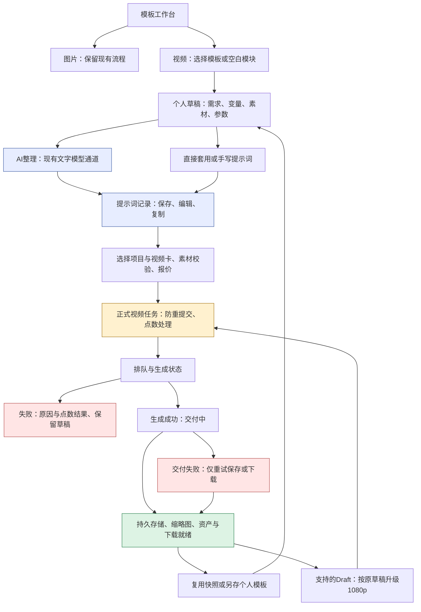

# 图片与视频模板工作台：上下游闭环规划

## 1. 大白话目标复述

文档版本：1.3.0。日期：2026-09-29。项目：Seedance 内部生成平台（video-api-debugger）。

目标路径：`/Volumes/Data/Projects/video-api-debugger-v12-full-todo`；实际文档工作树见1.1。
正式版本来源：生产`.deployed-commit`、`/api/release`与运行构建；实施开工需重新核对。
状态：用户已授权落地，T01–T07实现已交回执并进入整批修正；T08首轮统一验收未通过，T09未发布。验证等级：主流程L3，权限/迁移/发布按L4。
最后更新：2026-09-29。风险修订与新增验收入口：第5节，原九项实施任务不变。

用户需求：沿用图片生成的模板使用方式，把图片和视频放进同一个工作台，分成两个大类；视频类既能只做提示词，也能继续生成视频。成功标准是同事从找模板到取到产物不需要重新拼接素材、提示词和后台参数，失败后能继续，费用和历史能对上。

授权边界更新（2026-09-29）：用户已明确“落地执行”，主控负责设计与集成，gpt-6-luna xhigh执行代码并交回执；常规验证、聚焦Git和有回退保护的发布按已有授权连续完成。兼容性生产数据迁移与文字点数策略正在单独确认，真实付费生成仍未授权；不把新接口实现等同真实生成验收。

| 编号 | 任务 | 完成标准 | 当前状态 |
|---|---|---|---|
| TV01 | 图片／视频模板工作台闭环规划 | 上下游、权限、费用、任务拆解和验收均有明确安排 | 已完成文档规划；功能待实施 |
| TV02 | 模板工作台风险与缺口检查 | 风险有代码依据，缺口落实到任务和验收 | 已完成；修订规划独立复核通过，功能未实施 |

### 1.1 真实来源与复用依据

- 本轮资料工作树：`/Users/gouki-youdoo/.codex/worktrees/banana-image-channel/video-api-debugger`，读取起点 `f0fb165`，代码版本 0.19.0；这是本轮代码调查来源，不是未来发布起点承诺。
- 默认生产源：`/Volumes/Data/Projects/video-api-debugger-v12-full-todo`。正式站：<https://sd2.youdooart.com>。实施前重新核对线上 `.deployed-commit`、`/api/release`、生产构建与并行分支；只合入相关变更，不能拿本规划分支整库覆盖后续生产更新。
- 固定资料索引：`docs/materials/index.md` 已检索。本轮没有新附件；已有图片模板、视频模板、Draft 规划及源文件作为交接参考，详见第 4 节。实际模板示例媒体待从有权访问的现有模板选取，不能拿其他项目私有素材自动共享。

| 已读来源 | 已有能力 | 本轮发现的缺口／实施含义 |
|---|---|---|
| `src/app/image-studio/studio.tsx`、`src/lib/image-studio/{modules,presets,access}.ts` | 分组、个人模块、应用模板、共享、结果与下载 | UI 模式可以复用；图片字段与任务不能直接改名充当视频记录 |
| `src/app/templates/page.tsx`、`src/components/templates/TemplateLibraryClient.tsx` | 独立视频模板库、编辑与应用入口 | 旧入口需要归并导航；当前按关键词推断场景、按是否有素材判断可用性，不适合作为新模板的提交条件 |
| `src/app/api/agent/template-plans/route.ts`、`src/lib/agent-plans/template-plans.ts` | 需求拼接、四套方案、AgentRun 留存 | 当前是固定规则生成 A/B/C/D，不调用文字模型；不能包装成真实 AI 整理能力 |
| `src/lib/templates/template-config-builder.ts`、`src/lib/integrations/musk.ts` | 管理员模板配置草稿已调用文字模型 | 可复用文字模型传输与设置；管理员“写模板”和用户“写本次视频提示词”的职责、权限必须分开 |
| `src/components/templates/TemplateGenerateClient.tsx`、`src/components/GenerationComposer.tsx` | 模板到视频任务、项目／视频卡选择、最近任务 | 已读模板提交组包未见显式透传 `draft`、`first_frame_url`、`last_frame_url`；须做请求链路核对，不直接断言所有首尾帧场景都失败 |
| `prisma/schema.prisma` 的 `AgentRun`、`VideoTask` | 提示词快照、模板关联、任务防重键 | AgentRun 只有一个 `video_task_id` 且随模板级联删除；需要解决一份提示词多次生成与模板归档后的追溯 |
| `src/app/api/tasks/create/route.ts`、`src/lib/tasks/seedance-draft-upgrade.ts`、`src/lib/video/delivery-*.ts` | 既有任务创建、Draft 升级、视频交付 | 必须复用正式链路，不能增加独立扣费、轮询、下载系统 |

外部方案核对：初版只读了 [Handlebars 变量表达式官方说明](https://handlebarsjs.com/guide/expressions.html)，不足以决定采用。1.1.0 已补读六个候选项目的相关源码、包声明及许可证，比较结论见1.5；均未安装、未做本项目运行兼容验证，不将源码可用等同接入成功。

### 1.2 入口和页面安排

推荐统一入口名为“模板工作台”，顶部只有“图片 / 视频”两大类；视频提示词是视频类的一条输出路径，不增加第三个大类。普通“生成”页继续保留，用户不选模板也能生成。

推荐路由：`/template-studio?type=image|video`。这是拟新增入口，不是当前线上已存在页面。

| 用户入口 | 谁能操作 | 点击后与返回路径 |
|---|---|---|
| 顶栏“模板工作台” | 沿用当前对应功能的可见范围 | 默认恢复自己上次的大类、分组和模块；直达链接的参数优先于记忆 |
| 图片类 | 当前有图片工作台权限的账号 | 继续使用现有图片模块；原 `/image-studio` 可达同一套图片功能 |
| 视频类 → 模板库／新建模块 | 现有有权使用视频模板的内部账号 | 使用可见模板创建个人工作副本；无模板可从空白提示词开始 |
| 模块“整理提示词” | 有本模板与素材使用权的账号 | 写入独立提示词记录，展示可编辑文本；可以复制、保存或继续出视频 |
| 模块“生成视频” | 同时有目标项目／视频卡生成权的账号 | 使用用户当前确认的文本与素材，显示报价后创建正式视频任务 |
| 结果“继续使用” | 记录所有者／既有授权角色 | 从不可变历史快照创建新草稿，不覆盖原记录、不自动扣费 |
| 模板“编辑／发布／共享／归档” | 既有相应管理权限角色 | 管理员维护共享模板；普通用户调整自己的副本；不因入口合并扩大共享权限 |
| 视频“进度／预览／下载／交付重试” | 既有任务与资产访问权限角色 | 从模块结果到任务详情，再返回原大类、模块及滚动位置 |

布局：顶部大类切换，左侧用途分组，中部模板模块与输入，模块结果区用“提示词 / 视频”切换。模板封面可看示例，视频示例按需播放；不要整页自动下载原视频。结果与模板列表按授权范围筛选后游标分页，切换或刷新不清空已有列表。

输入项：模板名称、描述、示例、固定要求、按需填写的变量、参考素材槽位、推荐参数。变量用表单填写而非要求普通用户写模板语法；变量缺失逐项提示。分组显式保存，不沿用关键词猜分类。

共享与个人配置必须有清晰作用范围：个人草稿可自动保存并显示保存状态；发布／更新共享模板是独立操作，不能由普通生成或试参数隐式触发。图片区原保存规则不在本次顺手改造。

### 1.3 完整上下游



**素材与提示词：**引用保存资产 ID、类型、角色、顺序、版本与必要尺寸，不能只存会失效的签名 URL。首尾帧和普通参考素材独立建模；首尾帧模式不要求额外普通参考图。`@图片N` 等引用与提交顺序同源，移除或换序后提示修正；未经权限检查不能把任意 URL 交给 Provider。后台完成受控素材到 Provider 可读输入的转换，不向用户索取 API Key。

**模型配置：**文字走后台当前文字通道，图片走按图片模型选择的既有通道，视频走普通生成页的默认配置与能力表；不写死 gpt-5.4、gpt-5.5 或视频模型。图片通用上下文与视频通用上下文分开，避免图像规则污染视频文本。切换视频模型后重新校验模式、时长、分辨率、素材限制与报价；保留不兼容的用户值并给出修改入口，不静默降质或替换模型。

**AI 整理：**固定模板直接展开与大模型调用分别标识；不能在大模型失败后静默换成四套固定文案并报告成功。AI 输出必须保留原始需求、模板约束与素材映射；缺信息时返回待补项，不杜撰参考画面或制作参数。首期默认一份可用提示词，多方案不是硬性前置步骤。支持视频生成模板和“仅产出提示词”模板；后者仍能由用户选择转入正式视频生成。

素材理解取决于当前文字模型真实能力：支持读图时按既有受控链路传图；不能读视频／音频时只使用已提供的描述并明确局限，不把“已上传”当“模型已经看懂”。需要抽帧或新增参考图时提供明确操作与费用预期，不因模板缺素材自动触发付费生图。提示词重新整理完成后与当前编辑稿并列供替换，异步旧响应不能覆盖用户刚写的新内容。

**归属和保存：**只写提示词时不强迫创建项目／视频卡；真正生成视频前必须确定有权访问的保存位置，可以复用现有个人项目默认值并可见展示。模板工作台、项目、资产及任务页指向同一个视频任务 ID，不重复创建资产或账单。跨入口“带入模板工作台”携带有权引用的资产 ID 并重新校验；失败保留原输入。

**费用：**模板浏览、复制、套用与普通保存不触发模型请求。AI 整理仅复用已确认的文字计费策略，不能推断免费，也不能套图片的 20 点；缺少既有策略时明确标未配置，保留直接写提示词路径，不自行新建费率。视频提交、Draft 升级使用现有服务端报价、冻结／扣款／释放策略；美元成本与内部点数分开，报价变化需要用户看到新值。文本成功而视频失败不自动退已实际完成的文本费用；各步骤分别展示真实账务结果。

**防重与恢复：**每次明确的新生成有独立请求号，网络重试复用同一个请求号。提交超时先查询受理结果；上游不支持防重且结果未知时显示“结果待确认”，不自动再付费提交。刷新、跨标签页、返回页面从持久任务恢复，不以浏览器内存当唯一状态。配置更新只作用于尚未发出的请求；历史记录保留当时模型／非敏感配置版本，禁止记录 Key。

**交付：**生成状态、文件交付状态、账务状态分开。Provider 成功而文件未入库时显示“视频已生成，正在保存”；下载失败只修交付，不重新生成、不二次扣视频点数。接现有服务器持久目录、缩略图与资产链路；空间不足、媒体损坏、URL 过期要有任务详情和维护端恢复入口。本文不启用此前暂缓的 Mac 周期归档策略。

**Draft：**支持时显示“生成样片”和结果里的“按此样片生成1080p”。升级使用已有 draft-upgrade 接口与原 Provider 草稿身份，不用原提示词重新抽卡。升级产生关联子任务并单独报价，原草稿不覆盖；过期或不兼容明确禁用，不能悄悄改为全新生成。若正式站能力尚未发布，则保留入口说明为不可用，不以本规划替代其专项上线。

**共享与删除：**先按当前各类模板权限提供聚合视图，不取两套权限的并集。列表、详情、应用、AI、提交和素材读取均检查；来源模板撤销共享后禁止新的受保护调用，已提交任务依既有规则完成，历史产物按原权限可看。旧模板默认可见范围在迁移映射中逐项保留，不扩大外部用户权限；资产回收先检查历史任务与模板引用。模板优先归档，不能级联删除提示词和生成历史。

### 1.4 数据与接口边界（拟定）

保持图片 `ImageStudioPreset / ImageStudioModule / ImageStudioTask` 与视频 `GenerationTemplate / VideoTask` 的领域边界；复用目录、分组、封面、筛选、草稿体验，不强行合并数据库表。

- 视频模板增加必要元信息：用途分组、输出意图（视频／仅提示词）、输入变量 schema、素材槽位、能力要求、示例引用、不可变发布版本及可见性语义。`schema_version` 与用户可见模板版本分开。
- 推荐补齐“另存个人模板”：内部普通用户只能创建／编辑自己的私有模板，复制不携带来源之外的访问权；管理员共享发布仍受现有角色与来源所有权限制。旧 `GenerationTemplate` 按原可见性映射为兼容范围，新模板默认私有。私有写入用所有者校验的窄接口，不放开旧 `/api/templates` 的管理员写权限；这是待实施权限设计，需按V02/V13真实验证，不能只复用前端隐藏按钮。
- 个人视频草稿需持久化模板来源版本、用户修改、素材顺序、当前参数和修订号；多标签页冲突返回冲突信息，不最后写入覆盖他人的新草稿。
- 提示词运行记录有独立 request ID、状态、owner、输入快照、生成器类型（规则／LLM）、模型、输出、错误与非敏感用量。优先扩展 `AgentRun` 或关联小表；禁止把已有非空 `template_id` 的老记录直接迁成不可用。
- `VideoTask.agent_run_id` 可承载同一提示词对应多次生成；查询所有关联任务，`AgentRun.video_task_id` 仅兼容旧数据，不能当唯一结果。模板／提示词快照不随模板删除级联丢失。
- 复用 `/api/agent/template-plans` 与 `/api/agent/runs/[id]` 的兼容契约；规则模式与 LLM 模式显式区分。持久化草稿、用户编辑文本和列表查询可新增窄接口，名称在 T01 定稿，旧调用者保留原返回结构。
- 正式视频仍调用 `/api/tasks/create`、`/api/video/status/[id]`、`/api/video/play/[id]`、`/api/video/download/[id]`；升级复用 `/api/tasks/[id]/draft-upgrade`。不复制另一套外部生成后台，不改既有 Codex 外部 API 契约。
- 普通客户端只收到有权查看的模板内容、资产投影、模型能力与价格；不返回服务端路径、Key、完整诊断请求、其他用户历史或管理员专用上下文。

### 1.5 开源方案复查与更省成本的路线

本节回应用户2026-09-29“有没有其他最优解，例如开源方案和代码”。推荐是当前需求和已读代码下的工程判断，不宣称所有方案都经过运行比较。

**结论：统一模板配方和使用体验，复用两个既有生成系统；借鉴开源成熟机制，不部署第二套平台。** 现有后台已承担身份、素材、点数、异步视频、交付与Draft升级，整套替换并不能省掉这些对接。只复制页面也不够，因为提示词历史、权限和结果恢复仍需打通。

| 路线 | 能省什么 | 新增成本／缺口 | 当前判断 |
|---|---|---|---|
| 只复制图片页面做视频页 | 初始排版快 | 容易复制第二套草稿、状态和权限；无法解决现有假LLM和历史关系 | 不选作为完整实现方案 |
| Dify等完整工作流平台 | 图形编排、多步执行与管理能力 | 需额外运维、身份映射、视频异步适配、账务对账；许可也不能当纯Apache处理 | 当前两大类模板不需要这一级平台 |
| 本站外壳 + 开源库全面重搭 | 表单、LLM与模板都有现成工具 | 多个新依赖、默认行为差异、旧功能回归，未必比既有代码少 | 按实际缺口选择，不整套引入 |
| 本站外壳 + 既有执行链路 + 有限借鉴 | 最大限度保留已用的后台，补模板和历史缺口 | 仍需实现专属素材表单、快照与权限，不能省掉验收 | 首期推荐 |

#### 1.5.1 实际源码核对

以下为2026-09-29读取的仓库快照。版本是对应源码的包声明／compose镜像声明，不保证等于npm最新已发布稳定版；采用前重新核对发行版、安全公告与锁定版本。维护日期取默认分支最近提交，只反映当时活跃度，不代表安全认证。

| 方案 | 已读代码与事实 | 适配／许可证／维护 | 使用决定 |
|---|---|---|---|
| Dify | [模板执行辅助层](https://github.com/langgenius/dify/blob/e6f1d77ed5869e659e426b5459439d44bdabdbe5/api/core/helper/code_executor/template_transformer.py)有代码与输入编码、运行结果解码；[部署文件](https://github.com/langgenius/dify/blob/e6f1d77ed5869e659e426b5459439d44bdabdbe5/docker/docker-compose.yaml)包含API、worker、web、数据库、Redis、sandbox等，另有可选服务，不是所有列出的服务都必须启动 | Python后台而本站是Next/Prisma/SQLite；镜像声明1.17.1，最近提交09-28。[LICENSE](https://github.com/langgenius/dify/blob/e6f1d77ed5869e659e426b5459439d44bdabdbe5/LICENSE)有多租户和前端标识附加条件，具体适用需核对 | 暂不引入；真正需要用户自由连节点、条件分支、循环时再评估，不为两类模板加工作流平台 |
| Langfuse | [createPrompt](https://github.com/langfuse/langfuse/blob/536c2d6905d4311cc7c2b177454a084907328c43/web/src/features/prompts/server/actions/createPrompt.ts)有项目内版本递增、标签、变量名冲突和版本唯一性冲突识别；[部署文件](https://github.com/langfuse/langfuse/blob/536c2d6905d4311cc7c2b177454a084907328c43/docker-compose.yml)另含Postgres、ClickHouse、Redis、MinIO、web/worker | 核心[MIT、ee目录另有条款](https://github.com/langfuse/langfuse/blob/536c2d6905d4311cc7c2b177454a084907328c43/LICENSE)；最近提交09-28。其Prisma代码依赖自家服务，不能直接拷来接SQLite | 借鉴不可变版本与发布指针；不部署。以后确有跨团队提示词评估、追踪需求再接观测，不让它与本站争当模板唯一来源 |
| Vercel AI SDK | [兼容Provider](https://github.com/vercel/ai/blob/76303af79af8a4e92e7a2f9d4845e88b8249d8c4/packages/openai-compatible/src/openai-compatible-provider.ts)可配置baseURL、headers、fetch；[prepare-retries](https://github.com/vercel/ai/blob/76303af79af8a4e92e7a2f9d4845e88b8249d8c4/packages/ai/src/util/prepare-retries.ts)默认最多重试2次 | [Apache-2.0](https://github.com/vercel/ai/blob/76303af79af8a4e92e7a2f9d4845e88b8249d8c4/LICENSE)；快照ai7.0.118、compatible3.0.57要求Node>=22及Zod peer；最近提交09-28。尚未证明当前Muskapis完整兼容 | 首期复用`musk.ts`；需要多Provider、流式或统一结构化输出时再引入服务端适配，不替换视频任务。若采用，付费且受理不明的调用显式禁自动重试，再由应用查状态恢复 |
| React JSON Schema Form（RJSF） | [SchemaField](https://github.com/rjsf-team/react-jsonschema-form/blob/b1e39dc1f4d1d94c48be30268fa31c6299fe4c97/packages/core/src/components/fields/SchemaField.tsx)按schema类型选字段，支持自定义field注册与组合schema | [包声明](https://github.com/rjsf-team/react-jsonschema-form/blob/b1e39dc1f4d1d94c48be30268fa31c6299fe4c97/packages/core/package.json)6.10.1、React>=18、Node>=20；[Apache-2.0](https://github.com/rjsf-team/react-jsonschema-form/blob/b1e39dc1f4d1d94c48be30268fa31c6299fe4c97/LICENSE.md)；最近提交09-24。还需utils、validator和本站样式适配，素材组件仍得自做 | 当前有限字段先复用现有控件；出现大量嵌套/条件表单再优先做RJSF适配实验，不重写完整通用表单引擎 |
| Mustache.js | [mustache.js](https://github.com/janl/mustache.js/blob/972fd2b27a036888acfcb60d6119317744fac7ee/mustache.js)有parse/render；默认HTML转义；lookup会调用函数值、section支持函数，不能因“logic-less”就当任意输入安全 | [MIT](https://github.com/janl/mustache.js/blob/972fd2b27a036888acfcb60d6119317744fac7ee/LICENSE)；[4.2.0包声明](https://github.com/janl/mustache.js/blob/972fd2b27a036888acfcb60d6119317744fac7ee/package.json)无运行依赖；默认分支最近提交2023-01-21，维护较慢，安全状态未审计 | 纯结构化字段拼接不必引入；若必须支持用户写`{{变量}}`，再评估成熟解析器及受限语法，不自己用多层正则造语言 |
| promptfoo | [json断言](https://github.com/promptfoo/promptfoo/blob/2e4328646517239e7edbdac8d0fa1f040981374a/src/assertions/json.ts)解析输出后可用Ajv验证结构；[regex断言](https://github.com/promptfoo/promptfoo/blob/2e4328646517239e7edbdac8d0fa1f040981374a/src/assertions/regex.ts)针对输出，不是搜索源码字符串 | [MIT](https://github.com/promptfoo/promptfoo/blob/2e4328646517239e7edbdac8d0fa1f040981374a/LICENSE)；[包声明](https://github.com/promptfoo/promptfoo/blob/2e4328646517239e7edbdac8d0fa1f040981374a/package.json)0.123.1、Node>=22.22.0、76个直接依赖；最近提交09-28 | 可用于后续开发侧批量提示词评估，不进生产前端。首期复用tsx smoke和固定样例；真实模型评估单独给预算，不默认上传私有素材／提示词 |

没有测量任何候选的实际压缩包、浏览器增量或生产内存，不填虚构体积／耗时／节省比例。上述依赖数不是打包大小。RJSF、AI SDK等若采用，应先在隔离分支对比构建增量、类型兼容、错误恢复与既有样式，检查通过才批准进入实现。

#### 1.5.2 对原规划的收紧

1. **模板是配方，不是新的工作流。** 一份配方描述固定要求、用户输入、素材槽位、推荐参数和可用动作。采用共享的有类型数据边界，图片和视频各自适配；不合并数据库表、不引任意代码执行、循环、工具调用或用户自定义API地址。
2. **“只要提示词”是本次动作，不是必须建立的第三种模板对象。** 视频模板可声明默认动作和支持动作；整理出的提示词能继续生成。没有对应生成能力的提示词模板仍能保存，但转视频前走普通能力校验。保持1.4输出意图的用途，不让用户为同一配方维护两份副本。
3. **先做少量明确输入，避免造完整表单框架。** 建议首期文本、多行文本、单选、数值、开关，加独立素材槽位；必填、长度、选项、上下限前后端一致校验。表单结构与界面样式分开，后续需要RJSF时可接适配器；远程`$ref`、任意JS、可执行字段配置均不开放。
4. **提示词按结构化内容块组合。** 复用`workbench.ts`已有prompt blocks/context cards与`template-plans.ts`组合边界，字段值作为数据插入一次，不递归解释用户文本。首期不要求用户学习Mustache/Handlebars。若未来开放模板语法，要限定标识符、允许的字段和语法，禁函数/partials/未声明访问，限制输入及输出长度；纯文本发送不做HTML实体转义，界面仍用React文本安全展示，不用raw HTML。
5. **版本和发布分开。** 借鉴Langfuse机制，本站数据库是唯一权威来源；已发布版本不可变，个人草稿另存。应用模板时固定版本，不能每次提交自动取latest；发布指针切换不改历史。并发发布靠唯一约束和事务/冲突反馈，不只“查最大版本再+1”。不复制Langfuse整套依赖图与数据库服务。
6. **LLM只是可选一步。** 普通模板展开零模型请求；AI整理沿用现有文字通道，提示词确认后再由用户生成视频。应用层防重只能防自己重复发，不能保证不支持查询/防重的上游在超时后未执行；这种情况保留“结果待确认”，禁止SDK或页面自动再投递。
7. **固定样例先于引入评估平台。** 准备有权限的文字、素材、首尾帧、缺变量、转义字符、恶意模板和模型不兼容样例；离线检查字段、引用、归属、输出结构与请求次数，人工检查提示词是否忠于意图。结构通过不等于视频质量通过，Mock通过不等于上游实际兼容。

采用顺序是“已有实现能满足就复用 → 确有重复复杂逻辑才选单个成熟库 → 真实需要跨步骤编排才评估整套平台”。不因本表列出了候选而默认安装；不开新后台、不新增账号体系、不绕开现有点数与媒体交付。

## 2. 具体可执行任务

实施状态：T01–T07实现已交回执，T08首轮检查后整批修正中。顺序为 T01 → T02/T03 → T04/T05 → T06 → T07 → T08 → T09；有依赖的任务不并行共改文件。整批实现及关联测试代码完成后统一验证，失败汇总后整批修正。

执行分工与本轮已锁定选择：实际工作树`/Users/gouki-youdoo/.codex/worktrees/banana-image-channel/video-api-debugger`，分支`codex/template-studio-20260929`。开工只读确认线上为`c12a3ec/v0.19.0`，是当前提交祖先；未来发布仍需再次核对。原生产工作树有其他任务脏改，不触碰。
- 执行A（Euclid）：Prisma增量模型、`src/lib/template-studio/`、`src/app/api/template-studio/`、文字worker及契约smoke。新增独立`VideoStudioTemplate/VideoStudioTemplateVersion/VideoStudioDraft/VideoStudioRun`小表承载空白/旧模板/新模板来源，不改变旧AgentRun非空关系；VideoTask只增三个可空关联/快照/防重字段。
- 执行B（Heisenberg）：`/template-studio`、局部UI与导航；图片直接复用原组件和权限，视频有模板/提示词/结果；生成动作先保留当前修订，再进入普通`/generate?template_studio_run_id=...`。这替代另复制一套视频生成表单的实现方式，不减少原参数/素材/Draft能力。
- 执行C（Wegener）：普通生成页回填、正式tasks/create关联与载荷防重、旧AgentRun权限旁路修复及流转smoke；不接管A的数据层/B的新页面。
- 主控：固定契约、发布/迁移/权限关卡、一次统一验证、固定审核、Git与上线。三个执行者都禁止自行提交、部署、付费或碰生产DB；不共改所有权文件。新API统一`/api/template-studio`，旧API保持兼容，不复用旧同步响应承载新LLM202任务。
- 旧模板兼容纠偏：`GenerationTemplate`含上下文卡、绑定素材和时序配置，不能只拼旧prompts/rules就当完整新配方。统一目录保留旧模板入口，应用时进入原`/template-generate?templateId=...`完整流程；新`studio`模板和空白模块走新工作台。禁止静默截断或把旧模板无损迁移标为已完成，旧历史source仍保留。未来若转换，必须另有全字段映射与行为对照证据；本轮不重写旧引擎。

- [ ] T01. 锁定生产来源与入口契约。
  - 同时完成R01空白模式、R07输入/输出及频率边界和5.2入口契约；不以技术默认值代替尚未确认的文字价格。
  - 读取 `AGENTS.md`、本规划、图片／Draft专项、`src/components/GenerationComposer.tsx`、两套模板 API；核对生产提交及并行工作。将两大类 URL、旧入口映射、角色权限、文字计费现状和模型能力整理成实施契约。
  - 按1.5锁定首期有限字段、配方与动作的关系，以及不新增依赖的默认路线；需要候选库时先核对稳定发行版、Node/React/锁文件、许可证、安全信息与构建增量，不安装仓库main快照冒充稳定版。
  - 完成标准：模板库、模块、提示词历史、视频结果、维护入口都可定位；现有付费与分享规则有来源，未确认的新业务策略不伪装为既有规则。
- [ ] T02. 补视频草稿、模板版本与提示词历史。
  - 按R01明确空模板run来源与非空旧记录兼容，按R02保护不可变提示词修订；修改所有历史读写路径，不只新增表。含新记录的代码回退按R08演练。
  - 在 `prisma/schema.prisma`、`prisma/migrations/`、`src/lib/templates/`、`src/lib/agent-plans/` 增量实现 1.4；支持保存、恢复、编辑版本、归档与一对多任务关系。
  - 固定应用时的模板版本；发布指针、用户草稿、运行快照分离。并发发布有唯一性和冲突处理，禁止只查询最新版本后无保护地递增。
  - 完成标准：刷新／换设备可恢复自己的草稿；另存私有模板不公开内容；修改模板不改历史；旧模板/AgentRun 可继续读；冲突不覆盖；迁移前后计数、关系、空值及恢复方案可核验。生产迁移单独走明确授权与备份关卡。
- [ ] T03. 做统一工作台外壳和兼容入口。
  - 落实5.2普通用户历史、管理员维护入口与R10账号/模块隔离；新路由服务端鉴权，登录失效不自动重发付费。
  - 拟新增 `src/app/template-studio/page.tsx`；复用并小范围拆分 `src/app/image-studio/studio.tsx` 与 `src/components/templates/`，修改实际导航组件（实施时定位），保留 `/image-studio`、`/templates`、`/template-generate` 的 ID、筛选和返回参数。
  - 共享目录/筛选/有限字段组件，图片和视频分别适配，素材槽位沿用本站权限与上传。首期不做任意schema编辑器，不复制RJSF完整表单引擎。
  - 完成标准：两大类、个人分组、搜索、模板应用、个人草稿保存与恢复可用；现有图片功能无减项；旧链接不死路；模板和任务长列表分批加载。视频封面与人物头像符合项目规则。
- [ ] T04. 实现真实文字模型整理和直接套用两条路径。
  - 按R04先落库再执行，客户端提交前生成稳定request_id；新LLM模式返回202/run_id，旧规则模式保持原响应。若首次响应丢失，按账号+request_id查询或同载荷重放只取已有run；拟增`GET /api/agent/runs?request_id=...`兼容列表查询。注册实际执行进程、租约和重启恢复，不用请求内悬空Promise保证交付。JSON/输出边界和取消语义按R06/R07，V18/V19/V21验收。
  - 拟新增`src/lib/agent-plans/worker.ts`、`scripts/process-template-prompts.ts`及`src/app/api/agent/runs/route.ts`；复用现有SQLite任务领取模式，不引Redis等新平台。T09需落实服务启动/停止/健康与日志保留。提示词run状态只表达文字阶段，视频子任务状态单独展示，不能把提示词成功随任一视频失败改为失败。
  - 在 `src/app/api/agent/template-plans/route.ts`、`src/lib/agent-plans/template-plans.ts` 及相关 run API 接入 `src/lib/integrations/musk.ts`；保留老规则调用契约，新增持久执行、防重、超时与结果校验；不能把管理员配置生成接口直接开放给普通用户。
  - 按1.5结构化内容块一次性插入字段，阻止模板代码执行；保留纯文本字符，不把HTML转义后的字符串发给模型。沿用现有文字wrapper；确需SDK时显式确定重试策略、超时和usage映射，结果未知不自动重发。
  - 完成标准：规则模式零上游请求；LLM 模式确实使用后台配置，文本可编辑、保存、复制和继续生成；取消/断线后能查询已受理结果；超时不自动重复扣费；文字价格缺配置时直接套用仍可用。
- [ ] T05. 打通素材、权限和提交前校验。
  - 按R03显式消除只带run_id的模板状态/权限旁路，覆盖历史详情的最新模板泄露；R10共享撤销不扩权、不承诺收回已下载内容。
  - 复用 `src/lib/assets/`、现有上传／模板受控素材接口、`src/lib/image-studio/access.ts` 的已适用规则；视频素材新增角色时不要复用仅 image 的校验器。所有新入口和旧兼容入口复用服务端同一授权判断。
  - 完成标准：图片/视频/音频、首尾帧、引用序号与请求一致；本地上传后能提供 Provider 可读素材；无额外 reference 的首尾帧流程可提交；越权、撤销共享、缺文件、过期 URL 均在明确阶段反馈；无共享历史泄露。
- [ ] T06. 接正式视频任务、报价和 Draft 升级。
  - 按R05将防重号绑定规范化载荷摘要及接受的费用上限/报价版本，内容不同返回409；查询旧任务不重新报价。按R02清查所有`agentRun.update`，不能由后续生成覆盖早期提示词修订。
  - 在 `src/components/templates/TemplateGenerateClient.tsx`、`src/components/GenerationComposer.tsx` 和 `src/app/api/tasks/create/route.ts` 核对完整字段映射；抽共享组包 helper 必须同时覆盖普通生成页回归。
  - 完成标准：模板 ID/版本、提示词修订、项目/视频卡、模型/provider、模式、素材、时长、比例、分辨率、声音、seed、draft及适用LoRA不丢失；稳定防重键；所有价格从服务端获取；Draft 走升级接口，不重抽；现有审批规则（如适用项目1080p确认）不绕过。
- [ ] T07. 完成进度、交付、资产与历史复用。
  - 按R04/R06分清uncertain、failed和cancelled及账务状态，按5.2提供用户历史和管理员人工核对入口；停止等待不显示上游已取消。
  - 复用 `src/lib/video/delivery-status.ts`、`delivery-queue.ts`、`delivery-worker.ts`、`public-delivery.ts` 与既有任务／资产页；补提示词历史查询与个人草稿恢复，结果区关联同一任务。
  - 完成标准：离开再回仍见进行中/失败任务；文件保存与缩略图状态真实；原图/视频下载完整且可读；同一任务各入口一致；下载故障不重复生成；复用从快照新建草稿；空间或入库问题有维护入口和审计记录。
- [ ] T08. 完成统一验收、修正和固定审核。
  - 新增 `scripts/template-studio-contract-smoke.ts` 与 `scripts/template-studio-flow-smoke.ts`（拟定），以行为/数据库/API契约为断言，不照抄源码；与下节已有回归纳入实际发布检查入口。多角色和 UI 路径按 V01–V24 执行，新增项见5.3。
  - V03补`& < > 引号 花括号`文本保真、未知/缺失字段与禁止执行输入；V05补应用版本固定和并发发布；V08捕获网络故障时真实出站次数。任何可选库需要和原路线用同一组样例对比；promptfoo不作为本期强制依赖。
  - 完成标准：同一候选版本全部必要检查有证据，问题整批修复复测；固定审核线程只读审查通过。付费真实验收需新的明确预算，前一轮 Banana 单张20点授权已用尽，不转用于本功能。
- [ ] T09. 按生产流程发布并交付。
  - 按R08准备兼容新数据的代码回退、灰度开关与文字执行进程健康检查；不得用部署前整库覆盖发布后账单。正常发布入口必跑T08，否则停止切换。
  - 重核生产有效版本后按兼容新增能力升 MINOR，不现在预占版本号；复用 `src/lib/release.ts` 与现有升级弹窗。聚焦提交、push和远端回退点，候选构建保留旧产物与数据回退方案。
  - 完成标准：正式站真实角色看到两个大类，旧入口可达；来源标记、BUILD_ID、静态资源与实际页面一致；旧客户端发现新版本、稍后去重、用户确认刷新且草稿保留；迁移与灰度数据可回退，生产任务继续处理；回执附地址、版本、证据及剩余限制。

暂不扩张：全自动多镜头剪辑、视频批量生产、跨工具画布编排、新模型接入、重新定义计费、扩大外部账号权限、重做存储归档。既有功能继续可达，不因暂不扩张删除旧能力。

## 3. 验收/审查内容

本轮文档任务 L0：核对代码来源、路径、链接、任务依赖、文档差异和 Git 即可，不跑应用构建或真实付费测试。后续用户主流程 L3；权限/素材/数据迁移及部署部分按 L4 检查，不因“只是新增页面”降级。

### 3.1 必须通过的行为验收

以下均未执行，勾选必须引用对应候选版本证据。

| 验收 | 场景与通过标准 | 必要证据／对应任务 |
|---|---|---|
| V01 | 新旧入口进入对应大类，深链接模板 ID 正确，切换保留个人位置与草稿；图片生成/下载能力保留 | 桌面1440与手机390视口 DOM、少量截图；T03 |
| V02 | 公司普通用户只访问授权共享模板与自己的记录；匿名/外部按既有规则拒绝；篡改模板、素材、项目、run和task ID不可越权 | 真实或等价登录角色、直接API负例、无数据泄漏；T02/T05 |
| V03 | 套用、手写、复制、保存只改变个人草稿，不调用LLM/视频、不修改共享模板；冲突不会静默覆盖 | 请求计数、数据库修订及刷新恢复；T02/T04 |
| V04 | AI整理走配置的文字模型，产物真保存；失败不冒充固定文案成功；再生成不覆盖用户编辑文本 | Mock/契约、任务记录、授权真实调用及用量；T04 |
| V05 | 同一提示词多次生成均有可追溯任务；模板改版/归档后旧记录仍可读 | 数据关联、历史快照、兼容旧AgentRun测试；T02/T07 |
| V06 | 首尾帧不传普通参考图也可用；素材移除/换序后引用一致；缺素材明确阻止而非虚构输入 | 上游请求捕获、素材解析、权限和顺序断言；T05/T06 |
| V07 | 模型切换重新校验时长/分辨率/模式及LoRA；报价同后台；无静默换模型降质 | 模型能力边界、参数组包、真实表单；T06 |
| V08 | 双击、跨标签、响应丢失、worker重启最多创建一次既定请求；未知状态先查后恢复 | 隔离DB/Mock故障注入、请求号与任务/账单唯一性；T04/T06 |
| V09 | 余额不足、报价变化、视频失败/部分阶段成功各有真实账务结果；模板保存不扣点 | 服务端报价、账本、UI余额及冻结数；T06/T07 |
| V10 | 关页重开能看进行中/失败/成功；缩略图优先；列表筛选与总口径不是仅已加载部分 | 网络、分页契约、刷新与返回操作；T03/T07 |
| V11 | Provider成功但本地保存失败不假报下载就绪；修交付后文件完整可播放，账单不重复 | 文件大小、ffprobe、Range/播放、下载完成与资产关联；T07 |
| V12 | Draft按原Provider草稿身份升1080p，子任务关联正确、单独报价；过期不可升级且不静默重抽 | 升级请求捕获、父子任务及授权真实样片验证；T06 |
| V13 | 共享关闭后新受保护调用拒绝，已提交任务和自有历史按原权限继续；资产引用防误删 | 撤销时序/事务竞争测试、受控素材URL负例；T05 |
| V14 | 生产新页面/资源/版本一致，旧客户端提醒正确且草稿保留；回退仍可读取历史数据 | 正式站DOM/Network、版本/BUILD_ID、迁移演练和固定审查；T09 |

### 3.2 验证命令与环境

整批实现后统一运行；`npx --no-install` 只使用已有依赖，缺失时先报告环境，不静默安装。涉及数据库的 smoke 必须在备份副本／隔离测试库，先读脚本确认不会连生产；线上关键数据只读对账。

```sh
npx --no-install prisma validate
npx --no-install tsc --noEmit --pretty false
npm run lint
npm run build
npx --no-install tsx scripts/template-llm-contract-smoke.ts
npx --no-install tsx scripts/template-bound-image-upload-smoke.ts
npx --no-install tsx scripts/template-card-final-context-smoke.ts
npx --no-install tsx scripts/image-studio-integration-smoke.ts
npx --no-install tsx scripts/seedance-draft-upgrade-smoke.ts
npx --no-install tsx scripts/banana-image-channel-smoke.ts
npx --no-install tsx scripts/template-studio-contract-smoke.ts
npx --no-install tsx scripts/template-studio-flow-smoke.ts
```

末两项为拟新增脚本，其他为本轮已查到的脚本路径；已有名称不等于覆盖了新功能。没有授权真实LLM/视频预算时先完成Mock、角色、UI与数据验证，真实付费项明确未验收，不假报全闭环。真实生成成功后检查原视频下载完整、ffprobe和页面播放；不在下载未结束时把 `moov atom not found` 当生成失败。

### 3.3 四类复发风险与发布关卡

| 风险 | 具体防线 | 当前状态 |
|---|---|---|
| 假复现源 | 锁定正式域名、线上提交、构建及账号；不拿旧Mac站或过时worktree做结论 | 规划覆盖，未新增自动检查 |
| 真残留 | 搜索普通生成/模板生成/画布/外部API各调用者；旧规则模式不得冒充LLM，新入口请求字段全量契约 | 拟由T06/T08行为测试和调用者清单保护 |
| 真覆盖 | 发布前核对并行release和远端HEAD；保护图片共享、Banana通道、Draft与时长规则；增量迁移与回退演练 | 拟纳入T09实际发布检查 |
| 防复发失效 | T08脚本接入真实发布必跑清单，失败阻止切换；真实页面与权限证据归档，不以源码关键字测试代替 | 尚未实现，不能声称已有硬防线 |

守门员：本轮 planning + goal-alignment；只写规划。业务主要风险是权限合并、提示词假LLM、字段漏传、重复费用、历史随模板删除和交付假成功，已分配到任务及验收。

固定独立审核：实施完成后交 `审核001 - sd2 固定只读审查`（`019f44c6-64d3-7753-acd0-f31fc16763fb`），明确实际候选工作树、提交与正式站；只读查源码/测试/页面/数据证据，唯一可追加记录为 `tasks/audit-001-review.md`，不改实现、不提交、不部署。通过标准为V01–V24必要证据齐全、无阻塞风险；本轮仅派规划审查（见5.4），尚无实施产物可审。工具不可用时记录“主线程按同一清单只读复查；非独立审查，可信度低于子 agent”，保留独立审查未完成。

停止受影响步骤：发现越权／共享范围扩大、迁移会删历史、回退不可读新数据、来源版本冲突、缺少必须的文字计费策略，或真实付费超授权时，先保留产物并修正边界；其余独立工作继续。生产数据修改、迁移及付费分别核对当时授权，不借“落地页面”推定任意高风险操作。

## 4. 审查内容是否对齐目标

| 用户目标 | 任务与验收 | 闭环判断 |
|---|---|---|
| 像图片模板一样方便用 | T03 + V01/V03/V10 | 入口、分组、个人副本、刷新恢复及图片无回归都有对应检查 |
| 只有图片和视频两大类 | T01/T03 + V01 | 提示词放视频类；旧入口兼容，不新增第三套后台 |
| 能只写提示词，也能继续出视频 | T02/T04/T06 + V03/V04/V05 | 不强迫先建视频任务；真实文字模型、可编辑历史、后续多次生成全有安排 |
| 使用现有后台与费用 | T05/T06 + V02/V07/V08/V09 | 同配置、权限、任务与账本；不自行定新费率 |
| 产物能看到、能拿走、能继续 | T07 + V10/V11/V12 | 状态、下载、资产、Draft升级与失败恢复纳入，不以创建成功收尾 |
| 同事模板不被改坏、历史不丢 | T02/T05 + V02/V03/V05/V13 | 个人副本和共享发布分开，权限逐接口核验，保留版本与素材引用 |
| 上线后旧功能不被覆盖 | T08/T09 + V14 | 编译、契约、真实页面、固定审查、并行发布核对和回退均有安排 |

本轮结论：设计闭环与任务映射已形成；1.2.0补充第5节风险与V15–V24。系统实现、自动防线和线上验收尚未发生。待执行前核实的是文字计费既有策略、最新线上模型能力、老模板可见性映射，以及实际数据迁移授权；这些不能凭本规划编造已完成。

### 4.1 相关附件与参考入口

- A01 `src/app/image-studio/studio.tsx`：现有图片模块、模板库、历史交互；配合 `src/lib/image-studio/presets.ts`、`access.ts` 读取权限原文。
- A02 `src/components/templates/TemplateLibraryClient.tsx`、`TemplateGenerateClient.tsx`、`src/components/GenerationComposer.tsx`：旧视频模板、提交与字段衔接。
- A03 `src/app/api/agent/template-plans/route.ts`、`src/lib/agent-plans/template-plans.ts`：固定四方案来源；`src/lib/templates/template-config-builder.ts`、`src/lib/integrations/musk.ts`：已存在的真实文字通道。
- A04 [图片生成既有规划](2026-09-20-gpt-image-studio.md)：模板分享、素材授权与历史产物边界。
- A05 [画布与共享后台既有记录](2026-09-22-canvas-toolflow.md)：Banana专用通道、画布私有性；本轮不扩大画布功能。
- A06 [Draft升级既有规划](2026-09-22-seedance-draft-1080p.md)：草稿到1080p的专项边界与当前记录。
- A07 [资料索引](../../docs/materials/index.md)、`tasks/lessons.md`：已提供素材入口及模板上下文、引用顺序等历史教训。
- A08 现有模板示例图/视频：本轮未挑选或复制；实施T01按模板ID在正式站授权范围确认。只有明确选作模板示例的媒体随工单附上资产ID、用途和受控链接；不传播私人历史结果或临时签名下载地址。
- A09 本文1.5.1的六组固定提交源码、包声明、许可证与部署文件：用于技术选型与风险核对，已在线读取相关实现；未安装或运行。Handlebars仅读文档，不冒充已读其实现。实施前重核将采用的稳定版本。

以上本地源文件与Markdown入口已读取或存在性核对；没有新用户附件，不新增伪造截图/样片。跨机器执行随Git获取文档和源码；受保护示例需正常登录，不在工单放任何密钥。

### 4.2 本轮回执

- 1.0.0初版：更新本规划、固定todo索引及工具生成的hygiene记录；恢复工具默认替换的原有进行中入口，保留旧任务原文。
- 1.1.0补充：六个开源候选源码复查、三种替代路线与推荐路线、有限字段/配方/动作边界、模板版本并发及SDK重试风险，落实到T01/T02/T03/T04/T08；只修改本规划和固定todo入口，不改业务与依赖。
- 1.2.0风险修订：第5节记录R01–R10、V15–V24和独立审查回执，回写原T01–T09；更新固定todo与工具hygiene日志，不修改业务。
- 文档检查：确认任务依赖、V01–V24覆盖、现有参考路径与链接；`git diff --check` 作为格式验收。规划版本1.2.0，不升级应用0.19.0，不执行应用测试或部署。依赖安全审计、实际打包体积、Provider兼容实测尚未执行。
- 本轮分级/归类误判记录：无。独立实施审核未执行，留待候选产物完成后按3.3办理。

### 4.3 给后续执行者的交接正文

```text
图片视频模板工作台落地
项目：Seedance 内部生成平台（video-api-debugger）。
生产源：/Volumes/Data/Projects/video-api-debugger-v12-full-todo；先核对线上最新提交，再确定隔离执行工作树。
规划：tasks/todo/2026-09-29-unified-image-video-template-workbench.md，版本1.2.0；固定入口tasks/todo.md。
先读第1节代码事实与第4.1节A01–A09参考，按T01–T09推进。图片/视频两大类，视频支持独立提示词及后续生成，复用同一后台。
执行1.5选型结论：首期复用本站组件与执行链，提示词是视频配方的可选动作；不部署Dify/Langfuse，不默认引入SDK或表单库。若确有缺口按对应候选的兼容、安全、许可证与成本关卡再采用。
重点补真实LLM、个人草稿/模板、素材与首尾帧透传、费用防重、历史快照、交付与Draft升级，不扩大旧共享范围。
第5节R01–R10属于本期配套：空白run、不可变修订、旧接口权限、先落库再调用LLM、内容绑定防重、取消/未知结果、输入输出限制、保留新账单的回退和可达历史。
全部关联实现和测试代码完成后统一跑第3/5节及V01–V24；固定审核001只读审查，不能把Mock当真实付费验收。
用户已于2026-09-29授权实施；真实付费、生产迁移/覆盖和权限扩大单独核对授权，遇不可恢复数据影响停受影响步骤。当前分工与冻结架构见第2节。
回执：实际路径/提交/版本、文件变化、任务和验收逐项状态、正式入口、费用与数据影响、回退点、审核结论和未完成项。
```

## 5. 风险复查与缺口补齐（2026-09-29，文档1.2.0）

审查对象：规划1.1.0与本工作树提交`2e4bad74812ce0afb4989bbc87c5bd1303ee3742`。本节是设计修订，不是线上故障确认。未登录生产、未查生产数据、未运行应用或任何付费请求；没有新用户附件。沿用A01–A09源码与固定来源，开源选型没有新增安装动作。

| 编号 | 任务 | 完成标准 | 当前状态 |
|---|---|---|---|
| TV02 | 模板工作台风险与缺口检查 | 风险有代码依据，缺口落实到任务和验收 | 已完成；修订规划独立复核通过，功能未实施 |

### 5.1 新增风险清单

P1表示对应能力实施/上线前必须补齐，不代表已经证实生产出现损失；P2表示配套完整性风险。以下任务均未实施。

| 编号／级别 | 证据与缺口 | 补齐方案 | 任务／新增验收 |
|---|---|---|---|
| R01 / P1 空白路径没有数据落点 | `api/agent/template-plans/route.ts:39`无template_id即400；`schema.prisma:516`必填；原规划只要求兼容老记录，没明确新空白记录如何保存 | 推荐来源判别`blank/template`，新run允许空模板并保存自有输入快照；逐项修改serialize/详情/提交中的非空假设，旧非空关系保留。若采用关联小表而非空字段，T01必须固定一种方案并覆盖相同契约；不偷偷创建公司共享“空白模板”充数 | T01/T02/T04/T06；V15 |
| R02 / P1 历史快照仍有写入覆盖 | `api/agent/runs/[id]/route.ts:17,52`返回当前模板；`api/tasks/create/route.ts:1665,1819`每次视频提交覆盖同一run的最终文本和单任务字段。仅增加版本表仍会被旧写路径改回 | 区分可编辑草稿、不可变提示词修订、每次视频提交快照；同run多次生成引用明确修订，历史详情不得用当前模板重建内容。新路径停用旧覆盖写法，旧字段仅作兼容投影，不能反向覆盖历史 | T02/T06/T07；V05/V16 |
| R03 / P1 权限不能只挡新页面 | `api/tasks/create/route.ts:829-841`仅带agent_run_id时直接构造模板active；`api/agent/template-plans`只查模板状态，和`api/templates/route.ts:17`内部账号限制不同。规划“同一权限”未列出这条旁路 | 按用户、来源、模板版本、素材、目标项目统一服务端判定；带template_id、只带run_id、旧链接及详情读取都覆盖。归档/撤权不能通过旧run重新获得生成权；查历史仍只返回当时获准的最小快照与自己的产物，不附最新私有模板 | T05/T06/T07；V02/V13/V17 |
| R04 / P1 文字任务恢复与响应协议缺执行者 | `musk.ts:140-230`消息仅支持字符串、强制json_object、45秒Abort；`template-plans/route.ts:56,72`当前是同步规则再落库。原T04未落定谁执行、重启如何处理、JSON如何变成可编辑提示词 | LLM先持久创建run再由受监管执行进程处理；参照`image-studio/worker.ts`及`scripts/process-image-studio.ts`的领取/租约/恢复模式，不复用图片费用。定义queued/running/succeeded/failed/uncertain/cancelled；保存上游受理阶段，崩溃后受理不明不重发。严格解析JSON并校验prompt字段/长度；格式错误不自动付费修复。当前wrapper不是多模态实现，首期仅使用文字描述，读图须另有真实协议证据 | T04/T07/T09；V18/V19 |
| R05 / P1 防重只认请求号可能返回错误内容 | `api/tasks/create/route.ts:945-975`命中同用户请求号后仅核对video_card_id就返回旧任务；未比较提示词、素材、模型、时长等。报价与run修订也需绑定 | 对规范化业务载荷保存摘要，含模板/提示词修订、素材顺序、目标、模型和参数；同key同载荷返回原任务，同key不同载荷409，不误报新生成成功。报价有效条件绑定同一载荷和价格版本；查询已受理结果不得要求重新报价。用户明确“再生成”可用新key，不能用内容相同永久去重 | T04/T06；V08/V20 |
| R06 / P1 取消与费用容易被误解 | 本地Abort仅停止等待，不证明上游停机；当前文字wrapper不暴露Provider查询/取消能力。原规划提到取消但未划定承诺 | queued且未投递可取消；running没有真实上游取消能力时只提供“停止等待/稍后查看”，不假报cancelled或已退款。独立记录生成、交付、账务；未知费用显示待核对，不显示0冒充免费。管理员只能核对或处理已证实的账务，不用“重试”隐含新模型调用 | T04/T07；V18/V19 |
| R07 / P1 模板指令与输入上限 | 原规划禁模板代码，但未覆盖模型输出反过来修改请求参数；现有文字wrapper未传输出token上限 | 模板/用户/模型输出均是内容，不授予调用工具、修改模型/扣费/权限的权力。模型只返回允许的文本结构，不能自行提交视频。限制字段、模板体积、参考数量、上下文及输出，复用已有额度/频率规则；缺规则由T01明确定义，不无限并发。超限不静默截断，不虚构已读图片/视频 | T01/T04/T05；V19/V21 |
| R08 / P1 回退不能用旧库覆盖新账单 | 原T09写回退演练，但未区分代码回退与发布后新生产数据。新增模板关系/worker后回旧代码可能重试或丢记录 | 增量兼容迁移，先扩字段/表、不先删旧字段；候选副本演练并保存迁移前备份。灰度开关控制新入口/新写入，停新投递时继续查已受理任务；代码回退不直接恢复整库抹掉新账单/视频。指定可读新数据的回退代码，做不到则停受影响入口并前向修复，生产数据恢复另行授权 | T02/T09；V14/V22 |
| R09 / P2 历史和维护入口不够具体 | `TemplateGenerateClient.tsx:1313`链路入口仅管理员可见；原布局只有模块结果切换，跨模块找提示词、处理uncertain、共享版本管理位置不明确 | 按5.2补普通用户历史深链、管理员版本/异常队列入口，复用现有详情，不让普通用户借管理员页看自己的结果；新路由服务端鉴权，不靠菜单隐藏。模板作者、分组重名/空值、归档筛选有一致口径 | T03/T07；V10/V23 |
| R10 / P2 页面状态与共享副本语义 | 原规划有多标签冲突，但没写退出/切号/登录过期后的草稿隔离及异步响应串模块；个人副本也不自动拥有源素材所有权 | 草稿/请求/缓存按账号和模块隔离；切模块或换账号后旧响应不能覆盖当前内容，401保留本账号草稿、重新登录后重新鉴权，禁止自动重发付费。撤销共享不能收回已合法复制/下载的内容，但新受控素材使用仍要检查；自有已生成结果保持原归属，复制不自动扩权 | T02/T03/T05/T07；V13/V24 |

R01、R02、R04、R05是从“原则”落实到执行契约的补缺，不把原规划已经提到历史/恢复/防重说成完全没考虑。R03是已读源码的真实旁路形态，其线上可利用性未验证，不在文档任务内直接改生产权限。

### 5.2 明确入口与失败出口

- 视频大类下提供“模板 / 我的提示词 / 视频结果”可达视图；模块内仍保留结果切换。普通用户“我的提示词”能按模板/日期/状态查自己的记录，打开同页详情并复制、编辑为新修订或继续生成；这些不是第三个大类。
- 深链接推荐`/template-studio?type=video&view=prompts&runId=...`，URL只放ID不放私有正文；最终契约在T01固定。前进/后退、刷新、模板归档或找不到记录都有返回列表路径，不能无限加载或空白。
- 管理员从视频模板的“管理模板”进入版本列表，明确编辑草稿、发布、停用/归档；普通用户只有自己的副本操作。发布前校验必填槽位、默认参数与允许模型，不能把无可用模型的模板标为“可直接生成”；仅提示词用途仍可保存。
- 异常处理复用`/admin/agent-runs`列表/详情，增加待核对、超时、交付失败筛选；普通用户在自己的详情看到原因、下一步和任务编号。对上游无查询能力的unknown只能人工核对，不虚构“查询上游成功”。人工账务处理必须沿用现有授权和审计。
- 模板目录、提示词历史与任务列表独立游标和稳定排序，按权限后统计；无结果、无权限、加载失败分别显示。示例预览懒加载，不因打开模板页批量取原视频；缩略图失败保留稳定占位。

### 5.3 新增验收（均待实施后执行）

| 验收 | 通过标准 | 任务 |
|---|---|---|
| V15 | 无模板新建→保存→刷新→整理提示词→选择项目生成；旧非空模板run继续可读，无伪共享空白模板 | T02/T04/T06 |
| V16 | 同一提示词编辑为r2后再次生成，r1任务仍显示r1；模板改版/归档后历史展示不变；旧提交写路径不覆盖快照 | T02/T06/T07 |
| V17 | 撤权/归档后只传run_id、旧template_id、直接详情API和旧入口均不恢复新调用权；历史不泄露后来模板内容 | T05/T06/T07 |
| V18 | 断网/刷新/进程重启/租约超时分别落入正确状态；已投递任务不盲重发。排队可取消，执行中停止等待不冒充上游取消；查询入口可恢复 | T04/T07/T09 |
| V19 | 合法JSON提取可编辑prompt；空输出、截断/无效JSON、缺字段/usage、Provider拒绝和超时分别反馈；无自动收费修复，未知费用不记0；无图像协议时不声称模型已看图 | T04/T07 |
| V20 | 同key同载荷仅一个任务，同key变提示词/素材顺序/模型/时长返回409；明确再生成用新key可正常生成；报价过期不影响查询已受理结果 | T04/T06 |
| V21 | 超长输入、非法字段、模板/素材中的越权指令不能改请求模型、金额、权限或自动生成；前后端限制一致，多用户限流不互串 | T04/T05 |
| V22 | 副本上演练增量迁移、含新run/任务/账单的数据代码回退、暂停新投递后查询及交付；无丢单、重投和旧库覆盖新记录 | T02/T09 |
| V23 | 普通用户从视频类找到跨模块提示词历史及失败记录，管理员有版本/异常维护入口；直接URL鉴权，空态/错误/分页口径可判断 | T03/T07 |
| V24 | 账号A→退出→账号B不显示A草稿；切模块后旧AI响应不覆盖当前文本；401重登不自动重发；返回/刷新保留当前个人上下文 | T02/T03/T07 |

原T08/T09及独立审核的完成标准同步扩展为V01–V24；新增项不是新增平台，全部纳入既有九个任务。测试命令复用3.2两个拟新增smoke与现有相关回归，不额外搭建通用审计系统。文档勾选不能代替真实门禁接线。

### 5.4 关卡与剩余待核实项

- 开工前T01固定空白模式契约、有限输入schema、真实文字计费/输出上限和当前模型能力；这是技术核对责任，不让用户猜API字段。没有现行文字价格则暂禁付费整理，直接填写仍可用，不暗定新费率。
- 新能力上线前R01–R08对应验收通过，R09–R10入口/状态证据齐全；真实LLM、视频及Draft的必要付费证据按授权补齐。只完成Mock不得报告“生成全闭环”。
- 共享撤销的合理边界按R10告知；如果产品要求追回已复制内容、改变既有共享权限或保留政策，需另行确认，不从技术规划推定权限扩大。
- 开源风险沿用1.5固定源码证据，不重复检索无变化候选；安装前仍需核稳定版本/安全公告/兼容与体积。当前未安装，不存在本次新增依赖导致的生产影响。
- 四类复发核对：当前审查不是旧域名线上复现；已定位旧API旁路和覆盖写入；实施需重核生产并行提交；V15–V24尚未接入发布必跑链，自动防线仍为待实施。
- 独立审核首轮：固定`审核001 - sd2 固定只读审查`对1.1.0结论“不通过”，提出三项落地阻塞：空白run契约、LLM先落库后执行、防重绑定内容/报价。已分别补入R01/R04/R05、T02/T04/T06/T08及V15/V18/V20。外链二次在线读取失败，审核者未独立验证候选库实时内容；主线程复用上一轮固定源码证据，不宣称新增开源实测。
- 独立修订复核：同一审核线程复核1.2.0差异后结论“通过”，三项规划阻塞闭合，未发现新增矛盾；回执明确T01仍须锁定数据/计费/上限/入口契约，实施后验V01–V24。复核只读文档，不含应用或生产证据；本轮回写由主线程执行，规划通过不等于功能上线通过。
- 文档验证：`git diff --check`通过；Node只读校验确认T01–T09、V01–V24、R01–R10连续且无重复，本地Markdown引用存在。未运行应用测试/构建，原因是只改规划；未改业务、依赖、生产配置和数据，分级/归类误判记录：无。

## 6. 实施与统一验收记录

本节是1.3.0实施记录；5.4末尾的文档通过只对应此前1.2.0规划阶段，不代表本轮代码通过。

| 编号 | 本轮任务 | 完成标准 | 状态 |
|---|---|---|---|
| T01–T07 | 工作台及上下游实现 | 新旧入口、保存/权限/模型接入/任务及交付关联可用 | 本地实现及隔离验收已完成；真实模型和线上行为未验证 |
| T08 | 统一测试和独立审查 | 同一候选检查通过、必要浏览器证据齐全 | 已完成本地必要检查及固定独立复核；真实付费/生产证据明确未执行 |
| T09 | Git与服务器发布 | 可回退远端版本、正式站加载并可操作 | Git收口中；生产增量迁移与文字策略待答复，未调用付费模型 |

- 执行回执：A/Euclid负责数据与API；B/Heisenberg负责工作台及兼容入口；C/Wegener负责普通生成接入与防重。模型均为gpt-6-luna xhigh。回执只确认实现冻结，主控未把它当成测试通过。
- 首轮命令：`npm run test:template-studio`；日志`/tmp/sd2-template-studio-verification-20260929-1.log`。完整运行退出1。Prisma schema校验、lint（含已有及新警告）、旧文字契约、上下文、Draft与Banana通道smoke通过。
- 首轮阻断：TypeScript联合类型/响应字段/迭代及worker脚本顶层await错误；CSS Module裸全局选择器导致构建失败；新建空SQLite测试文件尚不存在时初始化报错，三个集成smoke未执行；旧上传smoke的源码形态断言与现有绑定恢复helper不同步，不据此断言产品上传回归。
- 整批修正：A处理后端类型/worker入口并补无网络投递与兼容读取证据；B处理CSS/字段类型/无障碍属性并准备隔离浏览器smoke；C处理响应类型/flow对象类型。主控修正runner专用空DB初始化及旧图片测试样本，保持当前生产全局价格和独立Banana通道规则，不改业务定价。
- 固定审核001已读取跟踪与未跟踪代码并独立回执“不通过”，阻断与runner一致。额外缺口：真实浏览器未保存/晚响应/账号切换、增量迁移后的旧代码读取与生产worker路径。未修改生产DB、未上线，不声称V01–V24已完成。
- 第二轮日志`/tmp/sd2-template-studio-verification-20260929-2.log`：临时DB初始化、旧模板上传smoke及前轮CSS/业务类型错误已解决；剩余为浏览器smoke deferred回调类型、PRAGMA返回bigint的测试断言、测试账号缺飞书身份。追溯账号根因同时发现worker把DB用户直接强转SessionUser而漏嵌套feishu投影，普通公司账号会被误判外部，已纳入第三批修正；不修改现有外部权限政策来让测试通过。
- 第三至第五轮日志沿用同一路径后缀`-3.log`至`-5.log`。第五轮schema、TypeScript、lint、旧能力smoke、新契约/接入smoke、图片集成、生产构建和真实本地HTTP路由smoke均通过。HTTP验收使用隔离DB及本地Provider替身，证明一次请求、一个视频任务、重复请求不重复冻结点数；不代表真实上游生成成功。
- 浏览器验收发现并定位两项真实产品问题：隐藏侧栏后仍被旧全局CSS限制为220px网格，导致分类页签被遮挡；草稿保存错误调用集合PUT而非`PUT /api/template-studio/drafts/:id`。前者第五轮已通过，后者纳入第六轮修正；不通过强制点击绕过问题。
- 同批补充草稿宽松保存与生成严格校验：未填完必填项仍可保存，发起run时再检查必填、选项和数值范围。浏览器同步补充部分填写恢复、现有升级提醒及API调用契约核对。
- 当前候选版本为0.20.0，线上仍为0.19.0。版本仅在本轮统一递增一次；尚未发布，不提前向真实用户报可升级。生产增量迁移和文字免费点数政策尚待答复，AI整理默认关闭；手工整理链路不受该开关影响。
- 第六轮后端/构建全部通过，浏览器证实新建草稿后的详情GET晚回包覆盖了立即输入的内容；按同账号、同草稿的编辑序号和快照拒绝旧响应，而非在测试中等待更久。第七轮新增浏览器测试存在两处响应类型unknown，阻止构建，尚未验证竞态修复效果；统一修正后再测。
- 固定审核001本轮实际工作树复核发现两处遗漏：普通生成已有非空请求指纹时仍未拒绝内容变化；模板交接后新增共享相册素材被错误限定为本人/管理员。分别补409防重和复用既有相册use授权，不改变真正历史无指纹任务的兼容处理、不扩大共享范围。
- 同次审查识别R09/V23管理员核对入口遗漏：补新文字run的管理员只读列表/详情及待核对筛选，保留旧AgentRun入口；unknown不提供假查询、隐式重投、退款或“已成功”按钮。不新建后台体系，不增加账务写权限。正式人工核对上游仍需使用供应商已有渠道，本地无查单协议则如实标明。
- 非图片历史素材删除为复用组件既有无效操作：新增入口同步隐藏视频/音频删除按钮并保留handler类型防护，服务器删除权限不变；草稿中移除引用不受影响。
- 第十轮完整检查除浏览器新增URL断言抢跑外均通过，包含普通生成防重及共享相册正反例HTTP；对应日志`/tmp/sd2-template-studio-verification-20260929-10.log`。固定审核001已复核这两处后端及管理员只读权限，结论通过；历史NULL指纹无法验证内容、管理员关联任务未设查询上限为非阻塞风险，后者留后续优化，不宣称无限规模验证。
- 第十一轮只改测试等待导航条件，复用同产物第十轮后端与构建证据，额外typecheck通过；浏览器日志`/tmp/sd2-template-studio-browser-20260929-11.log`证实模板套用、部分字段保存、首尾槽、历史输入复用、普通生成页交接返回及晚运行响应不覆盖新编辑。多窗口冲突另存发现真实遗漏：先建空白再保存会受路由保护拦截，且仅客户端复制配方不可持久；改为服务端一次创建完整冲突副本，旧记录不变，待整批复测。
- 第十二轮日志`/tmp/sd2-template-studio-verification-20260929-12.log`：schema、typecheck、lint、全部新旧smoke、生产构建及真实本机HTTP通过。构建`o7mFYXUrhzPNCN16exgqn`。浏览器完整业务流程到原子冲突副本均通过，尾部隔离断言发现素材预览URL被既有生产域名归一化逻辑改写，17次静态预览尝试均被阻断，未实际出站。
- B随后仅调整浏览器测试：只为本脚本实际创建的精确测试素材URL返回静态PNG fixture；意外外网和模型请求继续阻断且必须为0，不放宽产品或生产权限。同产物定向typecheck与完整浏览器复验通过；已有构建/后端证据复用，不重复重建。现有升级提醒的合成高版本、稍后去重、手动检查重开及保存稿恢复已验证，未点击真实发布更新、未声称线上可升级。
- 主控已检查同产物桌面1440与手机390截图：两大类、表单和首尾槽可见，无横向溢出或主内容错列。截图仅为本地隔离账号，不作为正式站证据。
- B最终通过运行退出0，工具会话`14742`，未另存完整日志文件（不能把第十二轮失败汇总当成最终通过日志）。最终截图已归档：[桌面](../../docs/materials/2026-09-29-template-studio/template-studio-desktop.png)、[手机](../../docs/materials/2026-09-29-template-studio/template-studio-mobile.png)，资料索引已登记；15次预期测试预览由fixture返回，意外外网0，所有浏览器业务与现有升级提醒断言通过。
- 固定审核001最终核对实际工作树及分支，对原子冲突副本只读复核通过：本人来源、字段白名单、素材授权、事务新建、旧记录不变、201完整成功后导航均有代码证据。回执不代表生产验收；另存响应丢失后重试可能增加重复副本但不覆盖原稿，列为非阻塞风险。最终已修权限/防重问题均通过该线程复核；过程中两次串到旧Seedance2.5任务的回执已拒收纠偏，未计为本轮证据。
- 实施映射说明：T04拟定的`agent-plans/worker`和旧AgentRun扩展最终落为独立的`template-studio`持久模型与`/api/template-studio/runs`，旧规则接口保留原协议并补授权，不把旧规则输出冒充LLM；仍共用后台文字配置、账号、素材、普通视频生成与点数体系，不另起服务平台。
- 发布前只读重核：服务器`.deployed-commit`仍为`c12a3ec97f38036cf2e8ad612880d03c7fa86e84`，`/api/release`仍为0.19.0。64个本轮文件经暂存范围核对，无.env、数据库、运行视频或密钥文件；`git diff --cached --check`通过。未执行生产写入、实际模型付费或部署。守门员按用户流程L3、授权与数据边界L4处理；本轮分级/归类误判记录：无。

### 6.1 发布前仍未关闭的关卡

- 用户尚未答复生产增量数据库迁移授权。迁移仅新增四张表、索引及VideoTask三个可空列，不运行`db:push`覆盖生产；仍需生产一致性备份、实际schema核对、迁移对账和含新记录的回退演练。
- AI整理默认关闭，等待文字点数策略确认；已实现后台配置接入与持久worker，但生产服务未安装/启用。开关关闭时直接套用、保存和历史可用，不能称AI已在正式站可用。
- 真实文字/视频生成、下载文件ffprobe及真实Draft升1080p未执行，没有本轮付费授权。离线捕获与既有回归只能证明接入契约，不能冒充Provider实测。
- 上线时重核正式站提交与版本，不能覆盖期间其他发布；0.20.0是本轮候选，若已被其他正式发布占用需重新核对后调整。按既有服务器候选构建、数据盘持久目录保护及公网登录页面验收发布。
- 非阻塞后续：管理员关联任务查询增加条数上限或独立分页；当前run列表有游标，但单run极大量子任务未做规模验收。NULL指纹旧任务维持兼容并标为未验证，不伪造内容相等。
